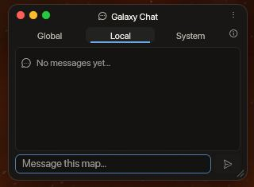
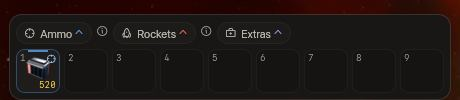
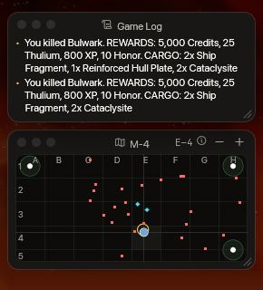
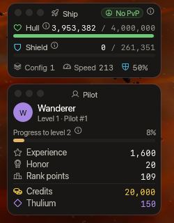
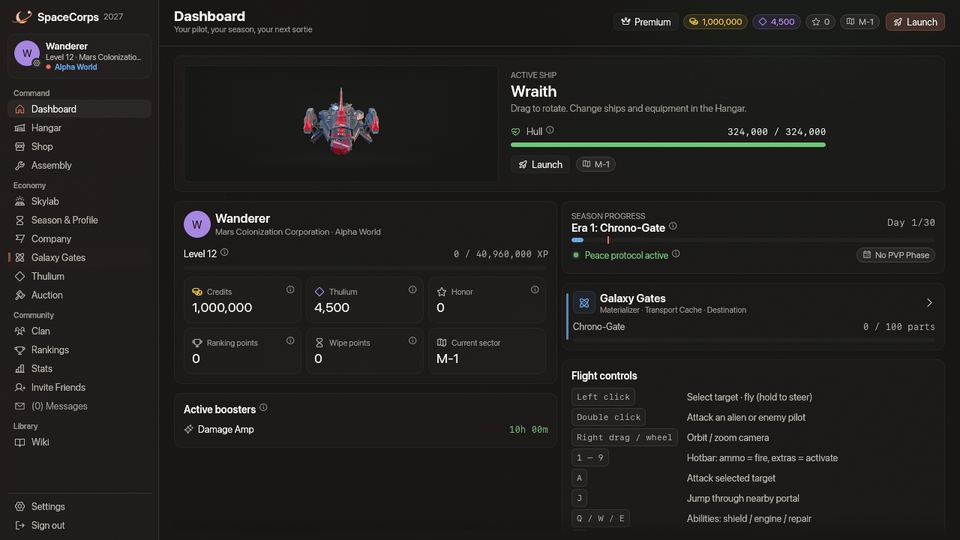
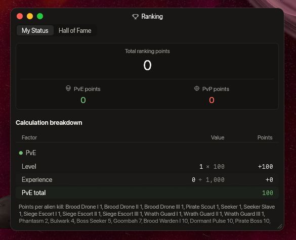
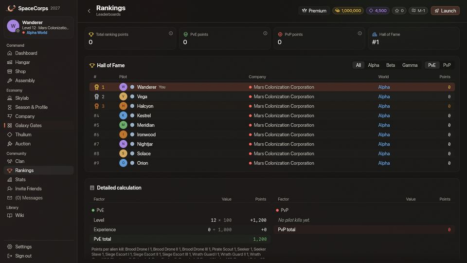

<!-- wiki-i18n source: ec87933483054d8f -->
<!-- wiki-i18n title: Erste Schritte -->
# Erste Schritte in SpaceCorps {#getting-started-in-spacecorps}

Willkommen zum ultimativen Erlebnis im Weltraumkrieg. Als Pilot in SpaceCorps kämpfst du für die Fraktion deiner Wahl um die Vorherrschaft in der Galaxis, sammelst wertvolle Ressourcen und mehrst dein Ansehen im Universum.

## Die wichtigsten Ressourcen {#core-resources}

Um zu überleben und voranzukommen, musst du zwei Währungen verwalten und deine Ehre im Blick behalten. Die Materialien, aus denen du baust, stehen auf der Seite [Ressourcen](/wiki/06-Items/Resources.md), jeweils mit ihrer Herkunft und ihrem Zweck:
- **Credits**: Die wichtigste Standardwährung. Jedes Alien, das du besiegst, und jede abgeschlossene Mission zahlt sie aus, und die Credit-Farm deines [Skylab](/wiki/03-Mechanics/Skylab.md) produziert sie. Damit kaufst du Grundausrüstung, Schiffe und Standardausstattung.
- **Thulium**: Das seltene radioaktive Erz und die wertvolle Währung. Jedes Alien, das du besiegst, und jede abgeschlossene Mission zahlt es aus, und die Thulium-Farm deines Skylab produziert es. Damit kaufst du Elitewaffen, Triebwerke, Hybridschilde und starke Booster-Pakete, rüstest Module in der Montage auf, wechselst den Konzern (5.000), boostest das Forschungszentrum (5.000) und bezahlst jeden Sprung einer Jump CPU (500).
- **Ehre**: Ein Punktestand, kein Geld: das Maß für deine Loyalität und dein Ansehen. Die Ehre bestimmt nicht deinen [Rang](/wiki/03-Mechanics/Ranks.md), der dein Platz unter den Piloten deines Konzerns nach PvE-Punkten ist, und Angriffe auf befreundete Piloten deiner eigenen Fraktion kosten dich viel Ehre: Einen Piloten deines eigenen Konzerns zu zerstören, also das Schiff eines Spielers oder einen seiner [Konzernpiloten](/wiki/03-Mechanics/Company-Pilots.md), kostet 100 Ehre. Dasselbe gilt, wenn du einen in den 15 Sekunden triffst, bevor etwas anderes ihn zerstört: Einen Konzernkameraden für ein Alien sturmreif zu schießen kostet so viel wie der Abschuss selbst. Der Abschuss eines Konzernkameraden ist kein PvP-Abschuss und bringt keine PvP-Punkte. Ein Konzernwechsel nimmt dir die Hälfte deiner Ehre, abgerundet; eine Ehre von 0 oder weniger bleibt, wie sie ist ([Den Konzern wechseln](#changing-your-company)).

Auf der Station stehen deine Credits, dein Thulium und deine Ehre auf jeder Seite oben rechts, neben deinem Sektor und der Schaltfläche **Starten**. Ist das Fenster für einen langen Betrag zu schmal, wird er gekürzt (987,7 Mio.); zeige darauf, um die ganze Zahl zu lesen.

## Den Konzern wechseln {#changing-your-company}

Deinen Konzern wählst du beim ersten Spielen, und das kostet nichts. Später kannst du ihn auf der Station wechseln: **Wirtschaft › Konzern** zeigt die beiden anderen Konzerne, jeden mit einer Schaltfläche **Konzern wechseln**. Ein Wechsel kostet **5.000 Thulium** und die Hälfte deiner Ehre (abgerundet; eine Ehre von 0 oder weniger bleibt, wie sie ist). Dein Schiff wird vollständig repariert, und du ziehst in den Heimatsektor deines neuen Konzerns um (`M-1`, `T-1` oder `G-1`). Dein Clan, deine Gruppe, deine Schiffe, deine Gegenstände und dein Skylab bleiben, wie sie sind, und deine Missionen laufen weiter: Ihre Offiziere gehören jetzt zu deinem neuen Konzern, und eine Aufgabe `rival x-4` meint die Grenzsektoren der beiden anderen Konzerne (siehe [Quests](/wiki/03-Mechanics/Quests.md#where-it-counts)). Deine PvE-Punkte gehen mit, und dein [Rang](/wiki/03-Mechanics/Ranks.md#who-is-on-the-ladder) wird dein Platz unter den Piloten deines neuen Konzerns. Solange dein Schiff im Flug ist, kannst du den Konzern nicht wechseln: Dock zuerst an.

## Mit Freunden spielen {#playing-with-friends}

Tritt einem [Clan](/wiki/03-Mechanics/Clans.md) bei oder fliege in einer [Gruppe](/wiki/03-Mechanics/Groups.md) mit bis zu fünf Piloten, und hol mit deinem persönlichen Code neue Freunde ins Spiel: **Community › Freunde einladen** gibt ihnen ein Startpaket und dir eine Thulium-Belohnung, sobald sie Level 5 erreichen. Siehe [Freunde einladen](/wiki/03-Mechanics/Invite-Friends.md).

## Missionen {#missions}

Missionen sind der schnellste Weg, im Level aufzusteigen. Öffne **Mission Control** über die Symbolleiste (in der Schutzzone einer Station) oder per Klick auf die **Mission Control**-Blase, die über der Station schwebt: 88 Missionen bringen dich von Level 1 bis 8, zehn pro Level in beliebiger Reihenfolge und dazu eine **Spezial**-Mission, die sich öffnet, sobald die zehn erledigt sind. Die meisten sind kurze Ketten: ein paar Aliens zerstören, einen Punkt anfliegen, ein paar Minuten in einem Sektor bleiben oder einen Missionsgegenstand finden, der nur für dich fällt, und ihn zu Mission Control fahren, manchmal mit einer Regel wie „höchstens 3.000 Hüllenpunkte verlieren“ oder „nicht sterben“. Die Missionen jedes Levels führen dich einen Sektor weiter hinaus, von deiner Basis bis zur Grenze und zum PvP-Zentrum. Ab Pilotenlevel 3 zahlt eine eigene Linie von fünfzig sehr schweren **Herausforderungen** in fünf Stufen hohe Belohnungen: Die gedruckten Zahlen sind die Basis, und deine Welt, Booster und Clan-Boosts multiplizieren sie, wie bei jeder Mission. Wie sie funktionieren und was jede Mission zahlt, steht unter [Quests](/wiki/03-Mechanics/Quests.md).

## Reisen {#travelling}

Zwischen den Karten reist du durch **Portale**: Fliege auf höchstens 500 Einheiten an eines heran und drücke `J`, und drei Sekunden später kommst du am passenden Tor der nächsten Karte an ([Reisen auf der Weltraumkarte](/wiki/01-General/Spacemap%20Travel.md)). Deine Basis `x-1` hat ein Tor, nach `x-2`; von dort führen die Karten weiter nach `x-3` und zur Grenze `x-4`, die sich zu deinem Gefahrensektor öffnet, dem PvP-Zentrum. Jede `x-4` hat außerdem ein Tor zur `x-3` des nächsten Konzerns, und jede `x-3` hat das Tor zurück: Mars `M-4` nach Terra `T-3`, Terra `T-4` nach Galactic `G-3`, Galactic `G-4` nach Mars `M-3`. Diese drei Verbindungen bilden den **Ring**, einen Weg zwischen den Karten der Konzerne, der das PvP-Zentrum nicht kreuzt.

## Zerstörung und Rückkehr {#dying-and-coming-back}

Erreicht deine Hülle 0, wird das Schiff zerstört, und der Zerstörungsbildschirm fragt, wo du zurückkehren willst. Drei Orte stehen immer zur Wahl, und du wählst per Klick oder mit den Tasten `1`, `2` und `3` (die Auswahl öffnet sich erst drei Sekunden nach der Explosion, damit eine Taste, die du noch im Gefecht gedrückt hast, nichts auswählt):

| Auswahl | Taste | Wo du erscheinst | Nach Gebrauch gesperrt |
| :--- | :---: | :--- | :--- |
| **An der Basis** | `1` | Die Basis deines Konzerns in deiner Welt (`M-1`, `T-1` oder `G-1`), in der Schutzzone der Station, egal wo du zerstört wurdest. | Nie |
| **Am nächsten Portal** | `2` | Neben dem Portal dieses Sektors, das dem Ort deiner Zerstörung in Luftlinie am nächsten liegt, 150 bis 300 Einheiten vom Portal entfernt. Ein Sektor mit nur einem Portal nimmt dieses. In einem Sektor ohne Portal (den neutralen Sektoren) ist diese Auswahl ausgegraut. | 3 Minuten |
| **An Ort und Stelle** | `3` | Der Ort, an dem du zerstört wurdest, im selben Sektor. | 5 Minuten |

- **Die Sperre beginnt, wenn du mit dieser Auswahl respawnst**, nicht beim Tod, und sie gilt nur für diese eine Auswahl: Wer das Portal nutzt, sperrt damit nicht die Rückkehr an Ort und Stelle. Eine gesperrte Auswahl ist auf dem Zerstörungsbildschirm mit einem Countdown (Minuten und Sekunden) ausgegraut und öffnet sich von selbst, wenn er abgelaufen ist. Die Sperren speichert der Server: Aus- und wieder Einloggen setzt sie nicht zurück. Eine neue Saison (der Wipe) schon.
- **Eine Auswahl, die der Server ablehnt, kostet nichts.** Lässt sich eine Auswahl nicht nutzen (noch gesperrt, kein Portal im Sektor, du hast seit deinem Tod die Welt gewechselt), wird keine Sperre ausgelöst und dein Schiff nicht versetzt; du wählst einfach neu.
- **Respawn-Schutz.** Wo du auch zurückkehrst: Dein Schiff kann nach der Rückkehr **3 Sekunden** lang weder beschädigt noch anvisiert werden, und Aliens verlieren das Interesse daran; wer dich zerstört hat, kann dich also nicht sofort wieder zerstören. In denselben 3 Sekunden **kannst du auch selbst nicht angreifen**: Ein Laser oder eine Rakete wird mit einem Hinweis abgelehnt, und der Schutz endet nicht vorzeitig. Das HUD zeigt die verbleibenden Sekunden. Der Schutz endet, wenn sie abgelaufen sind.
- **Das Schwarze Loch.** Ein Ort innerhalb des Strahlungsrings des [Schwarzen Lochs](/wiki/03-Mechanics/Black-Hole.md) (4.200 Einheiten vom Zentrum von Gefahrensektor 4) ist nie ein Ort für die Rückkehr: Wurdest du dort zerstört, setzt dich „An Ort und Stelle“ an den nächsten Punkt außerhalb des Rings, auf der Linie vom Zentrum durch deine Position, und sagt dir Bescheid.
- **Gefahrensektoren.** Auch dort funktionieren alle drei Auswahlmöglichkeiten.
- **Deine Hülle kommt begrenzt zurück.** Du kehrst mit der Hülle deines Schiffs **bis höchstens 10.000** und leerem Schild zurück, egal, wo du erscheinst. Die Protos (8.000 Hülle) kommt voll zurück; die größeren Schiffe (von der Kitefin mit 24.000 bis zur Ironclad mit 600.000) kommen mit 10.000 zurück, repariere also vor dem nächsten Kampf mit einer Repair Drone oder einer Emergency Repair (siehe [Kampf](/wiki/03-Mechanics/Combat.md) und [Fähigkeiten](/wiki/03-Mechanics/Abilities.md)). Der Schild lädt sich wie gewohnt wieder auf. Der Zerstörungsbildschirm weist darauf hin.
- **Was eine Zerstörung sonst kostet:** Du verlierst keine Gegenstände, und die Auswahl entscheidet nur, wo du erscheinst. Deine Fähigkeiten sind bereit, und du kehrst ungetarnt und außerhalb jedes EMP-Fensters zurück. Du bleibst in deiner [Gruppe](/wiki/03-Mechanics/Groups.md).
- **Andocken.** „Zurück zur Basis“ auf dem Zerstörungsbildschirm bringt dich wie immer an der Basis zurück, mit derselben Hülle. Schließt sich das Spiel, bevor du wählst, stellst du das Schiff im [Hangar](/wiki/03-Mechanics/Hangar.md) kostenlos wieder her; du bist dann an deiner Basis, mit derselben Hülle und ohne Schild.

## Tastatursteuerung & Tastenbelegung {#keyboard-controls-keybindings}

SpaceCorps unterstützt eine anpassbare Tastenbelegung (erreichbar über die Einstellungen im Spiel). Hier die Standardbelegung:

| Aktion | Steuerung / Taste | Beschreibung |
| :--- | :--- | :--- |
| **Schiff bewegen** | `Left Click` auf die Weltraumkarte | Lässt dein Schiff zu den angeklickten Zielkoordinaten fliegen. |
| **Kamera drehen und zoomen** | `Right Drag`, `Mouse Wheel` | Rechts ziehen dreht die Ansicht um dein Schiff; das Mausrad (oder Ziehen mit der mittleren Maustaste) zoomt hinein und heraus, von 30 Einheiten Abstand bis 1.500, was etwa 4.400 mal 2.650 Einheiten des Weltraums zeigt (die 2,25-fache Fläche einer Ansicht aus 1.000 Einheiten). Drehung und Zoom gleiten zwei Sekunden nach dem Loslassen in die Ruheansicht zurück, außer du schaltest **Kamera bleibt, wo ich sie lasse** in Einstellungen › Allgemein ein: Dann behält die Ansicht den Winkel und den Abstand, den du ihr gegeben hast (die Schaltfläche **Ansicht zurücksetzen** neben diesem Schalter setzt sie einmal auf die Ruheansicht zurück, ebenso das Ausschalten des Schalters). **Kamerazoom** in Einstellungen › Allgemein legt den Abstand der Ruheansicht fest, von 50 % bis 338 % (Standard: 150 %); bei eingeschaltetem Schalter bringt eine Änderung die Kamera auf den neuen Abstand. |
| **Ziel auswählen** | `Left Click` auf ein Objekt | Wählt ein Alien, einen feindlichen Piloten oder ein Portal als dein aktives Ziel. Das Zielfenster (siehe unten) zeigt Name, Entfernung, Hülle und Schild. |
| **Gewähltes Ziel angreifen** | `Key A` (oder `Ctrl + Click`) | Eröffnet mit deinen Lasern und Raketen das Feuer auf das gewählte Ziel. |
| **Rakete feuern** | `Key R` | Feuert die Rakete, die du zuletzt abgefeuert hast (oder die erste in der Aktionsleiste): eine gelenkte auf dein gewähltes Ziel, eine gerade in Richtung deines Mauszeigers. Willst du eine gerade Rakete mit der Maus ausrichten, klicke ihren Slot in der Aktionsleiste an, um sie scharf zu machen, und klicke dann in den Weltraum. Alle Raketen teilen sich einen Timer von 5 Sekunden (eine Drohnenformation kann ihn ändern). |
| **Portalsprung** | `Key J` | Startet einen Sprung, wenn du höchstens 500 Einheiten von einem Portal entfernt bist (in seiner Schutzzone). Der Sprung dauert 3 Sekunden (ein Balken über der Aktionsleiste zeigt ihn an), und du musst in Reichweite bleiben, bis er abgeschlossen ist. In den Gefahrensektoren kannst du keinen starten, solange du angegriffen wirst. |
| **Konfiguration wechseln** | `Key C` | Wechselt zwischen Konfig 1 und Konfig 2 (tauscht die aktive Zusammenstellung aus Lasern, Schilden und Tempo). |
| **Primäre Aktionsleiste** | `Digits 1 - 9` | Aktiviert Gegenstände/Aktionen in den Slots deiner primären Aktionsleiste im HUD (z. B. Munition, Reparaturbots). |
| **Sekundäre Aktionsleiste** | `Shift + Digits 1 - 9` | Aktiviert Gegenstände/Aktionen in den Slots deiner sekundären Aktionsleiste. Die Leiste erscheint über der primären, sobald etwas darin liegt; öffne die Auswahl für Munition, Raketen oder Extras (oder ziehe einen Slot), um dort einen Gegenstand abzulegen. |
| **Drohnenformation** | die Taste ihres Slots | Trägt die Formation auf diesem Slot. Ziehe sie aus der Formationenliste der Aktionsleiste dorthin; dort steht auch Standard, keine Formation. Du darfst einmal alle 2 Sekunden wechseln, auch im Kampf. Siehe [Drohnenformationen](/wiki/03-Mechanics/Formations.md). |
| **Vollbild** | `F11` oder `Alt + Enter` (Windows) | Schaltet randloses Vollbild ein oder aus; die Schaltfläche oben rechts im Flugbildschirm macht unter Windows und macOS dasselbe. Diese beiden Tasten sind fest vergeben und erscheinen nicht unter den Belegungen, die du ändern kannst. `Alt + Enter` wartet, während du im Chat tippst. |
| **Wähle, wo du zurückkehrst** | `Keys 1 - 3` | Auf dem Zerstörungsbildschirm: `1` an der Basis, `2` am nächsten Portal, `3` an Ort und Stelle. Siehe *Zerstörung und Rückkehr* oben. |
| **Zielfenster** | `Key V` | Blendet das Zielfenster ein oder aus. Die erste Schaltfläche der Symbolleiste oben links macht dasselbe. |
| **Gruppenfenster** | `Key B` | Blendet das Gruppenfenster ein oder aus: die Schiffe deiner Gruppe mit Hülle und Schild. Solange eine Gruppeneinladung wartet, nimmt `Y` sie an und `Escape` lehnt sie ab. Siehe [Gruppen](/wiki/03-Mechanics/Groups.md). |

## Das Zielfenster {#the-target-window}

Klicke ein Alien oder einen Piloten an, und das **Zielfenster** zeigt, was du ausgewählt hast: Name, Entfernung, die Balken für Hülle und Schild und ob du darauf feuerst. Die Schaltfläche mit dem **Fadenkreuz** startet und stoppt den Angriff (wie `A`), und die Schaltfläche **X** hebt das Ziel auf (wie `Esc`). Ist nichts ausgewählt, sagt das Fenster das in einer Zeile.

Es ist ein Fenster wie die anderen. Ziehe es an seiner Titelleiste, wohin du willst, schließe es mit dem roten Licht in seiner Ecke oder mit der **ersten Schaltfläche der Symbolleiste oben links** (oder `V`) und öffne es auf demselben Weg wieder. Wo du es lässt und ob es offen ist, wird für dein Konto gespeichert. Anfangs steht es oben am Bildschirm, zwischen den beiden Symbolleisten. Das Schließen blendet nur die Anzeige aus: Dein Ziel bleibt ausgewählt, und dein Angriff läuft weiter.

## Wenn das Spiel laggt {#when-the-game-lags}

Schalte **Einstellungen › Oberfläche › Netzwerkinfo anzeigen** ein, und oben rechts erscheint eine kleine Karte (sie weicht den Fenstern aus und ist aus, bis du sie einschaltest). Sie zeigt dir, welche Seite langsam ist:

| Anzeige | Was es ist | Gut, langsam |
| :--- | :--- | :--- |
| **Ping** | Die Umlaufzeit zum Spielserver (das Symbol daneben hat drei Balken, wenn der Wert gut ist, zwei, wenn er langsam ist, und einen, wenn er schlecht ist; jede andere Anzeige bekommt ein Dreieck, wenn sie langsam ist, und ein Achteck, wenn sie schlecht ist). | Unter 80 ms ist gut, über 150 ms ist schlecht. |
| **Jitter**, **Snapshot-Alter** | Wie gleichmäßig und wie frisch die Updates des Servers (20 pro Sekunde) ankommen. | Jitter unter 25 ms und ein Alter unter 100 ms sind gut. |
| **Längste Lücke** | Die längste Zeit ohne ein Update vom Server in den letzten zehn Sekunden. | Über eine Sekunde ist ein Aussetzer. |
| **Server** | Wie lange der eigene 50-ms-Schritt des Servers dauert (sein 99. Perzentil). Es steht *k. A.* da, wenn der Server zu alt ist, um ihn zu melden. | Unter 20 ms ist gut, über 35 ms ist schlecht. |
| **Client** | Die Bildzeit deines Computers (95. Perzentil). | Unter 25 ms ist gut, über 33 ms ist schlecht. |

Ist etwas schlecht, sagt dir eine Zeile unter den Zahlen, wer schuld ist: *Netzwerk langsam*, *Netzwerk verzögert* oder *Verbindung stockt* heißt, dass es an deiner Verbindung oder am Weg zum Server liegt, *Server ausgelastet* liegt am Server (ein ausgelasteter Server erhöht auch den Ping und kann die Updates zurückhalten), *Client langsam* liegt an deinem Computer (verringere die Grafikdetails), und *Client eingefroren* bedeutet, dass das Spiel selbst für einen Moment aufgehört hat zu zeichnen (ein Alt-Tab, ein minimiertes Fenster). Dieselben Zahlen schreibt das Spiel einmal pro Minute in seine Logdatei, bei einem Aussetzer sofort, sodass sich eine Meldung wie „Es hat um 21:10 gelaggt“ anhand des Logs beantworten lässt.

## Schnelle Profi-Tipps für Einsteiger {#quick-pro-tips-for-beginners}

1. **Konfigurationen**: Bereite immer zwei unterschiedliche Ausstattungen vor. Nutze zum Beispiel **Konfig 1** mit lauter Triebwerken/Schubdüsen in deinen Generator-Slots für schnelle Flucht oder Reisen und **Konfig 2** mit Schilden und Lasern für den Kampf.
2. **Schutzzonen**: Um Portale und Basen liegen **Schutzzonen**. Dort können dich andere Piloten nicht angreifen, sodass du in Ruhe deine Schilde aufladen oder Abklingzeiten aus dem Kampf abwarten kannst.
3. **Deine erste Fähigkeit**: In deiner Startausrüstung steckt bereits eine Repair Drone I im Fähigkeits-Slot der Protos, also heilt die Schaltfläche Emergency Repair (`E`, neben der Aktionsleiste) deine Hülle über zehn Sekunden, wann immer sie beschädigt ist. Siehe [Fähigkeiten](/wiki/03-Mechanics/Abilities.md). Das Paket legt außerdem eine **Base CPU I** (10 Nutzungen, ein Teleport zu deiner Basis) und eine zweite **Repair Drone I** in die beiden Extra-Slots der Protos: Ziehe sie aus der Extras-Auswahl der Aktionsleiste auf einen Slot, um sie zu benutzen (siehe [Extras](/wiki/06-Items/Extras.md)). Nur für neue Piloten: Wer sich vor 0.4.10 angemeldet hat, behält das Paket von damals, ohne diese beiden.
4. **Tägliche Clan-Steuer**: Bist du Mitglied eines Clans, denk daran, dass die Clankasse um Mitternacht UTC einen Steuersatz (0 % bis 5 %) von deinem täglichen Credits-Guthaben abzieht. Wähle deinen Clan also mit Bedacht!
5. **Aus dem Wiki kopieren**: Ziehe mit der Maus über einen beliebigen Text eines Artikels, um ihn auszuwählen, und drücke `Ctrl+C` (auf dem Mac `Cmd+C`), um ihn zu kopieren; ein Klick auf einen Link öffnet die Seite weiterhin. **Seite kopieren** oben in einem Artikel kopiert die ganze Seite als Markdown, zum Einfügen in einen Chat oder eine Notiz.
6. **Erst forschen, dann herstellen**: Die Montage stellt nur her, was das Forschungszentrum deines [Skylab](/wiki/03-Mechanics/Skylab.md) erforscht hat. Es öffnet sich ab Kern-Level 10, und auf der Seite [Forschung](/wiki/03-Mechanics/Research.md) stehen die Technologien, ihre Dauer und der Treibstoff.
7. **Drohnenformationen**: Sobald du eine Drohne besitzt und eine Formation erforscht und gebaut hast, ziehe sie aus der Formationenliste auf deine Aktionsleiste und trage sie mit der Taste ihres Slots: ein größerer Schild für schwächere Waffen, härtere Raketen für eine dünnere Hülle. Jede gibt deinen Drohnen auch eine Form zum Fliegen. Siehe [Drohnenformationen](/wiki/03-Mechanics/Formations.md).
