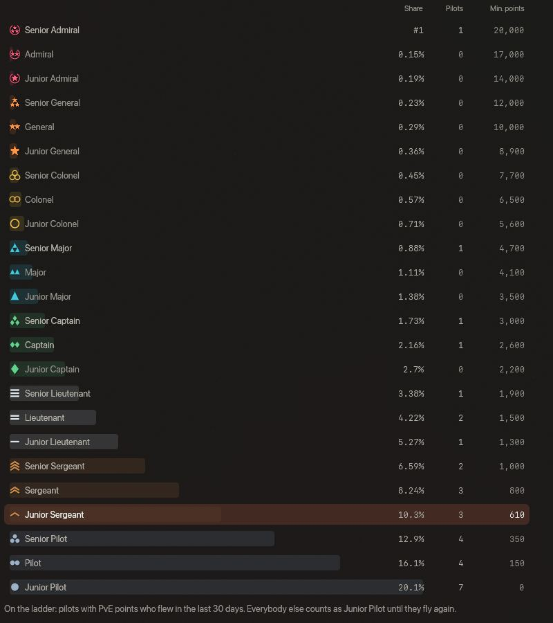
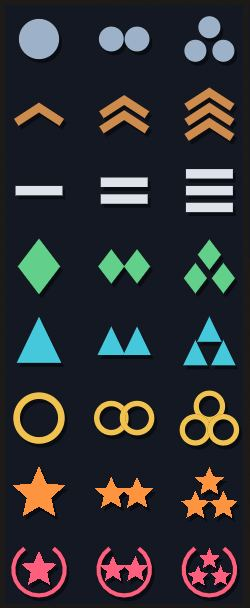

<!-- wiki-i18n source: 09eab0ba9b8c9863 -->
<!-- wiki-i18n title: Ränge -->
# Ränge {#ranks}

Jeder Pilot hat einen **Rang**, vom Junior-Piloten bis zum Senior-Admiral. Es ist eine militärische Leiter aus 8 Stufen mit je 3 Graden, insgesamt 24 Ränge. Dein Rang ist dein **Platz unter den Piloten deines Konzerns**, gezählt in **PvE-Punkten**: den Punkten, die du für dein Level, deine Erfahrung und die Aliens bekommst, die du zerstörst. Im Flug zeigt das Spiel nur ein kleines **Symbol** vor dem Namen eines Piloten, sodass du die besten Piloten eines Konzerns auf einen Blick von einem frischen unterscheiden kannst. Die Wörter stehen auf der Konzernseite und im Hover-Tooltip eines Symbols.

**In einer Minute**

- Dein Konzern führt eine einzige Liste seiner Piloten, der Pilot mit den meisten PvE-Punkten zuerst. Dein Rang ergibt sich aus deinem Platz in dieser Liste.
- Nur der beste Pilot des Konzerns ist der **Senior-Admiral**. Alle anderen werden von oben nach unten auf die übrigen 23 Ränge verteilt: wenige Piloten weit oben, die meisten unten.
- Jeder Rang verlangt außerdem ein **Minimum an PvE-Punkten**, damit ein kleiner oder junger Konzern die obersten Ränge nicht umsonst vergeben kann. Der Senior-Admiral braucht 20.000.
- Dein Rang bewegt sich. Er sinkt, wenn andere Piloten dich überholen, und steigt, wenn du sie überholst. Ein Abstieg wird nie gemeldet; ein neuer bester Rang schon.
- Nur Piloten mit PvE-Punkten, die in den letzten 30 Tagen geflogen sind, stehen in der Liste. Alle anderen sind Junior-Piloten, bis sie wieder fliegen.
- Der Wipe ändert niemandes Punkte, die Liste fängt also nicht von vorn an.
- Das Symbol vor einem Namen ist der Rang: eine Form für die Stufe, ein bis drei Markierungen für den Grad.

## So entsteht dein Rang {#the-company-ladder}

Die Piloten deines Konzerns, **alle drei Welten zusammen**, stehen in einer Reihe, der Pilot mit den meisten PvE-Punkten zuerst. Haben zwei Piloten gleich viele Punkte, liegt der mit dem höheren Level vorn, danach der ältere Pilot. Diese Reihe ist die **Rangliste** deines Konzerns, und dein Rang ergibt sich aus zwei Dingen:

1. **Dein Platz.** Der Pilot auf Platz 1 ist der **Senior-Admiral**, ganz allein. Die Piloten hinter ihm werden nach Anteilen der Rangliste auf die übrigen 23 Ränge verteilt, und jeder Rang umfasst ein Viertel mehr Piloten als der Rang über ihm. So ist etwa ein Fünftel der Piloten Junior-Pilot, und die besten zehn Prozent sind Hauptmann oder besser.
2. **Deine Punkte.** Jeder Rang verlangt ein Minimum an PvE-Punkten ([die Tabelle unten](#the-24-ranks)). Du hast den niedrigeren der beiden Ränge: den, den dein Platz ergibt, und den, den deine Punkte erreichen.

**Ein Beispiel.** Ein Konzern hat 31 Piloten in der Rangliste. Nach dem Platz allein sieht es so aus; die letzte Spalte nennt die wenigsten PvE-Punkte, die der Rang verlangt.

| Platz | Rang | Mindest-PvE-Punkte |
| :---: | :--- | ---: |
| 1 | Senior-Admiral | 20.000 |
| 2 | Senior-Major | 4.700 |
| 3 | Senior-Hauptmann | 3.000 |
| 4 | Hauptmann | 2.600 |
| 5 | Senior-Leutnant | 1.900 |
| 6–7 | Leutnant | 1.500 |
| 8 | Junior-Leutnant | 1.300 |
| 9–10 | Senior-Sergeant | 1.000 |
| 11–13 | Sergeant | 800 |
| 14–16 | Junior-Sergeant | 610 |
| 17–20 | Senior-Pilot | 350 |
| 21–24 | Pilot | 150 |
| 25–31 | Junior-Pilot | 0 |

Du bist auf Platz 16 von 31 und hast 1.800 PvE-Punkte. Die Konzernseite zeigt „Platz 16 von 31“ und ein kleines Etikett „Top 52 %“: Du gehörst zu den besten 52 Prozent deines Konzerns. Die Plätze 14 bis 16 sind Junior-Sergeants, also ist das dein Rang, obwohl deine Punkte allein für Leutnant reichen würden (1.500). Um Sergeant zu werden, musst du Platz 13 erreichen. Er gehört Sable, der 2.100 PvE-Punkte hat. Um ihn zu überholen, brauchst du 2.101, also 301 mehr, und genau das sagt dir die Konzernseite: „301 PvE-Punkte, um Sable zu überholen und Sergeant zu erreichen“.

Auch ganz oben zählen die Punkte. Hat der beste Pilot dieses Konzerns 12.000 PvE-Punkte, ist er Senior-General, bis er 20.000 hat, auf welchem Platz er auch steht.

> [!NOTE]
> Die Ränge werden in ganzen Piloten zugeschnitten, deshalb hat ein kleiner Konzern in manchen höheren Rängen niemanden. Ein Oberst braucht einen Konzern mit mindestens 46 Piloten in der Rangliste, ein General 118, ein Senior-General 178, ein Junior-Admiral 301 und ein Admiral 675. Platz 1 ist die Ausnahme: Jeder Konzern hat ihn, und sein Pilot ist der Senior-Admiral, sobald er 20.000 PvE-Punkte hat.

## Die 24 Ränge {#the-24-ranks}

Der **Anteil** ist der Teil deines Konzerns, der genau diesen Rang hat; der beste Pilot, der allein an der Spitze steht, wird nicht mitgezählt. Das **Minimum** sind die wenigsten PvE-Punkte, die der Rang verlangt, auf welchem Platz du auch stehst.

| # | Rang | Anteil am Konzern | Mindest-PvE-Punkte |
| :---: | :--- | ---: | ---: |
| 1 | Junior-Pilot | 20,1 % | 0 |
| 2 | Pilot | 16,1 % | 150 |
| 3 | Senior-Pilot | 12,9 % | 350 |
| 4 | Junior-Sergeant | 10,3 % | 610 |
| 5 | Sergeant | 8,24 % | 800 |
| 6 | Senior-Sergeant | 6,59 % | 1.000 |
| 7 | Junior-Leutnant | 5,27 % | 1.300 |
| 8 | Leutnant | 4,22 % | 1.500 |
| 9 | Senior-Leutnant | 3,38 % | 1.900 |
| 10 | Junior-Hauptmann | 2,7 % | 2.200 |
| 11 | Hauptmann | 2,16 % | 2.600 |
| 12 | Senior-Hauptmann | 1,73 % | 3.000 |
| 13 | Junior-Major | 1,38 % | 3.500 |
| 14 | Major | 1,11 % | 4.100 |
| 15 | Senior-Major | 0,88 % | 4.700 |
| 16 | Junior-Oberst | 0,71 % | 5.600 |
| 17 | Oberst | 0,57 % | 6.500 |
| 18 | Senior-Oberst | 0,45 % | 7.700 |
| 19 | Junior-General | 0,36 % | 8.900 |
| 20 | General | 0,29 % | 10.000 |
| 21 | Senior-General | 0,23 % | 12.000 |
| 22 | Junior-Admiral | 0,19 % | 14.000 |
| 23 | Admiral | 0,15 % | 17.000 |
| 24 | Senior-Admiral | #1 | 20.000 |

## Wer in der Rangliste steht {#who-is-on-the-ladder}

Ein Pilot steht in der Rangliste seines Konzerns, wenn **alle drei** Punkte zutreffen:

- er ist in einem Konzern;
- er hat PvE-Punkte: Der erste Abschuss bringt einen neuen Piloten in die Rangliste;
- er ist in den letzten **30 Tagen** geflogen.

Ein Pilot, der nicht in der Rangliste steht, ist überall, wo ein Rang erscheint, ein **Junior-Pilot**, hat keinen Platz und steht nicht in der Liste des Konzerns. Die Regel gibt es, damit ein Pilot, der das Spiel einmal ausprobiert hat und gegangen ist, nicht für immer unten sitzt, und damit ein Pilot, der weg ist, den besten Rang nicht monatelang behalten kann.

> [!TIP]
> Solange du weg bist, geht nichts verloren. Deine Punkte bleiben, und wenn du wieder startest oder nur die Konzernseite öffnest, wirst du mit den Punkten, mit denen du gegangen bist, wieder eingeordnet. Warst du der beste Pilot, bist du wieder Senior-Admiral, und der Pilot, der den Rang hielt, rutscht einen Platz nach unten.

Wenn du den Konzern wechselst, gehen deine Punkte mit, und du stehst in der Rangliste des neuen Konzerns auf dem Platz, den sie dir dort geben.

## Dein Rang bewegt sich {#your-rank-moves}

- Er **sinkt**, wenn andere Piloten dich überholen. Jeder Pilot, der dich überholt, nimmt dir einen Platz, und war das der letzte Platz deines Rangs, fällst du einen Grad.
- Er **steigt**, wenn du andere überholst, sobald dein Abschuss gezählt ist.
- Er kann sich auch bewegen, wenn Piloten in die Rangliste kommen oder sie verlassen, denn jeder Rang ist ein Anteil des Konzerns. Ein wachsender Konzern senkt keinen Piloten, der seinen Platz behält; wenn Piloten gehen, kann ein Pilot am Rand eines Rangs einen Grad verlieren.
- Dir wird dein Rang nur gemeldet, wenn er **steigt** ([Beförderungen](#promotions)). Ein Abstieg wird nie angekündigt: Dein Symbol ändert sich einfach.

## So verdienst du PvE-Punkte {#how-you-earn-pve-points}

Deine PvE-Punkte werden aus drei Dingen berechnet:

**Level × 100 + Erfahrung ÷ 1.000 (abgerundet) + die Punkte jedes Aliens, das du zerstört hast**

Ein zäheres Alien ist mehr wert: Ein Abschuss bringt Punkte danach, wie viel Schaden es kostet, das Alien zu zerstören. Die Schwarmschiffe und die Clan-Wächter zählen nach derselben Regel, ein Pirate Scout ist also so viel wert wie ein Bulwark. Jeder Abschuss wird unter dem eigenen Namen des Aliens in deiner Abschussstatistik gezählt.

| Alien oder Schiff | PvE-Punkte pro Abschuss |
| :--- | ---: |
| Seeker | 1 |
| Phantasm | 2 |
| Bulwark | 4 |
| Goombah | 7 |
| Crystalys | 16 |
| Boss Seeker | 5 |
| Seeker Slave | 1 |
| Pirate Boss | 15 |
| Pirate Scout | 4 |
| Dormant Force | 25 |
| Dormant Pulse | 11 |
| Brood Warden I, II, III | 14, 18, 35 |
| Siege Warden I, II, III | 13, 17, 32 |
| Wrath Warden I, II, III | 14, 18, 34 |
| Brood Drone I, II, III | 1, 1, 2 |
| Siege Escort I, II, III | 2, 3, 6 |
| Wrath Guard I, II, III | 2, 3, 6 |

Die ersten fünf Zeilen sind die gewöhnlichen Aliens, die nächsten sechs die Schiffe der drei Schwärme. Zuletzt kommen die Clan-Wächter, die Anführer eines Clan-Wächter-Kampfs, und ihre Besatzungen, die Brood Drones, Siege Escorts und Wrath Guards: I, II und III sind die Stärke des Wächters, und die Punkte stehen in dieser Reihenfolge.

Ein Beispiel: Ein Pilot auf Level 4 mit 12.500 Erfahrung, der 300 Seeker, 80 Phantasms und 10 Bulwarks zerstört hat, hat 400 + 12 + 300 + 160 + 40 = **912** Punkte. Das reicht für das Minimum eines Sergeants (800); ob er einer ist, hängt von seinem Platz im Konzern ab.

Die Seite **Ranglisten** (Community › Ranglisten) zeigt, woraus sich deine Punkte zusammensetzen, und die **Ruhmeshalle** dort listet die besten Piloten. Das **(i)** neben den PvE-Punkten dort nennt die fünf Aliens, was ein Abschuss in jedem der Schwärme ([Schwärme](/wiki/05-Swarms/Swarms.md)) wert ist, vom kleinsten Schiff bis zum Boss, und die [Clan-Wächter](/wiki/03-Mechanics/Clans.md#clan-wardens).

## Die Symbole {#the-symbols}

Das Spiel zeichnet einen Rang als kleines Symbol: eine **Form** für die Stufe, in einer eigenen Farbe, und **eine, zwei oder drei Markierungen** für den Grad: eine für einen Junior, zwei für den einfachen Rang, drei für einen Senior. Die Farben gehen mit steigender Stufe von kühl und schlicht zu warm und leuchtend.

| Stufe | Form | Farbe |
| :--- | :--- | :--- |
| Pilot | Punkte | Stahlblau |
| Sergeant | Winkel, übereinander | Kupfer |
| Leutnant | flache Balken, übereinander | Silber |
| Hauptmann | Rauten | Grün |
| Major | Dreiecke nach oben (Wimpel) | Cyan |
| Oberst | hohle Ringe | Gold |
| General | fünfzackige Sterne | Orange |
| Admiral | ein nach oben offener Lorbeerkranz um einen bis drei Sterne | Rosé |

## Wo du sie siehst {#where-you-see-them}

Im Flug siehst du **nur das Symbol**, nie die Wörter. Es steht vor dem Namen des Piloten:

- über einem Schiff, im Namensschild, und im Zielfenster;
- im Chat, vor dem Namen des Piloten, der die Zeile geschrieben hat;
- in der Liste deiner Gruppe und im Hover-Tooltip eines Gruppenmitglieds auf der Minikarte;
- im Kill-Feed, vor jedem genannten Piloten (nicht vor Aliens);
- in der Ruhmeshalle, im Ranglistenfenster und, groß, im Profil eines Piloten.

Die **Wörter** (Junior-Sergeant, Hauptmann …) stehen auf der Konzernseite und in einem Hover-Tooltip: Halte den Zeiger auf ein Symbol. Ein Symbol zeigt, wo ein Pilot unter den Piloten **seines eigenen Konzerns** steht: Der Major eines anderen Konzerns ist ein Major unter den Seinen, nicht unter deinen. [Konzernpiloten](/wiki/03-Mechanics/Company-Pilots.md) sind die Staffeln des Spiels selbst und haben keinen Rang.

## Die Konzernrangliste {#the-company-ranking}

Öffne **Wirtschaft › Konzern**. Der Abschnitt **Konzernrangliste** zeigt von oben nach unten:

- **Deinen Rang**: Symbol und Name, deinen Platz („Platz 16 von 31“) und ein kleines Etikett mit deinem Prozentrang („Top 52 %“).
- **Einen Balken und darunter eine Zeile**, die sagt, was der nächste Rang verlangt. Eine Zeile wie „301 PvE-Punkte, um Sable zu überholen und Sergeant zu erreichen“ nennt den letzten Piloten des nächsten Rangs: Überhole ihn, und der Rang gehört dir. Hält dich nur deine Punktzahl zurück, sagt die Zeile, wie viele PvE-Punkte dir noch fehlen. Beim Senior-Admiral steht „Der höchste Rang.“
- **Den besten Piloten** deines Konzerns mit seinen Punkten.
- **Alle Ränge**, zugeklappt, bis du sie öffnest: die 24 Ränge als Pyramide, jeder mit einem Balken so breit wie sein Anteil am Konzern, seinem **Anteil**, den **Piloten**, die ihn gerade haben, und den **Mindestpunkten**. Dein eigener Rang ist markiert, und ein Tooltip an einer Zeile sagt: „Die besten 10,2 % deines Konzerns haben Hauptmann oder höher.“ Eine Zeile unter der Tabelle sagt, wer in der Rangliste steht.
- **Die Liste**: die besten **50 Piloten deines Konzerns in allen drei Welten**, mit Platz, Symbol, Name und PvE-Punkten. Deine eigene Zeile ist markiert.

- Ein Pilot ohne PvE-Punkte steht nicht in der Rangliste und nicht in der Liste: Zerstöre ein Alien, um auf sie zu kommen. Ein Pilot, der 30 Tage weg war, steht auch nicht darin, bis er wieder startet oder die Seite öffnet.
- Es werden nur Namen und öffentliche Zahlen gezeigt.

## Beförderungen {#promotions}

- Wenn du einen neuen besten Rang erreichst, bekommst du eine Meldung („Befördert: Senior-Sergeant“) und einen kurzen, leisen Ton. „Bester“ heißt: der beste Rang, der dir seit deinem letzten Start gemeldet wurde; fällst du einen Grad und gewinnst ihn zurück, gibt es keine zweite Meldung. Ein Rang, den du in deiner Abwesenheit erreicht hast, wird dir einmal beim nächsten Login gemeldet. Ein Abstieg wird nie gemeldet.
- Ab **Junior-Major** erscheint eine Beförderung auch im Reiter **System** des Chats für die Piloten deines Konzerns, die in deiner Welt fliegen: „Nova wurde zum Rang Junior-Major befördert.“ Der Konzern erfährt es nur, wenn deine eigenen PvE-Punkte dich nach oben gebracht haben; stiegst du, weil andere Piloten die Rangliste verlassen haben, bekommst du deine Meldung, und niemand sonst erfährt etwas.

## Ränge und der Wipe {#ranks-and-the-wipe}

Ein Wipe ändert niemandes Punkte. Er behält dein Level, deine Erfahrung und deine Abschussstatistik ([Wipe-Zeitleiste](/wiki/03-Mechanics/Wipe-Timeline.md#cross-season-progression-permanent-buffs-)), und deine PvE-Punkte werden daraus berechnet, also hat die Rangliste deines Konzerns nach dem Wipe dieselbe Reihenfolge. Dein Rang gilt aber nicht mehr fürs Leben: Er folgt deinem Platz, bewegt sich also mit den Piloten deines Konzerns, und ein Pilot, der 30 Tage wegbleibt, verlässt die Rangliste, bis er wieder fliegt.

## Wie lange es dauert {#how-long-it-takes}

Das sind **Schätzungen** aus einem Modell, wie schnell ein Pilot jagt, keine Messungen. Das Minimum an Punkten ist nicht das Schwere: Ein Pilot, der etwa zwei Stunden am Tag jagt, 58 Stunden in einer Saison, hat nach einer Saison etwa 21.200 PvE-Punkte, mehr, als selbst der Senior-Admiral verlangt. In Jagdstunden kommt das Minimum des Rangs Pilot innerhalb der ersten Stunde, das eines Sergeants nach 4, das eines Hauptmanns nach etwa 9, das eines Majors nach 14, das eines Obersts nach 22, das eines Generals nach 32, das eines Admirals nach 48 und das des Senior-Admirals nach 55.

Was deinen Rang entscheidet, ist dein Platz, und die anderen Piloten jagen auch. In einem Konzern mit 31 Piloten können nur die besten vier Hauptmann oder besser sein, egal wie viele Punkte die anderen haben. Das Punkteminimum hindert einen jungen Konzern daran, die obersten Ränge zu verschenken; der Platz hält die Spitze eines alten Konzerns klein.
