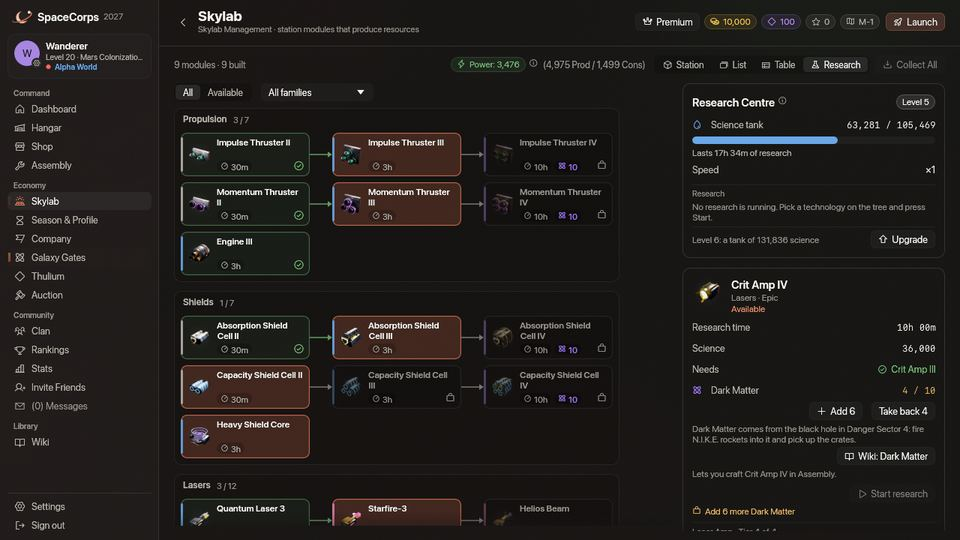
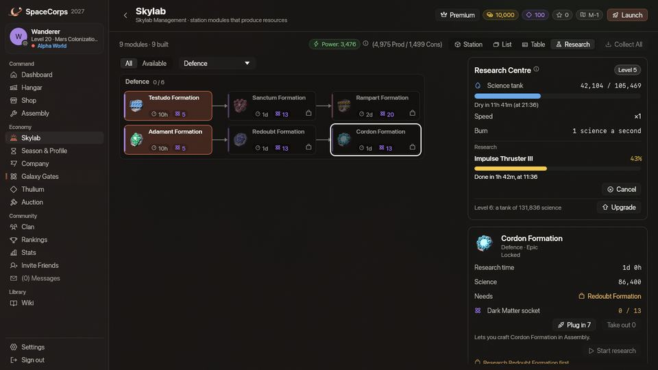
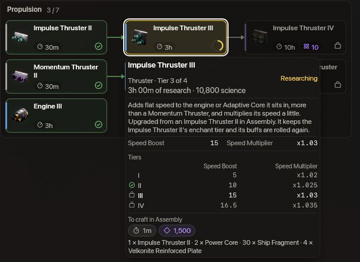

<!-- wiki-i18n source: 6b5935229efa5068 -->
<!-- wiki-i18n title: Forschung -->
# Forschung {#research}

Das **Forschungszentrum** ist das Labor deines [Skylab](/wiki/03-Mechanics/Skylab.md). Du fütterst es mit Ressourcen, es macht daraus **Wissenschaft**, und die Wissenschaft erforscht **Technologien**. Jede Herstellung in der [Montage](/wiki/06-Items/Overview.md#upgrading-modules) braucht zuerst ihre Technologie: Ein Schiff, ein Laser, eine Schubdüse oder eine CPU lässt sich erst herstellen, wenn sie erforscht ist.

Diese Seite zeigt den ganzen Technologiebaum mit der Dauer jeder Technologie, die Wissenschaft, die jede Ressource gibt, den Thulium-Boost, die Regel für Dark Matter und die neuen CPUs. Ihre Zahlen werden aus den Spieldaten selbst gelesen, es sind also immer die Zahlen des Spiels.





## Das Forschungszentrum {#the-research-centre}

<!-- research-centre:begin -->
<!-- Generated from server/Resources/{Research,CpuConfig,SkylabConfig}.json and Data/Seeds/{items,recipes}.json by scripts/research-wiki.sh: don't edit by hand. -->

- **Ab Kern-Level 10.** Das Forschungszentrum ist ein Modul deines [Skylab](/wiki/03-Mechanics/Skylab.md) und wird wie die anderen gebaut: 25 Ship Fragments aus deinem Inventar (bei gelandetem Schiff), 25.000 Credits und 500 Thulium. Sein Bildschirm ist die Ansicht **Forschung** der Skylab-Seite.
- **Level 1 bis 10.** Ein höheres Level gibt einen größeren Tank und braucht mehr Energie. Es macht die Forschung nicht schneller: Eine Technologie dauert auf jedem Level gleich lang.
- **Der Tank.** Das Zentrum bewahrt seine Wissenschaft in einem Tank auf, der auf Level 1 Forschung für 12 h fasst und mit jedem Level 25 % mehr (siehe Tabelle unten).
- **Treibstoff wird Wissenschaft.** Eine Ressource, die du einspeist, wird sofort zu Wissenschaft, wie die Treibstofftabelle zeigt. Eine Forschung verbraucht 1 Wissenschaft pro Sekunde ihrer Forschungsdauer; ist der Tank leer, wartet sie und läuft weiter, sobald du das Zentrum wieder fütterst.
- **Eine freie erste Stunde.** Ein neues Zentrum startet mit 3.600 Wissenschaft im Tank, das sind 1 h Forschung.
- **Eine nach der anderen.** Das Zentrum erforscht immer nur eine Technologie. Es gibt keine Warteschlange.
- **Während du weg bist.** Eine Forschung läuft nach der Uhr des Servers, sie geht also weiter, nachdem du dich ausgeloggt hast, bis sie fertig oder der Tank leer ist. Ein Energiedefizit oder ein Ausbau des Zentrums hält sie nicht an.
- **Energie.** Das Zentrum braucht 25 Energie auf Level 1 und mit jedem Level 15 % mehr, und es lässt sich nicht abschalten.
- **Der Wipe lässt alles bestehen:** deine Technologien, die Wissenschaft im Tank, das eingesetzte Dark Matter, eine laufende Forschung und den Boost.
- **Was du besitzt, gehört dir.** Als die Forschung ins Spiel kam, bekam jeder Pilot die Technologie jedes Gegenstands, den er schon besaß, und die Technologien, die dafür nötig waren. Ein Gegenstand, der später zu dir kommt (ein Geschenk, ein Code, eine Belohnung), schaltet seine Technologie nicht frei.
- **Unter Kern-Level 10** kannst du nicht forschen und in der Montage noch nichts Neues herstellen. Die Station-Missionen führen dich den Kern hinauf.

<!-- research-centre:end -->

**Die Laserverstärker und die letzte Stufe.** Die Damage, Crit und Penetration Amps der Stufen II bis IV werden wie alles andere erforscht. Piloten, die beim Erscheinen der Amp-Linien Amps besaßen oder in Auftrag hatten, erhielten die Technologie jedes dieser Amps und der Stufen darunter. Zwölf Technologien brauchen eine Technologie eines anderen Baums, die der Dark Matter Plate aus dem Baum Ressourcen, weil die letzte Stufe jeder Aufwertungskette drei Plates verlangt: die Damage, Crit und Penetration Amps der Stufe IV, die Absorption und Capacity Shield Cells der Stufe IV, die Impulse und Momentum Thrusters der Stufe IV sowie Heavy Shield Core, Engine III, Helios Beam, Extra Slots CPU III und Base CPU II. Wer eine davon früher erforscht hat, behält sie und braucht die Technologie der Plate, um ihre Plates herzustellen. Der Baum unten zeichnet dafür keinen Pfeil, aber die Tabelle führt sie auf, und die Karte im Spiel nennt sie ([Dark Matter und Dark Matter Plates](/wiki/03-Mechanics/Dark-Matter.md)).

In der Ansicht **Forschung** deines Skylab verrät dir eine Technologie mehr als ein Kasten der Bäume weiter unten. Zeige auf eine Technologie, und eine Karte öffnet sich mit der Forschungsdauer und der verbrauchten Wissenschaft; darunter steht, was der Gegenstand **ist und kann**: seine Art und seine Stufe in der Familie (zum Beispiel die dritte der vier Impulse Thruster), seine Beschreibung, seine Werte, wie Hangar und Shop sie zeigen (Schaden, Krit-Chance und Reichweite eines Lasers, Schildkapazität, Aufladerate und Absorption eines Schilds, Tempo-Boost und Tempofaktor einer Schubdüse, Schaden, Explosionsradius und Reichweite einer Rakete, was eine Drohnenformation gibt und was sie dich kostet), eine kleine Tabelle der Stufen seiner Familie und das, was die Montage danach zur Herstellung verlangt: die Zeit, die Credits und das Thulium und die Materialien. So siehst du, was eine Stufe bringt, bevor du sie erforschst. Klicke eine Technologie an, um sie auszuwählen: Die Karte neben dem Baum zeigt dasselbe vollständig, unter der Schaltfläche **Forschung starten**.

### Der Tank auf jedem Level {#the-tank-at-every-level}

<!-- research-tank:begin -->
<!-- Generated from server/Resources/{Research,CpuConfig,SkylabConfig}.json and Data/Seeds/{items,recipes}.json by scripts/research-wiki.sh: don't edit by hand. -->

| Level | Tank (Wissenschaft) | Fasst Forschung für | … mit Boost | Energie |
| :--- | ---: | ---: | ---: | ---: |
| 1 | 43.200 | 12 h | 6 h | 25 |
| 2 | 54.000 | 15 h | 7,5 h | 28,7 |
| 3 | 67.500 | 18,8 h | 9,4 h | 33,1 |
| 4 | 84.375 | 23,4 h | 11,7 h | 38 |
| 5 | 105.469 | 29,3 h | 14,6 h | 43,7 |
| 6 | 131.836 | 36,6 h | 18,3 h | 50,3 |
| 7 | 164.795 | 45,8 h | 22,9 h | 57,8 |
| 8 | 205.994 | 57,2 h | 28,6 h | 66,5 |
| 9 | 257.492 | 71,5 h | 35,8 h | 76,5 |
| 10 | 321.865 | 89,4 h | 44,7 h | 87,9 |

<!-- research-tank:end -->

## Treibstoff {#fuel}

Du fütterst das Zentrum mit Ressourcen, und jede Einheit wird sofort zu Wissenschaft. Je mehr Arbeit eine Einheit kostet, desto mehr Wissenschaft gibt sie: Die Werte folgen dem Aufwand, eine Einheit zu bekommen, nicht ihrer Seltenheit. Die Erze sind die Ausnahme: Eine Einheit gibt mehr Wissenschaft, als die Sekunden wert sind, die ein Kollektor braucht, um sie zu fördern; eine Stunde Erz eines Kollektors in der Mitte seiner Level füttert also etwa zwei Stunden Forschung. Die Erze kommen aus dem Ressourcenlager deines [Skylab](/wiki/03-Mechanics/Skylab.md#resource-storage), jede andere Ressource aus deinem Inventar, und dein Schiff muss gelandet sein. Die Velkonite Reinforced Plate, die Orvium Reinforced Plate, die Dark Matter Plate, Dark Matter, Credits und Thulium lassen sich nicht verbrennen; die Reinforced Hull Plate schon.

<!-- research-fuel:begin -->
<!-- Generated from server/Resources/{Research,CpuConfig,SkylabConfig}.json and Data/Seeds/{items,recipes}.json by scripts/research-wiki.sh: don't edit by hand. -->

| Ressource | Seltenheit | Entnommen aus | Wissenschaft pro Einheit | Einheiten für 1 Stunde |
| :--- | :--- | :--- | ---: | ---: |
| [Ship Fragment](/wiki/06-Items/Resources.md#ship-fragment) | Gewöhnlich | Dein Inventar | 5 | 720 |
| [Cataclysite](/wiki/06-Items/Resources.md#cataclysite) | Gewöhnlich | Dein Inventar | 5 | 720 |
| [Daraxium](/wiki/06-Items/Resources.md#daraxium) | Gewöhnlich | Dein Inventar | 7 | 515 |
| [Nyxite](/wiki/06-Items/Resources.md#nyxite) | Gewöhnlich | Dein Inventar | 7 | 515 |
| [Quorvium](/wiki/06-Items/Resources.md#quorvium) | Gewöhnlich | Dein Inventar | 8 | 450 |
| [Reinforced Hull Plate](/wiki/06-Items/Resources.md#reinforced-hull-plate) | Gewöhnlich | Dein Inventar | 33 | 110 |
| [Power Core](/wiki/06-Items/Resources.md#power-core) | Ungewöhnlich | Dein Inventar | 100 | 36 |
| [Velkonite](/wiki/06-Items/Resources.md#velkonite) | Ungewöhnlich | Ressourcenlager | 210 | 18 |
| [Orvium](/wiki/06-Items/Resources.md#orvium) | Selten | Ressourcenlager | 321 | 12 |
| [Ancient Control Unit](/wiki/06-Items/Resources.md#ancient-control-unit) | Selten | Dein Inventar | 650 | 6 |

Die letzte Spalte zeigt, wie viele Einheiten eine Stunde Forschung ohne Boost antreiben, aufgerundet; mit dem Boost sind es 2-mal so viele.

<!-- research-fuel:end -->

## Der Thulium-Boost {#the-thulium-boost}

<!-- research-boost:begin -->
<!-- Generated from server/Resources/{Research,CpuConfig,SkylabConfig}.json and Data/Seeds/{items,recipes}.json by scripts/research-wiki.sh: don't edit by hand. -->

- **5.000 Thulium** kaufen einen Boost: Das Zentrum forscht **24 Stunden lang 2-mal so schnell**.
- Er **verbraucht auch 2-mal so schnell Wissenschaft**, ein Boost kauft also Zeit und nie Treibstoff: Eine Technologie verbraucht dieselbe Wissenschaft, mit oder ohne Boost.
- Ein Boost beginnt in dem Moment, in dem du ihn kaufst, und läuft nach der Uhr, ob der Tank Treibstoff hat oder nicht; kaufe ihn also, während eine Forschung läuft. Das Zentrum lehnt einen Boost ab, wenn nichts erforscht wird.
- Boosts addieren sich: Kaufst du einen, während ein anderer läuft, verlängert er dessen Ende um 24 Stunden, höchstens 72 Stunden im Voraus. Ein Boost gehört zu deinem Forschungszentrum, nicht zu einer einzelnen Forschung.

Was ein Boost mit der Dauer einer Forschung macht, wenn er von ihrem Beginn an läuft:

| Forschungsdauer | Mit Boost | Boosts für alles | Thulium |
| :--- | :--- | ---: | ---: |
| 30 min | 15 min | 1 | 5.000 |
| 3 h | 1 h 30 min | 1 | 5.000 |
| 6 h | 3 h | 1 | 5.000 |
| 10 h | 5 h | 1 | 5.000 |
| 1 d | 12 h | 1 | 5.000 |
| 2 d | 1 d | 1 | 5.000 |

<!-- research-boost:end -->

## Dark Matter

Die Technologien an der Spitze des Baums brauchen zusätzlich Dark Matter. Es kommt aus dem [Schwarzen Loch](/wiki/03-Mechanics/Black-Hole.md#dark-matter), wo eine N.I.K.E.-Rakete, die es erreicht, etwas zurücklässt, und hin und wieder von einem Dormant Pulse des [Dormant-Schwarms](/wiki/05-Swarms/Dormant-Swarm.md).

<!-- research-dark-matter:begin -->
<!-- Generated from server/Resources/{Research,CpuConfig,SkylabConfig}.json and Data/Seeds/{items,recipes}.json by scripts/research-wiki.sh: don't edit by hand. -->

- **10 Dark Matter** für jede der 16 Technologien in der Tabelle unten, zusätzlich zur Wissenschaft: Setze es vor dem Start ins Forschungszentrum ein (aus deinem Inventar, bei gelandetem Schiff), die Forschung nimmt es beim Start.
- **Die Regel:** ein Gegenstand der Seltenheit Episch oder höher, dessen Forschung 10 h oder länger dauert. Die N.I.K.E., mit der Dark Matter entsteht, braucht es nie.
- **Drohnenformationen** stehen außerhalb der Regel: Jede Formationsforschung verlangt Dark Matter, je nach Stärke 5, 13 oder 20, wie die Tabelle zeigt.
- **Brichst du eine Forschung ab,** kehrt das dafür eingesetzte Dark Matter ins Zentrum zurück. Der Fortschritt und die schon verbrauchte Wissenschaft nicht.
- Alle zusammen verlangen 349 Dark Matter.

| Technologie | Seltenheit | Forschungsdauer | Dark Matter |
| :--- | :--- | :--- | ---: |
| [Impulse Thruster IV](/wiki/06-Items/Propulsion.md#thrusters) | Episch | 10 h | 10 |
| [Momentum Thruster IV](/wiki/06-Items/Propulsion.md#thrusters) | Episch | 10 h | 10 |
| [Absorption Shield Cell IV](/wiki/06-Items/Shields.md#shield-cells) | Episch | 10 h | 10 |
| [Capacity Shield Cell IV](/wiki/06-Items/Shields.md#shield-cells) | Episch | 10 h | 10 |
| [Starfire-3](/wiki/06-Items/Lasers.md#lasers) | Mythisch | 1 d | 10 |
| [Helios Beam](/wiki/06-Items/Lasers.md#lasers) | Mythisch | 1 d | 10 |
| [Damage Amp IV](/wiki/06-Items/Lasers.md#laser-amplifiers-amps-) | Episch | 10 h | 10 |
| [Crit Amp IV](/wiki/06-Items/Lasers.md#laser-amplifiers-amps-) | Episch | 10 h | 10 |
| [Ironclad](/wiki/02-Ships/Ironclad.md) | Episch | 1 d | 10 |
| [Storm](/wiki/02-Ships/Storm.md) | Episch | 1 d | 10 |
| [Wraith](/wiki/02-Ships/Wraith.md) | Mythisch | 2 d | 10 |
| [Dark Matter Plate](/wiki/06-Items/Resources.md#dark-matter-plate) | Mythisch | 1 d | 10 |
| [N.U.K.E.](/wiki/06-Items/Rockets.md#the-craft-only-rockets) | Legendär | 1 d | 10 |
| [Extra Slots CPU III](/wiki/06-Items/Extras.md#extra-slots-cpus) | Episch | 1 d | 10 |
| [Jump CPU](/wiki/06-Items/Extras.md#jump-cpu) | Episch | 1 d | 10 |
| [Testudo Formation](/wiki/03-Mechanics/Formations.md#the-sixteen-formations) | Episch | 10 h | 5 |
| [Bodkin Formation](/wiki/03-Mechanics/Formations.md#the-sixteen-formations) | Episch | 1 d | 13 |
| [Asterism Formation](/wiki/03-Mechanics/Formations.md#the-sixteen-formations) | Episch | 10 h | 5 |
| [Gemini Formation](/wiki/03-Mechanics/Formations.md#the-sixteen-formations) | Mythisch | 2 d | 20 |
| [Adamant Formation](/wiki/03-Mechanics/Formations.md#the-sixteen-formations) | Episch | 10 h | 5 |
| [Ballista Formation](/wiki/03-Mechanics/Formations.md#the-sixteen-formations) | Episch | 1 d | 13 |
| [Stiletto Formation](/wiki/03-Mechanics/Formations.md#the-sixteen-formations) | Mythisch | 2 d | 20 |
| [Rampart Formation](/wiki/03-Mechanics/Formations.md#the-sixteen-formations) | Mythisch | 2 d | 20 |
| [Sanctum Formation](/wiki/03-Mechanics/Formations.md#the-sixteen-formations) | Episch | 1 d | 13 |
| [Shrike Formation](/wiki/03-Mechanics/Formations.md#the-sixteen-formations) | Episch | 10 h | 5 |
| [Culler Formation](/wiki/03-Mechanics/Formations.md#the-sixteen-formations) | Episch | 1 d | 13 |
| [Redoubt Formation](/wiki/03-Mechanics/Formations.md#the-sixteen-formations) | Episch | 1 d | 13 |
| [Auger Formation](/wiki/03-Mechanics/Formations.md#the-sixteen-formations) | Episch | 1 d | 13 |
| [Cordon Formation](/wiki/03-Mechanics/Formations.md#the-sixteen-formations) | Episch | 1 d | 13 |
| [Centurion Formation](/wiki/03-Mechanics/Formations.md#the-sixteen-formations) | Episch | 10 h | 5 |
| [Gyre Formation](/wiki/03-Mechanics/Formations.md#the-sixteen-formations) | Episch | 1 d | 13 |
| [Penetration Amp IV](/wiki/06-Items/Lasers.md#laser-amplifiers-amps-) | Episch | 10 h | 10 |

<!-- research-dark-matter:end -->

## Der Technologiebaum {#the-technology-tree}

Jeder Kasten ist eine Technologie: der Gegenstand, den sie dich herstellen lässt, mit der Forschungsdauer unter dem Namen (die Uhr) und, wo sie Dark Matter braucht, dem Dark-Matter-Zeichen. Ein Pfeil führt von einer Technologie zu der, die sie braucht und die du zuerst erforschst; ein Kasten ohne Pfeil lässt sich sofort erforschen. Zeige auf einen Kasten, um die Forschungsdauer, die verbrauchte Wissenschaft und das zu sehen, was die Montage danach für den Gegenstand verlangt, und klicke ihn an, um die Seite des Gegenstands zu öffnen. Die Bäume werden aus den Spieldaten selbst gezeichnet. Zwei der Bäume, **Verteidigung** und **Angriff & Mobilität**, enthalten die sechzehn [Drohnenformationen](/wiki/03-Mechanics/Formations.md).

<!-- research-tree:begin -->
<!-- Generated from server/Resources/{Research,CpuConfig,SkylabConfig}.json and Data/Seeds/{items,recipes}.json by scripts/research-wiki.sh: don't edit by hand. -->

### Antrieb & Tempo {#tree-propulsion}

```tree research
Impulse Thruster II | thruster, common | craft 1000 Thulium, 60 s | research 1800 s, 1800 science | 1 Impulse Thruster I, 10 Ship Fragment, 1 Power Core, 2 Velkonite Reinforced Plate | /wiki/06-Items/Propulsion.md#thrusters
Impulse Thruster III | thruster, rare | craft 1500 Thulium, 60 s | research 10800 s, 10800 science | 1 Impulse Thruster II, 30 Ship Fragment, 2 Power Core, 4 Velkonite Reinforced Plate | /wiki/06-Items/Propulsion.md#thrusters
Impulse Thruster IV | thruster, epic | craft 2000 Thulium, 90 s | research 36000 s, 36000 science, 10 Dark Matter | 1 Impulse Thruster III, 60 Ship Fragment, 3 Power Core, 3 Dark Matter Plate | /wiki/06-Items/Propulsion.md#thrusters
Momentum Thruster II | thruster, common | craft 1000 Thulium, 60 s | research 1800 s, 1800 science | 1 Momentum Thruster I, 10 Ship Fragment, 1 Power Core, 2 Velkonite Reinforced Plate | /wiki/06-Items/Propulsion.md#thrusters
Momentum Thruster III | thruster, rare | craft 1500 Thulium, 60 s | research 10800 s, 10800 science | 1 Momentum Thruster II, 30 Ship Fragment, 2 Power Core, 4 Velkonite Reinforced Plate | /wiki/06-Items/Propulsion.md#thrusters
Momentum Thruster IV | thruster, epic | craft 2000 Thulium, 90 s | research 36000 s, 36000 science, 10 Dark Matter | 1 Momentum Thruster III, 60 Ship Fragment, 3 Power Core, 3 Dark Matter Plate | /wiki/06-Items/Propulsion.md#thrusters
Engine III | engine, rare | craft 2000 Thulium, 90 s | research 10800 s, 10800 science | 1 Engine II, 60 Ship Fragment, 3 Power Core, 3 Dark Matter Plate | /wiki/06-Items/Propulsion.md#engines

Impulse Thruster II => Impulse Thruster III => Impulse Thruster IV
Momentum Thruster II => Momentum Thruster III => Momentum Thruster IV
```

### Schilde & Verteidigung {#tree-shields}

```tree research
Absorption Shield Cell II | shield-cell, common | craft 1000 Thulium, 60 s | research 1800 s, 1800 science | 1 Absorption Shield Cell I, 4 Reinforced Hull Plate, 10 Cataclysite, 2 Velkonite Reinforced Plate | /wiki/06-Items/Shields.md#shield-cells
Absorption Shield Cell III | shield-cell, rare | craft 1500 Thulium, 60 s | research 10800 s, 10800 science | 1 Absorption Shield Cell II, 6 Reinforced Hull Plate, 15 Cataclysite, 4 Velkonite Reinforced Plate | /wiki/06-Items/Shields.md#shield-cells
Absorption Shield Cell IV | shield-cell, epic | craft 2500 Thulium, 90 s | research 36000 s, 36000 science, 10 Dark Matter | 1 Absorption Shield Cell III, 8 Reinforced Hull Plate, 20 Cataclysite, 3 Dark Matter Plate | /wiki/06-Items/Shields.md#shield-cells
Capacity Shield Cell II | shield-cell, common | craft 1000 Thulium, 60 s | research 1800 s, 1800 science | 1 Capacity Shield Cell I, 4 Reinforced Hull Plate, 10 Cataclysite, 2 Velkonite Reinforced Plate | /wiki/06-Items/Shields.md#shield-cells
Capacity Shield Cell III | shield-cell, rare | craft 1500 Thulium, 60 s | research 10800 s, 10800 science | 1 Capacity Shield Cell II, 6 Reinforced Hull Plate, 15 Cataclysite, 4 Velkonite Reinforced Plate | /wiki/06-Items/Shields.md#shield-cells
Capacity Shield Cell IV | shield-cell, epic | craft 2500 Thulium, 90 s | research 36000 s, 36000 science, 10 Dark Matter | 1 Capacity Shield Cell III, 8 Reinforced Hull Plate, 20 Cataclysite, 3 Dark Matter Plate | /wiki/06-Items/Shields.md#shield-cells
Heavy Shield Core | shield, rare | craft 2000 Thulium, 90 s | research 10800 s, 10800 science | 1 Basic Shield Core, 8 Reinforced Hull Plate, 20 Cataclysite, 3 Dark Matter Plate | /wiki/06-Items/Shields.md#shield-cores

Absorption Shield Cell II => Absorption Shield Cell III => Absorption Shield Cell IV
Capacity Shield Cell II => Capacity Shield Cell III => Capacity Shield Cell IV
```

### Laser & Munition {#tree-lasers}

```tree research
Quantum Laser 3 | laser, rare | craft 1500 Thulium, 60 s | research 10800 s, 10800 science | 10 Ship Fragment, 2 Velkonite Reinforced Plate | /wiki/06-Items/Lasers.md#lasers
Starfire-3 | laser, mythical | craft 100000 Credits, 1500 Thulium, 60 s | research 86400 s, 86400 science, 10 Dark Matter | 1 Quantum Laser 3, 15 Ship Fragment, 1 Reinforced Hull Plate, 8 Velkonite Reinforced Plate | /wiki/06-Items/Lasers.md#lasers
Helios Beam | laser, mythical | craft 2000 Thulium, 180 s | research 86400 s, 86400 science, 10 Dark Matter | 1 Starfire-3, 4 Reinforced Hull Plate, 2 Power Core, 50 Cataclysite, 18 Orvium Reinforced Plate, 3 Dark Matter Plate | /wiki/06-Items/Lasers.md#lasers
Damage Amp IV | laser-amp, epic | craft 1200 Thulium, 60 s | research 36000 s, 36000 science, 10 Dark Matter | 1 Damage Amp III, 1 Power Core, 30 Cataclysite, 3 Dark Matter Plate | /wiki/06-Items/Lasers.md#laser-amplifiers-amps-
Crit Amp IV | laser-amp, epic | craft 1200 Thulium, 60 s | research 36000 s, 36000 science, 10 Dark Matter | 1 Crit Amp III, 1 Power Core, 30 Cataclysite, 3 Dark Matter Plate | /wiki/06-Items/Lasers.md#laser-amplifiers-amps-
Damage Amp II | laser-amp, uncommon | craft 250 Thulium, 60 s | research 1800 s, 1800 science | 1 Damage Amp I, 10 Cataclysite, 1 Velkonite Reinforced Plate | /wiki/06-Items/Lasers.md#laser-amplifiers-amps-
Damage Amp III | laser-amp, rare | craft 1000 Thulium, 60 s | research 10800 s, 10800 science | 1 Damage Amp II, 1 Power Core, 20 Cataclysite, 2 Velkonite Reinforced Plate | /wiki/06-Items/Lasers.md#laser-amplifiers-amps-
Crit Amp II | laser-amp, uncommon | craft 250 Thulium, 60 s | research 1800 s, 1800 science | 1 Crit Amp I, 10 Cataclysite, 1 Velkonite Reinforced Plate | /wiki/06-Items/Lasers.md#laser-amplifiers-amps-
Crit Amp III | laser-amp, rare | craft 1000 Thulium, 60 s | research 10800 s, 10800 science | 1 Crit Amp II, 1 Power Core, 20 Cataclysite, 2 Velkonite Reinforced Plate | /wiki/06-Items/Lasers.md#laser-amplifiers-amps-
Penetration Amp II | laser-amp, uncommon | craft 250 Thulium, 60 s | research 1800 s, 1800 science | 1 Penetration Amp I, 20 Daraxium, 10 Cataclysite, 1 Velkonite Reinforced Plate | /wiki/06-Items/Lasers.md#laser-amplifiers-amps-
Penetration Amp III | laser-amp, rare | craft 1000 Thulium, 60 s | research 10800 s, 10800 science | 1 Penetration Amp II, 1 Power Core, 30 Nyxite, 20 Cataclysite, 2 Velkonite Reinforced Plate | /wiki/06-Items/Lasers.md#laser-amplifiers-amps-
Penetration Amp IV | laser-amp, epic | craft 1200 Thulium, 90 s | research 36000 s, 36000 science, 10 Dark Matter | 1 Penetration Amp III, 1 Power Core, 30 Cataclysite, 40 Quorvium, 3 Dark Matter Plate | /wiki/06-Items/Lasers.md#laser-amplifiers-amps-

Quantum Laser 3 => Starfire-3 => Helios Beam
Damage Amp II => Damage Amp III => Damage Amp IV
Crit Amp II => Crit Amp III => Crit Amp IV
Penetration Amp II => Penetration Amp III => Penetration Amp IV
```

### Booster {#tree-boosters}

```tree research
Laser Damage Booster 2 | booster, rare | craft 20000 Thulium, 60 s | research 10800 s, 10800 science | 5 Ship Fragment | /wiki/06-Items/Boosters.md#active-boosters
Shield Wall Booster 2 | booster, rare | craft 15000 Thulium, 60 s | research 10800 s, 10800 science | 5 Ship Fragment | /wiki/06-Items/Boosters.md#active-boosters
Hull Plating Booster 2 | booster, rare | craft 15000 Thulium, 60 s | research 10800 s, 10800 science | 5 Ship Fragment | /wiki/06-Items/Boosters.md#active-boosters
```

### Drohnen {#tree-drones}

```tree research
Master Drone | drone, rare | craft 40000 Thulium, 60 s | research 36000 s, 36000 science | 1 Slave Drone, 100 Ship Fragment | /wiki/06-Items/Drones.md#available-drones
```

### Schiffe {#tree-ships}

```tree research
Paragon | ship, rare | craft 1500 Thulium, 900 s | research 21600 s, 21600 science | 120 Ship Fragment, 20 Reinforced Hull Plate, 5 Power Core | /wiki/02-Ships/Paragon.md
Ironclad | ship, epic | craft 10500 Thulium, 900 s | research 86400 s, 86400 science, 10 Dark Matter | 200 Ship Fragment, 35 Reinforced Hull Plate, 10 Power Core, 1 Ancient Control Unit | /wiki/02-Ships/Ironclad.md
Storm | ship, epic | craft 15000 Thulium, 900 s | research 86400 s, 86400 science, 10 Dark Matter | 200 Ship Fragment, 35 Reinforced Hull Plate, 10 Power Core, 1 Ancient Control Unit | /wiki/02-Ships/Storm.md
Wraith | ship, mythical | craft 20000 Thulium, 900 s | research 172800 s, 172800 science, 10 Dark Matter | 300 Ship Fragment, 50 Reinforced Hull Plate, 15 Power Core, 3 Ancient Control Unit | /wiki/02-Ships/Wraith.md
```

### Ressourcen {#tree-resources}

```tree research
Dark Matter Plate | resource, mythical | craft 250 Thulium, 120 s | research 86400 s, 86400 science, 10 Dark Matter | 1 Velkonite Reinforced Plate, 1 Orvium Reinforced Plate, 5 Dark Matter | /wiki/06-Items/Resources.md#dark-matter-plate
```

### Raketen {#tree-rockets}

```tree research
N.I.K.E. | rocket, mythical | craft 100000 Credits, 1500 Thulium, 300 s, x5 | research 10800 s, 10800 science | 20 Ship Fragment, 4 Reinforced Hull Plate, 40 Cataclysite | /wiki/06-Items/Rockets.md#the-craft-only-rockets
N.U.K.E. | rocket, legendary | craft 150000 Credits, 3000 Thulium, 900 s | research 86400 s, 86400 science, 10 Dark Matter | 6 Scatter III, 40 Ship Fragment, 10 Reinforced Hull Plate, 4 Power Core, 80 Cataclysite | /wiki/06-Items/Rockets.md#the-craft-only-rockets
```

### CPUs {#tree-cpus}

```tree research
Extra Slots CPU I | extra, uncommon | craft 12000 Thulium, 300 s | research 1800 s, 1800 science | 60 Ship Fragment, 3 Power Core, 6 Velkonite Reinforced Plate | /wiki/06-Items/Extras.md#extra-slots-cpus
Extra Slots CPU II | extra, rare | craft 30000 Thulium, 600 s | research 36000 s, 36000 science | 120 Ship Fragment, 10 Reinforced Hull Plate, 6 Power Core, 12 Velkonite Reinforced Plate, 2 Orvium Reinforced Plate | /wiki/06-Items/Extras.md#extra-slots-cpus
Extra Slots CPU III | extra, epic | craft 75000 Thulium, 900 s | research 86400 s, 86400 science, 10 Dark Matter | 240 Ship Fragment, 25 Reinforced Hull Plate, 12 Power Core, 2 Ancient Control Unit, 6 Orvium Reinforced Plate, 3 Dark Matter Plate | /wiki/06-Items/Extras.md#extra-slots-cpus
Base CPU I | extra, uncommon | craft 8000 Thulium, 300 s | research 10800 s, 10800 science | 40 Ship Fragment, 2 Power Core, 4 Velkonite Reinforced Plate | /wiki/06-Items/Extras.md#base-cpus
Base CPU II | extra, rare | craft 20000 Thulium, 600 s | research 36000 s, 36000 science | 100 Ship Fragment, 5 Power Core, 2 Orvium Reinforced Plate, 3 Dark Matter Plate | /wiki/06-Items/Extras.md#base-cpus
Jump CPU | extra, epic | craft 40000 Thulium, 900 s | research 86400 s, 86400 science, 10 Dark Matter | 200 Ship Fragment, 20 Reinforced Hull Plate, 10 Power Core, 3 Ancient Control Unit, 15 Velkonite Reinforced Plate, 10 Orvium Reinforced Plate | /wiki/06-Items/Extras.md#jump-cpu
Auto-Repair CPU | extra, rare | craft 15000 Thulium, 600 s | research 21600 s, 21600 science | 80 Ship Fragment, 8 Reinforced Hull Plate, 4 Power Core, 6 Velkonite Reinforced Plate | /wiki/06-Items/Extras.md#auto-repair-cpu

Extra Slots CPU I => Extra Slots CPU II => Extra Slots CPU III
Base CPU I => Base CPU II => Jump CPU
```

### Verteidigung {#tree-defence}

```tree research
Testudo Formation | formation, epic | craft 7500 Thulium, 300 s | research 36000 s, 36000 science, 5 Dark Matter | 100 Ship Fragment, 10 Reinforced Hull Plate, 5 Power Core, 4 Velkonite Reinforced Plate | /wiki/03-Mechanics/Formations.md#the-sixteen-formations
Adamant Formation | formation, epic | craft 9000 Thulium, 300 s | research 36000 s, 36000 science, 5 Dark Matter | 100 Ship Fragment, 10 Reinforced Hull Plate, 5 Power Core, 4 Velkonite Reinforced Plate | /wiki/03-Mechanics/Formations.md#the-sixteen-formations
Rampart Formation | formation, mythical | craft 38500 Thulium, 900 s | research 172800 s, 172800 science, 20 Dark Matter | 260 Ship Fragment, 26 Reinforced Hull Plate, 13 Power Core, 2 Ancient Control Unit, 14 Velkonite Reinforced Plate, 6 Orvium Reinforced Plate | /wiki/03-Mechanics/Formations.md#the-sixteen-formations
Sanctum Formation | formation, epic | craft 20000 Thulium, 600 s | research 86400 s, 86400 science, 13 Dark Matter | 180 Ship Fragment, 18 Reinforced Hull Plate, 9 Power Core, 8 Velkonite Reinforced Plate, 3 Orvium Reinforced Plate | /wiki/03-Mechanics/Formations.md#the-sixteen-formations
Redoubt Formation | formation, epic | craft 21000 Thulium, 600 s | research 86400 s, 86400 science, 13 Dark Matter | 180 Ship Fragment, 18 Reinforced Hull Plate, 9 Power Core, 8 Velkonite Reinforced Plate, 3 Orvium Reinforced Plate | /wiki/03-Mechanics/Formations.md#the-sixteen-formations
Cordon Formation | formation, epic | craft 21500 Thulium, 600 s | research 86400 s, 86400 science, 13 Dark Matter | 180 Ship Fragment, 18 Reinforced Hull Plate, 9 Power Core, 8 Velkonite Reinforced Plate, 3 Orvium Reinforced Plate | /wiki/03-Mechanics/Formations.md#the-sixteen-formations

Testudo Formation => Sanctum Formation => Rampart Formation
Adamant Formation => Redoubt Formation => Cordon Formation
```

### Angriff & Mobilität {#tree-strike-mobility}

```tree research
Bodkin Formation | formation, epic | craft 21000 Thulium, 600 s | research 86400 s, 86400 science, 13 Dark Matter | 180 Ship Fragment, 18 Reinforced Hull Plate, 9 Power Core, 8 Velkonite Reinforced Plate, 3 Orvium Reinforced Plate | /wiki/03-Mechanics/Formations.md#the-sixteen-formations
Asterism Formation | formation, epic | craft 7000 Thulium, 300 s | research 36000 s, 36000 science, 5 Dark Matter | 100 Ship Fragment, 10 Reinforced Hull Plate, 5 Power Core, 4 Velkonite Reinforced Plate | /wiki/03-Mechanics/Formations.md#the-sixteen-formations
Gemini Formation | formation, mythical | craft 38000 Thulium, 900 s | research 172800 s, 172800 science, 20 Dark Matter | 260 Ship Fragment, 26 Reinforced Hull Plate, 13 Power Core, 2 Ancient Control Unit, 14 Velkonite Reinforced Plate, 6 Orvium Reinforced Plate | /wiki/03-Mechanics/Formations.md#the-sixteen-formations
Ballista Formation | formation, epic | craft 24000 Thulium, 600 s | research 86400 s, 86400 science, 13 Dark Matter | 180 Ship Fragment, 18 Reinforced Hull Plate, 9 Power Core, 8 Velkonite Reinforced Plate, 3 Orvium Reinforced Plate | /wiki/03-Mechanics/Formations.md#the-sixteen-formations
Stiletto Formation | formation, mythical | craft 46000 Thulium, 900 s | research 172800 s, 172800 science, 20 Dark Matter | 260 Ship Fragment, 26 Reinforced Hull Plate, 13 Power Core, 2 Ancient Control Unit, 14 Velkonite Reinforced Plate, 6 Orvium Reinforced Plate | /wiki/03-Mechanics/Formations.md#the-sixteen-formations
Shrike Formation | formation, epic | craft 8500 Thulium, 300 s | research 36000 s, 36000 science, 5 Dark Matter | 100 Ship Fragment, 10 Reinforced Hull Plate, 5 Power Core, 4 Velkonite Reinforced Plate | /wiki/03-Mechanics/Formations.md#the-sixteen-formations
Culler Formation | formation, epic | craft 20000 Thulium, 600 s | research 86400 s, 86400 science, 13 Dark Matter | 180 Ship Fragment, 18 Reinforced Hull Plate, 9 Power Core, 8 Velkonite Reinforced Plate, 3 Orvium Reinforced Plate | /wiki/03-Mechanics/Formations.md#the-sixteen-formations
Auger Formation | formation, epic | craft 20500 Thulium, 600 s | research 86400 s, 86400 science, 13 Dark Matter | 180 Ship Fragment, 18 Reinforced Hull Plate, 9 Power Core, 8 Velkonite Reinforced Plate, 3 Orvium Reinforced Plate | /wiki/03-Mechanics/Formations.md#the-sixteen-formations
Centurion Formation | formation, epic | craft 8000 Thulium, 300 s | research 36000 s, 36000 science, 5 Dark Matter | 100 Ship Fragment, 10 Reinforced Hull Plate, 5 Power Core, 4 Velkonite Reinforced Plate | /wiki/03-Mechanics/Formations.md#the-sixteen-formations
Gyre Formation | formation, epic | craft 20000 Thulium, 600 s | research 86400 s, 86400 science, 13 Dark Matter | 180 Ship Fragment, 18 Reinforced Hull Plate, 9 Power Core, 8 Velkonite Reinforced Plate, 3 Orvium Reinforced Plate | /wiki/03-Mechanics/Formations.md#the-sixteen-formations

Asterism Formation => Bodkin Formation => Ballista Formation
Gemini Formation => Stiletto Formation
Centurion Formation => Shrike Formation => Culler Formation
Gyre Formation => Auger Formation
```


<!-- research-tree:end -->

## Alle Technologien {#all-the-technologies}

<!-- research-technologies:begin -->
<!-- Generated from server/Resources/{Research,CpuConfig,SkylabConfig}.json and Data/Seeds/{items,recipes}.json by scripts/research-wiki.sh: don't edit by hand. -->

| Technologie | Braucht zuerst | Klasse | Forschungsdauer | Wissenschaft | Dark Matter |
| :--- | :--- | :--- | ---: | ---: | ---: |
| [Impulse Thruster II](/wiki/06-Items/Propulsion.md#thrusters) | – | A | 30 min | 1.800 | – |
| [Impulse Thruster III](/wiki/06-Items/Propulsion.md#thrusters) | [Impulse Thruster II](/wiki/06-Items/Propulsion.md#thrusters) | B | 3 h | 10.800 | – |
| [Impulse Thruster IV](/wiki/06-Items/Propulsion.md#thrusters) | [Dark Matter Plate](/wiki/06-Items/Resources.md#dark-matter-plate), [Impulse Thruster III](/wiki/06-Items/Propulsion.md#thrusters) | C | 10 h | 36.000 | 10 |
| [Momentum Thruster II](/wiki/06-Items/Propulsion.md#thrusters) | – | A | 30 min | 1.800 | – |
| [Momentum Thruster III](/wiki/06-Items/Propulsion.md#thrusters) | [Momentum Thruster II](/wiki/06-Items/Propulsion.md#thrusters) | B | 3 h | 10.800 | – |
| [Momentum Thruster IV](/wiki/06-Items/Propulsion.md#thrusters) | [Dark Matter Plate](/wiki/06-Items/Resources.md#dark-matter-plate), [Momentum Thruster III](/wiki/06-Items/Propulsion.md#thrusters) | C | 10 h | 36.000 | 10 |
| [Engine III](/wiki/06-Items/Propulsion.md#engines) | [Dark Matter Plate](/wiki/06-Items/Resources.md#dark-matter-plate) | B | 3 h | 10.800 | – |
| [Absorption Shield Cell II](/wiki/06-Items/Shields.md#shield-cells) | – | A | 30 min | 1.800 | – |
| [Absorption Shield Cell III](/wiki/06-Items/Shields.md#shield-cells) | [Absorption Shield Cell II](/wiki/06-Items/Shields.md#shield-cells) | B | 3 h | 10.800 | – |
| [Absorption Shield Cell IV](/wiki/06-Items/Shields.md#shield-cells) | [Absorption Shield Cell III](/wiki/06-Items/Shields.md#shield-cells), [Dark Matter Plate](/wiki/06-Items/Resources.md#dark-matter-plate) | C | 10 h | 36.000 | 10 |
| [Capacity Shield Cell II](/wiki/06-Items/Shields.md#shield-cells) | – | A | 30 min | 1.800 | – |
| [Capacity Shield Cell III](/wiki/06-Items/Shields.md#shield-cells) | [Capacity Shield Cell II](/wiki/06-Items/Shields.md#shield-cells) | B | 3 h | 10.800 | – |
| [Capacity Shield Cell IV](/wiki/06-Items/Shields.md#shield-cells) | [Capacity Shield Cell III](/wiki/06-Items/Shields.md#shield-cells), [Dark Matter Plate](/wiki/06-Items/Resources.md#dark-matter-plate) | C | 10 h | 36.000 | 10 |
| [Heavy Shield Core](/wiki/06-Items/Shields.md#shield-cores) | [Dark Matter Plate](/wiki/06-Items/Resources.md#dark-matter-plate) | B | 3 h | 10.800 | – |
| [Quantum Laser 3](/wiki/06-Items/Lasers.md#lasers) | – | B | 3 h | 10.800 | – |
| [Starfire-3](/wiki/06-Items/Lasers.md#lasers) | [Quantum Laser 3](/wiki/06-Items/Lasers.md#lasers) | D | 1 d | 86.400 | 10 |
| [Helios Beam](/wiki/06-Items/Lasers.md#lasers) | [Dark Matter Plate](/wiki/06-Items/Resources.md#dark-matter-plate), [Starfire-3](/wiki/06-Items/Lasers.md#lasers) | D | 1 d | 86.400 | 10 |
| [Damage Amp IV](/wiki/06-Items/Lasers.md#laser-amplifiers-amps-) | [Dark Matter Plate](/wiki/06-Items/Resources.md#dark-matter-plate), [Damage Amp III](/wiki/06-Items/Lasers.md#laser-amplifiers-amps-) | C | 10 h | 36.000 | 10 |
| [Crit Amp IV](/wiki/06-Items/Lasers.md#laser-amplifiers-amps-) | [Dark Matter Plate](/wiki/06-Items/Resources.md#dark-matter-plate), [Crit Amp III](/wiki/06-Items/Lasers.md#laser-amplifiers-amps-) | C | 10 h | 36.000 | 10 |
| [Laser Damage Booster 2](/wiki/06-Items/Boosters.md#active-boosters) | – | B | 3 h | 10.800 | – |
| [Shield Wall Booster 2](/wiki/06-Items/Boosters.md#active-boosters) | – | B | 3 h | 10.800 | – |
| [Hull Plating Booster 2](/wiki/06-Items/Boosters.md#active-boosters) | – | B | 3 h | 10.800 | – |
| [Master Drone](/wiki/06-Items/Drones.md#available-drones) | – | C | 10 h | 36.000 | – |
| [Paragon](/wiki/02-Ships/Paragon.md) | – | B | 6 h | 21.600 | – |
| [Ironclad](/wiki/02-Ships/Ironclad.md) | – | D | 1 d | 86.400 | 10 |
| [Storm](/wiki/02-Ships/Storm.md) | – | D | 1 d | 86.400 | 10 |
| [Wraith](/wiki/02-Ships/Wraith.md) | – | D | 2 d | 172.800 | 10 |
| [Dark Matter Plate](/wiki/06-Items/Resources.md#dark-matter-plate) | – | D | 1 d | 86.400 | 10 |
| [N.I.K.E.](/wiki/06-Items/Rockets.md#the-craft-only-rockets) | – | B | 3 h | 10.800 | – |
| [N.U.K.E.](/wiki/06-Items/Rockets.md#the-craft-only-rockets) | – | D | 1 d | 86.400 | 10 |
| [Extra Slots CPU I](/wiki/06-Items/Extras.md#extra-slots-cpus) | – | A | 30 min | 1.800 | – |
| [Extra Slots CPU II](/wiki/06-Items/Extras.md#extra-slots-cpus) | [Extra Slots CPU I](/wiki/06-Items/Extras.md#extra-slots-cpus) | C | 10 h | 36.000 | – |
| [Extra Slots CPU III](/wiki/06-Items/Extras.md#extra-slots-cpus) | [Dark Matter Plate](/wiki/06-Items/Resources.md#dark-matter-plate), [Extra Slots CPU II](/wiki/06-Items/Extras.md#extra-slots-cpus) | D | 1 d | 86.400 | 10 |
| [Base CPU I](/wiki/06-Items/Extras.md#base-cpus) | – | B | 3 h | 10.800 | – |
| [Base CPU II](/wiki/06-Items/Extras.md#base-cpus) | [Base CPU I](/wiki/06-Items/Extras.md#base-cpus), [Dark Matter Plate](/wiki/06-Items/Resources.md#dark-matter-plate) | C | 10 h | 36.000 | – |
| [Jump CPU](/wiki/06-Items/Extras.md#jump-cpu) | [Base CPU II](/wiki/06-Items/Extras.md#base-cpus) | D | 1 d | 86.400 | 10 |
| [Auto-Repair CPU](/wiki/06-Items/Extras.md#auto-repair-cpu) | – | B | 6 h | 21.600 | – |
| [Testudo Formation](/wiki/03-Mechanics/Formations.md#the-sixteen-formations) | – | C | 10 h | 36.000 | 5 |
| [Bodkin Formation](/wiki/03-Mechanics/Formations.md#the-sixteen-formations) | [Asterism Formation](/wiki/03-Mechanics/Formations.md#the-sixteen-formations) | D | 1 d | 86.400 | 13 |
| [Asterism Formation](/wiki/03-Mechanics/Formations.md#the-sixteen-formations) | – | C | 10 h | 36.000 | 5 |
| [Gemini Formation](/wiki/03-Mechanics/Formations.md#the-sixteen-formations) | – | D | 2 d | 172.800 | 20 |
| [Adamant Formation](/wiki/03-Mechanics/Formations.md#the-sixteen-formations) | – | C | 10 h | 36.000 | 5 |
| [Ballista Formation](/wiki/03-Mechanics/Formations.md#the-sixteen-formations) | [Bodkin Formation](/wiki/03-Mechanics/Formations.md#the-sixteen-formations) | D | 1 d | 86.400 | 13 |
| [Stiletto Formation](/wiki/03-Mechanics/Formations.md#the-sixteen-formations) | [Gemini Formation](/wiki/03-Mechanics/Formations.md#the-sixteen-formations) | D | 2 d | 172.800 | 20 |
| [Rampart Formation](/wiki/03-Mechanics/Formations.md#the-sixteen-formations) | [Sanctum Formation](/wiki/03-Mechanics/Formations.md#the-sixteen-formations) | D | 2 d | 172.800 | 20 |
| [Sanctum Formation](/wiki/03-Mechanics/Formations.md#the-sixteen-formations) | [Testudo Formation](/wiki/03-Mechanics/Formations.md#the-sixteen-formations) | D | 1 d | 86.400 | 13 |
| [Shrike Formation](/wiki/03-Mechanics/Formations.md#the-sixteen-formations) | [Centurion Formation](/wiki/03-Mechanics/Formations.md#the-sixteen-formations) | C | 10 h | 36.000 | 5 |
| [Culler Formation](/wiki/03-Mechanics/Formations.md#the-sixteen-formations) | [Shrike Formation](/wiki/03-Mechanics/Formations.md#the-sixteen-formations) | D | 1 d | 86.400 | 13 |
| [Redoubt Formation](/wiki/03-Mechanics/Formations.md#the-sixteen-formations) | [Adamant Formation](/wiki/03-Mechanics/Formations.md#the-sixteen-formations) | D | 1 d | 86.400 | 13 |
| [Auger Formation](/wiki/03-Mechanics/Formations.md#the-sixteen-formations) | [Gyre Formation](/wiki/03-Mechanics/Formations.md#the-sixteen-formations) | D | 1 d | 86.400 | 13 |
| [Cordon Formation](/wiki/03-Mechanics/Formations.md#the-sixteen-formations) | [Redoubt Formation](/wiki/03-Mechanics/Formations.md#the-sixteen-formations) | D | 1 d | 86.400 | 13 |
| [Centurion Formation](/wiki/03-Mechanics/Formations.md#the-sixteen-formations) | – | C | 10 h | 36.000 | 5 |
| [Gyre Formation](/wiki/03-Mechanics/Formations.md#the-sixteen-formations) | – | D | 1 d | 86.400 | 13 |
| [Damage Amp II](/wiki/06-Items/Lasers.md#laser-amplifiers-amps-) | – | A | 30 min | 1.800 | – |
| [Damage Amp III](/wiki/06-Items/Lasers.md#laser-amplifiers-amps-) | [Damage Amp II](/wiki/06-Items/Lasers.md#laser-amplifiers-amps-) | B | 3 h | 10.800 | – |
| [Crit Amp II](/wiki/06-Items/Lasers.md#laser-amplifiers-amps-) | – | A | 30 min | 1.800 | – |
| [Crit Amp III](/wiki/06-Items/Lasers.md#laser-amplifiers-amps-) | [Crit Amp II](/wiki/06-Items/Lasers.md#laser-amplifiers-amps-) | B | 3 h | 10.800 | – |
| [Penetration Amp II](/wiki/06-Items/Lasers.md#laser-amplifiers-amps-) | – | A | 30 min | 1.800 | – |
| [Penetration Amp III](/wiki/06-Items/Lasers.md#laser-amplifiers-amps-) | [Penetration Amp II](/wiki/06-Items/Lasers.md#laser-amplifiers-amps-) | B | 3 h | 10.800 | – |
| [Penetration Amp IV](/wiki/06-Items/Lasers.md#laser-amplifiers-amps-) | [Dark Matter Plate](/wiki/06-Items/Resources.md#dark-matter-plate), [Penetration Amp III](/wiki/06-Items/Lasers.md#laser-amplifiers-amps-) | C | 10 h | 36.000 | 10 |

Die Klassen nach Forschungsdauer:

| Klasse | Forschungsdauer | Technologien | Nacheinander | Wissenschaft | Dark Matter |
| :--- | :--- | ---: | ---: | ---: | ---: |
| A | 30 min | 8 | 4 h | 14.400 | 0 |
| B | 3 h bis 6 h | 17 | 2 d 9 h | 205.200 | 0 |
| C | 10 h | 15 | 6 d 6 h | 540.000 | 95 |
| D | 1 d bis 2 d | 20 | 24 d | 2.073.600 | 254 |
| Alle |  | 60 | 32 d 19 h | 2.833.200 | 349 |

Nacheinander erforscht, dauert der ganze Baum 32 d 19 h. Mit ständig laufendem Boost sind es 16 d 9 h 30 min, das sind 17 Boosts und 85.000 Thulium; die Wissenschaft bleibt dieselbe.

<!-- research-technologies:end -->

## Die CPUs {#the-cpus}

Auch die neuen CPUs werden hier erforscht und dann in der Montage hergestellt. Dieselbe Tabelle und dieselben Hinweise stehen auf der Seite [Extras](/wiki/06-Items/Extras.md#research-cpus).

<!-- research-cpus:begin -->
<!-- Generated from server/Resources/{Research,CpuConfig,SkylabConfig}.json and Data/Seeds/{items,recipes}.json by scripts/research-wiki.sh: don't edit by hand. -->

| CPU | Forschungsdauer | Braucht zuerst | Thulium zum Herstellen | Herstellungsdauer |
| :--- | :--- | :--- | ---: | ---: |
| [Extra Slots CPU I](/wiki/06-Items/Extras.md#extra-slots-cpus) | 30 min | – | 12.000 | 5 min |
| [Extra Slots CPU II](/wiki/06-Items/Extras.md#extra-slots-cpus) | 10 h | [Extra Slots CPU I](/wiki/06-Items/Extras.md#extra-slots-cpus) | 30.000 | 10 min |
| [Extra Slots CPU III](/wiki/06-Items/Extras.md#extra-slots-cpus) | 1 d | [Dark Matter Plate](/wiki/06-Items/Resources.md#dark-matter-plate), [Extra Slots CPU II](/wiki/06-Items/Extras.md#extra-slots-cpus) | 75.000 | 15 min |
| [Base CPU I](/wiki/06-Items/Extras.md#base-cpus) | 3 h | – | 8.000 | 5 min |
| [Base CPU II](/wiki/06-Items/Extras.md#base-cpus) | 10 h | [Base CPU I](/wiki/06-Items/Extras.md#base-cpus), [Dark Matter Plate](/wiki/06-Items/Resources.md#dark-matter-plate) | 20.000 | 10 min |
| [Jump CPU](/wiki/06-Items/Extras.md#jump-cpu) | 1 d | [Base CPU II](/wiki/06-Items/Extras.md#base-cpus) | 40.000 | 15 min |
| [Auto-Repair CPU](/wiki/06-Items/Extras.md#auto-repair-cpu) | 6 h | – | 15.000 | 10 min |

Keine davon wird im Shop verkauft: Erforsche die Technologie und stelle die CPU dann in der Montage her. Zeige im Baum auf eine CPU, um zu sehen, was die Montage dafür verlangt.

### Extra Slots CPUs

- **Was sie tun.** Extra Slots CPU I, II und III geben jedem Schiff 3, 5 und 7 Extra-Slots mehr, also 6, 8 und 10 insgesamt bei einem Schiff mit 3 eigenen und 5, 7 und 9 bei einem mit 2. Eine höhere CPU ersetzt die vorige: II kommt nicht zu I dazu.
- **Installiert, nicht getragen.** Eine Extra Slots CPU ist kein Gegenstand: Holst du sie in der Montage ab, installiert sie sich in deinem Skylab, für jedes Schiff in beiden Konfigurationen, und sie belegt keinen Slot. Sie bleibt über den Wipe erhalten.
- **In Reihenfolge.** Stelle sie nacheinander her: II erst, wenn I installiert ist, III erst, wenn II installiert ist; bis dahin sagt dir die Montage, welche du zuerst installieren musst. Die drei kosten zusammen 117.000 Thulium: 12.000, 30.000 und 75.000.

### Jump CPU

- **Was sie tut.** Sie springt mit deinem Schiff in jeden Konzern-Sektor deiner Welt, den deines eigenen Konzerns wie die der anderen, deren Heimatsektoren eingeschlossen (`M`, `T` und `G`, Sektoren 1 bis 4), für **500 Thulium** pro Sprung. Sie hat keine Nutzungsgrenze: Du zahlst nur das Thulium. Sie führt nie in einen Gefahrensektor (`DS`) oder einen neutralen Sektor (`N`).
- **Der Sprung.** Drücke den Slot JMP, wähle den Sektor auf der Karte Sternensystem und bestätige: Das Schiff lädt 5 Sekunden lang auf und kommt dann an einem Tor dieses Sektors an, geschützt wie nach jedem Torsprung. Nach der Ankunft kühlt die CPU 30 Sekunden lang ab.
- **Nicht im Kampf.** Sie startet nicht innerhalb von 10 Sekunden nach einem Schuss oder Treffer, und ein Schuss oder Treffer beim Aufladen bricht den Sprung ab; dann wird nichts bezahlt. Getarnt kannst du nicht springen.
- **Nicht aus einem neutralen Sektor:** Ein Pilot in einem neutralen Sektor oder ohne Konzern kann sie nicht benutzen.
- Sie darf einen Gefahrensektor verlassen, wenn du nicht im Kampf bist.

### Base CPUs

- **Was sie tun.** Sie teleportieren dein Schiff zur Basis deines Konzerns, in die Schutzzone um die Station (`M-1`, `T-1` oder `G-1`, der Sektor mit Mission Control), ohne Thulium-Kosten. Du startest sie über den Slot BSE der Aktionsleiste.
- **Nicht im Kampf.** Eine Aufladung von 10 Sekunden, für beide gleich. Sie startet nicht innerhalb von 10 Sekunden nach einem Schuss oder Treffer, nicht getarnt und nicht, wenn du schon in der Schutzzone deiner Basis bist, und ein Schuss oder Treffer beim Aufladen bricht sie ab.

| CPU | Nutzungen | Abklingzeit |
| :--- | ---: | ---: |
| [Base CPU I](/wiki/06-Items/Extras.md#base-cpus) | 10 | 10 min |
| [Base CPU II](/wiki/06-Items/Extras.md#base-cpus) | 25 | 5 min |

- **Verbraucht, nicht aufgeladen.** Jede Nutzung nimmt der CPU eine ihrer Nutzungen, und eine CPU ohne verbleibende Nutzungen ist weg: Stelle eine neue her. Sind beide eingebaut, wird die bessere (II) zuerst verbraucht.

### Auto-Repair CPU

- **Was sie tut.** Sie schickt die Repair Drone aus deinen Extra-Slots von allein los, sobald du sie auch von Hand hättest losschicken können: Deine Hülle ist nicht voll, die Drohne ist nicht schon draußen und seit dem letzten Treffer sind 10 Sekunden vergangen. Eine Hüllengrenze musst du nicht einstellen.
- Sie belegt einen eigenen Extra-Slot und tut nichts ohne eine Repair Drone in einem Extra-Slot derselben Konfiguration. Eine Repair Drone in einem Fähigkeits-Slot schickt sie nie los (das ist die Schaltfläche Emergency Repair).
- **Stoppst du die Drohne von Hand,** lässt die CPU sie in Ruhe, bis deine Hülle wieder voll ist oder du die Drohne selbst losschickst.


<!-- research-cpus:end -->
