<!-- wiki-i18n source: d06e4b2673a5b545 -->
<!-- wiki-i18n title: Skylab -->
# Skylab

Das Skylab ist deine persönliche Orbitalanlage. Hier baust du Module und baust sie aus: Sie erzeugen Credits und Thulium, fördern Erz, schmieden die Platten, aus denen die Montage die besten Laser herstellt, und erforschen ab Kern-Level 10 die Technologien, die die Montage braucht. Das Skylab arbeitet für dich, sogar während du offline bist.

Auf Kern-Level 10 wächst das Skylab außerdem: Eine **Brücke** verbindet den Kern mit einem zweiten Kern mit sechs weiteren Modul-Slots, und zwei weitere Module docken dort an, der **Munitionsdrucker** und die **Raketenfabrik**, die Munition und Raketen aus dem Nichts herstellen (siehe [Die Brücke und Kern 2](#the-bridge-and-core-2)).

> [!NOTE]
> **Was sich in 0.4.10 geändert hat.** Jedes Skylab-Modul hat jetzt seine eigene Tabelle mit Produktion, Preisen und Zeiten, Level für Level. Du hast deine Level behalten: Es wurde nichts berechnet und nichts für den Unterschied erstattet. Was deine Farmen und Kollektoren beim Eintreffen des Updates in ihren Speichern hatten, wurde **einmalig zum alten Satz** ausgezahlt: Credits und Thulium gingen auf dein Konto, das Erz ins Ressourcenlager, und die Speicher fingen wieder bei null an.
>
> Zwei Regeln sind neu. **Solar erzeugt während des Ausbaus nur 25 % seiner Energie**, daher stehen bei den meisten Stationen alle Farmen und Kollektoren still, bis der Ausbau fertig ist (siehe [Solarmodul](#solar-module) und [Einen Solar-Ausbau planen](#timing-a-solar-upgrade)). **Das Ressourcenlager hat für jedes Erz eine eigene Obergrenze**: einen Tag der Förderung des Kollektors auf Level 1, vier Tage auf Level 20.

> [!NOTE]
> **Was sich in 0.4.15 geändert hat.** Der Schritt des Kerns von Level 9 auf Level 10 kostet jetzt **2.000 Thulium** mehr, und wenn er fertig ist, entstehen eine **Brücke** und ein zweiter Kern, **Kern 2**, mit sechs neuen Modul-Slots. Solar zieht auf Kern 2 um. Zwei neue Module docken dort an: der **Munitionsdrucker** und die **Raketenfabrik**. Solar erzeugt außerdem ab Level 7 mehr Energie, damit eine volle Station weiterhin gedeckt ist. Nichts, was du gebaut hast, geht verloren: Ein Kern, der schon auf Level 10 oder höher ist, hat die Brücke sofort und zahlt nichts.

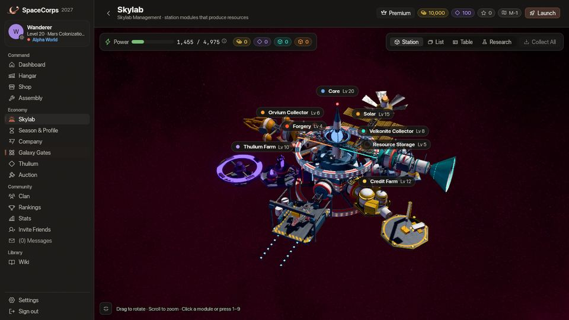
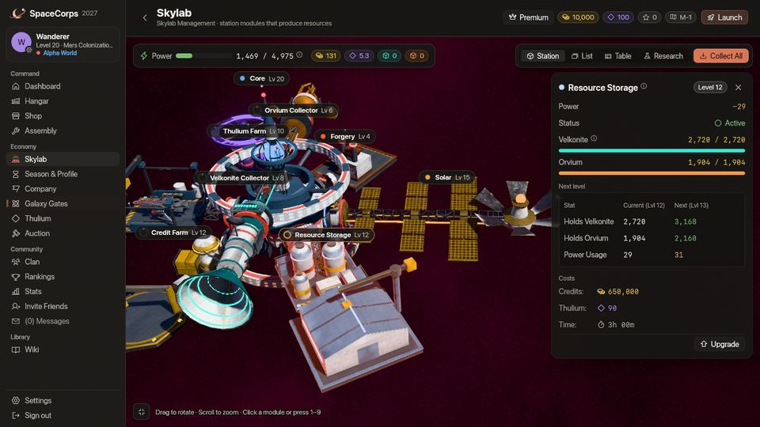
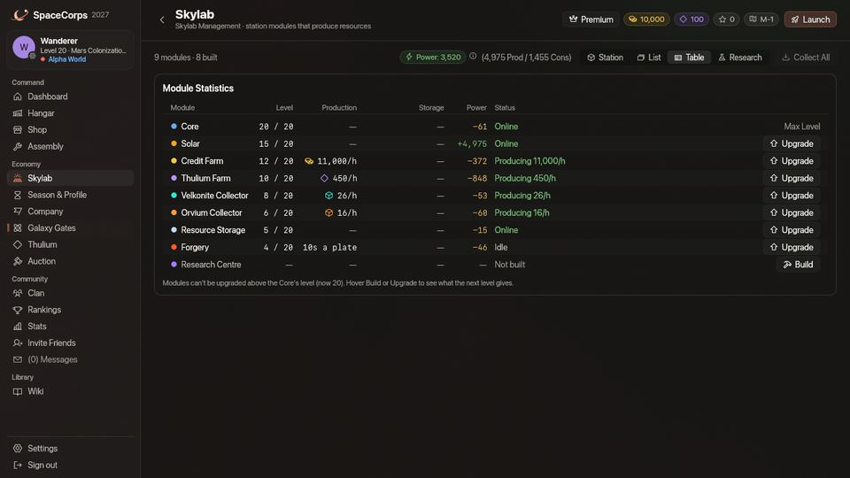

## In einer Minute {#in-one-minute}

- Baue zuerst **Solar**: Ohne dessen Energie läuft im Skylab nichts. Die Credit-Farm kostet beim Bauen nichts, die Thulium-Farm 5.000 Credits und 500 Thulium.
- Farmen und Kollektoren füllen einen **Speicher** (für 72 Stunden), solange du weg bist. **Abholen** bringt ihn auf dein Konto (Credits, Thulium) oder ins Ressourcenlager (Erz).
- Die **Thulium-Farm** ist deine wichtigste Thulium-Quelle: 50 pro Stunde auf Level 1, 1.600 auf Level 20. Die Credit-Farm macht auf Level 1 500 Credits pro Stunde und auf Level 20 50.000.
- Der **Kern** gibt den Takt vor: Kein Modul geht über ihn hinaus, und sein eigener Ausbau dauert etwa 16,5 Tage.
- Auf **Kern-Level 10** baut eine **Brücke** den **Kern 2** mit sechs weiteren Modul-Slots, und der **Munitionsdrucker** und die **Raketenfabrik** docken dort an. Der Schritt auf Level 10 kostet 2.000 Thulium mehr.
- **Solar erzeugt während des Ausbaus nur 25 % seiner Energie**, deine Farmen und Kollektoren stehen also still, bis er fertig ist. [Plane es](#timing-a-solar-upgrade).

## Überblick {#overview}

Das Skylab läuft nach seiner eigenen Uhr, unabhängig von deinem Schiff: Module produzieren und schmieden, während du weg bist. Deine Aufgabe ist es, zu bauen, auszubauen, die Energie im Gleichgewicht zu halten und abzuholen. Die Seite hat vier Ansichten derselben Station: **Station** (die 3D-Station, mit einem Chip über jedem Modul; klicke auf einen, um das Fenster des Moduls zu öffnen, oder drücke **1** bis **9**), **Liste** (eine Karte für jedes Modul), **Tabelle** (die Werte aller Module in einer Tabelle) und **Forschung** (der eigene Bildschirm des Forschungszentrums, siehe [Forschung](/wiki/03-Mechanics/Research.md)). Zeigst du auf **Bauen** oder **Ausbauen**, siehst du, was das nächste Level ändert, was es kostet und wie lange es dauert.

Elf Module bilden die Station:

| Modul | Erzeugt oder tut | Voraussetzung |
| :--- | :--- | :--- |
| **Kern** | Legt das höchste Level jedes anderen Moduls fest | Immer vorhanden |
| **Solar** | Erzeugt Energie | Beliebiges Kern-Level |
| **Credit-Farm** | Erzeugt [Credits](/wiki/01-General/Getting-Started.md) | Beliebiges Kern-Level |
| **Thulium-Farm** | Erzeugt [Thulium](/wiki/01-General/Getting-Started.md) | Beliebiges Kern-Level |
| **Velkonite-Kollektor** | Fördert Velkonite-Erz | Kern-Level 5 |
| **Orvium-Kollektor** | Fördert Orvium-Erz | Kern-Level 5 |
| **Ressourcenlager** | Verwahrt das Erz | Kern-Level 5 |
| **Schmiede** | Schmiedet Erz zu Platten | Kern-Level 5 |
| **Forschungszentrum** | Macht aus Ressourcen Wissenschaft und erforscht [Technologien](/wiki/03-Mechanics/Research.md) | Kern-Level 10 |
| **Munitionsdrucker** | Druckt x2-, x3- oder x4-Munition aus dem Nichts | Kern-Level 10, auf Kern 2 |
| **Raketenfabrik** | Baut Shop-Raketen aus dem Nichts | Kern-Level 10, auf Kern 2 |

Die **Brücke** und **Kern 2** sind keine Module: Sie entstehen, wenn der Kern Level 10 erreicht, und Kern 2 hat kein eigenes Level (siehe [Die Brücke und Kern 2](#the-bridge-and-core-2)).

**Missionen dafür.** Zehn [Station-Missionen](/wiki/03-Mechanics/Quests.md#station-missions) in Mission Control führen dich durch das Skylab: Baue Solar, eine Credit-Farm und eine Thulium-Farm, bring den Kern und Solar auf höhere Level, hol deine ersten 50.000 Credits ab und öffne die Versorgungskette, und für jeden Schritt zahlen sie dir ein wenig. Die erste ist ab Level 1 offen.

## Die Station auf jedem Level {#the-station-at-every-level}

Hier siehst du die Ansicht Station des Skylab auf jedem Level von 1 bis 20, alle aus demselben Winkel, mit jedem Modul auf demselben Level. Die Ansicht passt die ganze Station ins Bild, daher ist der Maßstab nicht überall gleich: Er springt, wenn die Form wächst. Die Station wächst in Stufen: Ihre Form ändert sich auf **Level 1, 5, 10, 15 und 20**, und dazwischen lässt jedes Level **eine Lampe mehr** am Kragen jedes Moduls aufleuchten (die Zahl der leuchtenden Lampen ist das Level, und der Ring aus zwanzig Lampen am Kern füllt sich genauso).

Die Bilder ab Level 10 zeigen die Station, wie sie vor der Brücke aussah: Seit 0.4.15 baut der Schritt des Kerns auf Level 10 auch die Brücke und Kern 2, und Solar steht auf Kern 2 (siehe [Die Brücke und Kern 2](#the-bridge-and-core-2)).

**Level 1 bis 4.** Die ersten vier Module um den Kern: Solar, die Credit-Farm, die Thulium-Farm und die Andockbucht, die dein Schiff aufnimmt. Die Versorgungskette lässt sich noch nicht bauen.

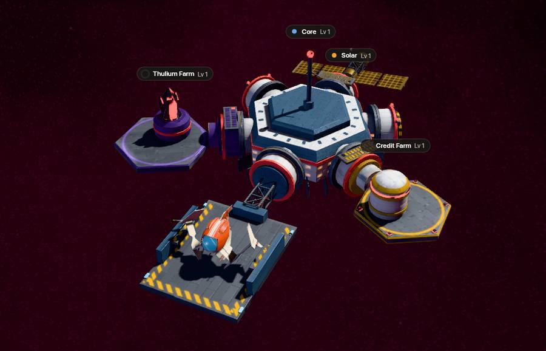

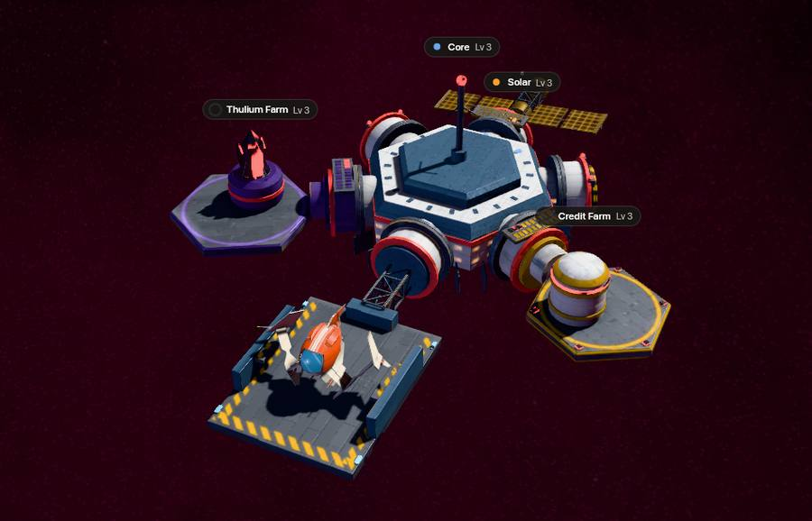
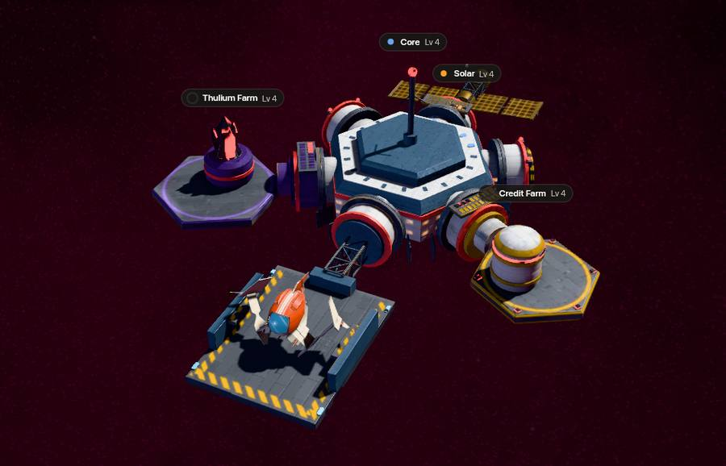

**Level 5 bis 9.** Mit Kern-Level 5 lässt sich die Versorgungskette bauen: die beiden Kollektoren auf ihren Gerüsten über der Station, das Ressourcenlager am Nordost-Port des Kerns und die Schmiede an seinem Nordwest-Port (hier im gebauten Zustand gezeigt).

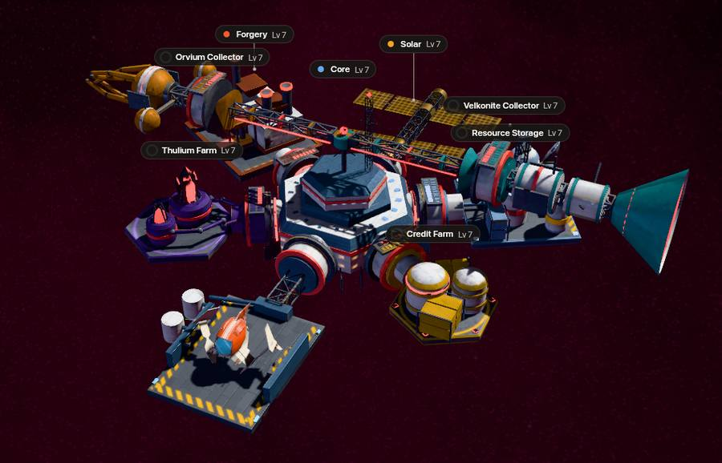

**Level 10 bis 14.** Der Kern trägt seinen Ring, die Farmen und die Kollektoren nehmen ihre größere Form an, und die Thulium-Farm bekommt einen eigenen Ring.

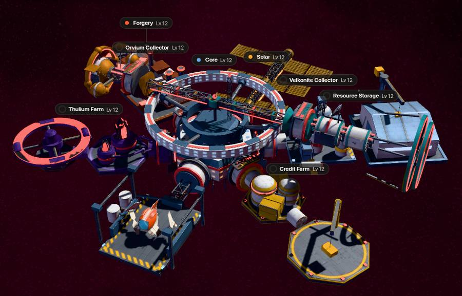

**Level 15 bis 19.** Die Farmen füllen sich mit Kisten und Kristallen, die Andockbucht beleuchtet ihre Anflugschneise, und die Solaranlage bekommt ihre Spitze.

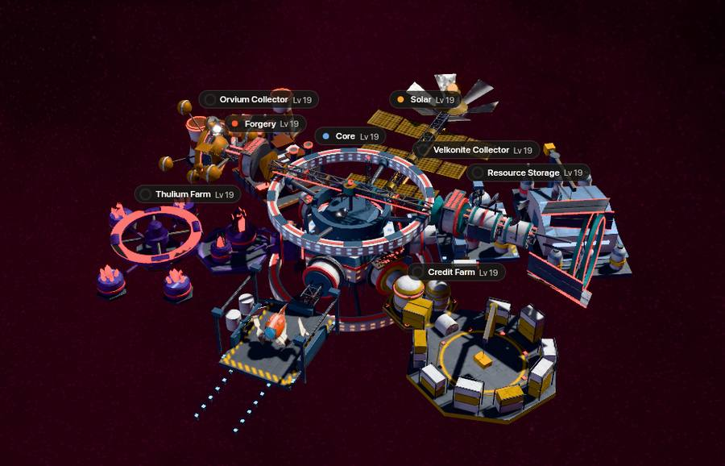

**Level 20.** Die oberste Sprosse der Leiter: die Krone auf dem Kern und die ausgewachsenen Türme der Farmen und der Versorgungskette.

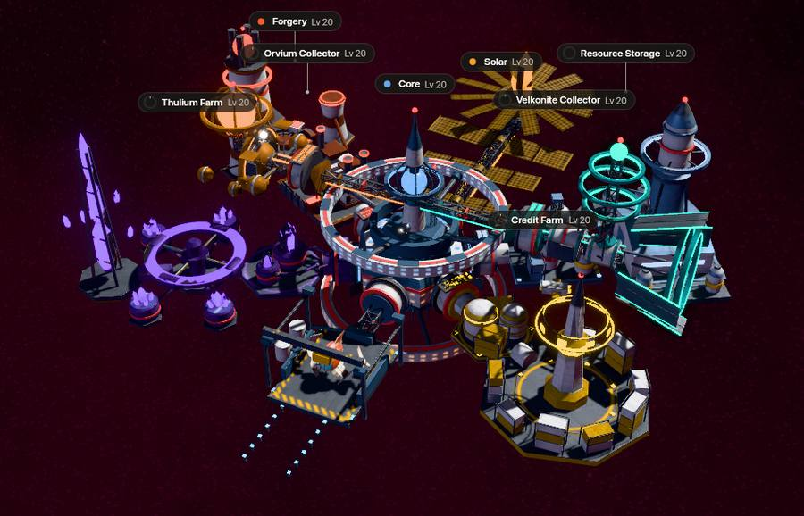

**Die Karten der neun Module.** Die Ansicht Liste derselben Station auf Level 20: die vier Module der ersten Version und der Velkonite-Kollektor, der Orvium-Kollektor, das Ressourcenlager und die Schmiede, die mit der Versorgungskette dazukamen, und das Forschungszentrum. Jede Karte zeigt das Level des Moduls, seine Produktion, seine Energie und seinen Schalter. Jede Karte zeigt Level 20, nur die des Forschungszentrums nicht: Es hat die Level 1 bis 10, seine Karte zeigt also Level 10, sein höchstes. Der Munitionsdrucker und die Raketenfabrik haben in derselben Ansicht ihre eigenen Karten; sie sind [unten](#the-bridge-and-core-2) beschrieben.

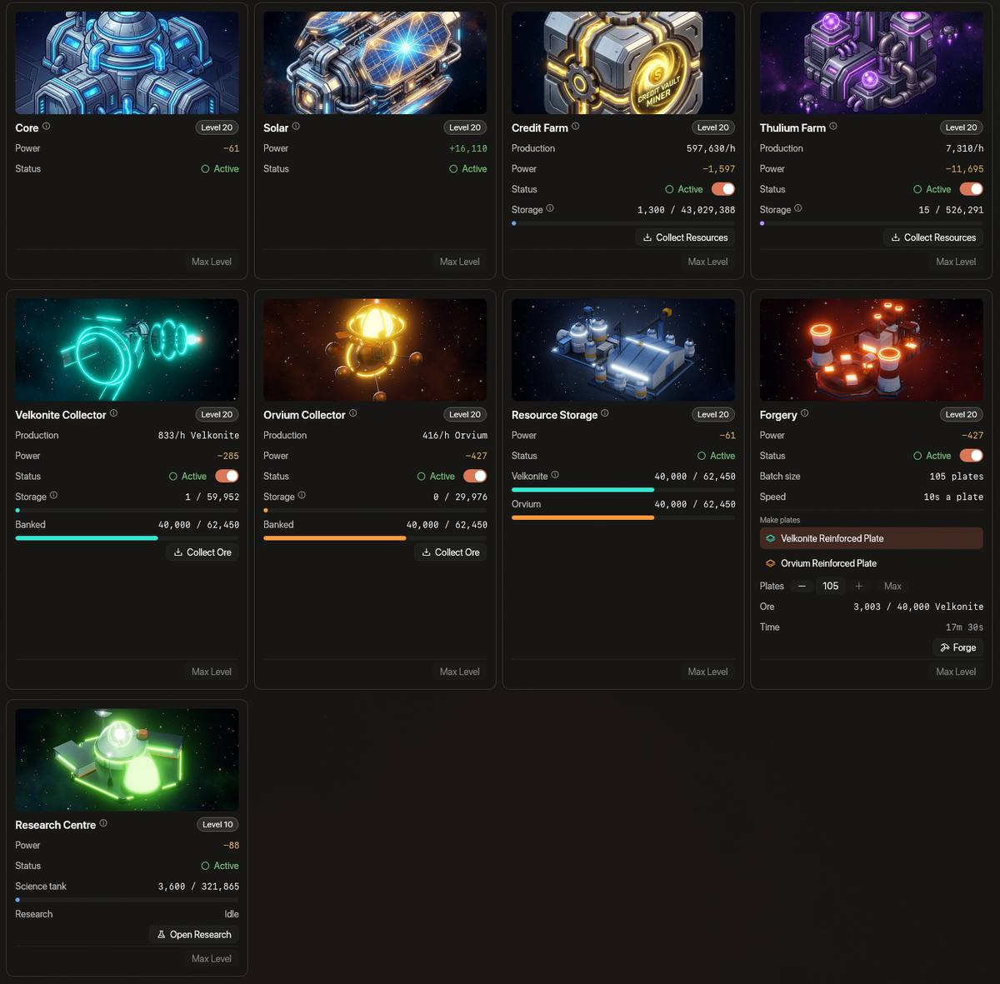

## Die ersten vier Module {#the-first-four-modules}

### Kernmodul {#core-module}

Das Herz deines Skylab. Das Level des Kerns bestimmt das höchste Level jedes anderen Moduls: Kein Modul lässt sich höher ausbauen als dein Kern. Der Kern geht bis Level 20, und ab **Level 5** öffnet er die Versorgungskette (siehe unten). Sein Ausbau kostet Credits, und der Schritt auf **Level 10** kostet **2.000 Thulium** mehr und baut die Brücke und Kern 2 (siehe [Die Brücke und Kern 2](#the-bridge-and-core-2)). Insgesamt sind es 112.326 Credits bis Level 10 und 6.647.504 bis Level 20, dazu diese 2.000 Thulium, und der Ausbau dauert etwa 16,5 Tage (siehe [Ausbauzeiten](#upgrade-times)).

### Solarmodul {#solar-module}

Energie ist das Lebenselixier des Skylab. Das Solarmodul erzeugt die Energie, die jedes andere Modul verbraucht.

- **Bedeutung**: Ist dein Energieverbrauch höher als deine Energieerzeugung, schalten deine Farmen und Kollektoren ab.
- **Erzeugte Energie**: Ein Solarmodul auf Level N erzeugt genug für **jedes andere Modul auf Level N** und etwa ein Zehntel mehr: 255 auf Level 1, 965 auf Level 7, 17.890 auf Level 20. Solar auf Level 7 versorgt eine ganze Station auf Level 7 (siehe Energieverwaltung für jedes Level).
- **Preis**: Der Bau von Solar kostet **500 Credits und 50 Thulium**. Sein Ausbau kostet dasselbe und dauert genauso lang wie der der Schmiede: von 8.000 Credits und 25 Thulium für Level 2 (5 Minuten) bis 9.000.000 Credits und 10.000 Thulium für Level 20 (24 Stunden).
- **Ausbau**: Solange Solar ausgebaut wird, erzeugt es nur **25 %** der Energie seines aktuellen Levels, und ab dem Ende des Ausbaus die des neuen Levels. Eine Station, die mehr verbraucht, schaltet ab: Jede Farm und jeder Kollektor hört auf zu produzieren, und die Schmiede startet keine neue Charge, bis der Ausbau fertig ist. Bei fast jeder Station ist das der Fall: Sie läuft nur dann durch den Ausbau, wenn alle anderen Module mindestens fünf Level unter Solar liegen (sechs Level ab Solar-Level 10). Plane einen Solar-Ausbau wie einen Blackout deiner Farmen (siehe Bauen und Ausbauen).
- **Platz**: Ab Kern-Level 10 steht Solar auf Kern 2, am fernen Ende der Station (siehe [Die Brücke und Kern 2](#the-bridge-and-core-2)).

### Credit-Farm und Thulium-Farm {#credit-farm-and-thulium-farm}

- **Credit-Farm**: erzeugt mit der Zeit Credits: **500 pro Stunde auf Level 1, 50.000 auf Level 20** (Level 5: 2.500; Level 10: 7.500; Level 15: 17.000). Der Bau kostet nichts.
- **Thulium-Farm**: erzeugt mit der Zeit Thulium: **50 pro Stunde auf Level 1, 1.600 auf Level 20** (Level 5: 180; Level 10: 450; Level 15: 950). Der Bau kostet 5.000 Credits und 500 Thulium.
- Beide brauchen Energie, und jede speichert 72 Stunden ihrer Produktion, bis du sie abholst.

## Die Versorgungskette {#the-supply-chain}

Vier Module verwandeln die Zeit, die du nicht an der Tastatur verbringst, in die Platten für deine besten Laser. Erz kommt **nur** aus den Kollektoren (alle Materialien und Währungen stehen auf der Seite [Ressourcen](/wiki/06-Items/Resources.md)): Aliens lassen es nicht fallen, und der Shop verkauft es nicht.

1. Ein **Kollektor** fördert Erz, eine bestimmte Menge pro Stunde, in seinen eigenen Speicher (für 72 Stunden).
2. **Abholen** bringt das Erz aus dem Speicher ins **Ressourcenlager**, wo jedes Erz für sich eingelagert wird.
3. Die **Schmiede** nimmt das Erz, das sie braucht, aus dem Lager, wenn eine Charge startet, und macht daraus Platten, 10 Sekunden pro Platte, eine Charge nach der anderen.
4. **Platten abholen** bringt die fertigen Platten in dein Inventar (dein Schiff muss gelandet sein). Die [Montage](/wiki/06-Items/Lasers.md) macht daraus einen Quantum Laser III, einen Starfire-III oder einen Helios Beam und, aus je einer der beiden Platten mit 5 Dark Matter, eine Dark Matter Plate, die die [Schmiede der Montage](/wiki/06-Items/Forge.md) und die letzte Stufe jeder Aufwertungskette verlangen.

### Velkonite-Kollektor und Orvium-Kollektor {#velkonite-collector-and-orvium-collector}

- **Erz**: Der Velkonite-Kollektor fördert auf Level 1 **10 Velkonite pro Stunde** und der Orvium-Kollektor **10 Orvium pro Stunde**, und jedes Level hat seine eigene Rate: bis zu 80 Velkonite und 40 Orvium pro Stunde auf Level 20 (Level 5: 18 und 14 pro Stunde; Level 10: 32 und 24).
- **Speicher**: Jeder fasst 72 Stunden seines Erzes und hört auf zu fördern, wenn er voll ist.
- **Erz abholen**: bringt das Erz ins Ressourcenlager, soweit dort Platz ist. Ist kein Lager gebaut oder das Lager für dieses Erz voll, gibt es keinen Platz dafür, und die Schaltfläche sagt, warum. Der Rest bleibt im Speicher.
- **Energie**: 20 (Velkonite) und 30 (Orvium) auf Level 1, mit jedem Level 15 % mehr.

### Ressourcenlager {#resource-storage}

- **Lager**: verwahrt Velkonite und Orvium getrennt und fasst von jedem eine andere Menge: **240 von jedem auf Level 1**, bis zu 7.680 Velkonite und 3.840 Orvium auf Level 20 (Level 5: 720 und 560; Level 10: 1.920 und 1.440).
- **Obergrenze**: einen Tag der Förderung des zugehörigen Kollektors auf Level 1, bis zu vier Tage auf Level 20. Der Speicher eines Kollektors fasst drei Tage, daher fasst das Lager ab Level 13 mindestens einen vollen Speicher.
- **Über der Obergrenze**: Hält ein Lager mehr als seine Obergrenze (die Auszahlung des Updates 0.4.10 konnte das bewirken), wird nichts weggenommen, aber Abholen fügt von diesem Erz nichts mehr hinzu, bis du etwas davon verbraucht hast.
- Erz kommt nur durch Abholen aus einem Kollektor hinein und nur in die Schmiede wieder heraus. Es gelangt nie in dein Inventar.
- **Das eingelagerte Erz bleibt** über den Saison-Wipe erhalten.
- **Energie**: 10 auf Level 1, mit jedem Level 10 % mehr. Es lässt sich nicht ausschalten.

### Schmiede {#forgery}

- **Platten**: Die Schmiede macht aus Velkonite eine **Velkonite Reinforced Plate** und aus Orvium eine **Orvium Reinforced Plate**: **40 Velkonite** oder **80 Orvium** pro Platte auf Level 1, mit jedem Level weniger, bis auf 30 und 60 auf Level 20 (nie unter 75 %).
- **Chargen**: eine Charge einer Plattensorte auf einmal, **10 Platten auf Level 1** und 5 mehr für jedes weitere Level. Das Erz verlässt das Ressourcenlager in dem Moment, in dem die Charge startet, und jede Platte braucht **10 Sekunden**. Die Platten entstehen nacheinander, auch während du weg bist.
- **Platten abholen**: bringt die fertigen Platten in dein Inventar, solange dein **Schiff gelandet ist**, und der Rest der Charge läuft weiter. Eine neue Charge kann starten, sobald die Schmiede leer ist.
- Eine laufende Charge wird fertig, auch wenn du die Schmiede ausschaltest oder ausbaust. Eine **neue** Charge braucht eine eingeschaltete Schmiede, die nicht gerade ausgebaut wird, und eine ausgeglichene Energiebilanz des Skylab.
- **Energie**: 30 auf Level 1, mit jedem Level 15 % mehr.
- **Nicht handelbar**: Die Platten, die die Schmiede herstellt, können nicht in der [Auktion](/wiki/03-Mechanics/Auction.md#marketable-items) verkauft werden, sonst wären sie die größte Ware ihres Markts. Als Material für die Montage und die Schmiede taugen sie weiterhin.

### Der Bau {#building-them}

Die beiden Kollektoren kosten je **10 Ship Fragments, 20.000 Credits und 500 Thulium**, das Ressourcenlager **10 Ship Fragments, 5.000 Credits und 250 Thulium** und die Schmiede **10 Ship Fragments, 5.000 Credits und 500 Thulium**; alle vier brauchen Kern-Level 5.

- Die Ship Fragments werden aus deinem Inventar genommen (nicht aus dem Transport-Cache), und dein Schiff muss gelandet sein. Das Baufenster zeigt, was du hast, gegenüber dem, was nötig ist, und was dir fehlt.
- Sie verbrauchen Energie. Vor dem Bau zeigt das Fenster deine Energiebilanz jetzt und danach: **Ein Bau kann eine Station ins Defizit bringen**, wenn ihr Solar hinter den anderen Modulen zurückliegt, und ein Defizit stoppt jede Farm und jeden Kollektor. Schalte ein Modul aus oder baue zuerst Solar aus.
- Die beiden Kollektoren hängen an Gerüsten über der Station, das Ressourcenlager sitzt am Nordost-Port des Kerns und die Schmiede an seinem Nordwest-Port.

## Das Forschungszentrum {#the-research-centre}

Das neunte Modul macht aus Ressourcen Wissenschaft und erforscht die Technologien, die die Montage braucht, bevor sie etwas Neues herstellt. Es wird ab Kern-Level 10 gebaut, hat Level 1 bis 10, braucht Energie und lässt sich nicht abschalten. Seine Zahlen, was es als Treibstoff verbrennt, der Boost und der ganze Technologiebaum stehen auf der Seite [Forschung](/wiki/03-Mechanics/Research.md). Die höchsten Technologien brauchen außerdem Dark Matter, das du dem Zentrum hinzufügst: [Dark Matter und Dark Matter Plates](/wiki/03-Mechanics/Dark-Matter.md) sagt, wie du es bekommst.

## Die Brücke und Kern 2 {#the-bridge-and-core-2}

Der Ausbau des Kerns auf **Level 10** baut eine **Brücke** und einen zweiten Kern. Die Brücke dockt am Nordport des Kerns an, wo Solar stand, und verbindet ihn am fernen Ende mit **Kern 2**.

- **Kosten**: Der Schritt von Level 9 auf Level 10 kostet zusätzlich zu seinen 38.443 Credits **2.000 Thulium** und dauert wie bisher 1 h 20 min. Die Brücke und Kern 2 kosten nichts extra und brauchen keine eigene Zeit. Ein Ausbau, der schon lief, behält den Preis, zu dem er gestartet wurde, und ein Kern auf Level 10 oder höher zahlt nichts.
- **Kern 2 hat kein Level**: Es gibt nichts auszubauen und nichts zu bezahlen. Er gibt deiner Station **sechs weitere Modul-Slots**, und die Karte des Kerns zeigt, wie viele davon frei sind.
- **Solar zieht um**: Solar verlässt den Nordport des Kerns, den jetzt die Brücke belegt, und wechselt auf den Nordport von Kern 2 am fernen Ende der Station. Sein Level, seine Energie und ein laufender Ausbau bleiben unberührt.
- **Eine Regel, kein Bau**: Wo jedes Modul sitzt, ergibt sich allein aus dem Level des Kerns. Die Brücke erscheint in dem Moment, in dem der Ausbau des Kerns auf Level 10 fertig ist (ein leiser Ton und eine Meldung sagen es dir), und ein Skylab, dessen Kern schon auf Level 10 oder höher ist, hat sie beim nächsten Blick. Kein Modul geht verloren oder wird gelöscht, nur Solar wechselt seinen Platz.
- **Slots**: Der **Munitionsdrucker** belegt den Nordost-Slot von Kern 2 und die **Raketenfabrik** den Nordwest-Slot; die anderen vier bleiben frei für künftige Module. Beide lassen sich erst bauen, wenn Kern 2 steht: Davor steht auf der Schaltfläche „Braucht Kern 2“.
- **Level**: Ein Modul auf Kern 2 folgt dem Level des Kerns wie jedes andere Modul: Keines geht über den Kern hinaus, Kern 2 bringt also Slots, keine Level.

### Munitionsdrucker {#ammo-printer}

Der Munitionsdrucker druckt Lasermunition aus dem Nichts, immer eine Sorte: kein Erz und keine Credits, nur Energie. Er hat die Level 1 bis 20.

- **Ausstoß**: **x2** (Advanced Plasma) **100 pro Stunde auf Level 1, 2.000 auf Level 20** (mit jedem Level 100 mehr); **x3** (Ultra Core) die Hälfte davon, 50 bis 1.000; **x4** (Experimental Fusion Core) ein Viertel, 25 bis 500.
- **Modus**: Du wählst x2, x3 oder x4 auf seiner Karte oder im Fenster. Ein Wechsel behält die bereits gespeicherten Stunden und rechnet sie danach mit der Rate des neuen Modus.
- **Speicher**: ein Tag, 24 Stunden Produktion auf dem Level und in der Sorte, die gerade läuft (2.400 x2 auf Level 1, 48.000 auf Level 20). Offline-Zeit zählt, und ein voller Speicher hält einfach an.
- **Abholen**: bringt die ganzen Einheiten in dein Inventar, solange dein **Schiff gelandet ist**. Munition hat kein Tragelimit, und ein Bruchteil einer Einheit bleibt und zählt weiter.
- **Energie**: 40 auf Level 1, mit jedem Level 20 % mehr. Bei einem Energiedefizit hält er an wie die Farmen und Kollektoren, und was er hält, bleibt und lässt sich abholen.
- **Bau**: 20.000 Credits, 500 Thulium und 10 Ship Fragments (aus deinem Inventar, bei gelandetem Schiff), nur auf Kern 2. Seine Ausbauten kosten von 21.000 Credits und 140 Thulium bis 5.600.000 Credits und 11.000 Thulium und dauern so lange wie die der Schmiede, 5 Minuten bis 24 Stunden und insgesamt 5 d 13 h (siehe die Tabellen unten).
- **Nicht handelbar**: Was er druckt, kann nicht in der [Auktion](/wiki/03-Mechanics/Auction.md#marketable-items) verkauft werden.

### Raketenfabrik {#rocket-factory}

Die Raketenfabrik baut Shop-Raketen aus dem Nichts, immer eine Sorte. Sie hat die Level 1 bis 20.

- **Was sie herstellt**: genau eine der zwölf Shop-Raketen, die du wählst: Lancet, Rivet, Scatter oder Ember, Stufe I, II und III. Die N.U.K.E. und die N.I.K.E. entstehen nie.
- **Ausstoß**: Stufe III **0,5 pro Stunde auf Level 1, 10 auf Level 20** (mit jedem Level 0,5 mehr), Stufe II das 1,25-Fache davon und Stufe I das Doppelte. Es zählen nur ganze Raketen: Ein Bruchteil bleibt und zählt weiter.
- **Speicher**: ein Tag, 24 Stunden Produktion auf dem Level und mit der Rakete, die gerade läuft (240 Stufe III auf Level 20). Offline-Zeit zählt, ein voller Speicher hält einfach an, und ein Wechsel der Rakete behält die bereits gespeicherten Stunden.
- **Abholen**: bringt die Raketen in dein Inventar, solange dein **Schiff gelandet ist**, so viele, wie du tragen kannst: höchstens 5.000 Raketen der Stufe I, 2.000 der Stufe II und 500 der Stufe III, das Limit des Shops. Was nicht passt, bleibt in der Fabrik.
- **Energie**: 24 auf Level 1, mit jedem Level 15 % mehr. Bei einem Energiedefizit hält sie an wie der Drucker.
- **Bau**: 20.000 Credits, 500 Thulium und 15 Ship Fragments (aus deinem Inventar, bei gelandetem Schiff), nur auf Kern 2. Ihre Ausbauten kosten ein Viertel von denen des Druckers, von 5.300 Credits und 35 Thulium bis 1.400.000 Credits und 2.800 Thulium, und dauern genauso lange: insgesamt 5 d 13 h.
- **Nicht handelbar**: Was sie baut, kann nicht in der [Auktion](/wiki/03-Mechanics/Auction.md#marketable-items) verkauft werden.

## Mechanik {#mechanics}

### Bauen und Ausbauen {#building-and-upgrading}

- **Bau**: Jedes Modul wird einzeln gebaut. Ein Modul ist auf Level 1, sobald es gebaut ist, und ein Ausbau erhöht seine Produktion (oder seine Energieerzeugung) und seinen Speicher, aber auch seinen Energieverbrauch.
- **Dauer und Kosten**: Ausbauten kosten Credits und Thulium und brauchen Zeit, und jedes Modul hat für jedes Level seinen eigenen Preis und seine eigene Zeit (zeige auf **Ausbauen**, um das nächste zu sehen; die Summen stehen unten). Der Preis wird beim Start des Ausbaus bezahlt. Die Kosten hängen nicht von der Dauer ab.
- **Timer**: Ein Ausbau läuft nach der Uhr des Servers, er wird also fertig, während du weg bist, notfalls Tage später. Starte ihn, logge dich aus, komm zurück: Das Modul hat sein neues Level, wenn du die Skylab-Seite öffnest.
- **Ausbauzeiten**: Die ersten Level gehen schnell, die letzten dauern bis zu 36 Stunden, die des Kerns bis zu 6 Tage (siehe die Tabellen unten). Jedes Modul hat seinen eigenen Timer, du kannst also mehrere gleichzeitig ausbauen.
- **Produktionspause**: Während ein Modul ausgebaut wird, ist es offline: Es produziert nichts und verbraucht keine Energie. Solar ist die Ausnahme: Es erzeugt weiter ein Viertel seiner Energie (siehe unten).
- **Solar erzeugt während des Ausbaus nur 25 % seiner Energie**: Solar erzeugt die gesamte Energie des Skylab, und während seines Ausbaus (24 Stunden für das letzte Level) erzeugt es ein Viertel der Energie seines **aktuellen** Levels; die Energie des neuen Levels übernimmt in dem Moment, in dem der Ausbau endet. Eine volle Station verbraucht etwa 90 % dessen, was Solar auf seinem eigenen Level erzeugt, ein Viertel davon trägt also nur eine Station, die fünf bis sechs Level unter Solar liegt. Sonst stehen alle Farmen und Kollektoren für den ganzen Ausbau still, was du gelagert hast, bleibt und lässt sich abholen, und die Schmiede startet keine neue Charge. Ein Modul, das ausgebaut oder ausgeschaltet wird, verbraucht keine Energie, daher kostet es nichts extra, die Farmen zusammen mit Solar auszubauen, und das Ausschalten von Modulen schafft Platz für die anderen; die Thulium-Farm verbraucht mit Abstand die meiste Energie.

### Was es kostet {#what-it-costs}

Der Preis des ganzen Weges, der Bau plus jeder Ausbau, bis Level 10 und bis Level 20. Der Kern ist immer da, und seine Schritte kosten Credits, auf dem Schritt auf Level 10 dazu 2.000 Thulium; das Forschungszentrum hat Level 1 bis 10, und seine Zahlen stehen auf der Seite [Forschung](/wiki/03-Mechanics/Research.md). Der Munitionsdrucker und die Raketenfabrik werden auf Kern 2 gebaut, also erst, wenn der Kern auf Level 10 ist, und ihr Level 1 ist der Bau.

| Modul | Credits bis Level 10 | Thulium bis Level 10 | Credits bis Level 20 | Thulium bis Level 20 |
| :--- | ---: | ---: | ---: | ---: |
| Kern | 112.326 | 2.000 | 6.647.504 | 2.000 |
| Solar | 1.219.500 | 1.600 | 35.039.500 | 36.850 |
| Credit-Farm | 840.000 | 109 | 26.240.000 | 2.399 |
| Thulium-Farm | 1.154.000 | 4.190 | 32.254.000 | 67.890 |
| Velkonite-Kollektor | 696.000 | 6.950 | 20.996.000 | 78.950 |
| Orvium-Kollektor | 696.000 | 6.950 | 20.996.000 | 78.950 |
| Ressourcenlager | 619.500 | 359 | 18.169.500 | 2.649 |
| Schmiede | 1.224.000 | 2.050 | 35.044.000 | 37.300 |
| Munitionsdrucker | 1.411.000 | 5.140 | 22.031.000 | 47.940 |
| Raketenfabrik | 377.300 | 1.674 | 5.547.300 | 12.494 |

Die ersten Schritte sind billig und die letzten teuer: Der Schritt der Credit-Farm von Level 1 auf 2 kostet 5.000 Credits und 1 Thulium, ihr Schritt von 19 auf 20 kostet 7.000.000 Credits und 550 Thulium. Bei der Thulium-Farm sind es 7.000 Credits und 45 Thulium, dann 8.500.000 Credits und 16.000 Thulium. Der Ausbau von Solar kostet auf jedem Level dasselbe wie der der Schmiede, und die beiden Kollektoren kosten gleich viel.

### Ausbauzeiten {#upgrade-times}

<!-- upgrade-times:start -->
<!-- Generated from server/Resources/SkylabConfig.json by the test skylab::duration_tests::the_wiki_page_is_the_config (run it with SKYLAB_WIKI_WRITE=1 to rewrite this part). -->

**Ausbauzeiten**, je Modul (der Ausbau von dem Level in der ersten Spalte an):

| Level | Kern | Solar | Credit-Farm | Thulium-Farm | Ressourcenlager | Velkonite-Kollektor | Orvium-Kollektor | Schmiede | Forschungszentrum |
| :--- | ---: | ---: | ---: | ---: | ---: | ---: | ---: | ---: | ---: |
| 1 auf 2 | 72 s | 5 min | 5 min | 5 min | 5 min | 5 min | 5 min | 5 min | 78 s |
| 2 auf 3 | 86 s | 15 min | 10 min | 15 min | 10 min | 15 min | 15 min | 15 min | 101 s |
| 3 auf 4 | 104 s | 30 min | 15 min | 30 min | 15 min | 20 min | 20 min | 30 min | 132 s |
| 4 auf 5 | 124 s | 45 min | 20 min | 45 min | 20 min | 30 min | 30 min | 45 min | 171 s |
| 5 auf 6 | 149 s | 1 h | 30 min | 1 h | 30 min | 45 min | 45 min | 1 h | 223 s |
| 6 auf 7 | 20 min | 1 h 15 min | 45 min | 1 h 30 min | 45 min | 50 min | 50 min | 1 h 15 min | 20 min |
| 7 auf 8 | 30 min | 1 h 30 min | 1 h | 2 h | 1 h | 1 h | 1 h | 1 h 30 min | 30 min |
| 8 auf 9 | 50 min | 2 h | 1 h 20 min | 3 h | 1 h 20 min | 1 h 15 min | 1 h 15 min | 2 h | 50 min |
| 9 auf 10 | 1 h 20 min | 3 h | 1 h 40 min | 4 h | 1 h 40 min | 1 h 30 min | 1 h 30 min | 3 h | 1 h 20 min |
| 10 auf 11 | 2 h 15 min | 4 h | 2 h | 5 h | 2 h | 2 h | 2 h | 4 h | – |
| 11 auf 12 | 3 h 30 min | 5 h | 2 h 30 min | 6 h | 2 h 30 min | 3 h | 3 h | 5 h | – |
| 12 auf 13 | 5 h 30 min | 6 h | 3 h | 8 h | 3 h | 4 h | 4 h | 6 h | – |
| 13 auf 14 | 9 h | 8 h | 3 h 30 min | 10 h | 3 h 30 min | 6 h | 6 h | 8 h | – |
| 14 auf 15 | 14 h | 10 h | 4 h | 11 h | 4 h | 8 h | 8 h | 10 h | – |
| 15 auf 16 | 1 d | 12 h | 5 h | 12 h | 5 h | 10 h | 10 h | 12 h | – |
| 16 auf 17 | 1 d 12 h | 16 h | 6 h | 14 h | 6 h | 12 h | 12 h | 16 h | – |
| 17 auf 18 | 2 d 12 h | 18 h | 8 h | 18 h | 8 h | 16 h | 18 h | 18 h | – |
| 18 auf 19 | 4 d | 20 h | 10 h | 1 d | 10 h | 20 h | 1 d | 20 h | – |
| 19 auf 20 | 6 d | 1 d | 12 h | 1 d 12 h | 12 h | 1 d | 1 d 12 h | 1 d | – |
| **Gesamt** | 16 d 13 h | 5 d 13 h | 2 d 14 h | 6 d 13 h | 2 d 14 h | 4 d 16 h | 5 d 10 h | 5 d 13 h | 3 h 12 min |
<!-- upgrade-times:end -->

Ein Ausbau, der schon läuft, wenn sich die Zeiten ändern, behält die Fertigstellungszeit, die er bekommen hat. Allein der Kern braucht etwa **16,5 Tage** Ausbau am Stück, um von Level 1 auf Level 20 zu kommen. Kein Modul steigt über das Level des Kerns, daher kann der letzte Schritt jedes anderen Moduls (12 bis 36 Stunden) erst beginnen, wenn der Kern auf Level 20 ist: Wenn jeder Timer ständig läuft und die Credits und das Thulium bereitliegen, braucht die ganze Station etwa **18 Tage**.

### Energieverwaltung {#power-management}

Dein Skylab hat ein begrenztes Energiebudget.

- **Bilanz**: Halte die Leistung von Solar über dem Verbrauch aller anderen Module. Die Skylab-Seite zeigt die Bilanz und warnt, bevor ein Bau sie unter null drücken würde.
- **Solar hält Schritt**: Ein Solarmodul auf Level N erzeugt die Energie **aller anderen Module auf Level N** (Kern, beide Farmen, Ressourcenlager, beide Kollektoren und Schmiede, ab Level 10 auch das Forschungszentrum) und etwa ein Zehntel mehr, eine Station, deren Module alle auf Level 7 stehen, braucht also Solar 7 und ist damit gedeckt. Solar ein Level niedriger reicht für eine volle Station nicht (die letzte Spalte), Solar muss dem Rest also weiter nach oben folgen. Der Kern verbraucht wenig, er darf also vorauslaufen: Solar 5 und höher deckt eine volle Station auf ihrem Level, mit dem Kern auf jedem Level. Die Tabelle unten zählt auch den Munitionsdrucker ab Level 7 und die Raketenfabrik ab Level 10.
- **Aktiver Zustand**: Du kannst die Farmen, die Kollektoren und die Schmiede ein- und ausschalten, um die Energie zu verwalten. Kern, Solar, das Ressourcenlager und das Forschungszentrum laufen immer. Auch der Munitionsdrucker und die Raketenfabrik lassen sich ein- und ausschalten.
- **Energiedefizit**: Ist der Energieverbrauch höher als die Erzeugung, hören alle Farmen und Kollektoren auf zu produzieren, bis die Bilanz wieder stimmt. Was sie schon gelagert haben, bleibt, und du kannst es weiterhin abholen. Die Schmiede startet keine neue Charge, und das Forschungszentrum startet keine neue Forschung (eine laufende Forschung geht weiter). Der Munitionsdrucker und die Raketenfabrik halten an wie die Farmen und Kollektoren.
- **Solar-Ausbau**: Solange Solar ausgebaut wird, erzeugt es nur ein Viertel seiner Energie. Liegen deine anderen Module nicht weit darunter, steht die Station also im Defizit, und die Farmen und Kollektoren stehen still, bis der Ausbau fertig ist (siehe [Solarmodul](#solar-module)).

Die Energie von Solar auf jedem Level, gegenüber dem, was die anderen Module auf demselben Level verbrauchen (jedes Modul auf diesem Level, der Kern eingeschlossen, und das Forschungszentrum ab Level 10):

<!-- skylab-power:start -->
<!-- Generated from server/Resources/SkylabConfig.json by docs/design/skylab-power-model.py --doc (--check fails while this part is behind). -->

| Level | Solar erzeugt | Die anderen sieben Module verbrauchen | Übrig | Mit Solar ein Level niedriger |
| :--- | ---: | ---: | ---: | :--- |
| 1 | 255 | 230 | 25 | – |
| 2 | 310 | 278 | 32 | 255: 23 zu wenig |
| 3 | 375 | 337 | 38 | 310: 27 zu wenig |
| 4 | 455 | 410 | 45 | 375: 35 zu wenig |
| 5 | 555 | 501 | 54 | 455: 46 zu wenig |
| 6 | 680 | 615 | 65 | 555: 60 zu wenig |
| 7 | 965 | 875 | 90 | 680: 195 zu wenig |
| 8 | 1.185 | 1.076 | 109 | 965: 111 zu wenig |
| 9 | 1.460 | 1.327 | 133 | 1.185: 142 zu wenig |
| 10 | 2.000 | 1.814 | 186 | 1.460: 354 zu wenig |
| 11 | 2.445 | 2.221 | 224 | 2.000: 221 zu wenig |
| 12 | 3.005 | 2.731 | 274 | 2.445: 286 zu wenig |
| 13 | 3.715 | 3.373 | 342 | 3.005: 368 zu wenig |
| 14 | 4.605 | 4.183 | 422 | 3.715: 468 zu wenig |
| 15 | 5.730 | 5.205 | 525 | 4.605: 600 zu wenig |
| 16 | 7.150 | 6.499 | 651 | 5.730: 769 zu wenig |
| 17 | 8.955 | 8.140 | 815 | 7.150: 990 zu wenig |
| 18 | 11.250 | 10.225 | 1.025 | 8.955: 1.270 zu wenig |
| 19 | 14.170 | 12.879 | 1.291 | 11.250: 1.629 zu wenig |
| 20 | 17.890 | 16.261 | 1.629 | 14.170: 2.091 zu wenig |
<!-- skylab-power:end -->

Die Tabelle zählt jedes Modul auf demselben Level. Die Thulium-Farm verbraucht oben knapp drei Viertel davon (11.695 auf Level 20, gegenüber 16.261 für alle zehn), eine Station mit dieser Farm weit vor dem Rest braucht also mehr Solar, als ihr Kern vermuten lässt.

### Abholen {#collecting}

Jede Farm und jeder Kollektor hat einen Speicher für etwa 72 Stunden der eigenen Produktion. Du holst von Hand ab.

- **Kapazität**: Ist ein Speicher voll, produziert das Modul nichts mehr, bis du abholst.
- **Farmen**: Abgeholte Credits und abgeholtes Thulium gehen direkt auf dein Konto.
- **Kollektoren**: Das Erz geht ins Ressourcenlager, soweit dort Platz ist.
- **Schmiede**: Die Platten gehen in dein Inventar, wenn dein Schiff gelandet ist.
- **Munitionsdrucker und Raketenfabrik**: Die Munition und die Raketen gehen in dein Inventar, wenn dein Schiff gelandet ist. Jeder speichert nur 24 Stunden Produktion (siehe [Munitionsdrucker](#ammo-printer) und [Raketenfabrik](#rocket-factory)).
- **Alles abholen** nimmt alles auf einmal, auch von ausgeschalteten Modulen und von Modulen im Ausbau.
- Ein **(!)**-Abzeichen weist auf einen vollen Speicher hin, den du leeren kannst, und auf Platten, die in der Schmiede warten, auf der Skylab-Seite und in der Skylab-Zeile der Seitenleiste.

### Der Wipe {#the-wipe}

Das Skylab wird beim Wipe nie zurückgesetzt: Module behalten ihre Level, das Ressourcenlager behält sein Erz, und das Forschungszentrum behält seine Technologien, seinen Tank voll Wissenschaft, das darin liegende Dark Matter und eine laufende Forschung. Die Platten in deinem Inventar sind Gegenstände wie alle anderen, sie folgen also den [Wipe-Regeln](/wiki/03-Mechanics/Wipe-Timeline.md). Der Munitionsdrucker und die Raketenfabrik behalten ihre Level, das, was sie herstellen sollen, und das, was sie halten.

## Dein Skylab planen {#planning-your-skylab}

Ein Skylab wächst wochenlang, ein wenig Planung zahlt sich also aus. Die Zahlen sind die Tabellen oben.

### Was du zuerst ausbaust {#what-to-upgrade-first}

1. **Solar, dann die Credit-Farm.** Solar kostet 500 Credits und 50 Thulium, und ohne es läuft nichts; die Credit-Farm kostet nichts. Die zehn [Station-Missionen](/wiki/03-Mechanics/Quests.md#station-missions) führen dich durch diese ersten Schritte und zahlen dir dafür 52.000 Credits und 610 Thulium, als Basis: Deine Welt, Booster und Clan-Boosts multiplizieren sie.
2. **Dann die Thulium-Farm: Sie ist deine wichtigste Thulium-Quelle.** Auf Level 10 erzeugt sie 450 Thulium pro Stunde, 10.800 pro Tag, so viel wie 54 Abschüsse eines [Crystalys](/wiki/04-Aliens/Crystalys.md) in Alpha zahlen (je 200). Der Weg bis Level 10 kostet 1.154.000 Credits und 4.190 Thulium, den Bau eingerechnet. Auf Level 15 erzeugt die Farm 22.800 pro Tag und auf Level 20 38.400. Ihr Speicher fasst 72 Stunden, komm also mindestens alle drei Tage vorbei. Was Thulium kauft, steht auf der Seite [Ressourcen](/wiki/06-Items/Resources.md#thulium).
3. **Die Credit-Farm ist das stetige Nebeneinkommen.** Auf Level 10 erzeugt sie 7.500 Credits pro Stunde, 180.000 pro Tag, für 840.000 Credits und 109 Thulium. Die höheren Level zahlen sich langsam zurück: Der Schritt von Level 9 auf 10 kostet 300.000 Credits für 1.000 mehr pro Stunde, das sind 300 Stunden. Baue sie aus, wenn du Credits übrig hast.
4. **Halte den Kern beschäftigt.** Nichts geht über den Kern hinaus, und der Kern allein braucht etwa 16,5 Tage bis Level 20. Es gibt keine Warteschlange, also starte seinen nächsten Schritt jedes Mal, wenn du zurückkommst.
5. **Baue die Versorgungskette als Satz.** Die Kollektoren, das Ressourcenlager und die Schmiede öffnen sich auf Kern-Level 5. Ein Kollektor kann Erz nur in ein Ressourcenlager einlagern, und das Lager fasst auf Level 1 einen Tag der Förderung seines Kollektors und auf Level 20 vier Tage, baue das Lager also zusammen mit den Kollektoren aus, sonst wartet das Erz in deren Speichern.
6. **Halte 2.000 Thulium für Kern-Level 10 bereit.** Der Schritt des Kerns von Level 9 auf Level 10 verlangt sie, und er baut die Brücke und Kern 2, wo der [Munitionsdrucker](#ammo-printer) und die [Raketenfabrik](#rocket-factory) gebaut werden.

### Einen Solar-Ausbau planen {#timing-a-solar-upgrade}

Solange Solar ausgebaut wird, erzeugt es ein Viertel seiner Energie, und eine Station verbraucht fast immer mehr. Die Farmen und Kollektoren stehen dann für den ganzen Ausbau still: Was sie halten, bleibt, aber was sie hätten erzeugen können, ist verloren. Die Tabelle nennt für jeden Solar-Schritt seine Zeit, die größte Station, die noch durchläuft (jedes Modul auf demselben Level, Kern und Versorgungskette eingeschlossen; eine kleinere Station kommt etwas weiter), und was eine Credit-Farm und eine Thulium-Farm dieses Levels in der Zeit erzeugt hätten. Zum Beispiel dauert Solar von Level 10 auf 11 vier Stunden, und Farmen auf Level 10 hätten darin 30.000 Credits und 1.800 Thulium erzeugt. Die Tabelle zählt auch den Munitionsdrucker ab Level 7 und die Raketenfabrik ab Level 10.

| Solar-Ausbau | Zeit | Station, die weiterläuft, bis Level | Credit-Farm erzeugt in der Zeit | Thulium-Farm erzeugt in der Zeit |
| :--- | ---: | ---: | ---: | ---: |
| 1 auf 2 | 5 min | keine | 42 | 4 |
| 2 auf 3 | 15 min | keine | 250 | 20 |
| 3 auf 4 | 30 min | keine | 750 | 55 |
| 4 auf 5 | 45 min | keine | 1.500 | 105 |
| 5 auf 6 | 1 h | keine | 2.500 | 180 |
| 6 auf 7 | 1 h 15 min | keine | 4.375 | 288 |
| 7 auf 8 | 1 h 30 min | 1 | 6.750 | 420 |
| 8 auf 9 | 2 h | 2 | 11.000 | 660 |
| 9 auf 10 | 3 h | 3 | 19.500 | 1.140 |
| 10 auf 11 | 4 h | 4 | 30.000 | 1.800 |
| 11 auf 12 | 5 h | 5 | 45.000 | 2.750 |
| 12 auf 13 | 6 h | 6 | 66.000 | 3.900 |
| 13 auf 14 | 8 h | 7 | 104.000 | 6.000 |
| 14 auf 15 | 10 h | 8 | 150.000 | 8.500 |
| 15 auf 16 | 12 h | 9 | 204.000 | 11.400 |
| 16 auf 17 | 16 h | 9 | 320.000 | 17.600 |
| 17 auf 18 | 18 h | 11 | 432.000 | 22.500 |
| 18 auf 19 | 20 h | 12 | 580.000 | 28.000 |
| 19 auf 20 | 1 d | 13 | 840.000 | 36.000 |

- **Baue die Farmen zusammen mit Solar aus.** Ein Modul im Ausbau erzeugt ohnehin nichts und verbraucht keine Energie, daher kostet die Zeit, die eine Farm während der Pause mit ihrem Ausbau verbringt, nichts extra.
- **Halte die anderen Module niedrig, wenn du dir keine Pause leisten kannst.** Eine Station läuft nur dann durch einen Solar-Ausbau, wenn alle ihre anderen Module mindestens fünf Level unter Solar liegen (sechs ab Solar-Level 10), und eine volle Station braucht etwas mehr, wie die Tabelle zeigt.
- **Schalte aus, worauf du verzichten kannst.** Ein ausgeschaltetes Modul verbraucht keine Energie, daher schafft das Ausschalten der Thulium-Farm, die am meisten verbraucht (80 auf Level 1, mit jedem Level 30 % mehr), Platz für die anderen.
