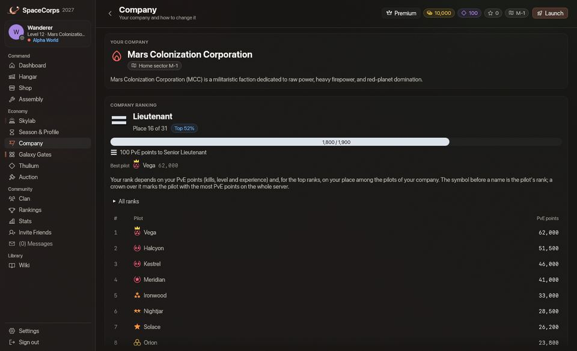
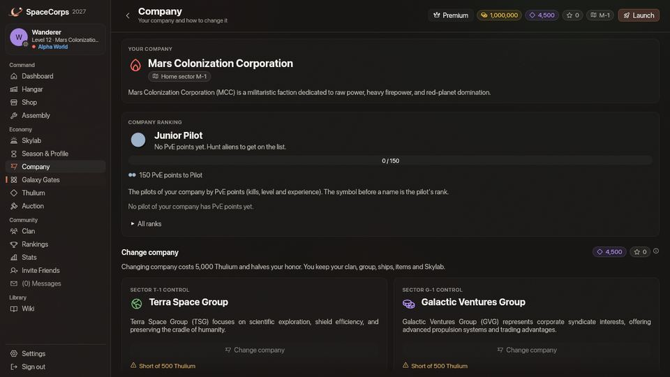

<!-- wiki-i18n source: 50138d1e4d4865f8 -->
<!-- wiki-i18n title: Pilotos de corporación -->
# Pilotos de corporación {#company-pilots}

Cada corporación mantiene un pequeño escuadrón de pilotos NPC en sus sectores de origen (`M-1` a `M-4`, `T-1` a `T-4`, `G-1` a `G-4`). Vuelan para la corporación a todas horas y echan una mano a sus pilotos.

## Quiénes son {#who-they-are}

- **Escuadrón**: 3 pilotos por sector de corporación en cada mundo (Alpha, Beta y Gamma tienen sus propios escuadrones), cada uno con la etiqueta de la corporación y un indicativo, p. ej., **[M] Vesper**. Sus etiquetas de nombre llevan una pequeña marca de robot y el color de la corporación.
- **Nave**: una [Ostirion](/wiki/02-Ships/Ostirion.md) con tres **Quantum Laser II**, dos **Light Shield Cores**, un **Engine I** y un **Repair Drone I**:
  - 48.000 puntos de vida, 22.000 puntos de escudo, velocidad 202
  - absorción del 45 %: sus escudos reciben el 45 % de cada impacto y el casco, el 55 %
  - 195 de daño base por andanada (munición x1), sin probabilidad de crítico, alcance 700
- **En el minimapa**: un rombo verde para los pilotos de tu corporación y uno ámbar para los de otra corporación.
- **Sin rango**: el pequeño símbolo delante del nombre de un piloto en vuelo es su [rango](/wiki/03-Mechanics/Ranks.md) y pertenece a los pilotos reales. Los pilotos de corporación no tienen ninguno y no están en la clasificación de tu corporación. La página Corporación lista a los pilotos reales de tu corporación con más puntos PvE primero, y el rango de un piloto sale de sus puntos PvE en esa lista y, en los seis mejores rangos, de las plazas que tiene la corporación.

## Qué hacen {#what-they-do}

- **Patrullan** un circuito que pasa por la estación del sector, sus portales y algunos puntos intermedios.
- **Cazan** los alienígenas que pueden vencer (Seekers y Phantasms; dejan en paz a Bulwarks, Goombahs y Crystalys) mientras haya pilotos volando en el sector. Un alienígena contra el que lucha un piloto de otra corporación es de ese piloto: el escuadrón lo deja en paz.
- **Ignoran los [enjambres](/wiki/05-Swarms/Swarms.md)**: una nave de enjambre no es asunto suyo. No la cazan ni se suman a un combate contra ella, y nunca acuden en tu ayuda en uno.
- **Ayudan**: cuando un alienígena ataca a un piloto de su corporación que está a menos de 1500 de ellos, o cuando ese piloto abre fuego contra un alienígena que ellos podrían vencer, se unen a ese combate. Se mantienen al margen de un combate que un compañero empezó con un alienígena al que no podrían vencer (un Goombah al que un piloto disparó, o un Bulwark); a un alienígena agresivo que va a por un compañero lo combaten, sea cual sea. Un alienígena que rematan paga al piloto que tiene su reclamación (el primero que lo impactó; consulta [Combate](/wiki/03-Mechanics/Combat.md)); si nadie la tiene, cuenta para el piloto de su corporación más cercano que le esté disparando (con fijación, a su alcance y con una andanada en los últimos 2,5 segundos). En ambos casos, las recompensas son de ese piloto, y su [caja de carga](/wiki/03-Mechanics/Cargo.md) queda reservada para él como si hubiera hecho el derribo. Los pilotos de corporación nunca reclaman un alienígena ni ganan o recogen nada ellos mismos: un alienígena contra el que luchan solos no deja caja. Fijar un alienígena desde lejos, o solo recibir sus disparos, no da nada.
- **Se defienden** cuando les disparan alienígenas, y también pilotos de otras corporaciones una vez abierto el PvP y donde su [mundo](/wiki/03-Mechanics/Wipe-Timeline.md#worlds-alpha-beta-and-gamma) permite el PvP: no en `x-1` a `x-3` de Alpha, ni en `x-1` de Beta.
- **Reparan** con su dron siempre que su casco está dañado: un 1,5 % de él por segundo, a partir de 10 segundos después del último impacto.
- **Se retiran** al 30 % de casco a la zona segura más cercana y reparan allí hasta el 90 %.
- **Reaparecen** en la estación del sector (o en su primer portal) 60 segundos después de ser destruidos.

## Reglas de enfrentamiento {#rules-of-engagement}

- Sus láseres nunca alcanzan a los pilotos ni a las naves de su propia corporación.
- Las zonas seguras los protegen como a cualquier piloto, y nunca disparan hacia el interior de una zona segura.
- **Los pilotos de tu propia corporación** se pueden atacar, pero destruir uno cuesta **100 de honor** (tu honor puede bajar de 0), y lo mismo cuesta impactarlo en los 15 segundos antes de que lo destruya un alienígena o cualquier otro. Tu fuego nunca pasa a uno por sí solo: seleccionar uno mientras disparas detiene tu fuego, y solo la tecla de ataque o una ranura de munición le disparan. Un clic junto a uno (para volar allí) no lo selecciona.
- **Los pilotos de otra corporación** no pagan nada al ser destruidos (ni créditos, ni honor, ni puntos de clasificación), y no se pueden atacar durante el Protocolo de paz (los tres primeros días de la temporada).
- Atacar a cualquier piloto de corporación sigue las reglas PvP de tu [mundo](/wiki/03-Mechanics/Wipe-Timeline.md#worlds-alpha-beta-and-gamma): no en `x-1` a `x-3` de Alpha, ni en `x-1` de Beta.
- **Restos**: un piloto de corporación destruido no deja [caja de carga](/wiki/03-Mechanics/Cargo.md) ni piezas, lo destruya quien lo destruya: derribar pilotos de corporación no sirve para conseguir materiales.

## Notas de combate {#combat-notes}

Una nave que tiene fijado un objetivo y le dispara se gira hacia él, vuele como vuele: los pilotos de corporación rodean a su objetivo con los cañones apuntándole, y los alienígenas se giran hacia quien disparan.

Los oyes como a cualquier piloto: sus láseres suenan como el fuego x1 de cualquier piloto, sus naves estallan con una gran explosión, y un piloto de otra corporación que va a por ti hace sonar la música de combate como lo haría un alienígena. Los pilotos de tu propia corporación que luchan cerca dejan la música tranquila hasta que te unes al combate.
