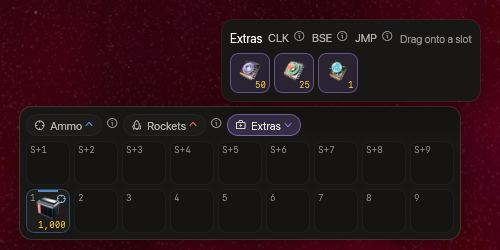
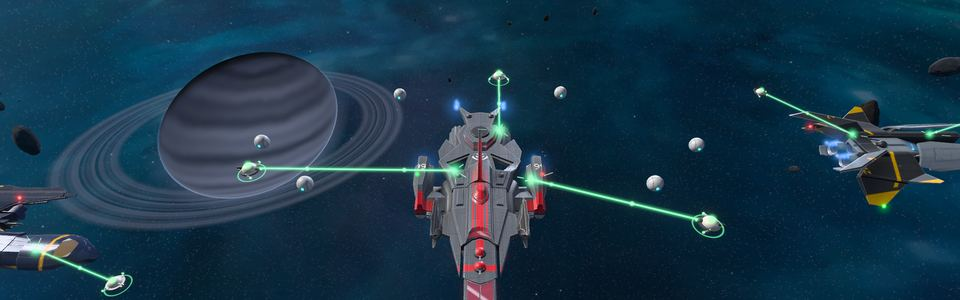

<!-- wiki-i18n source: 93029f432757eb93 -->
<!-- wiki-i18n title: Extras -->
# Extras

Les extras sont les gadgets installés dans les **emplacements extras** d’un vaisseau (deux sur le Protos, le Kitefin, l’Ostirion et le Nomad, les vaisseaux avec lesquels vous commencez ou que vous achetez, et trois sur le Paragon, l’Ironclad, le Wraith et le Storm, les vaisseaux que vous fabriquez, par configuration, et 3, 5 ou 7 de plus avec les Extra Slots CPU). Vous en activez un depuis le sélecteur d’extras de la barre rapide, ou depuis un emplacement de la barre rapide où vous l’avez placé. Ils ne fonctionnent que dans la configuration que vous pilotez : installé dans l’autre configuration, un extra attend que vous changiez de configuration.

| Extra | Effet | Utilisations | Prix |
| :---- | :----------- | :--- | :---- |
| **Repair Drone I à IV** | Répare votre coque de 1,5 %, 2,25 %, 3,5 % et 5 % du maximum par seconde | illimitées | 5 000 / 15 000 / 35 000 crédits, 2 000 Thulium |
| **Cloaking CPU S** | Cache votre vaisseau | 10 | 5 000 Thulium |
| **Cloaking CPU M** | Cache votre vaisseau | 25 | 11 250 Thulium |
| **Cloaking CPU L** | Cache votre vaisseau | 50 | 20 000 Thulium |
| **EMP Charge** | Pendant 3 secondes, personne ne peut vous cibler, tous les verrouillages sur vous se rompent et toutes les occultations proches cessent | 1 | 500 Thulium |

Les Cloaking CPU et l’EMP Charge ne se vendent qu’à la boutique. Ils ne peuvent pas être fusionnés, et aucune récompense ni aucun butin ne les donne.

Le **kit de départ** d’un nouveau pilote installe déjà deux extras dans les deux emplacements extras du Protos : un **Base CPU I** (10 utilisations, une téléportation vers la base de votre corporation) et un **Repair Drone I**. Faites-les glisser depuis le sélecteur d’extras de la barre rapide vers un emplacement pour les utiliser. Seuls les nouveaux pilotes reçoivent le kit : un pilote engagé avant la 0.4.10 ne l’a pas.

Sept autres CPU ne sont pas vendus : l’Assemblage les fabrique une fois que le Centre de recherche du Skylab les a recherchés (voir [Recherche](/wiki/03-Mechanics/Research.md)). Ce sont les Extra Slots CPU I, II et III, le Jump CPU, les Base CPU I et II et l’Auto-Repair CPU, et [la dernière section](#research-cpus) dit ce que fait chacun. Comme le Cloaking CPU, le Jump CPU et les Base CPU sont faits pour un moment calme : aucun des trois ne démarre dans les 10 secondes qui suivent un tir de votre part ou un coup reçu. Les deux CPU warp, le Jump CPU et les Base CPU, sont aussi refusés tant que vous transportez un objet de mission (« Vous ne pouvez pas utiliser de CPU warp en transportant un objet de mission. ») : voir [Objets de mission](/wiki/03-Mechanics/Quests.md#quest-items).

Chaque extra porte une étiquette courte sur son emplacement de la barre rapide : **REP** pour un Repair Drone, **CLK** pour un Cloaking CPU, **EMP** pour l’EMP Charge, et **ARP**, **BSE** et **JMP** pour l’Auto-Repair CPU, les Base CPU et le Jump CPU. Les Extra Slots CPU n’ont pas d’emplacement : ils s’installent dans votre Skylab. Pointez un emplacement pour lire ce que fait un appui en ce moment, ou pourquoi il n’en fait rien.




<!-- item-tree:begin -->
<!-- Generated from server/Data/Seeds/{items,recipes}.json and Resources/Rockets.json by scripts/trees-wiki.sh: don't edit by hand. -->

## Arbre d’objets {#item-tree}

Ce que fabrique l’Assemblage exige d’abord sa technologie ; pointez un objet pour voir combien de temps sa recherche prend. L’arbre des technologies, le carburant et le boost : [Recherche](/wiki/03-Mechanics/Research.md).

```tree
Cloaking CPU S | extra, common | buy 5000 Thulium | /wiki/06-Items/Extras.md#cloaking-cpu
Repair Drone I | extra, common | buy 5000 Credits | /wiki/06-Items/Extras.md#repair-drones
Repair Drone II | extra, common | buy 15000 Credits | /wiki/06-Items/Extras.md#repair-drones
Repair Drone III | extra, common | buy 35000 Credits | /wiki/06-Items/Extras.md#repair-drones
Extra Slots CPU I | extra, uncommon | craft 12000 Thulium, 300 s | research 1800 s, 1800 science | 60 Ship Fragment, 3 Power Core, 6 Velkonite Reinforced Plate | /wiki/06-Items/Extras.md#extra-slots-cpus
Base CPU I | extra, uncommon | craft 8000 Thulium, 300 s | research 10800 s, 10800 science | 40 Ship Fragment, 2 Power Core, 4 Velkonite Reinforced Plate | /wiki/06-Items/Extras.md#base-cpus
EMP Charge | extra, uncommon | buy 500 Thulium | /wiki/06-Items/Extras.md#emp-charge
Cloaking CPU M | extra, uncommon | buy 11250 Thulium | /wiki/06-Items/Extras.md#cloaking-cpu
Extra Slots CPU II | extra, rare | craft 30000 Thulium, 600 s | research 36000 s, 36000 science | 120 Ship Fragment, 10 Reinforced Hull Plate, 6 Power Core, 12 Velkonite Reinforced Plate, 2 Orvium Reinforced Plate | /wiki/06-Items/Extras.md#extra-slots-cpus
Base CPU II | extra, rare | craft 20000 Thulium, 600 s | research 36000 s, 36000 science | 100 Ship Fragment, 5 Power Core, 2 Orvium Reinforced Plate, 3 Dark Matter Plate | /wiki/06-Items/Extras.md#base-cpus
Auto-Repair CPU | extra, rare | craft 15000 Thulium, 600 s | research 21600 s, 21600 science | 80 Ship Fragment, 8 Reinforced Hull Plate, 4 Power Core, 6 Velkonite Reinforced Plate | /wiki/06-Items/Extras.md#auto-repair-cpu
Repair Drone IV | extra, rare | buy 2000 Thulium | /wiki/06-Items/Extras.md#repair-drones
Cloaking CPU L | extra, rare | buy 20000 Thulium | /wiki/06-Items/Extras.md#cloaking-cpu
Extra Slots CPU III | extra, epic | craft 75000 Thulium, 900 s | research 86400 s, 86400 science, 10 Dark Matter | 240 Ship Fragment, 25 Reinforced Hull Plate, 12 Power Core, 2 Ancient Control Unit, 6 Orvium Reinforced Plate, 3 Dark Matter Plate | /wiki/06-Items/Extras.md#extra-slots-cpus
Jump CPU | extra, epic | craft 40000 Thulium, 900 s | research 86400 s, 86400 science, 10 Dark Matter | 200 Ship Fragment, 20 Reinforced Hull Plate, 10 Power Core, 3 Ancient Control Unit, 15 Velkonite Reinforced Plate, 10 Orvium Reinforced Plate | /wiki/06-Items/Extras.md#jump-cpu

Cloaking CPU S -> Cloaking CPU M -> Cloaking CPU L
Repair Drone I -> Repair Drone II -> Repair Drone III -> Repair Drone IV
Extra Slots CPU I -> Extra Slots CPU II -> Extra Slots CPU III
Base CPU I -> Base CPU II
```
<!-- item-tree:end -->

## Repair Drones

Activez un Repair Drone (REP) et il répare la coque jusqu’à ce qu’elle soit pleine. Il ne démarre qu’après 10 secondes sans coup reçu, et chaque coup reçu l’éteint. Si plusieurs sont installés, c’est le meilleur qui travaille. Un [Auto-Repair CPU](#auto-repair-cpu) le réactive à votre place. Les taux figurent dans [Combat](/wiki/03-Mechanics/Combat.md). Pendant qu’il répare, de petits drones de réparation sortent du vaisseau, tournent autour et arrosent la coque de faisceaux, un pour un Repair Drone I, deux pour un II, trois pour un III ou un IV, et les pilotes proches les voient ; ils retournent s’arrimer quand la réparation s’arrête.

## Cloaking CPU

Appuyez sur l’emplacement CLK pour vous occulter. **Un appui consomme une utilisation**, quel que soit le pack, et vous voyez les utilisations restantes sur l’emplacement et dans le hangar. Une occultation **n’a pas de limite de durée** : elle reste active jusqu’à ce que vous la coupiez ou que quelque chose la rompe.

- **Qui ne peut pas vous voir.** Les pilotes des autres corporations et les aliens ne voient pas du tout votre vaisseau : il n’est ni à leur écran ni dans leur liste de cibles, et personne ne peut le verrouiller. Les pilotes de corporation des autres corporations l’ignorent aussi.
- **Le point radar.** Tous les autres pilotes de la carte, à l’exception de votre corporation, voient sur la mini-carte un simple **point rouge** là où vous êtes, et savent ainsi que quelqu’un d’occulté rôde. Le point n’a ni nom, ni vaisseau, ni corporation, ni ID, et on ne peut ni cliquer dessus ni le cibler ; le survol indique seulement « Quelque chose est occulté ici ». Il est rond, à l’intérieur d’un anneau (les vaisseaux sont des carrés sur la mini-carte), et l’anneau respire lentement, ou reste immobile si vous avez activé Réduire les animations. Le serveur le rafraîchit environ deux fois par seconde et votre jeu le déplace en douceur entre-temps. Il indique que quelqu’un est là, et où, mais pas qui : un pilote qui vous a vu vous occulter peut suivre le point, et **l’explosion d’une roquette** visée dessus vous trouve quand même.
- **Qui peut vous voir.** Vous voyez votre propre vaisseau, estompé, avec un contour. Les pilotes de votre corporation vous voient comme un pâle fantôme ; les membres de votre clan issus d’autres corporations, non, car un clan accepte tous ceux qui postulent. Personne ne peut cibler le fantôme, pas même votre corporation.
- **Vous ne pouvez pas vous occulter** dans une zone sûre, pendant que le CPU se recharge, ni dans les **10 secondes** qui suivent un coup reçu ou un tir.
- **Ce qui la rompt.** Appuyer de nouveau sur l’emplacement, votre première salve ou roquette (elle touche, et vous êtes vu), l’entrée dans une zone sûre, le CPU qui quitte la configuration que vous pilotez, une **EMP déclenchée à moins de 1 500 unités** de vous, quel qu’en soit l’auteur (celle de votre propre corporation aussi, mais pas celle d’un membre de votre groupe), et l’explosion de zone d’une roquette qui vous touche. Le temps ne la rompt pas, la récupération d’une cargaison non plus (une caisse que vous prenez disparaît pour tout le monde, qui apprend ainsi que quelque chose se trouvait à portée de cet endroit, sans savoir qui), les compétences non plus, et la radiation du trou noir blesse un vaisseau occulté sans rompre son occultation. Se déconnecter ou mourir la rompt, car un vaisseau que personne ne pilote n’est pas occulté.
- **Recharge.** Quand une occultation prend fin, quelle qu’en soit la cause, le CPU se recharge pendant **60 secondes**. La recharge vous appartient, pas au vaisseau : elle se poursuit si vous sautez par un portail, vous déconnectez ou mourez. Chaque appui consomme toujours une utilisation.
- Les **aliens** qui vous poursuivaient vous perdent. Vos revendications d’éliminations sont levées quand vous vous occultez.
- **Roquettes.** Personne ne peut verrouiller une roquette guidée sur vous, et une roquette droite à cible unique vous traverse. Une **explosion de zone** blesse toujours un vaisseau qu’elle couvre et rompt son occultation, et l’endroit où se trouve le vaisseau est montré aux pilotes qui peuvent le voir avant que le nombre de dégâts n’apparaisse. Lancer une roquette est un tir : cela rompt votre propre occultation comme une salve (le CPU se recharge alors les 60 secondes indiquées plus haut) et, occulté ou non, vous empêche de vous occulter pendant les 10 secondes qui suivent.
- Le **trou noir** engloutit un vaisseau occulté comme n’importe quel autre, et toute la carte en est informée.
- **Ce que vous voyez.** Votre vaisseau devient translucide, avec un contour violet en pointillés, ses drones s’estompant avec lui, et une pastille en haut de l’écran indique « Occulté » avec les utilisations restantes (pas de secondes : il n’y a pas de minuterie). L’emplacement CLK affiche les utilisations restantes ; pendant que vous êtes occulté, il brille en violet et indique ON, et quand l’occultation prend fin, quelle qu’en soit la cause, il s’assombrit et décompte les 60 secondes de recharge. Un appui que le serveur refuse (recharge, zone sûre, coup reçu ou tir dans les 10 dernières secondes) fait clignoter l’emplacement en rouge, et un message vous en donne la raison. Un allié apparaît comme un pâle fantôme, avec une marque de fantôme devant son nom, et un pilote qui s’occulte près de vous disparaît dans une ondulation. Faites glisser CLK depuis les Extras de la barre rapide sur un emplacement pour l’utiliser, comme REP.
- Les **utilisations** sont enregistrées avec le CPU. Se déconnecter, mourir ou relancer le jeu n’en rend aucune, et une activation que vous annulez est tout de même dépensée. Quand la dernière utilisation d’un pack disparaît, il est épuisé et son emplacement est réapprovisionné à partir d’un exemplaire de rechange du même CPU de votre inventaire, si vous en possédez un.
- **Plusieurs CPU** dans une même configuration ne s’additionnent pas. Celui qui a le moins d’utilisations restantes est utilisé en premier.

Les S, M et L fonctionnent de la même façon : les packs plus gros ne sont que moins chers par utilisation (500, 450 et 400 Thulium).

## EMP Charge

Appuyez sur l’emplacement EMP en plein combat. Pendant **3 secondes**, personne ne peut vous verrouiller, et **tous ceux qui vous avaient verrouillé perdent leur verrouillage** aussitôt, où qu’ils soient : pilotes, aliens et pilotes de corporation. Un pilote dont le verrouillage se rompt reçoit le message « Verrouillage perdu : la cible a utilisé une EMP ». Quiconque tente de verrouiller pendant ces 3 secondes est refusé.

- **Ce n’est pas de l’invulnérabilité.** Elle arrête ce qui demande un verrouillage : les lasers, les roquettes guidées et le contact d’une roquette droite à cible unique, qui vous traverse. Une **explosion de zone** n’a besoin d’aucun verrouillage, elle vous blesse donc toujours si vous êtes dedans, et le trou noir n’est pas un tir du tout.
- **Vous pouvez toujours agir.** Tirer ne l’interrompt pas. Vous pouvez vous occulter (si les règles propres à l’occultation le permettent) et utiliser d’autres extras.
- **Elle rompt les occultations proches.** Tout vaisseau occulté à moins de **1 500 unités** de vous quand l’impulsion se déclenche est révélé aussitôt et son CPU commence ses 60 secondes de recharge, quelle que soit sa corporation, la vôtre comprise ; les vaisseaux de votre propre [groupe](/wiki/03-Mechanics/Groups.md) font exception : ils gardent leur occultation. Le pilote reçoit le message « Occultation rompue : une EMP a été déclenchée à proximité. », voit le vaisseau réapparaître avec la même ondulation que pour toute fin d’occultation, et l’emplacement commence sa recharge. Vous ne pouvez pas utiliser d’EMP tant que vous êtes vous-même occulté.
- **Elle ne cache rien.** Tout le monde vous voit toujours, entouré pendant les 3 secondes d’une coque électrique crépitante.
- **Vous ne pouvez pas l’utiliser** tant qu’une zone sûre vous protège, en étant occulté, ni dans les **30 secondes** qui suivent la dernière. Elle fonctionne partout ailleurs, y compris pendant les premiers jours d’une saison (le Protocole de paix) : les aliens chassent encore à ce moment-là.
- Un alien que vous touchez pendant les 3 secondes ne se retourne contre vous qu’une fois celles-ci écoulées. Vos revendications d’éliminations et les règles du premier tir ne changent pas.
- **Ce que vous voyez.** Une impulsion d’espace déformé jaillit du pilote jusqu’à la distance où elle rompt les occultations (1 500 unités), tous ceux à portée la voient, et une coque électrique crépitante entoure le vaisseau pendant les 3 secondes, avec un anneau autour de votre propre vaisseau et une pastille en haut de l’écran qui comptent le temps. L’anneau de cible de tous ceux qui vous avaient sélectionné se brise, avec une brève décharge. L’emplacement EMP indique les charges que vous possédez, s’illumine en bleu tant que la coque est active et s’assombrit pendant la recharge.
- **Une charge, une utilisation.** L’emplacement est réapprovisionné depuis votre inventaire quand vous en possédez davantage. Les **30 secondes** de recharge ne sont pas conservées : se déconnecter ou sauter par un portail les efface, et l’impulsion suivante coûte une charge.

## CPU du Centre de recherche {#research-cpus}

Deux des CPU demandent des Dark Matter Plates, comme le dernier palier de chaque chaîne d’amélioration : l’**Extra Slots CPU III** en demande 3 (et 6 Orvium Reinforced Plates) et le **Base CPU II** 3 (et 2 Orvium Reinforced Plates) ; recherchez donc d’abord la Dark Matter Plate ([Dark Matter et Dark Matter Plates](/wiki/03-Mechanics/Dark-Matter.md)).

<!-- research-cpus:begin -->
<!-- Generated from server/Resources/{Research,CpuConfig,SkylabConfig}.json and Data/Seeds/{items,recipes}.json by scripts/research-wiki.sh: don't edit by hand. -->

| CPU | Durée de recherche | Exige d’abord | Thulium pour fabriquer | Durée de fabrication |
| :--- | :--- | :--- | ---: | ---: |
| [Extra Slots CPU I](/wiki/06-Items/Extras.md#extra-slots-cpus) | 30 min | – | 12 000 | 5 min |
| [Extra Slots CPU II](/wiki/06-Items/Extras.md#extra-slots-cpus) | 10 h | [Extra Slots CPU I](/wiki/06-Items/Extras.md#extra-slots-cpus) | 30 000 | 10 min |
| [Extra Slots CPU III](/wiki/06-Items/Extras.md#extra-slots-cpus) | 1 j | [Dark Matter Plate](/wiki/06-Items/Resources.md#dark-matter-plate), [Extra Slots CPU II](/wiki/06-Items/Extras.md#extra-slots-cpus) | 75 000 | 15 min |
| [Base CPU I](/wiki/06-Items/Extras.md#base-cpus) | 3 h | – | 8 000 | 5 min |
| [Base CPU II](/wiki/06-Items/Extras.md#base-cpus) | 10 h | [Base CPU I](/wiki/06-Items/Extras.md#base-cpus), [Dark Matter Plate](/wiki/06-Items/Resources.md#dark-matter-plate) | 20 000 | 10 min |
| [Jump CPU](/wiki/06-Items/Extras.md#jump-cpu) | 1 j | [Base CPU II](/wiki/06-Items/Extras.md#base-cpus) | 40 000 | 15 min |
| [Auto-Repair CPU](/wiki/06-Items/Extras.md#auto-repair-cpu) | 6 h | – | 15 000 | 10 min |

Aucun n’est vendu à la boutique : recherchez la technologie, puis fabriquez le CPU à l’Assemblage. Pointez un CPU dans son arbre pour voir ce que l’Assemblage demande pour le fabriquer.

### Extra Slots CPUs

- **Ce qu’ils font.** Les Extra Slots CPU I, II et III donnent à chaque vaisseau 3, 5 et 7 emplacements extras de plus, soit 6, 8 et 10 au total sur un vaisseau qui en possède 3 en propre, et 5, 7 et 9 sur un vaisseau qui en possède 2. Un CPU supérieur remplace le précédent : le II ne s’ajoute pas au I.
- **Installé, pas transporté.** Un Extra Slots CPU n’est pas un objet : quand vous le récupérez à l’Assemblage, il s’installe dans votre Skylab, pour chaque vaisseau dans les deux configurations, et ne prend aucun emplacement. Il reste après la réinitialisation.
- **Dans l’ordre.** Fabriquez-les l’un après l’autre : le II seulement quand le I est installé, le III seulement quand le II est installé ; d’ici là, l’Assemblage vous dit lequel installer d’abord. Les trois coûtent 117 000 Thulium en tout : 12 000, 30 000 et 75 000.

### Jump CPU

- **Ce qu’il fait.** Il fait sauter votre vaisseau vers n’importe quel secteur de corporation de votre monde, celui de votre propre corporation comme ceux des autres, secteurs d’origine compris (`M`, `T` et `G`, secteurs 1 à 4), pour **500 Thulium** le saut. Il n’a pas de limite d’utilisations : vous ne payez que le Thulium. Il ne mène jamais à un secteur dangereux (`DS`) ni à un secteur neutre (`N`).
- **Le saut.** Appuyez sur l’emplacement JMP, choisissez le secteur sur la carte du Système stellaire et confirmez : le vaisseau se charge pendant 5 secondes, puis arrive à une porte de ce secteur, protégé comme après n’importe quel saut de porte. Le CPU refroidit pendant 30 secondes après votre arrivée.
- **Pas en combat.** Il ne peut pas démarrer dans les 10 secondes qui suivent un tir ou un coup reçu, et un tir ou un coup pendant la charge annule le saut ; rien n’est alors payé. Vous ne pouvez pas sauter occulté.
- **Pas depuis un secteur neutre :** un pilote dans un secteur neutre, ou sans corporation, ne peut pas l’utiliser.
- Il peut quitter un secteur dangereux quand vous n’êtes pas en combat.

### Base CPUs

- **Ce qu’ils font.** Ils téléportent votre vaisseau à la base de votre corporation, dans la zone sûre autour de sa station (`M-1`, `T-1` ou `G-1`, le secteur de Mission Control), sans coût en Thulium. Vous les lancez depuis l’emplacement BSE de la barre rapide.
- **Pas en combat.** Une charge de 10 secondes, la même pour les deux. Elle ne peut pas démarrer dans les 10 secondes qui suivent un tir ou un coup reçu, ni occulté, ni quand vous êtes déjà dans la zone sûre de votre base, et un tir ou un coup pendant la charge l’annule.

| CPU | Utilisations | Recharge |
| :--- | ---: | ---: |
| [Base CPU I](/wiki/06-Items/Extras.md#base-cpus) | 10 | 10 min |
| [Base CPU II](/wiki/06-Items/Extras.md#base-cpus) | 25 | 5 min |

- **Épuisé, pas rechargé.** Chaque utilisation consomme l’une des utilisations du CPU, et un CPU qui n’en a plus disparaît : fabriquez-en un nouveau. Si les deux sont installés, le meilleur (II) est utilisé en premier.

### Auto-Repair CPU

- **Ce qu’il fait.** Il envoie tout seul le Repair Drone installé dans vos emplacements extras, chaque fois que vous auriez pu l’envoyer à la main : votre coque n’est pas pleine, le drone n’est pas déjà sorti et 10 secondes se sont écoulées depuis le dernier coup reçu. Il n’y a aucun seuil de coque à régler.
- Il occupe un emplacement extra à lui et ne fait rien sans un Repair Drone dans un emplacement extra de la même configuration. Il n’envoie jamais un Repair Drone placé dans un emplacement de compétence (c’est le bouton Emergency Repair).
- **Si vous arrêtez le drone à la main,** le CPU le laisse tranquille jusqu’à ce que votre coque soit de nouveau pleine, ou jusqu’à ce que vous l’envoyiez vous-même.


<!-- research-cpus:end -->
