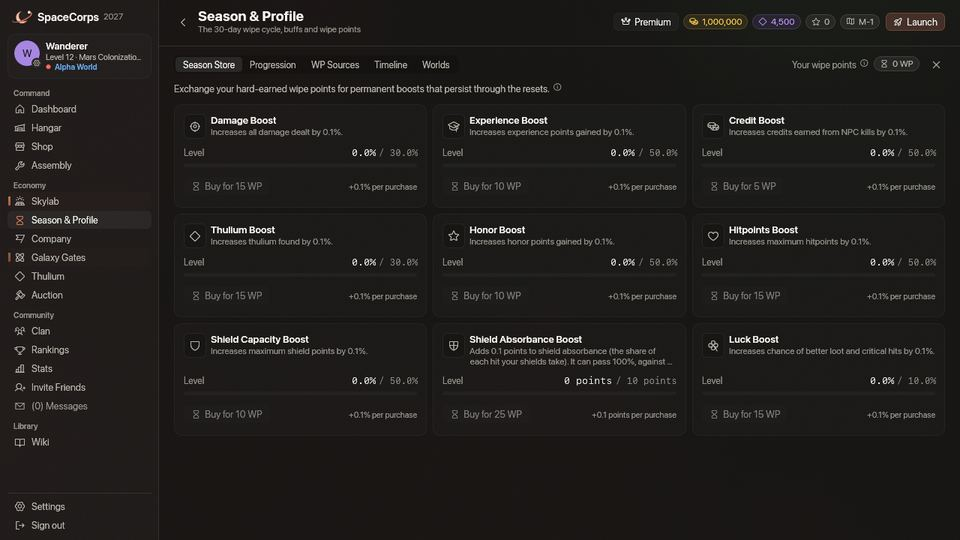

<!-- wiki-i18n source: b3c1a5c5512f39cd -->
<!-- wiki-i18n title: Wipe-idővonal -->
# Wipe-idővonal és szezonok {#wipe-timeline-seasons}

A SpaceCorps univerzumát egy ismétlődő szezonális ciklus irányítja. 30 naponta a galaxis egy kozmikus resetet él át, amelyet **wipe**-nak hívnak. Bár a reset ijesztően hangozhat, valójában a felkészülés és a tervezés végső próbája: átviheted a legjobb felszerelésedet, kiválaszthatod a következő világodat, és állandó, szezonokon átívelő bónuszokat építhetsz.

---

## A 30 napos szezon menetrendje {#30-day-season-schedule}

Minden szezon az 1. naptól a 30. napig tart (a wipe a 30. nap kezdetekor induló 5 perces visszaszámlálással kezdődik), és több különálló szakaszon halad át. A szezon aktuális napját és az aktív szakaszt közvetlenül a játékbeli HUD-on követheted.

| Szakasz | Napok | Protokoll / esemény | Leírás |
| :--- | :--- | :--- | :--- |
| **Békeprotokoll** | 1–3. nap | PvP nélküli szakasz | Új kezdet, amely teljes egészében a PvE-fejlődésre, a nyersanyag-farmolásra és a hajóépítésre összpontosít, a játékosok közti konfliktus fenyegetése nélkül. |
| **Első kapcsolat** | 4–10. nap | 1. esemény | A PvP megnyílik (a világod szabálya szerint, lásd lent: Világok), és a három [raj](/wiki/05-Swarms/Swarms.md) megjelenni kezd: a wipe-ig maradnak, az ezt követő szakaszokon át. A szakasz maga egyelőre nem ad különleges jutalmat. |
| **Techroham** | 11–18. nap | 2. esemény | A [veszélyes szektorok](/wiki/01-General/Danger-Sectors.md) megváltoznak: egy pulzár egy [óriás kotrógéppel](/wiki/03-Mechanics/Giant-Excavator.md) a `DS-1`-től a `DS-3`-ig, a [Dormant Swamp](/wiki/03-Mechanics/Dormant-Swamp.md) a `DS-4`-en, Slumbering Voidok, és egy Dormant-raj, amely hamarabb tér vissza, és kétszer annyit fizet. Mindez a wipe-ig marad. A szakasz nem ad saját jutalmat. |
| **Hadijátékok** | 19–25. nap | 3. esemény | Különleges hatások egyelőre nincsenek: a PvP úgy működik, mint a Békeprotokoll utáni minden szakaszban. |
| **Visszaszámlálás** | 26–30. nap | 4. esemény | A záró visszaszámlálás szakasza. Minden pilóta versenyt fut az idővel, hogy a kitörés előtt összeállítsa és lezárja a magával vitt rakományát. |
| **A reset** | 30. nap | Feketelyuk-kitörés | Az univerzum elpusztul, és újjászületik, és minden [klán](/wiki/03-Mechanics/Clans.md#the-wipe-disbands-every-clan) feloszlik. A pilóták átköltöznek abba a világba, amelyet a következő szezon úti céljául választottak. |

A wipe-on kívül csak négy dolog követi a naptárat: a Békeprotokoll (1–3. nap) egy szabályt változtat, a 4. naptól megjelennek a [rajok](/wiki/05-Swarms/Swarms.md), és a wipe-ig maradnak, a 11. naptól a [veszélyes szektorok](/wiki/01-General/Danger-Sectors.md) megkapják a pulzárjaikat, az óriás kotrógépeiket és a Dormant Swamp-ot, amelyek a wipe-ig maradnak, az [Aukció](/wiki/03-Mechanics/Auction.md#the-season-and-the-wipe) pedig a 28. naptól nem szed díjat, a 30. naptól pedig zárva van. A négy esemény a szezon elnevezett szakasza: megjelennek a játék Szezon és profil oldalán és az Irányítópulton. A 2. esemény a fent leírt módon megváltoztatja a veszélyes szektorokat; a többi egyike sem ad egyelőre saját különleges jutalmat, megjelenő idegeneket vagy bónuszt.

---

## Chrono-Gate és Energiamaterializáló {#chrono-gate-energy-materializer}

A **Chrono-Gate** (Galaxiskapunak is hívják) egy hatalmas szezonális építmény, amely hidat képez a szezonok között. A kapu megépítése és stabilizálása elengedhetetlen ahhoz, hogy megkapd a szezonok közötti átvitel szállítási jogosultságait.

### A kapu összeállítása {#gate-assembly}
A Chrono-Gate teljes stabilizálásához pontosan **100 Chrono-Gate-alkatrészt** kell összegyűjtened.

### Az Energiamaterializáló {#the-energy-materializer}
Az alkatrészeket az Energiamaterializáló felületén szerzed, amely a helyi energiaszektorokat pörgeti, hogy megtalálja a kapu alkatrészeit:
* **Kredites pörgetés** (5 000 kredit): **5% eséllyel** ad egy kapualkatrészt.
* **Thuliumos pörgetés** (5 Thulium): **10% eséllyel** ad egy kapualkatrészt.

*Profi tipp: szorzókkal (1×, 5×, 10×, 100×) tömeges pörgetést végezhetsz, és felgyorsíthatod a kapu építését.*

---

## Tranzittároló (utazókapszula) {#transport-cache-travel-capsule-}

Amint mind a 100 alkatrész megvan, és a Chrono-Gate teljesen stabilizálva van, a portál megnyitja a hozzáférést a személyes **tranzittárolódhoz** (átviteli kocsi vagy utazókapszula néven is ismert). Ez a zsebdimenzió megvédi a holmidat attól, hogy törlődjön a wipe alatt. Az [Aukción](/wiki/03-Mechanics/Auction.md#the-season-and-the-wipe) meghirdetett tárgyaid a wipe-kor laza tárgyként visszajönnek hozzád, amelyeket a wipe a többihez hasonlóan töröl, ha nem teszed őket a Tranzittárolóba; a tételekben tartott licitjeidet visszatérítik.

### Automatikus átvitel (ingyenes) {#automatic-carry-over-free-}
A következő tárgyak mindig védettek, és automatikusan átkerülnek a következő szezonba, miközben **nulla** kapacitást foglalnak a tranzittárolódban:
1. Az éppen aktív hajód.
2. Minden tárgy, amely jelenleg fel van szerelve arra az aktív hajóra, mind a **Konfig 1**, mind a **Konfig 2** konfigurációban (a lézereket, pajzsokat, hajtóműveket és generátorokat is beleértve).
3. Minden drónod, a szintjével és a tapasztalatával együtt: a [Slave Drone-jaid](/wiki/03-Mechanics/Drones.md) megmaradnak, így a drónfoglalataid nyitva maradnak, és a következő drónod ára a birtokolt darabszámtól folytatódik. A drónfoglalatba szerelt lézerek és pajzsok a fenti szabályt követik: akkor maradnak meg, ha az aktív hajón vannak.
4. Minden drónformáció, amelyet birtokolsz ([Drónformációk](/wiki/03-Mechanics/Formations.md)), bárhol is van: a leltáradban, a gyorssávodon vagy egy hajón. A drónjaidhoz hasonlóan ezek is megmaradnak, anélkül, hogy a tranzittároló kapacitásából foglalnának.

### Kézi átvitel (tranzittároló) {#manual-carry-over-transport-cache-}
A leltáradban lévő további tárgyakhoz, amelyeket meg szeretnél menteni (pl. tartalék fegyverzet, gyártási nyersanyagok vagy extra pajzsgenerátorok):
* **Súlykorlát**: a tranzittárolónak szigorú kapacitáskorlátja van: **50 tonna (50 000 kg)**.
* **Tárgyak betöltése**: a leltáradból kézzel húzhatsz tárgyakat a tranzittároló helyeire.
* **Tárgyak súlya**: a különböző tárgyosztályok súlya eltérő:
  * *Lézerek / fegyverzet*: 10 kg
  * *Pajzsgenerátorok*: 20 kg
  * *Hajtóművek / meghajtás*: 30 kg
  * *Generátorok*: 30 kg
  * *Nyersanyagok / ásványok*: ritkaságtól függően változó súly (a Skylab Kovácsműhelyében készült Reinforced Plate 5 kg-ot nyom)
  * *Rakéták*: egyáltalán nincs súlyuk: nem foglalnak helyet a tárolóban, így egész készletek is beférnek (lásd: [Rakéták](/wiki/06-Items/Rockets.md))

A [Skylabod](/wiki/03-Mechanics/Skylab.md) soha nem nullázódik: a moduljai megtartják a szintjüket, az Erőforrás-raktár pedig a benne tárolt ércet. A Kutatóközpont mindent megtart, amit a [Kutatás](/wiki/03-Mechanics/Research.md) tartalmaz: a technológiáidat, a tartályában lévő tudományt, a belehelyezett Dark Mattert, a folyamatban lévő kutatást és a boostot. Ugyanígy az általad telepített Extra Slots CPU-k is megmaradnak, mert nem tárgyak. Amit viszont már begyűjtöttél, az nem marad meg: a leltáradban lévő lemezek ugyanolyan tárgyak, mint bármelyik másik, ezért a lemeznek, amelyet meg akarsz tartani, a tranzittárolóban kell lennie.

### Megerősítés és zárolás {#confirm-lock}
A szezon vége előtt rá kell kattintanod a **Zárolás** gombra a Materializáló felületén.
* A tároló zárolása egy biztonsági protokoll, amely előkészíti az ugrótükört.
* **FIGYELMEZTETÉS**: minden tárgy, amely nincs felszerelve az aktív hajódra, nem drón, és nincs egy zárolt tranzittárolóban sem, **véglegesen megsemmisül** a feketelyuk-kitörés során.

---

## Világok: Alpha, Beta és Gamma {#worlds-alpha-beta-and-gamma}

A SpaceCorpsban három **világ** működik. Mindegyik az egész galaxis külön másolata: minden szektor a saját idegeneivel, [vállalati pilótáival](/wiki/03-Mechanics/Company-Pilots.md), rakományával, chatjével és pilótáival. Csak a saját világodban repülsz, és csak az ottani pilótákkal találkozol; a fiókod, a tárgyaid és a pilóták ranglistái mindhárom világban közösek. A klán egy világhoz tartozik, csak annak pilótáit veszi fel, és a wipe-nál feloszlik ([Klánok és világok](/wiki/03-Mechanics/Clans.md#clans-and-worlds)).

| Világ | Kockázat | Idegenek ereje | Jutalomszorzó | PvP |
| :--- | :--- | :--- | :--- | :--- |
| **Alpha** | Laza / kezdő | 1,0× | 1,0× kredit, Thulium, XP, becsület | **Magas biztonság**: csak a határtérképeken (`x-4`) és a központi PvP-zónában (`DS-x`). A vállalati szektorokban (`x-1`–`x-3`) nincs PvP. |
| **Beta** | Normál / középhaladó | 1,5× | 2,0× kredit, Thulium, XP, becsület | **Közepes biztonság**: mindenhol, kivéve a bázisszektorokat (`x-1`). |
| **Gamma** | Hardcore / elit | 2,0× | 3,0× kredit, Thulium, XP, becsület | **Alacsony biztonság**: mindenhol. Maximális kockázat, maximális jutalom. |

Hogyan működnek a világok:

* **Idegenek**: egy világ idegenerőssége megszorozza az idegenek életerejét, pajzsát, pajzstöltődését és sebzését. A sebességük és a hatótávjuk mindenhol ugyanaz.
* **Jutalom**: egy kilövés annak a világnak megfelelően fizet, amelyben történik. Egy küldetés annak a világnak megfelelően fizet, amelyben teljesítetted (a legalacsonyabbnak megfelelően, ha kettőt is érint), akármelyik világban veszed is át (az állomásküldetésnek nincs saját világa, és annak a világnak megfelelően fizet, amelyben repülsz, amikor átveszed), és az időkorlátos küldetések időkorlátja a Betában 1,5-szer, a Gammában kétszer olyan hosszú ([Küldetések](/wiki/03-Mechanics/Quests.md)). A zsákmány és a vállalati pilóták minden világban ugyanazok, így egy magasabb világ óránként többet hoz, de a harcai több javításba kerülnek.
* **PvP**: a térképen mindenki annak a világnak a tagja, így egyetlen szabály érvényes az egész térképre, a vállalati pilótákat is beleértve. A biztonságos zónák és a Békeprotokoll (1–3. nap) minden világot védenek.
* **Repülés közben**: a világ neve a szektor azonosítója előtt áll a jobb felső sarokban („Beta · M-2”). A Hajó ablak címsorában lévő jelvény megmondja, hol állsz: **Védett** egy biztonságos zónában, **Nincs PvP** a Békeprotokoll alatt vagy ott, ahol a világod tiltja a PvP-t, **PvP** ott, ahol más pilóták megtámadhatnak. Ha fölé viszed az egeret, megmutatja a szabályt. A [galaxistérkép](/wiki/01-General/Spacemap%20Travel.md) a világod szabálya szerint színezi a szektorokat.

### Csatlakozás és költözés {#joining-and-moving}

* **Csatlakozás**: az új pilóta a világválasztásnál csatlakozik egy világhoz, szezononként egyszer. Egy világ szezononként legfeljebb 1 000 pilótát fogad; egy megtelt világhoz nem lehet csatlakozni.
* **Költözés**: csak a feketelyuk-kitörés idején (30. nap), a Galaxiskapuk **Úti cél** lapján kiválasztott világba. Minden világváltás a vállalatod otthoni szektorába (`M-1`, `T-1` vagy `G-1`) tesz. Ha nincs úti cél kiválasztva, a világválasztásnál újra világot választasz. Az úti célok beleszámítanak a következő szezon férőhelyeibe: az a világ, amely felé már annyi pilóta tart, amennyi belefér, nem választható.
* **Nincs szezon közbeni átköltözés**: a **Travel Token**, amelyet minden pilóta a wipe-kor kap, egyelőre semmire sem használható.

---

## Szezonokon átívelő fejlődés (állandó buffok) {#cross-season-progression-permanent-buffs-}

A wipe elveszi a hajóidat és a tárgyaidat (kivéve az aktív hajódat a rajta lévő mindennel, a tranzittárolódat és a drónjaidat), és visszahelyez a vállalatod otthoni szektorába; a szinted, a krediteid, a Thuliumod és a rangpontjaid nem nullázódnak. Ezen felül az általános pilóta-teljesítményed állandó erőt ad. Az idegenek kilövéséért és a küldetések teljesítéséért **wipe-pontok (WP)** járnak. Maguk a [küldetéseid](/wiki/03-Mechanics/Quests.md), a teljesítettek és a folyamatban lévők is, átvihetők: mindegyik pilótánként csak egyszer teljesíthető, soha többé, kivéve azokat a szintküldetéseket, amelyeket a 0.4.10-es frissítés átdolgozott: közülük 64-et még egyszer felkínálnak ([Küldetések](/wiki/03-Mechanics/Quests.md#reworked-missions)).

**Klánok és rangok.** A wipe minden klánt feloszlat, a Flottakincstárával, a bejegyzéseivel, a naplójával, a szerződéseivel, a pontjaival és a bónuszszintjeivel együtt, így minden szezon új verseny egy klán alapításáért és a bónuszai megtöltéséért; a kreditek, amelyeket a klán már kifizetett neked, megmaradnak, és az adományi keretedet sem nullázza ([Klánok](/wiki/03-Mechanics/Clans.md#the-wipe-disbands-every-clan)). Vezérek és Alvezérek: a visszaszámlálás vége előtt fizessétek ki a Flottakincstárat. A PvE-rangpontjaid is maradnak, így a wipe nem mozdít el a vállalatod ranglistáján: a rangod az ottani helyezésedet követi, nem a szezont ([Rangok](/wiki/03-Mechanics/Ranks.md#ranks-and-the-wipe)).

### Az állandó buffok boltja {#the-permanent-buff-store}
Az összegyűjtött WP-det állandó buffokra költheted, amelyek örökre átívelnek az összes szezonon. Ezek a buffok halmozódnak, és jelentős passzív bónuszokat adnak:

* **Damage Boost**: +0,1% okozott sebzés szintenként (max. 30% / 300 szint) - *Ár: 15 WP*
* **Experience Boost**: +0,1% szerzett XP szintenként (max. 50% / 500 szint) - *Ár: 10 WP*
* **Credit Boost**: +0,1% szerzett kredit szintenként (max. 50% / 500 szint) - *Ár: 5 WP*
* **Thulium Boost**: +0,1% talált Thulium szintenként (max. 30% / 300 szint) - *Ár: 15 WP*
* **Honor Boost**: +0,1% szerzett becsület szintenként (max. 50% / 500 szint) - *Ár: 10 WP*
* **Hitpoints Boost**: +0,1% maximális életerő (HP) szintenként (max. 50% / 500 szint) - *Ár: 15 WP*
* **Shield Capacity Boost**: +0,1% maximális pajzs (a pajzs **kapacitása**) szintenként (max. 50% / 500 szint) - *Ár: 10 WP*
* **Shield Absorbance Boost**: szintenként +0,1 pont a pajzsod **elnyeléséhez** (max. +10 pont / 100 szint) - *Ár: 25 WP*. Az elnyelés az a rész, amelyet a pajzsaid minden találatból felfognak (lásd [Pajzsmechanika](/wiki/03-Mechanics/Shields.md#2-shield-absorbance-damage-split-)); a buff fix pontokat ad hozzá: 100 wipe-pont 4 szintet vesz (+0,4 pont), 300 12-t (+1,2), 500 20-at (+2,0), a mai források által fizetett mind a 855 wipe-pont (a felső határukat elérve, a wipe-okon át megőrizve) pedig 34-et (+3,4 pont). A maximumon (100 szint, 2 500 WP: több wipe-ra szóló cél, és további wipe-pont-források vannak tervben) a 80% (az alapból elérhető legjobb) 90%-ra, egy Light Shield Core 45%-a pedig 55%-ra nőne. Az érték nincs 100%-ra korlátozva: abból levonják a támadó *pajzsáthatolását*, így ami 100% fölé jut, az tartalék. Ha a mai wipe-pontok mindegyikét ebbe a buffba teszed, és egy teljesen kovácsolt, Örök ritkaságú pajzs- és cellaszettel játszol, egy hajó nagyjából 93–95%-ot ér el. (A 0.4.5-ös verzióig ez a buff magának az elnyelésnek egy hányadát adta hozzá, szintenként 0,1%-át, ugyanazon az áron; a pontok minden elnyelésnél ugyanannyit vagy többet érnek, így a már megvásárolt szintek nem veszítettek semmit; a 0.4.2-es verzióig ez a buff a pajzs *töltődési* sebességét növelte; ma már egyetlen állandó buff sem növeli a töltődést.)
* **Luck Boost**: +0,1% kritikus és zsákmányszerencse szintenként (max. 10% / 100 szint) - *Ár: 15 WP*

### Wipe-pontok szerzése {#earning-wipe-points}

A wipe-pontok mérföldkövekből jönnek, amelyeket magad veszel át, a játékban a **Szezon és profil › WP-források** alatt. Egy átvétel minden olyan mérföldkövet felvesz, amelyet elértél, de még nem vettél át.

**Idegenek kilövése.** Az öt idegen mindegyike fix számú wipe-pontot fizet a kilövései minden blokkjáért, vagyis mérföldkövéért, idegenenként legfeljebb 50 mérföldkőig. Az 50. mérföldkövön túli kilövések már nem fizetnek többet:

| Idegen | Kilövés mérföldkövenként | WP mérföldkövenként | Legfeljebb ennyit kereshetsz vele |
| :--- | :--- | :--- | :--- |
| [Seeker](/wiki/04-Aliens/Seeker.md) | 100 | 1 | 50 WP, 5 000 kilövésnél |
| [Phantasm](/wiki/04-Aliens/Phantasm.md) | 100 | 2 | 100 WP, 5 000 kilövésnél |
| [Bulwark](/wiki/04-Aliens/Bulwark.md) | 100 | 3 | 150 WP, 5 000 kilövésnél |
| [Goombah](/wiki/04-Aliens/Goombah.md) | 50 | 4 | 200 WP, 2 500 kilövésnél |
| [Crystalys](/wiki/04-Aliens/Crystalys.md) | 50 | 5 | 250 WP, 2 500 kilövésnél |

Csak azok a kilövések számítanak, amelyekért jutalmat kapsz (lásd [Harc](/wiki/03-Mechanics/Combat.md)). Egy mérföldkő akkor fizet, ha teljes: 99 Seeker nem fizet semmit, a 100. 1 WP-t fizet, a rá következő kilövések pedig a 200. felé számítanak.

**Küldetések.** Az első teljesített küldetésed 5 WP-t fizet, aztán minden 5. (az 5., 10., 15. és így tovább, a 85.-ig) további 5 WP-t fizet, összesen 90 WP-t. Csak a szintküldetések számítanak (összesen 88; az állomásküldetések és a Kihívások sora nem, lásd a [Küldetések](/wiki/03-Mechanics/Quests.md) oldalt), és az újra elvégzett, átdolgozott szintküldetés nem számít másodszor.
