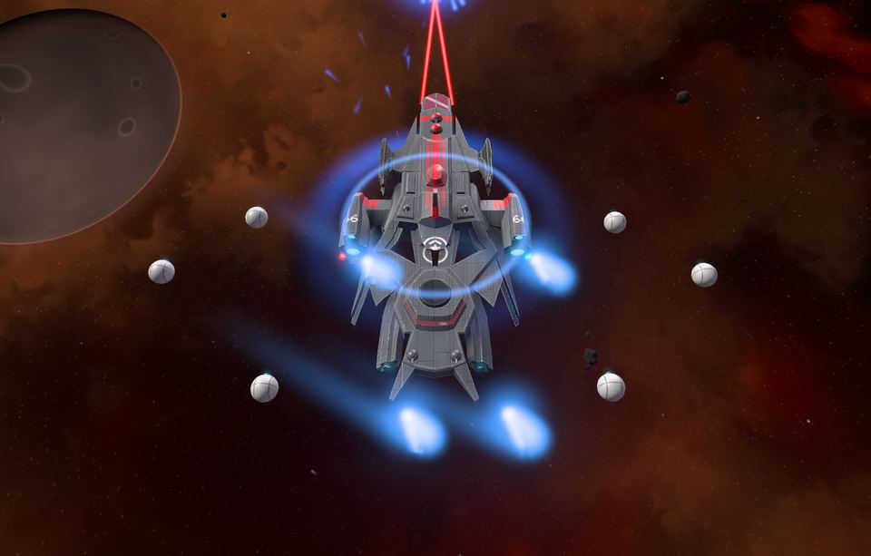
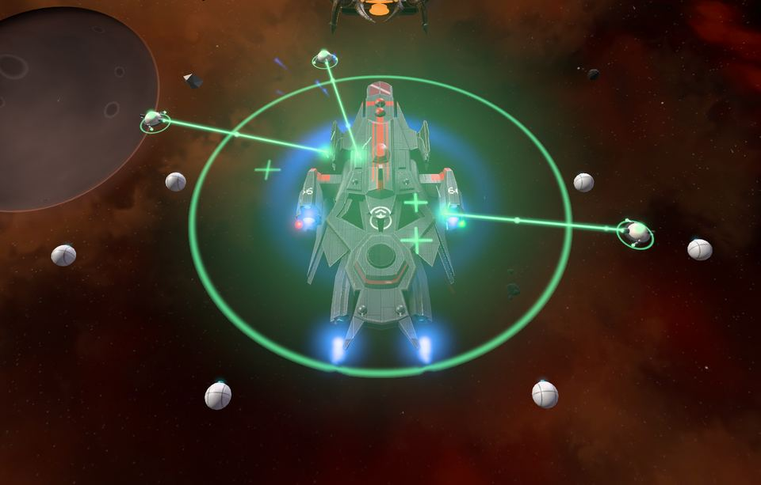
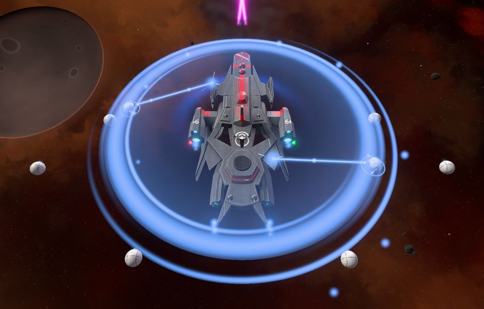

<!-- wiki-i18n source: 1f9dad98b1e0c6d8 -->
<!-- wiki-i18n title: アビリティ -->
# 艦のアクティブアビリティ {#active-ship-abilities}

アビリティは、戦闘のさなかに押すボタンです。シールドの回復、射程から抜け出すための急加速、船体が残りわずかになったときの修理などがあります。艦の**アビリティスロット**に装備した**シールド、エンジン、Repair Drone** から生まれ、そのアイテムが優れているほど、アビリティも強力になります。必要な瞬間のために用意されたもので、クールダウンが明けるたびに押すためのものではありません。それぞれ約10秒間作動したあと、1分30秒から2分間休みます。

新しいパイロットは、最初から1つ持っています。スターターキットの **Repair Drone I** が Protos のアビリティスロットにあらかじめ装備されているため、Emergency Repair のボタン（`E`）は最初から使えます。キットの2つ目の Repair Drone I はエクストラスロットに入っています。こちらは自動で少しずつ船体を修復するもので、アビリティではありません（[エクストラ](/wiki/06-Items/Extras.md#repair-drones)を参照）。

## アビリティスロット {#ability-slots}

どの艦にも、ハンガーに決まった数のアビリティスロットがあります。

- **Protos**（初期艦）：1スロット
- **Kitefin**：1スロット
- **Ostirion**：2スロット
- **Nomad**：2スロット
- **Paragon**：3スロット
- **Storm**：3スロット
- **Ironclad**：3スロット
- **Wraith**：3スロット

アビリティスロットには、**シールドコア**、**エンジン**、**Repair Drone** のいずれかを入れられ、それぞれ固有のアビリティを発生させます。アイテムをスロットにドラッグしてください。構成 1 と構成 2 には、それぞれ専用のスロットがあります。

- **シールドセルとスラスターは、アビリティスロットには入りません。**これらは、シールド、エンジン、アダプティブコアに装着するモジュールです。
- **アビリティスロットのアイテムは、ほかには何も与えません。**シールド容量、リチャージ、吸収率、速度は加わらず、シールドによる減速もありません。同じ Heavy Shield Core でも、ジェネレータースロットに入れれば常にそのシールドとして働き、アビリティスロットに入れれば Surge のために働きます。どちらにするかは、あなた次第です。
- セルやスラスターを装着したシールドやエンジンをアビリティスロットにドラッグすると、それらはインベントリに戻ります。
- アビリティスロットの Repair Drone は Emergency Repair を発生させるだけで、船体を自動では修理しません。ゆっくり修理するドローン（**REP**）には、エクストラスロットに Repair Drone が必要です。

## 同じ種類のモジュールを複数装備する {#several-modules-of-one-kind}

1つの構成のアビリティスロットには、**複数のシールド、エンジン、Repair Drone** を装備できます。アビリティは1つ、ボタンも1つ、クールダウンも1つのまま、より強力になります。

- **最も低いランクのモジュールが基準になります。**そのランクが、効果の強さとクールダウンを決めます。Heavy Shield Core と Light Shield Core を並べると、ランク I のモジュール2つとして働きます。2つ目に良いモジュールを入れても、得られるのはボーナスだけで、より強い効果や短いクールダウンにはなりません。
- **それ以外のモジュールは、1つにつき基準の50%を加算します。**加算であって、掛け算ではありません。エンジンを増やすと Afterburner が**長く続き**ます。10秒、エンジン2つで15秒、3つで20秒です（速度ボーナスとクールダウンは変わりません）。シールドを増やすと Shield Surge の**回復量が増え**、Repair Drone を増やすと Emergency Repair の**回復量が増えます**。どちらも同じ10秒の間に、モジュール1つ、2つ、3つで、合計の100%、150%、200%になります。
- **追加のモジュールはスロットを消費します。**アビリティスロットが3つある艦は、同じ種類を3つ、各種類を1つずつ、または2つと1つ、という組み合わせにできます。Protos と Kitefin はスロットが1つだけなので、重ねられません。Ostirion と Nomad は同じ種類を2つまで入れられます。
- ランクが同じなら、そのランクがそのまま基準です。同じランクのモジュールが2つある場合は、エンチャントの弱いほうが基準になります。

## 3つのアビリティ {#the-three-abilities}

### Shield Surge（シールド）、キー `Q` {#shield-surge-shields-key-q}

10秒間、艦のシールドが**修復**されます。Surge は最大シールドの一定の割合を均等に回復し、最大値を超えることはありません。バリアではなく、ダメージがシールドと船体に振り分けられる仕組みも変わりません。シールドを取り戻すだけで、回復した分はそのまま残ります。被弾しても止まりません（通常のリチャージは被弾後15秒待ちますが、Surge は待ちません）。シールドが満タンの艦では、ほとんど効果がないため、シールドが削られているときに押してください。合計は、コア自身の容量を下回ることはないので、シールドの少ない艦でも、しっかりとした回復が得られます（最大値まで）。

- セーフゾーンの保護の中と、シールドがまったくない艦では使用できません。誤クリックで無駄にしないためです。
- 貫通ロケットは、これまでどおり、シールドを一部すり抜けます。

### Afterburner（エンジン）、キー `W` {#afterburner-engines-key-w}

作動している間、最終的な速度に、そのランクのボーナスが掛かります。旋回、ターゲティング、被ダメージは変わりません。時間を距離に変えるアビリティです。戦闘から離脱するとき、ステーションやポータルのリングに到達するとき、逃げるターゲットに追いつくときに使いましょう。どこでも使え、セーフゾーンの中でも使えます。エンジンを増やすと、効果は長く続きますが、速くはなりません。

### Emergency Repair（Repair Drone）、キー `E` {#emergency-repair-repair-drones-key-e}

**最大船体の一定割合を10秒かけて均等に**回復します。最大値を超えることはありません。被弾しても中断されません。非常時のアビリティなので、攻撃を受けている最中、ブラックホールの放射線の中、ステルス中、EMP の効果時間内でも作動します。時間が尽きるか、艦が破壊されると終了します。シールドには影響せず、被弾としても数えられず、ゆっくり修理する REP の状態も変えません。船体が満タンのときは使用できません。

## ランク {#ranks}

アビリティの強さは、**自分の艦の数値**（最大シールド、速度、最大船体）**に対する割合**で決まるため、艦とともに大きくなります。ランクはアイテムによって決まり、良いモデルほど良いアビリティになります。エンチャントされたアイテムは、そのエンチャントのボーナスを強さに加えます（最大15%）。表は1つのモジュールの場合のものです。重ねた場合は、表の下に載っています。

<!-- abilities:begin -->
<!-- Generated from server/Resources/AbilityConfig.json and the items' stats by scripts/abilities-wiki.sh: don't edit by hand. -->

| アビリティ | ランク | アイテム | 効果（モジュール1つ） | 持続時間 | クールダウン | 作動率 |
| :--- | :---: | :--- | :--- | --: | --: | --: |
| **Shield Surge** | I | Light Shield Core | 最大シールドの30%を回復 | 10秒 | 120秒 | 8.3% |
| **Shield Surge** | II | Basic Shield Core | 最大シールドの60%を回復 | 10秒 | 105秒 | 9.5% |
| **Shield Surge** | III | Heavy Shield Core | 最大シールドの100%を回復 | 10秒 | 90秒 | 11.1% |
| **Afterburner** | I | Engine I | 速度 +30% | 10秒 | 120秒 | 8.3% |
| **Afterburner** | II | Engine II | 速度 +45% | 10秒 | 105秒 | 9.5% |
| **Afterburner** | III | Engine III | 速度 +60% | 10秒 | 90秒 | 11.1% |
| **Emergency Repair** | I | Repair Drone I | 最大船体の20%を回復 | 10秒 | 120秒 | 8.3% |
| **Emergency Repair** | II | Repair Drone II | 最大船体の25%を回復 | 10秒 | 105秒 | 9.5% |
| **Emergency Repair** | III | Repair Drone III | 最大船体の32%を回復 | 10秒 | 90秒 | 11.1% |
| **Emergency Repair** | IV | Repair Drone IV | 最大船体の40%を回復 | 10秒 | 75秒 | 13.3% |

1つの構成に同じ種類のモジュールを複数装備した場合：最も低いランクのモジュールが上の効果とクールダウンを決め、ほかのモジュールは1つにつき、その50%を加算します。

| 同じ種類のモジュールの数 | Afterburner の持続時間 | Shield Surge の回復量 | Emergency Repair の回復量 |
| :---: | --: | --: | --: |
| 1 | 10秒 | 100% | 100% |
| 2 | 15秒 | 150% | 150% |
| 3 | 20秒 | 200% | 200% |

<!-- abilities:end -->

ランク III のシールドとエンジン（Heavy Shield Core、Engine III）は販売されていません。[アセンブリ](/wiki/06-Items/Overview.md#upgrading-modules)で、それぞれ Basic Shield Core、Engine II から作ります。必要なのは Thulium、ドロップ品、そしてあなたの [Skylab](/wiki/03-Mechanics/Skylab.md) の鍛造所で作る Velkonite Reinforced Plate です。Emergency Repair には、4番目のランクとして Repair Drone IV があります。

## クールダウンと制限 {#cooldowns-and-limits}

- **クールダウンは、アビリティを押した時点から始まり**、作動時間も含みます。そのため、クールダウン90秒の10秒間の Surge が作動している時間は、最大でも全体の11%で、終わってから80秒間は使えません。モジュールを複数にしてもクールダウンは短くなりません（最も低いランクのモジュールのものになります）。Afterburner を3つ重ねても、作動している時間は最大で22%です。
- **クールダウンはアイテムではなく、あなた自身に付きます。**構成の切り替え、アイテムの交換、別のセクターへのジャンプ、ログアウトをしても、リセットされません。艦が破壊された場合、次の飛行はすべてのアビリティが使用可能な状態で始まります。
- **アビリティごとに、それぞれ独自のクールダウンがあります。**1つを使っても、ほかのアビリティはロックされません。
- **作動中の効果は、開始時の数値を保ちます。**アイテムを外したり、構成を切り替えたりしても、変化も終了もしません。ジャンプや再接続でも終了しません。終了するのはログアウトしたときで、クールダウンは残ります。
- ほかのパイロットは、これまでどおり、マップ上であなたのアビリティのタイマーを見られます。使い切った Surge は、この先の数分は隙があると相手に教えることになります。

## キーとボタン {#keys-and-buttons}

`Q` は Shield Surge、`W` は Afterburner、`E` は Emergency Repair です（いずれも設定で変更できます）。各ボタンは、構成にそのアビリティがあるときだけホットバーの横に表示されます。そのため、新しいパイロットの `E` は最初から表示されています。アイコンの周りのリングが、アビリティの状態を示します。使用可能なときは、アビリティの色で途切れのない輪になり、作動中は残り秒数に合わせて減っていき（Emergency Repair も、10秒かけて回復するようになったため同様です）、リチャージ中は再び満ちていき、中央には残り秒数が表示されます。複数のモジュールを重ねている場合は、ボタンの角にその印（`x2`、`x3`）が付きます。Emergency Repair のボタンは、船体が満タンの間は暗くなり、Shield Surge のボタンは、シールドがまったくない艦では暗くなります。ボタンにカーソルを合わせると、重ねた分も含めた、自分の艦での数値が表示されます（例：*Afterburner II x2：15秒間、速度 +45%*）。Surge や修理が作動している間は、毎秒どれだけ回復するか、あとどれだけ回復するかも表示されます。

## ハンガーでの操作 {#in-the-hangar}

シールド、エンジン、Repair Drone をアビリティスロットにドラッグするか、インベントリで右クリックすると、最初の空きスロットに入ります。同じ種類の2つ目と3つ目は、次の空きスロットに入り、重なります。埋まった各スロットの下には、アビリティの名前とランクが表示され、重ねた印と、すべてのモジュールを合わせた数値も出ます（*Afterburner II x2*、*x2 · 15秒*。Wraith の Repair Drone II 1つなら*船体 +81,000*）。スロットにカーソルを合わせると、自分の艦で重ねた分も含めてどれだけの価値があるか、そして重ねたうちのどのモジュールがランクを決めているかが表示されます。同じ種類のモジュールはどれも同じアビリティを表示します。それらは1つのアビリティだからです。それ以外の場所でアイテムにカーソルを合わせると、自分の艦に対する割合でアビリティが表示され、さらにモジュールを加えると何が増えるかが1文で示されます。

## みんなに見えるもの {#what-everyone-sees}

Shield Surge は、作動している間、艦を包む球状のバリアとして表示され、最後の2秒は明滅し、終了とともに収縮します。シールドバー（自分のものは艦船ウィンドウ、ターゲットのものはターゲットウィンドウ）は、Surge がシールドを戻すにつれて単純に満ちていき、まだ余地がある間は、バーが軽く脈動します。Afterburner は、作動している間（10秒、15秒、または20秒）エンジンをより熱く燃やし、作動開始時に艦から輪を放ちます。重ねた場合は、輪がより大きくなります。Emergency Repair は、開始時に緑色の脈動を放ち、その10秒の間、船体を柔らかな緑の輝きで包みます。船体からはいくつかのプラス記号が立ちのぼり、毎秒回復した船体の量が自分の艦の上に浮かび上がって、最後に光がぱっと閃いて終わります。作動中は、小さな修理ドローンが艦の周りを回って修理します。Repair Drone I なら1機、II なら2機、III または IV なら3機で、重ねた場合は Repair Drone を1つ増やすごとにさらに1機です（3機までです）。ドローンは船体を離れ、船体のプレートに柔らかな緑のビームを向け、II 以上ではビームに沿ってパルスを送り、10秒が終わるとドックに戻ります。Shield Surge には、バリアの内側に青いドローンが最大2機います。マップ上のすべてのパイロットには、3つのアビリティのすべてが見え、ドローンも見えます（他のパイロットの艦では小さく表示され、低めのグラフィック設定では数が減ります。「低」では、ドローンのモデルなしで、ビームと輝きだけが表示されます。ビームは、ドローンのランクが1つ上がるごとに少し太くなります）。そのため、使い切った Surge は、あなただけでなく敵にとっても合図になります。ドローンは、修理のベル音よりはるかに小さい、固有の控えめな音を3つ出します。船体を離れるときの小さなピッという音、ドックに戻るときのもう1つのピッという音、そして作業中のビームの下で鳴る微かな音です（Surge のドローンはやや高めです）。聞こえるのは画面上の艦のもので、一度に聞こえるのは最大でも数機分です。効果音の音量で小さくできます。*動きを減らす*がオンのときは、輝きは一定のままで、プラス記号は出ず、最後の閃光はフェードになり、ドローンは艦の横に待機したまま、一定のビームを出します（音は鳴ります）。エクストラスロットの Repair Drone（REP）も、船体を修復している間はドローンを表示します。Repair Drone I は1機、II は2機、III と IV は3機で、艦の周りを回ってビームを当て、マップ上のすべてのパイロットに見えます。修復が止まると、ドックに戻ります。

## 変更点 {#what-changed}

0.4.3 のアップデートより前は、アビリティスロットにはシールドセル（シールド回復）とスラスター（速度ブースト）を入れていました。アビリティスロットに入っていたシールドセルとスラスターは、ゲームの更新時にインベントリへ戻されており、引き続き所有しています。これらは今も、シールド、エンジン、アダプティブコアに装着するモジュールです。それ以降、Shield Surge はオーバーシールドのバリアを与えるのではなく、10秒かけてシールドを回復するようになり、Emergency Repair は一度にではなく10秒かけて回復するようになりました。また、同じ種類のモジュールを複数装備して、より長い Afterburner、より大きな Surge、より大きな修理を得られるようになりました。
