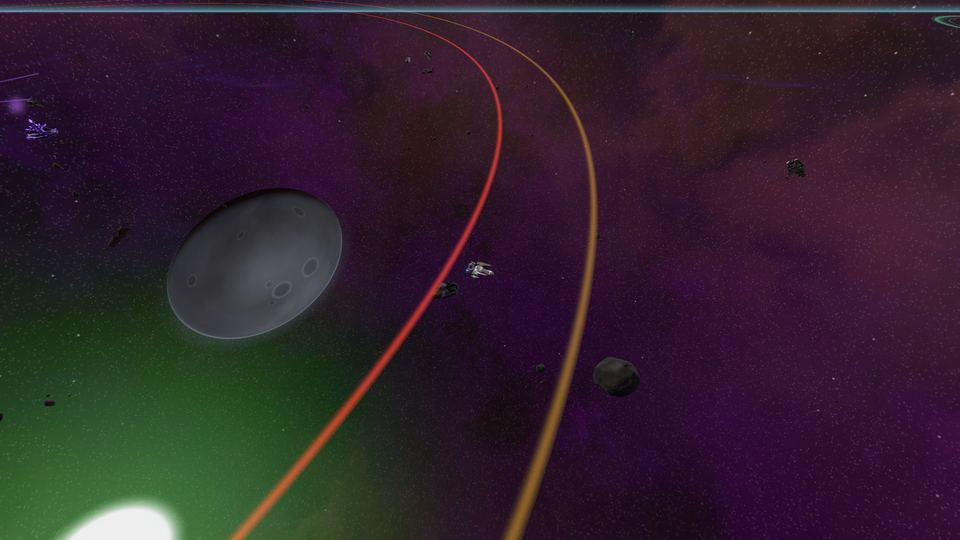

<!-- wiki-i18n source: 13c9ac551cfd01fa -->
<!-- wiki-i18n title: 위험 섹터 -->
# 위험 섹터 {#danger-sectors}

<!-- wiki-search: ds; ds-1; ds-2; ds-3; ds-4; central pvp zone; pvp zone; pulsar; giant excavator; excavator; dormant swamp; swamp; event 2; tech surge; 위험 섹터; 거대 굴착기; 굴착기; 펄서; 늪; 기술 급성장 -->

**위험 섹터**는 은하 중앙에 있는 네 개의 섹터, `DS-1`부터 `DS-4`입니다. 세 기업이 여기서 만나며, 모든 월드에서 파일럿끼리 싸울 수 있습니다([스페이스맵 이동](/wiki/01-General/Spacemap%20Travel.md)). `DS-1`, `DS-2`, `DS-3`에는 각각 한 기업의 게이트가 있고, `DS-4`는 중심부로 한가운데에 [블랙홀](/wiki/03-Mechanics/Black-Hole.md)이 있습니다. 어느 곳에도 정거장이 없습니다. 안전한 곳은 점프 게이트 둘레의 링뿐입니다.

옛 은하의 문명이 이곳에 살았습니다. 고도로 발달했고 보랏빛이 도는 검은색이었으며, 아무도 모르는 이유로 무너졌습니다. 그 잔해는 완전히 죽은 적이 없었고, [Dormant 무리](/wiki/05-Swarms/Dormant-Swarm.md)가 첫 징후였습니다. **시즌 11일차**, 이벤트 2(**기술 급성장**, [초기화 일정](/wiki/03-Mechanics/Wipe-Timeline.md#30-day-season-schedule) 참고)가 시작되면 더 많은 것이 깨어나고 위험 섹터가 달라집니다. 월드의 모든 파일럿은 시작된 날 알림을 받으며, 새로 생긴 것은 초기화까지 남습니다.

## 11일차부터 새로 생긴 것 {#what-is-new-from-day-11}

- **거대 굴착기.** `DS-1`, `DS-2`, `DS-3`에는 시즌 첫날부터 각각 펄서가 하나씩 있습니다. 하늘의 빛일 뿐 그 이상은 아닙니다. 11일차부터는 그 옆에 **거대 굴착기**가 섭니다. 굴착기 탱크에 Dark Matter를 넣고 자원을 고르면 굴착기가 펄서를 채굴합니다. Thulium과 희귀 광석이 누구나 주울 수 있는 상자로 굴착기 주위에 떨어집니다. 위험 섹터에서 다툴 만한 것 중 가장 풍성하고 가장 위험합니다. [거대 굴착기](/wiki/03-Mechanics/Giant-Excavator.md)를 보세요.
- **Slumbering Void.** 굴착기가 채굴하는 동안 **Slumbering Void**가 맵 가장자리에서 웨이브로 날아와 근처의 파일럿을 사냥합니다. 다른 개체들은 늪을 순찰합니다. [Dormant Swamp](/wiki/03-Mechanics/Dormant-Swamp.md#slumbering-void)를 보세요.
- **Dormant Swamp.** `DS-4`의 한쪽 모서리에 잃어버린 문명의 기지가 서 있습니다. 보이는 모든 함선을 쏘는 포대, 그것을 지키는 Inert Mass, 그리고 한가운데의 Unwakened입니다. 파일럿이 아직 찾아가서는 안 되는 곳입니다. [Dormant Swamp](/wiki/03-Mechanics/Dormant-Swamp.md)를 보세요.
- **더 빠르고 더 풍성해진 Dormant 무리.** 이제 무리는 늪에 나타나고, 격파된 뒤 더 일찍 돌아오며, 보상은 두 배입니다. [Dormant 무리](/wiki/05-Swarms/Dormant-Swarm.md)를 보세요.
- **11일차 이전**에는 펄서만 빛납니다. 그 밖의 위험 섹터는 [스페이스맵 이동](/wiki/01-General/Spacemap%20Travel.md)이 설명하는 그대로입니다. 11일차 이후인 월드에는 모두 한꺼번에 있습니다.

## 무엇이 어디에 있나 {#where-everything-is}

모든 월드에 모든 것의 사본이 따로 있습니다. 펄서와 굴착기는 섹터의 트인 3분의 1, 어느 게이트 링에서도 먼 곳, 맵 한가운데를 향한 쪽에 서 있습니다. 거리는 맵 단위이고, 섹터의 크기는 32,000 × 18,000 유닛입니다.

<!-- danger-sites:begin -->
<!-- Generated from server/Resources/Excavator.json and DormantSwamp.json (and Rockets.json, Values/ranking-config.json) by scripts/dormant-wiki.sh: don't edit by hand. -->

| 섹터 | 기업 게이트 | 펄서 | 거대 굴착기 |
| :--- | :--- | :--- | :--- |
| `DS-1` | Mars | 8,000 / 5,000 | 8,805 / 5,402 |
| `DS-2` | Terra | 8,000 / 13,000 | 8,805 / 12,598 |
| `DS-3` | Galactic | 24,000 / 13,000 | 23,195 / 12,598 |

<!-- danger-sites:end -->

`DS-4`에는 펄서가 없습니다. 그곳에는 블랙홀이 있습니다. 그 모서리에는 대신 Dormant Swamp가 있으며, 늪의 수치는 [Dormant Swamp](/wiki/03-Mechanics/Dormant-Swamp.md#at-a-glance)에 있습니다.

<!-- danger-rules:begin -->
<!-- Generated from server/Resources/Excavator.json and DormantSwamp.json (and Rockets.json, Values/ranking-config.json) by scripts/dormant-wiki.sh: don't edit by hand. -->

- 펄서는 시즌 첫날부터 빛납니다. 그 밖의 새로운 것은 모두 시즌 11일차에 나타나 초기화까지 남습니다.
- 모든 월드에 자신만의 펄서, 굴착기, 늪이 있습니다. 한 월드에서 일어난 일은 다른 월드에서 일어나지 않습니다.
- 펄서에서 2,600 유닛 이내, 거대 굴착기에서 2,200 유닛 이내, Dormant Swamp 중심에서 4,900 유닛 이내에는 소행성이 없습니다.

<!-- danger-rules:end -->

## 위험을 피하려면 {#keeping-out-of-trouble}

- **방사선.** 과열되었거나 파괴된 굴착기와 그 펄서는 원 안에 머무는 모든 함선을 태웁니다([거대 굴착기](/wiki/03-Mechanics/Giant-Excavator.md#heat-and-radiation)). 게임이 미리 경고하고, 원은 비행 중에는 바닥에, 그리고 미니맵에 그려집니다.
- **늪의 포대.** 늪의 포탑은 함선이 갈 만한 가치가 있는 무언가를 보기 훨씬 전에 보이는 함선을 쏩니다([Dormant Swamp](/wiki/03-Mechanics/Dormant-Swamp.md#the-guns)). 클릭한 항로는 블랙홀 때와 마찬가지로 포대와 방사선을 피해 휘어지며, 클릭한 곳이 안쪽이면 토스트로 경고합니다.
- **그곳에서 파괴되었다면,** 부활 선택지 **그 자리에서**는 블랙홀 때와 마찬가지로 방사선 밖이자 늪의 구역 밖에서 가장 가까운 지점에 놓아 줍니다([시작하기](/wiki/01-General/Getting-Started.md#dying-and-coming-back)).
- **그룹과 탈출로.** 굴착기는 Void와 라이벌을 똑같이 끌어들입니다. [그룹](/wiki/03-Mechanics/Groups.md)으로 가고, 가장 가까운 게이트를 알아 두고, 위험 섹터에서는 공격받는 동안 점프로 빠져나갈 수 없다는 점을 기억하세요([공격받는 중의 점프](/wiki/01-General/Spacemap%20Travel.md#jumping-under-fire)).
- **나머지는 늘 그렇듯 PvP입니다.** 여기에 안전한 곳은 없습니다. 라이벌을 포함해 내 월드의 일반 규칙이 적용됩니다.

## 더 읽을거리 {#where-to-read-more}

- [거대 굴착기](/wiki/03-Mechanics/Giant-Excavator.md): 제어 패널, 연료, 채굴하는 것, Void, 열과 방사선.
- [Dormant Swamp](/wiki/03-Mechanics/Dormant-Swamp.md): 포대, 세 외계인, 무리의 새 보금자리.
- [Dormant 무리](/wiki/05-Swarms/Dormant-Swarm.md)와 [무리](/wiki/05-Swarms/Swarms.md).
- [블랙홀](/wiki/03-Mechanics/Black-Hole.md)과 [Dark Matter](/wiki/03-Mechanics/Dark-Matter.md): 연료는 어디서 오는가.
- [소행성 채굴](/wiki/03-Mechanics/Asteroid-Mining.md): 위험 섹터의 바위.
