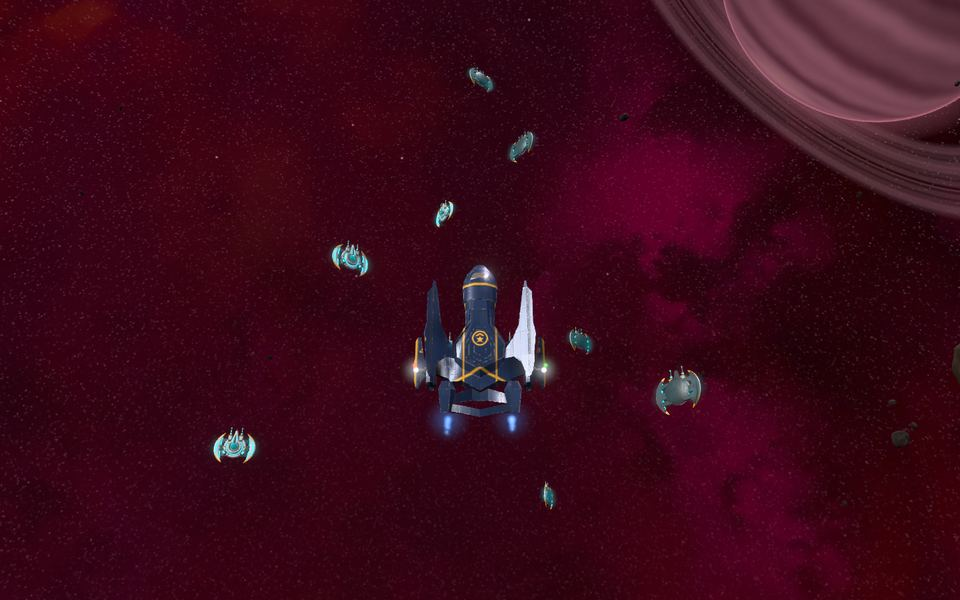
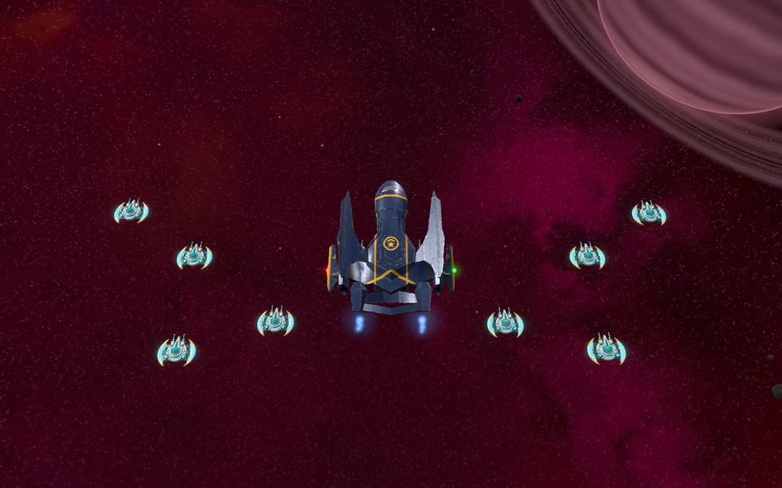
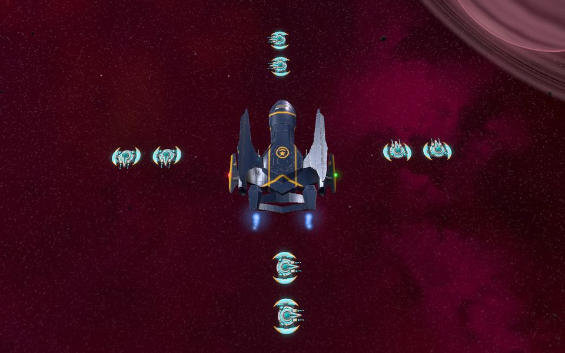
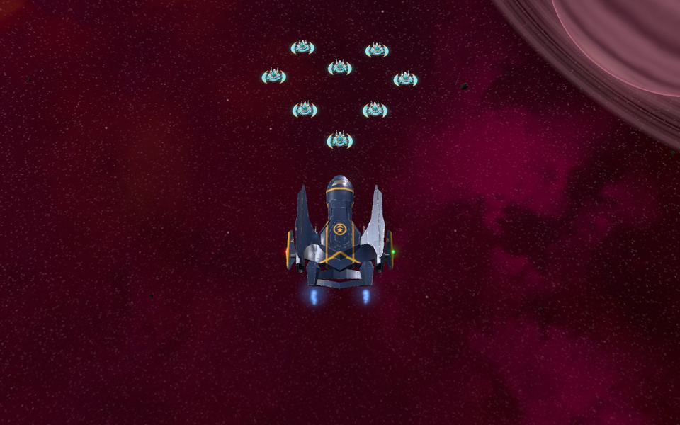
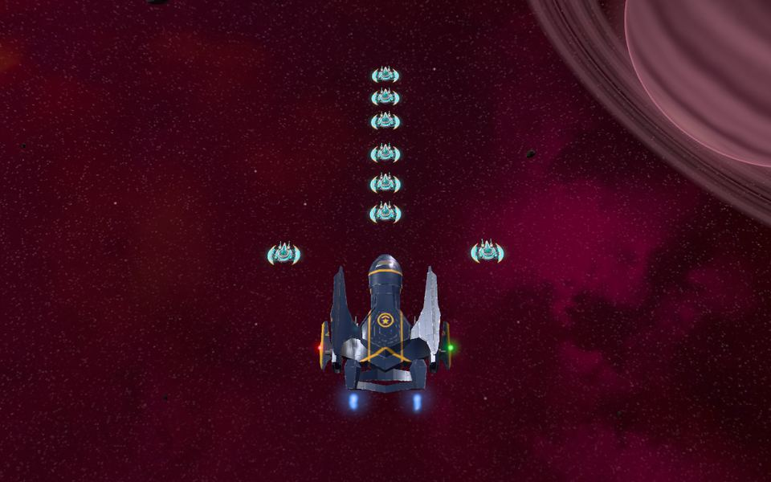
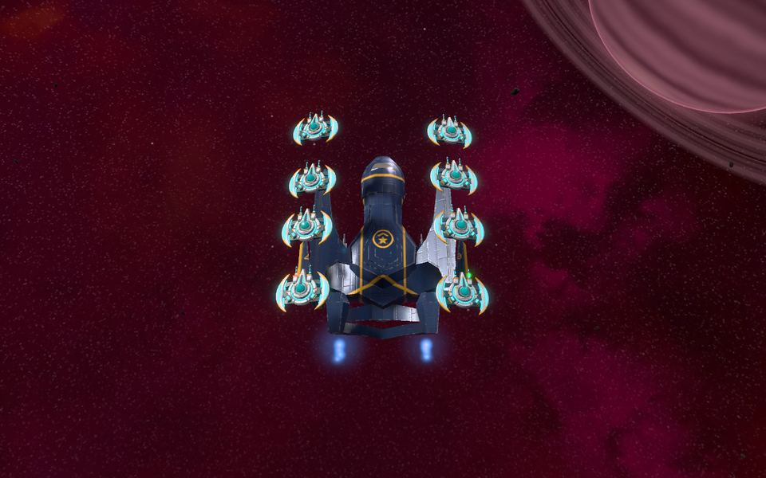
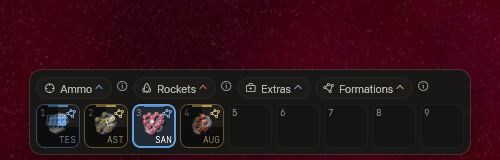
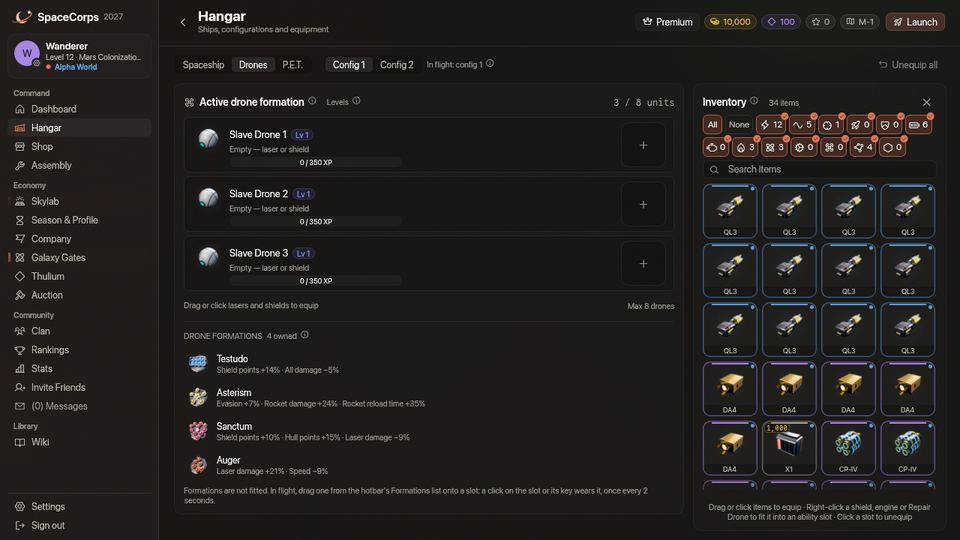

<!-- wiki-i18n source: 5848c2376fcf87d8 -->
<!-- wiki-i18n title: 편대 -->
# 드론 편대 {#drone-formations}

**드론 편대**는 드론이 함선 둘레에서 취하는 대형이며, 함선이 싸우는 방식을 바꿉니다. 모든 편대는 보너스를 주고 대가를 요구합니다. 실드가 커지는 대신 무기가 약해지거나, 로켓이 강해지는 대신 선체가 얇아지거나, 에일리언을 더 빨리 잡는 대신 함선이 느려지는 식입니다. 모두 **16종**입니다. [Skylab](/wiki/03-Mechanics/Skylab.md)에서 연구하고 어셈블리에서 제작한 뒤, 가진 것 중 **하나**를 골라 씁니다. 전투 중에도 **2초**에 한 번 바꿀 수 있습니다.

## 1분 요약 {#in-one-minute}

- **구하기.** 연구 센터에서 그 기술을 연구하고(*방어*와 *공격·기동* 두 개의 트리), 어셈블리에서 Thulium으로 제작합니다. 가장 싼 것은 Thulium 7,000과 Dark Matter 5, 가장 비싼 것은 Thulium 46,000과 Dark Matter 20입니다. 상점에서는 팔지 않습니다.
- **가지기.** 편대는 어디에도 장착하지 않습니다. 인벤토리에 하나만 있으면 됩니다. 드론(Slave Drone 또는 Master Drone)이 최소 한 기 필요하며, 없으면 어떤 편대도 작동하지 않습니다.
- **사용하기.** 퀵슬롯의 편대 목록에서 원하는 슬롯으로 드래그하세요. 슬롯을 클릭하거나 그 키를 누르면 편대를 씁니다. 목록에는 편대 없음을 뜻하는 ‘표준’도 있어, 슬롯에 드래그해 누르면 다시 편대 없는 상태가 됩니다. 2초에 한 번 바꿀 수 있고, 전투 잠금은 없습니다.
- **보기.** 편대마다 고유한 모양이 있고, 드론이 함선 둘레에서 그 모양으로 날아다닙니다. 지붕, 하트, 날개, 검, 드릴 같은 모양입니다. 다른 파일럿에게도 보입니다. [비행 모양](#how-they-fly)을 참고하세요.
- **다음 1분에 맞춰 고르기.** 편대는 모두 보너스의 대가를 치르므로 어디서나 최고인 편대는 없습니다. 지금 하려는 일(사냥, 결투, 로켓, 도주)에 맞는 편대를 쓰세요.

> [!NOTE]
> 드론 편대는 두 가지입니다. 보너스와 대가의 묶음, 그리고 드론이 나는 **모양**입니다([비행 모양](#how-they-fly)). 편대를 쓰지 않으면 드론은 단순한 “Wingman” 배치로 납니다([드론 시스템](/wiki/03-Mechanics/Drones.md#formation-movement)).

## 편대 얻기 {#getting-a-formation}

1. **연구하기.** Skylab의 연구 센터에는 편대용 트리가 두 개 있습니다. **방어**(6종)에는 함선을 살아남게 하는 편대가 있습니다. 실드, 선체, 스스로 복구되는 실드입니다. **공격·기동**(10종)에는 전투에서 이기거나 전투에서 빠져나가게 하는 편대가 있습니다. 로켓, 레이저, 관통, 외계인 사냥, 속도입니다. 연구는 **10시간, 1일 또는 2일**이 걸리고, 시작하기 전에 꽂아 두어야 하는 **Dark Matter 5, 13 또는 20**이 필요합니다. 편대가 강할수록 더 오래 걸리고 더 비쌉니다. 먼저 다른 편대를 연구해 두어야 하는 것도 있습니다(아래 표에 나와 있습니다). 16종 전부는 연구가 차례로 16일 2시간, Dark Matter는 189입니다. 연료, 부스트, Dark Matter는 [연구](/wiki/03-Mechanics/Research.md) 페이지에 있습니다.
2. **제작하기.** 어셈블리의 드론 분류에서 편대를 제작합니다. 필요한 것은 Thulium과 재료이며 크레딧은 들지 않습니다. 5분, 10분 또는 15분이 걸립니다. 편대는 단조하거나 강화할 수 없습니다.
3. **보관하기.** 아무것도 장착하지 않습니다. 인벤토리에 하나만 있으면 됩니다. 정거장에서, 또는 비행 중 안전 지대에서 격납고의 드론 화면을 열면([비행 중 격납고](/wiki/03-Mechanics/Hangar.md)) 드론 아래에 가진 편대가 나열됩니다. 같은 편대를 여러 개 가질 수 있지만 하나면 전부와 같습니다.

## 편대 사용하기 {#wearing-a-formation}

- **퀵슬롯에 놓기.** 퀵슬롯 위의 **편대** 버튼을 누르면 가진 편대 목록이 열립니다. 탄약이나 로켓처럼 두 줄 중 어느 슬롯으로든 드래그하세요. 슬롯에는 편대 그림과 세 글자가 표시되고, 그 슬롯의 키가 그대로 쓰입니다.
- **비행 중 쓰기.** 슬롯을 클릭하거나 그 키를 누르세요. 켜진 슬롯을 한 번 더 눌러도 아무 일도 일어나지 않습니다. 편대를 쓰지 않으려면 목록의 ‘표준’을 슬롯에 놓고 누르세요. 쓰고 있는 편대의 슬롯은 켜져 있습니다. 바꾼 뒤에는 다음 변경이 허용될 때까지 다른 편대 슬롯 위로 부채꼴 그림자가 지나가며, 그 사이에 누르면 슬롯이 붉게 깜박입니다. 함선 창의 제목 표시줄에 쓰고 있는 편대가 표시됩니다.
- **키.** 편대는 놓은 슬롯의 키를 씁니다(처음에는 1~9와 Shift+1~Shift+9). 슬롯의 키는 설정 › 조작에서 바꿀 수 있습니다.
- **2초마다, 전투 중에도.** 전투 잠금도 안정화 시간도 없습니다. 새 수치는 즉시 적용됩니다. 너무 일찍 요청하면 채팅에 “1.4초 후에 편대를 다시 바꿀 수 있습니다.”라고 나옵니다. 안전 지대 안에서는 사실상 기다림이 없습니다.
- **따라옵니다.** 게임은 마지막으로 쓴 편대를 기억하고, 출격하거나 부활할 때 다시 요청합니다. 구성을 바꿔도(`C` 키) 그대로이며, 기다릴 필요가 없습니다.
- **드론이 필요합니다.** 함대에 Slave Drone도 Master Drone도 없으면 편대는 아무 일도 하지 않습니다. 한 기면 충분하며, 드론의 수, 레벨, 장착한 것은 상관없습니다.
- **다른 파일럿도 볼 수 있습니다.** 내 함선이 보이는 파일럿에게는 내 드론이 내 편대의 모양으로 나는 모습도 보입니다. 파일럿을 선택하면 대상 창에 “편대:”와 그 이름이 나옵니다. 그룹과 공유되는 것은 없습니다.

## 비행 모양 {#how-they-fly}

편대마다 드론에게 **고유한 모양**을 줍니다. 편대를 쓰면 드론은 단순한 윙맨 배치를 떠나 **0.8초** 만에 함선 둘레의 그 모양으로 미끄러지듯 옮겨 가며, 선체를 돌아서 가고 절대 통과하지 않습니다. 모양은 공간에 있습니다. Testudo의 지붕은 날개 위에 떠 있고, Auger는 원뿔이며, 모양 전체가 함선과 함께 방향을 바꾸므로 그 앞쪽은 언제나 함선의 선수가 향하는 곳입니다. 그중 여섯 가지는 이 페이지 위쪽 그림에 있으며, 모두 Paragon과 레벨 8 드론 여덟 기를 카메라를 조금 기울여 위에서 본 모습입니다. Auger, Culler, Gyre, Sanctum, Stiletto, Testudo입니다.

- **편대 없음, 모양 없음.** 편대를 쓰지 않으면(편대 목록의 **표준**) 드론은 [드론 시스템](/wiki/03-Mechanics/Drones.md#formation-movement)의 단순한 “Wingman” 배치로 납니다.
- **가진 드론에 맞춰 만들어집니다.** 모양은 가진 드론 수에 정확히 맞춰 만들어집니다(1~8기). 한두 기이면 모양의 시작 부분만, **8기**이면 그림처럼 모양 전체가 보입니다. 드론의 레벨이나 장착한 것은 아무것도 바꾸지 않습니다.
- **함선에 맞춰집니다.** 긴 함선은 작은 함선보다 긴 모양으로 날고, 드론은 선체와 거리를 둡니다.
- **모두에게 보입니다.** 다른 파일럿은 내 모양을 보고, 나도 그들의 모양을 봅니다. 카메라에서 **3,500유닛**보다 먼 함선은 드론을 표시하지 않으며, 붐비는 곳에서는 가까운 **64척**만 표시합니다.
- **끄기.** 설정 › 인터페이스에 **내 드론 표시**와 **적 드론 표시**(다른 파일럿의 드론)가 있습니다. 보이는 것만 바뀌고, 편대의 보너스는 그대로 작동합니다. **움직임 줄이기**(설정 › 그래픽)는 움직이는 모양인 Cordon, Asterism, Culler, Gyre, Auger를 멈춰 두고 미끄러지는 시간을 **0.2초**로 줄입니다.
- **높이 보기.** 지붕, 그릇, 드릴에는 높이가 있는데, 바로 위에서 보는 시점에서는 거의 보이지 않습니다. 오른쪽 드래그로 카메라를 돌리면([시작하기](/wiki/01-General/Getting-Started.md#keyboard-controls-keybindings)) 옆에서 볼 수 있습니다.

| 편대 | 모양 | 움직이는 것 |
| :--- | :--- | :--- |
| **Testudo** | 지붕: 날개 위의 드론 두 줄, 그 사이는 함선의 등이 비어 있음 | 없음 |
| **Adamant** | 함선을 둘러싼 마름모: 앞에 꼭짓점 하나, 뒤에 하나, 양옆에 하나씩 | 없음 |
| **Sanctum** | 선수 앞의 하트, 뾰족한 끝이 함선을 향함 | 없음 |
| **Redoubt** | 그릇: 선체를 둘러싼 고리, 날개 위의 두 기, 맨 위의 한 기 | 없음 |
| **Cordon** | 함선을 둘러싼 넓은 고리 | 24초에 한 바퀴 돕니다 |
| **Rampart** | 선수 앞을 가로지르는 벽, 양 끝이 집게처럼 앞으로 휨 | 없음 |
| **Asterism** | 네 갈래 빛의 별: 앞, 뒤, 양옆에 뾰족한 끝 | 각 드론이 1.5초마다 한 번 부풀었다 줄어듭니다 |
| **Bodkin** | 함선이 화살촉인 화살: 선수 앞에 끝, 옆면을 따라 미늘, 뒤에 화살대 | 없음 |
| **Ballista** | 함선 앞의 V자, 팔이 옆면을 따라 뒤로 뻗음 | 없음 |
| **Centurion** | 블록: 함선을 둘러싼 직사각형의 호위 | 없음 |
| **Shrike** | 선수 앞의 삼지창, 함선이 자루: 세 기의 줄과 세 갈래, 가운데가 가장 김 | 없음 |
| **Culler** | 날개: 양쪽에 드론 부채, 긴 것과 짧은 것, 드론 수가 홀수이면 선수 앞에 머리 | 날개 끝이 2.4초마다 한 번 오르내립니다 |
| **Gemini** | 쌍창: 양 옆면을 따라 늘어선 드론 줄, 끝이 선수 앞 | 없음 |
| **Stiletto** | 함선이 손잡이인 검: 선수 앞에 최대 여섯 기의 날과 선수에 날밑 한 쌍 | 없음 |
| **Gyre** | 수레바퀴: 테두리와 중심이 바큇살로 이어짐 | 6초에 한 바퀴 돕니다 |
| **Auger** | 드릴: 함선을 둘러싼 원뿔, 끝이 선수 앞, 넓은 쪽이 뒤, 드론은 바라보는 방향을 향함 | 드론이 함선의 비행 축을 따라 3초에 한 바퀴 나선을 그립니다 |

## 16종의 편대 {#the-sixteen-formations}

표에는 게임의 아이템 카드처럼 각 편대가 주는 것과 치러야 하는 대가가 나옵니다. 퍼센트는 함선의 최종 수치가 변하는 비율입니다. 관통은 탄약과 마찬가지로 대상의 실드 흡수율 포인트로 셉니다([실드 시스템](/wiki/03-Mechanics/Shields.md#shield-penetration)).

### 방어 {#defence}

| 편대 | 보너스 | 대가 |
| :--- | :--- | :--- |
| **Testudo** | 실드 포인트 +14% | 모든 피해 −5% |
| **Sanctum** | 실드 포인트 +10%, 선체 포인트 +15% | 레이저 피해 −9% |
| **Rampart** | 실드 흡수율 +17% | 속도 −17% |
| **Adamant** | 초당 실드 재생 +1.2% (초당 최대 5,750 실드 포인트) | 선체 포인트 −15% |
| **Redoubt** | 실드 포인트 +38%, 초당 실드 재생 +0.7% (초당 최대 4,500 실드 포인트), 로켓 재장전 시간 −27% | 속도 −11%, 레이저 피해 −12% |
| **Cordon** | 실드 포인트 +95% | 속도 −3%, 레이저 피해 −11%, 로켓 재장전 시간 +11% |

### 공격·기동 {#strike-mobility}

| 편대 | 보너스 | 대가 |
| :--- | :--- | :--- |
| **Asterism** | 회피 +7%, 로켓 피해 +24% | 로켓 재장전 시간 +35% |
| **Bodkin** | 로켓 피해 +29% | 레이저 피해 −6% |
| **Ballista** | 로켓 피해 +55% | 선체 포인트 −13% |
| **Gemini** | 실드 관통 +9% | 실드 포인트 −22% |
| **Stiletto** | 선체 포인트 +13%, 실드 관통 +16% | 전투 중 초당 실드 감소 −3.5% |
| **Centurion** | 파괴로 얻는 명예 +32% | 실드 포인트 −7%, 선체 포인트 −5%, 레이저 피해 −5% |
| **Shrike** | 외계인에 대한 레이저 피해 +7.5%, 외계인 파괴 경험치 +6% | 실드 흡수율 −6% |
| **Culler** | 외계인에 대한 피해 +12%, 외계인 파괴 경험치 +12% | 속도 −10% |
| **Gyre** | 속도 +10% | 레이저 피해 −11%, 전투 중 초당 실드 감소 −0.5% |
| **Auger** | 레이저 피해 +21% | 속도 −9% |

## 필요한 비용 {#what-they-cost}

Thulium만 들고 크레딧은 들지 않습니다. 16종 전부는 Thulium 330,500과 Dark Matter 189입니다.

| 편대 | 먼저 필요한 기술 | 연구 시간 | Dark Matter | 제작에 필요한 Thulium | 제작 시간 |
| :--- | :--- | ---: | ---: | ---: | ---: |
| **Testudo** | – | 10시간 | 5 | 7,500 | 5분 |
| **Sanctum** | Testudo | 1일 | 13 | 20,000 | 10분 |
| **Rampart** | Sanctum | 2일 | 20 | 38,500 | 15분 |
| **Adamant** | – | 10시간 | 5 | 9,000 | 5분 |
| **Redoubt** | Adamant | 1일 | 13 | 21,000 | 10분 |
| **Cordon** | Redoubt | 1일 | 13 | 21,500 | 10분 |
| **Asterism** | – | 10시간 | 5 | 7,000 | 5분 |
| **Bodkin** | Asterism | 1일 | 13 | 21,000 | 10분 |
| **Ballista** | Bodkin | 1일 | 13 | 24,000 | 10분 |
| **Gemini** | – | 2일 | 20 | 38,000 | 15분 |
| **Stiletto** | Gemini | 2일 | 20 | 46,000 | 15분 |
| **Centurion** | – | 10시간 | 5 | 8,000 | 5분 |
| **Shrike** | Centurion | 10시간 | 5 | 8,500 | 5분 |
| **Culler** | Shrike | 1일 | 13 | 20,000 | 10분 |
| **Gyre** | – | 1일 | 13 | 20,000 | 10분 |
| **Auger** | Gyre | 1일 | 13 | 20,500 | 10분 |

### 재료 {#materials}

어셈블리는 Thulium 외에 이 재료들을 인벤토리에서 가져갑니다. 재료는 편대의 연구 시간에 따라 정해집니다.

| 연구 시간 | Ship Fragment | Reinforced Hull Plate | Power Core | Velkonite Reinforced Plate | Orvium Reinforced Plate | Ancient Control Unit |
| ---: | ---: | ---: | ---: | ---: | ---: | ---: |
| 10시간 | 100 | 10 | 5 | 4 | – | – |
| 1일 | 180 | 18 | 9 | 8 | 3 | – |
| 2일 | 260 | 26 | 13 | 14 | 6 | 2 |

## 규칙 자세히 {#the-rules-in-detail}

- **선체는 비율을 유지합니다.** 최대 선체를 바꾸는 편대는 선체도 같은 비율로 바꿉니다. 선체가 가득이면 새 최대치에서도 가득, 80%이면 80%이며, 어느 방향이든 같고, 되돌리면 같은 수치로 돌아옵니다. 바꾼다고 회복되거나 다치지 않고, 피해로 치지도 않습니다. 실드는 다릅니다. 최대 실드를 낮추는 편대는 현재 값을 그 수준으로 깎고, 높이는 편대는 아무것도 더하지 않으므로, Cordon에서 채운 실드는 벗을 때 깎입니다.
- **파괴 보너스는 10초를 기다립니다.** Shrike, Culler, Centurion이 파괴에 더해 주는 경험치와 명예는 편대를 10초 동안 사용한 뒤에야 집계됩니다. 외계인 파괴(떼의 함선 포함)만 집계되며, 임무나 파일럿은 해당하지 않습니다. 편대의 나머지 효과는 즉시 작동합니다.
- **감소는 편대를 쓰는 동안만 진행됩니다.** Stiletto와 Gyre는 매초 *현재* 실드의 일부를 태우지만, 전투 중(최근 10초 안에 피격당했거나 레이저를 쏘았거나 로켓을 쏜 경우)에만, 그리고 안전 지대 안에서는 절대 태우지 않습니다. 편대를 바꾸면 감소는 즉시 멈춥니다. 피해가 아니므로 실드가 회복되기 시작하기까지의 15초를 다시 시작하지 않습니다.
- **재생은 전투 중에도 작동합니다.** Adamant와 Redoubt는 함선 자체의 회복에 더해 매초 최대 실드의 일부를 돌려주며, 표의 상한까지입니다. 실드가 가득 차면 멈추고, 받은 피해로 집계되지 않습니다.
- **회피는 직격을 피할 확률입니다.** Asterism의 7%는 나에게 들어오는 직격(레이저 일제 사격, 직격 로켓, 외계인의 사격) 하나하나가 7%의 확률로 피해를 전혀 주지 못한다는 뜻이며, 내 함선 위에 “빗나감”이 떠오릅니다. 나머지 공격은 그대로 들어오므로 많은 피격에서는 피해를 약 7% 덜 받지만, 로켓 한 발은 전부 아니면 전무입니다. 범위 폭발은 조준하지 않으므로 회피되는 일이 없습니다.
- **관통은 탄약의 관통에 더해집니다.** Gemini와 Stiletto는 그 포인트를 탄약과 직격 로켓의 관통에 더합니다. 합계는 40%에서 멈추고, 폭발에는 관통이 없습니다.
- **로켓 14종 전부.** 편대의 로켓 보너스는 N.U.K.E.와 N.I.K.E.를 포함한 모든 로켓의 피해에 곱해집니다. Testudo의 모든 피해 대가도 로켓에 적용되고, Culler의 외계인 대상 피해는 외계인에 맞는 로켓에 적용됩니다. 로켓 하나에 걸리는 모든 배율은 합쳐서 ×1.59에서 멈춥니다. 로켓 편대 중 가장 강한 Ballista(+55%)는 N.I.K.E.로 최대 116,250, N.U.K.E.로 최대 77,500의 피해를 줍니다. 멀쩡한 Paragon(128,000)은 앞의 것을, Goombah(80,000)는 뒤의 것을 버텨 냅니다.
- **로켓의 재장전은 발사할 때 정해집니다.** 5초는 Asterism에서는 6.75초, Cordon에서는 5.55초, Redoubt에서는 3.65초가 됩니다. 단, 로켓의 비행 시간에 잠깐의 여유를 더한 시간보다 짧아지지는 않습니다. N.U.K.E. 뒤에는 4.1초, N.I.K.E. 뒤에는 4.6초입니다. 발사한 뒤에 편대를 바꿔도 이미 시작된 대기 시간은 짧아지지 않습니다.
- **능력은 편대를 따르지 않습니다.** Shield Surge와 Emergency Repair는 편대를 뺀 최댓값으로 총량을 계산하므로, 편대를 바꾼다고 더 강해지지 않습니다. Afterburner는 그 순간의 속도에 배율을 곱하고, Repair Drone은 그 순간의 최대 선체의 일부를 수리합니다.
- **느린 함선일수록 [블랙홀](/wiki/03-Mechanics/Black-Hole.md)의 돌아올 수 없는 지점이 멉니다.** Rampart(−17%)와 Redoubt(−11%)가 가장 많이 느려집니다. 빠져나올 때는 Gyre(속도 +10%)입니다.

## 언제 무엇을 {#which-one-when}

- **외계인 사냥:** 단단한 상대에는 Auger(레이저 +21%), 경험치에는 Culler(외계인 대상 피해 +12%, 경험치 +12%)와 Shrike(외계인 대상 레이저 피해 +7.5%, 경험치 +6%). 파괴 보너스 편대는 공격하기 *전에* 착용하세요. 보너스는 10초 뒤부터 집계됩니다.
- **결투:** Gemini(관통 +9포인트)는 실드를 뚫고, Rampart(흡수율 +17%)는 내 실드를 버티게 하고, Stiletto(관통 +16포인트, 선체 +13%)는 가장 깊게 파고들지만 전투 중 실드를 태우며(초당 3.5%), Sanctum(선체 +15%, 실드 +10%)은 피격을 받아 냅니다.
- **로켓:** Ballista(+55%)는 중포이고, Bodkin(+29%)은 대가가 작은 온건한 선택이며, Asterism(+24%, 회피 7%)은 그 대가로 재장전이 느립니다.
- **보스나 떼의 공격 받아 내기:** Cordon(실드 +95%), Redoubt(스스로 복구되는 실드 +38%), Sanctum.
- **도망치기:** Gyre(속도 +10%).
- **전투 중에 바꾸는 것이 핵심입니다.** Gemini로 시작해 상대의 실드를 뚫고, 맞는 쪽일 때는 Rampart나 Sanctum으로 바꾸고(바꿔도 선체 비율이 유지되므로 회복되지 않습니다), 빠져나가고 싶을 때는 Gyre를 쓰세요. 퀵슬롯에 서너 개만 놓아도 충분합니다.

## 간직하기 {#keeping-them}

드론 편대는 드론처럼 시즌 와이프 후에도 남습니다. 보유한 모든 편대는 인벤토리, 퀵슬롯, [수송 보관함](/wiki/03-Mechanics/Wipe-Timeline.md#transport-cache-travel-capsule-), 함선 어디에 있든 남으므로 보관함의 공간을 쓸 필요가 없고, 퀵슬롯도 그대로 유지됩니다. 연구도 남습니다.
