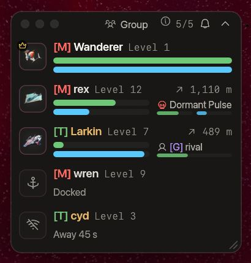

<!-- wiki-i18n source: 29a5924a0521c514 -->
<!-- wiki-i18n title: Grupos -->
# Grupos {#groups}

Um grupo reúne até **5 pilotos** que voam juntos, de qualquer corporação: amigos que voam por corporações diferentes, até mesmo inimigos nos setores PvP, podem formar um mesmo grupo. Os membros veem a nave, o casco e o escudo uns dos outros, dividem as recompensas dos alienígenas que destroem e têm os abates uns dos outros contados para as suas missões. O grupo também tem um canal de chat.

## Formando um grupo {#forming-a-group}

- **Convide** um piloto de três maneiras: selecione-o e pressione **Convidar para o grupo** na janela do alvo; clique com o botão direito no nome dele no chat e escolha **Convidar para o grupo**; ou pressione **+** na barra de título da janela do grupo para ver uma lista dos pilotos do seu mapa (o nome de um inimigo aparece em âmbar nela). Você pode convidar um piloto de qualquer corporação. Se for de outra corporação, o convite que ele recebe cita a sua corporação, a marca como **Inimigo** e avisa o que aceitar significa (os membros do grupo veem a sua nave em todos os mapas, camuflada ou não, e vocês não podem se atacar), para que ninguém entre por engano; e você pode convidar no máximo **3 pilotos de outras corporações por minuto**. Um piloto de outra corporação que sair do seu grupo não pode ser convidado de novo por você durante **um minuto**.
- O piloto vê um cartão com **Aceitar** e **Recusar**, que conta os **60 segundos** que ele tem para responder, e um aviso. **Y** aceita e **Escape** recusa (um campo de texto em uso, ou uma janela aberta por cima, fica com as teclas). Se vários convites estão à espera, o cartão mostra um de cada vez. Ele aparece também na estação. Quando o tempo acaba, o convite expira e você é avisado de qual deles. Você não pode convidar um piloto que já está em um grupo, que ativou o **Não perturbe** ou que tem convites demais à espera, e pode enviar no máximo 10 convites por minuto (3 para outras corporações).
- O **Não perturbe** desativa os convites: o sino na barra de título da janela do grupo, ou Configurações › Geral › Grupos. Enquanto ele estiver ativado, ninguém pode convidar você, e você nem é consultado.
- Quem tiver o convite aceito primeiro se torna o **líder**. O líder convida, remove membros e torna outro membro o líder. Qualquer um pode sair. Um grupo de um só piloto se desfaz sozinho. Quando o líder sai, passa a liderar o membro que está há mais tempo no grupo.
- Você está em **um grupo por vez**. [Mudar de corporação](/wiki/01-General/Getting-Started.md#changing-your-company) não tira você do grupo (você aparece sob a sua nova corporação); o reset da temporada tira.
- Se a sua conexão cair, ou se você atracar e decolar de novo, o seu lugar é mantido por **2 minutos**. Um membro ausente por mais tempo que isso é removido. Uma atualização do servidor encerra todos os grupos: convidem-se de novo.

## Vendo o seu grupo {#seeing-your-group}

Depois que você aceita, a **janela do grupo** se abre (a tecla **B** ou o botão dela na barra de ferramentas a mostra e a oculta; reatribua a tecla em Configurações › Controles). Cada membro tem uma linha: a nave dele, o nome e o nível, e embaixo a **barra de casco** (verde) com a **barra de escudo** (azul) abaixo dela, cada uma tão larga quanto a linha (passe o mouse para ver os números). Uma nave sem escudo instalado mostra só a barra de casco. Um membro no seu mapa mostra no canto superior direito da linha a que distância está e em que direção, como o minimapa desenha (para cima é o alto do mapa); um membro em outro mapa mostra ali o nome desse mapa, com o mundo quando for outro mundo. Uma **coroa** marca o líder, um **fantasma** marca um membro camuflado (um grupo compartilha as suas naves camufladas, sejam quais forem as corporações) e um **escudo** marca um membro em uma zona segura. Um membro que atracou, foi destruído ou perdeu a conexão aparece esmaecido e diz isso. Clique em uma linha para selecionar aquela nave quando ela estiver no seu mapa (você não pode atirar em um colega de grupo: o jogo segura o fogo).
- Um membro que está **atirando** mostra também o **alvo** dele, à **direita** das barras dele: uma pequena marca do que ele é (uma caveira para um alienígena), o nome do alvo e duas barras finas, o **casco** e o **escudo** do alvo (passe o mouse para ver os números). As barras do próprio membro cedem um pouco do comprimento para isso, e a linha mantém a altura, quer um colega tenha alvo ou não. Você vê o alvo e o casco e o escudo dele de cada colega de grupo que atira em um alienígena, em outro piloto ou em um piloto de corporação. Conta uma trava de laser ou um foguete guiado em voo, e o alvo permanece por **5 segundos** depois do último. Ele só aparece para um membro que voa no seu mapa (no seu mundo) e só para uma nave que você mesmo poderia ver ali: o casco e o escudo de um piloto camuflado nunca são mostrados a um membro que não consegue ver esse piloto. Uma base ou um portão não é um alvo. A sua própria linha não mostra alvo (essa é a janela do alvo), nem a janela dobrada. Se você estreitar a janela (ela se redimensiona por qualquer lado ou canto), deixa de haver espaço ao lado das barras: o alvo vai então para **baixo** delas e a linha fica mais alta.
- O **líder** clica com o botão direito em uma linha para **Tornar líder** ou **Remover do grupo**. Qualquer membro clica com o botão direito na própria linha, ou usa o menu, para **Sair do grupo**.
- O botão de minimizar dobra a janela em um pequeno par de barras para cada membro; a posição, o tamanho e o estado dobrado são lembrados.
- Os membros **veem as camuflagens uns dos outros** e não podem desfazê-las: um EMP que dispara perto de um colega de grupo camuflado deixa a camuflagem dele como está.
- No mapa, os pilotos do grupo são rosa: um ponto rosa no minimapa e, sobre as naves deles em voo, uma marca de grupo, uma barra de casco e uma barra de escudo, todas rosa. Passe o mouse sobre um ponto para ver o nome. Os colegas de corporação fora do grupo continuam verdes.
- Cada membro mostra a **corporação** por que voa: a tag dela na cor da corporação antes do nome (“[T] rex”), como em todo o jogo. Um membro de outra corporação, que fora do grupo seria um inimigo, tem o nome em âmbar e diz isso no cartão dele. Ninguém fora do seu grupo vê nada disso e, quando você sai ou é removido, você deixa de ver tudo isso na hora.

## Dividindo abates {#sharing-kills}

Quando um membro destrói um alienígena (ou é pago por ele pela [reivindicação](/wiki/03-Mechanics/Combat.md) dele), as recompensas (créditos, Thulium, experiência e honra) são divididas entre os membros que estiverem:

- no **mesmo mapa** (no mesmo mundo),
- **vivos** e a até **4.000 unidades** dos destroços, e
- **atirando**: eles dispararam um laser ou um foguete em qualquer coisa nos últimos 15 segundos.

Cada um recebe uma parte proporcional ao seu **nível**, seja qual for a corporação (os créditos e a honra são de cada piloto; nenhuma corporação fica com nada): um piloto de nível 15 com um colega de nível 5 fica com 75% e o colega com 25%. Todo crédito é distribuído: o piloto que fez o abate recebe o que sobra depois que as partes são arredondadas para baixo. A recompensa inteira é calculada com os bônus do autor do abate: valem os boosters dele, o multiplicador do mundo dele e o Premium dele, e os de um colega não valem. Sozinho, ou sem mais ninguém ao alcance, um abate paga o que sempre pagou. Um piloto parado perto da luta, sem atirar, não recebe parte.

O aviso do abate informa isso: a linha **RECOMPENSAS** do próprio autor do abate mostra a parte dele, seguida de “Recompensas divididas com 2 colegas de grupo: sua parte é 40%.”, e um colega que recebe uma parte lê “*Alienígena* foi abatido por *piloto*; a parte do seu grupo garante o pagamento a você.” com os valores. Os avisos aparecem no Registro do jogo.

O que fica só com o autor do abate: a **caixa de carga** (saque e recursos), o abate nas estatísticas e no ranking dele, a contagem de abates dos pontos de reset e a experiência dos drones. Os abates de outros pilotos não são divididos.

## Dividindo missões {#sharing-missions}

Um abate também conta para as **missões de abate** de todos os outros membros que estão no mesmo mapa e **dispararam um laser ou um foguete em qualquer coisa nos últimos 15 segundos**, onde quer que estejam nele, como se eles mesmos tivessem destruído o alienígena. As regras da própria missão continuam valendo: o alienígena precisa ser do tipo da missão e o setor, o que a missão cita. Um colega que não atirou, ou que está em outro mapa, não recebe a contagem. As missões mantêm as regras da corporação de cada um: uma missão que pede um abate no “setor 4 de outra corporação” conta para o membro para quem esse setor é de outra corporação. Quando o abate de um colega conta para uma das suas missões, um aviso informa qual. Na [linha de Desafios](/wiki/03-Mechanics/Quests.md#where-it-counts), um membro também precisa estar a até **4.000 unidades** dos destroços para contar, e cada membro que tem uma missão com um item de missão faz o seu próprio sorteio e vê o seu próprio item: ninguém pode compartilhar um.

## Canais de chat {#chat-channels}

O chat tem uma fileira de abas no alto: **Global**, **Local**, **Grupo** (enquanto você está em um grupo) e, por último, **Sistema**. A linha que você digita vai para a aba em vista, e a aba que você usou por último é lembrada. Cada canal tem a sua cor e uma tag curta em cada linha (GLB, LOC, GRP), cada aba conta as linhas que você não leu, e o botão do chat na barra de ferramentas mostra a contagem enquanto a janela está fechada. Ou comece uma linha com um comando:

| Canal | Quem ouve | Comando |
| :--- | :--- | :--- |
| **Local** | os pilotos do seu mapa | `/l` ou `/local` |
| **Global** | todos os pilotos online | `/g` ou `/global` |
| **Grupo** | o seu grupo, onde quer que esteja | `/p`, `/party` ou `/group` |

Um comando também muda a aba e, digitado sozinho (`/g`), só muda a aba. O chat do grupo precisa de um grupo. Em um servidor de jogo anterior aos canais, o chat é a lista única que sempre foi, e não é possível formar um grupo.

A aba **Sistema** é dourada e somente de leitura, com uma lista própria: nela ficam as mensagens que o servidor dá por conta própria (as boas-vindas, os avisos de reinício, de atualização e de reset, os anúncios de enxame) e o que a sua nave informa (reparos, camuflagem, EMPs, foguetes). Essas linhas não estão em nenhuma outra aba, então um Global movimentado não consegue empurrá-las para fora, e as outras abas guardam o que os pilotos dizem. A contagem da aba é só dos anúncios; a contagem regressiva de um reinício ou de uma atualização e os avisos de reset também aparecem por um instante como notificação. O [registro de baixas](#the-kill-feed) fica no **Global**, com o seu próprio interruptor, e as linhas sobre pilotos que entram no seu grupo ou saem dele estão em **Grupo**.

### Digitar {#typing}

**Enter** abre o chat e dá a ele o teclado. Envie uma linha com **Enter** e o campo mantém o teclado, então a próxima linha pode vir logo em seguida; enquanto for assim, a barra de atalhos e as teclas de habilidade ficam desligadas. A digitação termina quando você pressiona **Escape**, pressiona **Enter** sem ter digitado nada, clica no mapa com o botão esquerdo (o mesmo clique continua guiando a sua nave), deixa o campo vazio e não pressiona nenhuma tecla por 15 segundos ou a sua nave é destruída. Na aba Sistema, onde não dá para escrever, **Enter** leva você de volta ao canal em que escreveu por último.

### As regras do chat {#the-chat-rules}

O servidor submete cada linha a algumas regras, as mesmas em Local, Global e Grupo. Uma linha que ele recusa não é enviada, o motivo aparece por alguns segundos abaixo do campo e o seu texto volta para o campo.

- **Um limite para a velocidade de envio.** Você pode enviar **5 linhas** de uma vez e depois **mais uma linha a cada 2 segundos**, contadas juntas para Local, Global e Grupo. Se você enviar uma linha quando não sobrar nenhuma, o chat entra em **pausa** para você: **10 segundos** na primeira vez e depois **30**, **120** e **300 segundos** a cada reincidência em até 10 minutos da última pausa (depois de 10 minutos sem pausa, a contagem recomeça). Enquanto durar, o botão Enviar fica cinza e “Chat pausado: 7 s” faz a contagem regressiva abaixo do campo. **O texto que você digitou continua no campo** e o campo mantém o teclado: espere ou pressione **Escape**. Uma conversa normal nunca chega ao limite. Uma linha que as regras recusam conta como 2 linhas da sua cota.
- **200 caracteres** por linha. Um contador (“150/200”) aparece a partir de 120 caracteres, e uma linha mais longa é cortada.
- **Só letras latinas.** As letras dos alfabetos latinos com os seus acentos (é, ß, ñ, ø, ő), dígitos, a pontuação comum e os sinais ¡ ¿ « » ° £ €. Cirílico, chinês, japonês, coreano, emojis e outros símbolos são recusados, e o campo os descarta enquanto você digita ou cola.
- **Sem links.** Uma linha com um endereço da web, um link de convite ou um e-mail é recusada, mesmo quando disfarçada das maneiras mais comuns. Só palavras não têm problema: “join my discord” passa.
- **Sem repetições.** A mesma linha da sua última, enviada de novo em menos de 10 segundos, é recusada, e também uma linha com o mesmo caractere mais de 8 vezes seguidas ou sem nenhuma letra nem dígito.

Os administradores não estão sujeitos a essas regras, só aos 200 caracteres. As regras exigem um servidor de jogo a partir da 0.4.9; um mais antigo limita só o Global, a 3 linhas de uma vez e depois uma a cada 2 segundos.

### O registro de baixas {#the-kill-feed}

A aba **Global** também traz um registro de baixas: uma linha em tom discreto, com uma caveira, sempre que um piloto é destruído, redigida com um pouco de humor (“vega pediu informação ao buraco negro”). Ela diz quem morreu e quem ou o que o destruiu: os lasers de um piloto, um foguete (a **N.U.K.E.** e a **N.I.K.E.** têm mensagens próprias), um alienígena pelo nome, o horizonte do buraco negro ou a radiação dele, ou um inimigo que empurrou o piloto para lá. Os nomes vêm com a tag e a cor da corporação. Ela nunca diz **onde**: nenhum mapa e nenhuma posição, então a morte de um piloto camuflado não revela nada. Só pilotos ganham uma linha: a destruição de um alienígena ou de um piloto de corporação não ganha, e um piloto que se desconecta no meio de uma luta não é destruído, então também não há linha para isso.

Quando muitos pilotos morrem em poucos segundos (uma N.U.K.E. sobre um combate), você vê os primeiros e depois uma única linha: “Mais 7 pilotos morreram”. O registro tem o seu próprio espaço no histórico, então uma batalha nunca empurra para fora as mensagens dos seus amigos.

Desligue-o com o botão de menu na barra de título da janela do chat (**Mostrar o registro de baixas**) ou em **Configurações › Interface › Chat**. Desligar só oculta as linhas; elas voltam quando você liga de novo. O registro precisa de um servidor de jogo da versão 0.4.5: em um mais antigo, a aba Global não o tem.

### Ocultar, ignorar e denunciar {#hiding-ignoring-and-reporting}

O Global alcança todos os pilotos online, então o chat tem três ferramentas para mantê-lo agradável. Elas ficam na janela do chat: o botão de menu na barra de título dela e o clique com o botão direito no nome de um piloto.

- **Ocultar o chat Global** (o menu, ou Configurações › Interface › Chat): a aba Global não mostra nada, nem as linhas do registro de baixas, e deixa de contar linhas não lidas. A aba continua lá, diz “O Global está oculto” e tem um botão que o mostra de novo; o que você envia ao Global continua saindo. Desligue a opção e todas as linhas que chegaram nesse meio-tempo estarão lá.
- **Ignorar** (clique com o botão direito em um nome e depois em **Ignorar**): as linhas desse piloto no Global e no Local ficam ocultas, e os convites de grupo dele são recusados sem perguntar a você. Ele não é avisado. As linhas dele continuam visíveis na aba **Grupo**: um colega de grupo que você ignora continua sendo do seu grupo, então saia do grupo para se livrar dele. As linhas do próprio servidor nunca são ocultadas. **Deixar de ignorar** está no mesmo menu, e **Configurações › Interface › Chat** lista os pilotos ignorados (até 200) com um botão **Remover** para cada um.
- **Denunciar** (clique com o botão direito em um nome e depois em **Denunciar…**): escolha um motivo (spam, ofensas ou assédio, trapaça ou outro motivo) e envie. A denúncia leva o seu nome, o do piloto, o canal, o motivo e a última linha desse piloto que o seu chat mostra (até 200 caracteres). Os administradores do jogo a leem; ninguém é punido automaticamente, e o piloto não fica sabendo quem o denunciou. Você pode enviar 5 denúncias por hora.

A sua lista de ignorados e a opção de ocultar o Global ficam guardadas na sua conta, então acompanham você em outros computadores. O jogo não tem filtro de palavras e não silencia ninguém pelo que diz: a pausa por enviar rápido demais ([As regras do chat](#the-chat-rules)) é a sua única parada automática, e as ferramentas acima são suas para usar.

## Regras de engajamento {#rules-of-engagement}

**Os membros de um mesmo grupo não podem se ferir**, sejam quais forem as corporações: você não pode travar um colega de grupo como alvo (lasers ou foguetes), seus disparos e explosões passam por ele, e nada do que você faz a um deles conta como abate, abate PvP ou abate do buraco negro para ninguém. Os colegas de corporação que **não** estão no mesmo grupo continuam como antes: atingir um custa **100 de honra** quando ele é destruído. Saia do grupo e um ex-colega, inimigo ou não, volta a ser alvo legítimo na hora (onde o setor e a temporada permitem lutar). Todos fora do seu grupo são tratados como sempre, e as zonas seguras, o Protocolo de Paz e as regras PvP dos setores não mudam para ninguém.

## Convidando um amigo {#bringing-a-friend}

Um amigo que é novo no jogo pode entrar com o seu código pessoal e recebe um pacote inicial; veja [Convidar amigos](/wiki/03-Mechanics/Invite-Friends.md).
