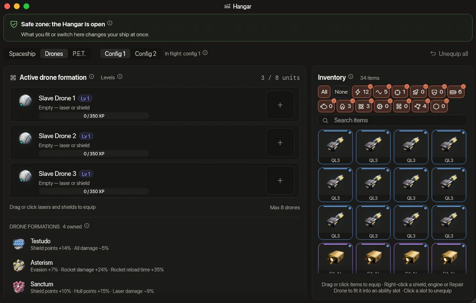

<!-- wiki-i18n source: 9c17f4775a1e2000 -->
<!-- wiki-i18n title: Hangar -->
# O hangar em voo {#the-hangar-in-flight}

Você não precisa voltar à base para trocar de nave. De dentro de uma zona segura, você pode abrir a janela **Hangar** (o botão do armazém na barra de ferramentas, no canto superior esquerdo) e mudar o que está equipado, trocar para a outra configuração ou voar com outra nave sua, sem sair do jogo. A janela é a página Hangar da estação, com os mesmos slots, atributos e inventário, só que numa janela sobre o jogo. Veja [Inventário e equipamento](/wiki/03-Mechanics/Inventory.md) para saber como os itens se encaixam.

## Quando ele está aberto {#when-it-is-open}

Uma mudança só é permitida enquanto todas estas condições forem verdadeiras:

- **Uma zona segura protege você.** Toda estação e todo portal tem um anel protetor (veja [Combate](/wiki/03-Mechanics/Combat.md)). Dentro dele você fica protegido depois de 5 segundos sem ser atingido e 15 sem disparar.
- **Você ficou fora de combate** por mais alguns segundos: **10** por padrão. Isso importa quando você chega já protegido, por um portal, com uma luta para trás.
- Você não está camuflado, nem dentro da janela do seu próprio EMP, nem perto do [buraco negro](/wiki/03-Mechanics/Black-Hole.md), e não tem nenhum foguete seu ainda no ar.

Reparos em andamento não impedem a mudança. Em qualquer outro lugar a janela Hangar ainda abre, mas só para leitura. Uma faixa âmbar diz o motivo e faz a contagem regressiva dos segundos quando se trata de uma espera (“Você estava em combate há pouco. Aguarde 6 s para mudar a nave.”). O servidor também impõe a regra, então nada consegue mudar uma nave em campo.

## O que você pode mudar {#what-you-can-change}

- **Equipar e desequipar qualquer coisa**, em todo tipo de slot: lasers, geradores (escudos, motores, núcleos adaptativos), extras, slots de habilidade e slots de drone, além dos amplificadores, células e propulsores encaixados neles. Arraste os itens para os slots, ou clique neles, exatamente como na estação. Sua nave acompanha na hora: atributos, lasers, habilidades e barra de atalhos.
- **Desequipar tudo.** O botão **Desequipar tudo** da barra de ferramentas do Hangar esvazia de uma vez a configuração mostrada na visão **Nave**: os lasers, escudos, motores, núcleos adaptativos, extras e slots de habilidade **e os lasers e escudos nos slots dos seus drones**, com os amplificadores, células e propulsores encaixados neles. Tudo volta para o seu inventário, tudo ou nada. Seus **drones continuam seus** (um drone nunca é equipado em uma nave, então não há nada a tirar dele) e a **formação de drones** que você usa continua ativa. A outra configuração não é tocada. Em voo valem as regras de qualquer mudança: a partir de uma zona segura, fora de combate. A visão **Drones** tem um botão próprio que esvazia só os slots dos drones.
- **Qualquer uma das duas configurações.** Você pode preparar a configuração 2 enquanto voa com a configuração 1 e depois trocar com a tecla Trocar config. Um botão **Voar com config.** no hangar faz a mesma troca.
- **Qualquer nave.** Ative outra nave e você voa com ela de onde está. O modelo da sua nave muda diante de todos que estão por perto.
- **Um novo escudo, motor ou núcleo adaptativo começa vazio**, como na estação: a carga de escudo da configuração fica vazia até recarregar.
- **Formações de drones.** A tela Drones lista sob os seus drones as formações que você tem. Elas não são equipadas: em voo você arrasta uma da lista de Formações da barra de atalhos para um slot, e o clique ou a tecla desse slot a usa, com a mesma espera de 2 segundos de qualquer lugar, inclusive dentro de uma zona segura ([Formações de drones](/wiki/03-Mechanics/Formations.md)).
- **Extras.** As quatro naves comuns, Protos, Kitefin, Ostirion e Nomad (as com que você começa ou que compra), têm 2 slots extras por configuração; as quatro naves que você fabrica na Montagem, Paragon, Ironclad, Wraith e Storm, têm 3. As Extra Slots CPUs do seu Skylab dão 3, 5 ou 7 a mais: 5, 7 ou 9 nas comuns e 6, 8 ou 10 nas fabricadas ([Extras](/wiki/06-Items/Extras.md#extra-slots-cpus)). Com a 0.4.10, um terceiro extra em uma nave comum foi desequipado e foi para o seu inventário: nada foi apagado, e você recebeu uma mensagem no chat.

Vender não faz parte da janela: o martelo que abre o [Leilão](/wiki/03-Mechanics/Auction.md) pertence ao Hangar da estação, e o próprio Leilão é uma página da estação.

## Trocar de nave {#changing-ship}

A nave para a qual você troca fica com **o casco e os escudos que tinha** na última vez que você voou com ela, exatamente como se você tivesse decolado com ela. O anel não repara, então trocar de nave nunca cura você: a nave que você deixa mantém os danos que tem e volta com eles. Não dá para voar com uma nave destruída até você recuperá-la, o que é de graça e a devolve com no máximo 10.000 de casco e sem escudo, como um reaparecimento.

O que é seu continua sendo seu: a munição, os foguetes e a recarga deles, os tempos de recarga das habilidades, os boosters, o XP e os Slave Drones. O que pertencia à nave termina: um Shield Surge ou um Afterburner em andamento, os reparos, a trava no alvo, o ataque em curso e o rumo que você seguia. O equipamento encaixado continua na nave em que está encaixado.

## Pedidos vindos de outras ferramentas {#requests-from-other-tools}

No servidor, o hangar também só muda a partir de uma zona segura: equipar, desequipar, excluir um item, recuperar uma nave ou ativar uma nave enquanto você voa recebe como resposta “Você só pode mudar a nave dentro de uma zona segura.” A troca de configuração é a exceção e funciona em qualquer lugar (uma vez a cada 5 segundos).
