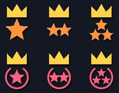

<!-- wiki-i18n source: 809d4bcacb9de9c5 -->
<!-- wiki-i18n title: Patentes -->
# Patentes {#ranks}

Todo piloto tem uma **patente**, de Piloto júnior a Almirante sênior. É uma escada militar de 8 categorias com 3 graus cada, 24 patentes no total. A sua patente vem dos seus **pontos PvE**: os pontos que você ganha pelo seu nível, pela sua experiência e pelos alienígenas que destrói. Cada patente exige um **mínimo** de pontos PvE, e as seis melhores patentes também têm um número fixo de **vagas** em cada corporação. Em voo, o jogo mostra só um pequeno **símbolo** antes do nome de um piloto, para você distinguir de relance os melhores pilotos de uma corporação de um novato, e um piloto de todo o servidor usa uma **coroa** dourada sobre o símbolo. As palavras estão na página Corporação e na dica de um símbolo.

**Em um minuto**

- A sua corporação mantém uma única lista dos seus pilotos, com o piloto de mais pontos PvE primeiro. Cada corporação tem a sua, e os pilotos das outras corporações nunca contam contra você.
- Você tem a **patente mais alta cujo mínimo os seus pontos alcançam e que ainda tem uma vaga livre na sua corporação**.
- As seis melhores patentes têm um número de vagas por corporação: **Almirante sênior 1** (a partir de 50.000 pontos PvE), **Almirante 2** (a partir de 45.000), **Almirante júnior 4** (a partir de 40.000), **General sênior 8** (a partir de 30.000), **General 10** (a partir de 27.500) e **General júnior 15** (a partir de 25.000). As patentes de baixo não têm limite de pilotos, e cada uma pede 2.500 pontos a menos que a de cima, até os 2.500 de Capitão júnior.
- **Mesmos pontos, mesma patente.** Dois pilotos com os mesmos pontos nunca têm patentes diferentes. Quando a última vaga de uma patente cai no meio de um empate, todos os empatados ficam com a melhor patente, mesmo que isso passe do número de vagas.
- Só estão em uma lista os pilotos com pontos PvE que voaram nos últimos 30 dias. Todos os outros são Piloto júnior até voltarem a voar, e não ocupam vaga.
- Uma **coroa** dourada sobre o símbolo marca o piloto com mais pontos PvE de todo o servidor: todas as corporações, os três mundos.
- A sua patente se move. Até Coronel sênior, ela depende só dos seus pontos, então só sobe. As seis melhores patentes também se movem com os outros pilotos da sua corporação: podem cair quando outros ocupam as vagas acima de você. Uma queda nunca é anunciada; uma nova melhor patente é.
- O reset não muda os pontos de ninguém, então as listas não recomeçam do zero.
- O símbolo antes de um nome é a patente: uma forma para a categoria, de uma a três marcas para o grau.

## Como a sua patente é calculada {#the-company-ladder}

Os pilotos da sua corporação, **os três mundos juntos**, ficam em uma única fila, com o piloto de mais pontos PvE primeiro. Essa fila é o **ranking**. Se dois pilotos têm os mesmos pontos, fica na frente o de nível mais alto e depois o piloto mais antigo, mas isso só define a ordem da lista: nunca dá a eles patentes diferentes. A sua patente vem de duas coisas, os seus pontos e as vagas da sua corporação:

1. **Cada patente tem um mínimo** de pontos PvE ([a tabela abaixo](#the-24-ranks)). Um piloto nunca tem uma patente cujo mínimo os pontos dele não alcançaram.
2. **As seis melhores patentes têm vagas.** Elas são preenchidas de cima para baixo, a melhor patente primeiro: os melhores pilotos que alcançam 50.000 pontos ficam com a patente Almirante sênior, até a sua única vaga; dos pilotos que sobram, os melhores que alcançam 45.000 ficam com Almirante, até as suas duas vagas; e assim por diante até General júnior.
3. **Todos os outros têm a patente mais alta que os pontos deles alcançam abaixo dessas seis**, que é Coronel sênior no máximo. Um piloto que alcança o mínimo de uma patente mas encontra as vagas dela cheias cai para a melhor patente que está aberta para ele.
4. **Um empate nunca é desfeito.** Pilotos com os mesmos pontos têm a mesma patente. Se a última vaga de uma patente cai no meio de um empate, o empate inteiro fica com a melhor patente, então uma patente pode ter mais pilotos do que vagas, e nunca menos do que deveria.

**Um exemplo.** Os doze melhores pilotos de uma corporação, com a patente de cada um:

| Posição | Pontos PvE | Patente |
| :---: | ---: | :--- |
| 1 | 60.000 | Almirante sênior |
| 2 | 52.000 | Almirante |
| 3 | 51.000 | Almirante |
| 4 | 50.500 | Almirante júnior |
| 5 | 44.000 | Almirante júnior |
| 6 | 30.000 | General sênior |
| 7 | 29.000 | General |
| 8 | 28.000 | General |
| 9 | 26.000 | General júnior |
| 10 | 24.999 | Coronel sênior |
| 11 | 21.000 | Coronel |
| 12 | 1.000 | Sargento sênior |

A posição 4 tem 50.500 pontos, que alcançam o mínimo de Almirante sênior, mas a única vaga dessa patente e as duas de Almirante estão ocupadas, então ele é Almirante júnior. As posições 7 e 8 têm 29.000 e 28.000: os dois alcançam os 27.500 de General e não os 30.000 de General sênior, e General ainda tem vagas, então os dois são General. O piloto com 24.999 está a um ponto de General júnior e é Coronel sênior, a melhor patente aberta para ele. Se dois pilotos nas primeiras posições tivessem os dois 60.000, ambos seriam Almirante sênior, e os dois seguintes, com 50.000 e 45.000, seriam Almirante.

> [!NOTE]
> As vagas só pesam quando mais pilotos de uma corporação alcançam um mínimo do que a patente tem de vagas. Em uma corporação pequena, a patente é simplesmente a dos pontos: um piloto sozinho na corporação é Coronel com 21.000 pontos PvE e Almirante sênior com 50.000.

## As 24 patentes {#the-24-ranks}

As **vagas** são quantos pilotos de uma mesma corporação podem ter exatamente esta patente; um traço significa sem limite. O **mínimo** é o menor número de pontos PvE que a patente pede.

| # | Patente | Vagas por corporação | Pontos PvE mínimos |
| :---: | :--- | ---: | ---: |
| 1 | Piloto júnior | – | 0 |
| 2 | Piloto | – | 150 |
| 3 | Piloto sênior | – | 350 |
| 4 | Sargento júnior | – | 610 |
| 5 | Sargento | – | 800 |
| 6 | Sargento sênior | – | 1.000 |
| 7 | Tenente júnior | – | 1.300 |
| 8 | Tenente | – | 1.500 |
| 9 | Tenente sênior | – | 1.900 |
| 10 | Capitão júnior | – | 2.500 |
| 11 | Capitão | – | 5.000 |
| 12 | Capitão sênior | – | 7.500 |
| 13 | Major júnior | – | 10.000 |
| 14 | Major | – | 12.500 |
| 15 | Major sênior | – | 15.000 |
| 16 | Coronel júnior | – | 17.500 |
| 17 | Coronel | – | 20.000 |
| 18 | Coronel sênior | – | 22.500 |
| 19 | General júnior | 15 | 25.000 |
| 20 | General | 10 | 27.500 |
| 21 | General sênior | 8 | 30.000 |
| 22 | Almirante júnior | 4 | 40.000 |
| 23 | Almirante | 2 | 45.000 |
| 24 | Almirante sênior | 1 | 50.000 |

## Quem está no ranking {#who-is-on-the-ladder}

Um piloto está no ranking da sua corporação quando **as três** condições são verdadeiras:

- ele está em uma corporação;
- ele tem pontos PvE: o primeiro abate coloca um piloto novo no ranking;
- ele voou nos últimos **30 dias**.

Um piloto que não está no ranking é **Piloto júnior** onde quer que apareça uma patente, não tem vaga e não está na lista da corporação. A regra existe para que um piloto que experimentou o jogo uma vez e foi embora não fique no fundo para sempre, e para que um piloto ausente não possa manter por meses uma das poucas melhores vagas, nem a coroa.

> [!TIP]
> Nada se perde enquanto você está fora. Os seus pontos são mantidos, e quando você decola de novo, ou só abre a página Corporação, você é colocado outra vez com os pontos com que saiu, na patente que esses pontos e as vagas da sua corporação dão então.

Se você trocar de corporação, os seus pontos vão com você e você entra no ranking da nova corporação, com a patente que as vagas dela lhe dão lá.

## A sua patente se move {#your-rank-moves}

- **Até Coronel sênior, são só os seus pontos.** A patente sobe quando os seus pontos alcançam o mínimo seguinte, assim que o seu abate é contado, e nenhum outro piloto pode baixá-la.
- **As seis melhores patentes se movem com os outros pilotos da sua corporação.** Um piloto que alcança um mínimo antes de você ocupa uma das vagas, e quando as vagas da sua patente estão cheias você cai para a próxima patente aberta para você. Quando um piloto sai do ranking ou da corporação, uma vaga se abre e os pilotos atrás dele podem subir para ela.
- Um piloto com os mesmos pontos que você, ou menos, nunca tira uma vaga de você.
- A sua própria patente é comunicada a você quando **sobe**, e só então ([Promoções](#promotions)). Uma queda nunca é anunciada: o seu símbolo simplesmente muda.

## Como ganhar pontos PvE {#how-you-earn-pve-points}

Os seus pontos PvE são calculados a partir de três coisas:

**nível × 100 + experiência ÷ 1.000 (arredondado para baixo) + os pontos de cada alienígena que você destruiu**

Um alienígena mais duro vale mais: um abate dá pontos conforme o dano necessário para destruí-lo. As naves dos enxames e os Guardiões do clã contam pela mesma regra, então um Pirate Scout vale o mesmo que um Bulwark. Cada abate é contado com o nome do próprio alienígena nas suas estatísticas de abates.

| Alienígena ou nave | Pontos PvE por abate |
| :--- | ---: |
| Seeker | 1 |
| Phantasm | 2 |
| Bulwark | 4 |
| Goombah | 7 |
| Crystalys | 16 |
| Boss Seeker | 5 |
| Seeker Slave | 1 |
| Pirate Boss | 15 |
| Pirate Scout | 4 |
| Dormant Force | 25 |
| Dormant Pulse | 11 |
| Slumbering Void | 10 |
| Inert Mass | 15 |
| The Unwakened | 112 |
| Brood Warden I, II, III | 14, 18, 35 |
| Siege Warden I, II, III | 13, 17, 32 |
| Wrath Warden I, II, III | 14, 18, 34 |
| Brood Drone I, II, III | 1, 1, 2 |
| Siege Escort I, II, III | 2, 3, 6 |
| Wrath Guard I, II, III | 2, 3, 6 |

As cinco primeiras linhas são os alienígenas comuns, as seis seguintes as naves dos três enxames e as três seguintes os alienígenas do [Dormant Swamp](/wiki/03-Mechanics/Dormant-Swamp.md) (a partir do dia 11 da temporada). No fim vêm os Guardiões do clã, os líderes de uma luta contra um Guardião, e as suas tripulações, os Brood Drones, Siege Escorts e Wrath Guards: I, II e III são a força do Guardião, e os pontos aparecem nessa ordem.

Por exemplo, um piloto de nível 4 com 12.500 de experiência que destruiu 300 Seekers, 80 Phantasm e 10 Bulwarks tem 400 + 12 + 300 + 160 + 40 = **912** pontos. Isso o torna Sargento: o mínimo é 800, e a patente seguinte, Sargento sênior, pede 1.000. Até Coronel sênior, só os pontos contam.

A página **Rankings** (Comunidade › Rankings) mostra como os seus pontos são compostos, e o **Hall da Fama** dela lista os melhores pilotos. O **(i)** ao lado dos pontos PvE ali cita os cinco alienígenas, quanto vale um abate em cada um dos [enxames](/wiki/05-Swarms/Swarms.md), da menor nave ao chefe, o mesmo para os alienígenas do [Dormant Swamp](/wiki/03-Mechanics/Dormant-Swamp.md), e os [Guardiões do clã](/wiki/03-Mechanics/Clans.md#clan-wardens).

## Os símbolos {#the-symbols}

O jogo desenha uma patente como um pequeno símbolo: uma **forma** para a categoria, em uma cor própria, e **uma, duas ou três marcas** para o grau: uma para um júnior, duas para a patente simples, três para um sênior. As cores vão do frio e discreto ao quente e vivo conforme as categorias sobem.

| Categoria | Forma | Cor |
| :--- | :--- | :--- |
| Piloto | pontos | azul-aço |
| Sargento | divisas, uma sobre a outra | cobre |
| Tenente | barras chatas, uma sobre a outra | prata |
| Capitão | losangos | verde |
| Major | triângulos para cima (flâmulas) | ciano |
| Coronel | anéis vazados | ouro |
| General | estrelas de cinco pontas | laranja |
| Almirante | uma coroa de louros aberta no alto em volta de uma a três estrelas | rosa |

## A coroa {#the-crown}

O piloto com **mais pontos PvE de todo o servidor** usa uma pequena **coroa** dourada sobre o símbolo da sua patente. “Todo o servidor” quer dizer todas as corporações e os três mundos, não só a sua corporação: há uma coroa no servidor, e o melhor piloto de cada corporação continua com a patente da própria. Se vários pilotos têm exatamente os mesmos pontos no topo, todos a usam.

Só um piloto que está em um ranking pode usá-la. Um piloto que ficou 30 dias fora não a usa, por mais pontos que tenha: a coroa vai para o melhor piloto que está em um ranking, e ele a recupera quando voltar a voar e estiver na frente. Ninguém é avisado quando a coroa muda de dono, ela se vê. Não é uma patente e não dá nada: passe o ponteiro sobre um símbolo coroado e a dica dele diz “Melhor piloto PvE do servidor”.

## Onde você os vê {#where-you-see-them}

Em voo, você vê **só o símbolo**, nunca as palavras. Ele fica antes do nome do piloto, com a coroa sobre ele, em todos estes lugares:

- sobre uma nave, na etiqueta de nome, e na janela do alvo;
- no chat, antes do nome do piloto que escreveu a linha;
- na lista do seu grupo e na dica de um colega de grupo no minimapa;
- no registro de baixas, antes de cada piloto citado (não antes dos alienígenas);
- no Hall da Fama, na janela de ranking e, grande, no perfil de um piloto;
- na página Corporação: a sua própria patente, a lista dos melhores pilotos e a tabela de todas as patentes.

As **palavras** (Sargento júnior, Capitão …) estão na página Corporação e em uma dica: apoie o ponteiro sobre um símbolo. Um símbolo mostra onde um piloto está entre os pilotos da **própria corporação**: o Major de outra corporação é um Major entre os dele, não entre os seus. Os [pilotos de corporação](/wiki/03-Mechanics/Company-Pilots.md) são os esquadrões do próprio jogo e não têm patente.

## O ranking da corporação {#the-company-ranking}

Abra **Economia › Corporação**. A seção **Ranking da corporação** mostra, de cima para baixo:

- **A sua patente**: o símbolo (com a coroa, se for sua) e o nome, a sua posição (“Posição 16 de 31”) e uma pequena etiqueta com o seu percentil (“Top 52%”).
- **Uma barra e uma linha embaixo** que dizem o que a próxima patente pede. Uma linha como “2.500 pontos PvE para General júnior” diz quantos pontos PvE a mais o mínimo da próxima patente pede. Quando a próxima patente não tem vaga livre, a linha nomeia o piloto que tem a última: “3.100 pontos PvE para ultrapassar Sable e chegar a General júnior”. Igualar os pontos dele basta, porque pontos iguais têm a mesma patente. Para Almirante sênior, a linha diz “A patente mais alta.”
- **O melhor piloto** da sua corporação, com os pontos dele.
- **Todas as patentes**, fechado até você abrir: as 24 patentes, a melhor primeiro, com as **Vagas** por corporação (um traço: sem limite), os **Pilotos** que a têm agora, com uma barra tão larga quanto a patente que tem mais deles, e os **Mín. pontos**. A sua própria patente é marcada, e uma dica em uma linha diz: “Almirante sênior: 1 vaga por corporação, a partir de 50.000 pontos PvE.” Uma linha sob a tabela diz quem está no ranking.
- **A lista**: os **50 melhores pilotos da sua corporação nos três mundos**, com posição, símbolo, nome e pontos PvE. A sua própria linha é marcada.

- Um piloto sem pontos PvE ainda não está no ranking nem na lista: destrua um alienígena para entrar. Um piloto ausente há 30 dias também não está, até decolar de novo ou abrir a página.
- Só nomes e números públicos são mostrados.

## Promoções {#promotions}

- Quando você chega a uma nova melhor patente, recebe um aviso («Promoção: Sargento sênior») e um som curto e discreto. «Melhor» quer dizer a melhor patente de que você foi avisado desde a última vez que decolou: se você perde um grau e o recupera, não há segunda mensagem. Uma patente que você ganhou enquanto estava fora é avisada uma vez, no seu próximo login. Uma queda nunca é avisada.
- A partir de **Major júnior**, uma promoção também aparece na aba **Sistema** do chat para os pilotos da sua corporação que voam no seu mundo: «Nova foi promovido a Major júnior.» A corporação só fica sabendo quando os seus próprios pontos PvE levaram você para cima; se você subiu porque outros pilotos saíram do ranking, você recebe o seu aviso e mais ninguém é avisado.

## Patentes e o reset {#ranks-and-the-wipe}

Um reset não muda os pontos de ninguém. Ele mantém o seu nível, a sua experiência e as suas estatísticas de abates ([Linha do tempo do reset](/wiki/03-Mechanics/Wipe-Timeline.md#cross-season-progression-permanent-buffs-)), e os seus pontos PvE são calculados a partir deles, então o ranking da sua corporação fica na mesma ordem depois do reset, e as patentes e a coroa também. A sua patente já não é para a vida toda, porém: as seis melhores patentes se movem com os outros pilotos da sua corporação, e um piloto que fica 30 dias fora sai do ranking até voltar a voar.

## Quanto tempo leva {#how-long-it-takes}

Estas são **estimativas** de um modelo de quão rápido um piloto caça, não medições. Um piloto que caça cerca de duas horas por dia, 58 horas em uma temporada, tem cerca de 21.200 pontos PvE depois de uma temporada: Coronel. Em horas de caça, o mínimo de Piloto chega dentro da primeira hora, o de Sargento em 4, o de Capitão em 18, o de Major em 38, o de Coronel em 55, o de General júnior em 67, o de General em 73, o de General sênior em 78, o de Almirante júnior em 101, o de Almirante em 113 e o de Almirante sênior em 124.

Assim, um piloto ativo típico alcança as patentes com vagas na sua segunda temporada. Conseguir uma vaga depende dos outros pilotos da sua corporação, que também caçam: as vagas de uma patente só pesam quando mais pilotos alcançam o mínimo dela do que ela tem de vagas. Até lá, a patente é simplesmente a dos seus pontos.
