<!-- wiki-i18n source: 129abc8d9ddf80be -->
<!-- wiki-i18n title: Путешествие по карте -->
# Путешествие по космической карте {#spacemap-travel}

Космическая карта — ваш навигационный интерфейс для перемещения по вселенной SpaceCorps. Каждая корпорация контролирует свой участок космоса; участки выстроены в определённую топологию, которая позволяет и безопасно исследовать пространство, и вступать в опасные PvP-столкновения.

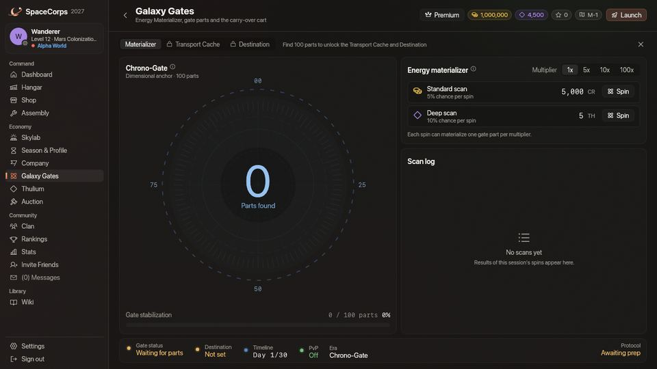
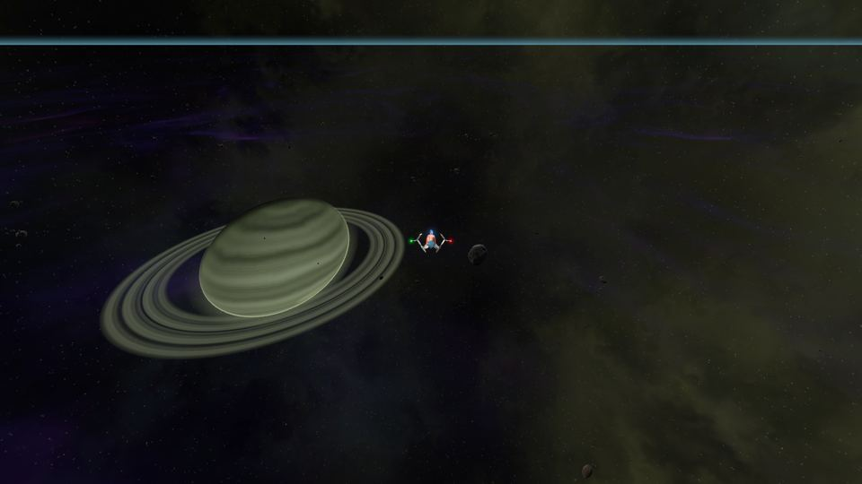
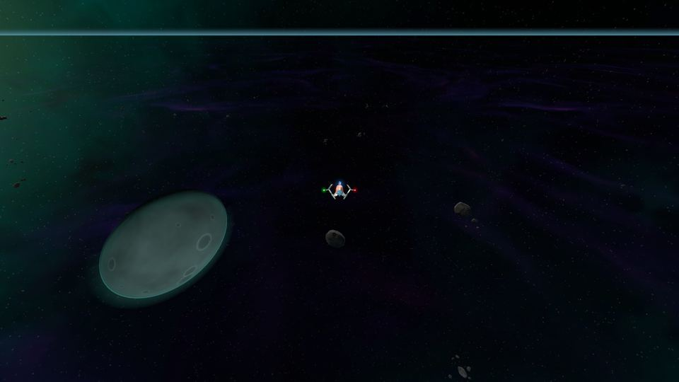
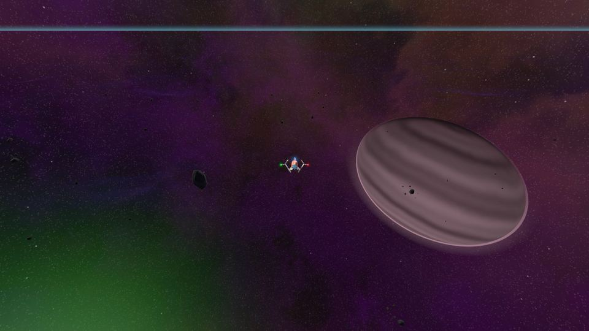
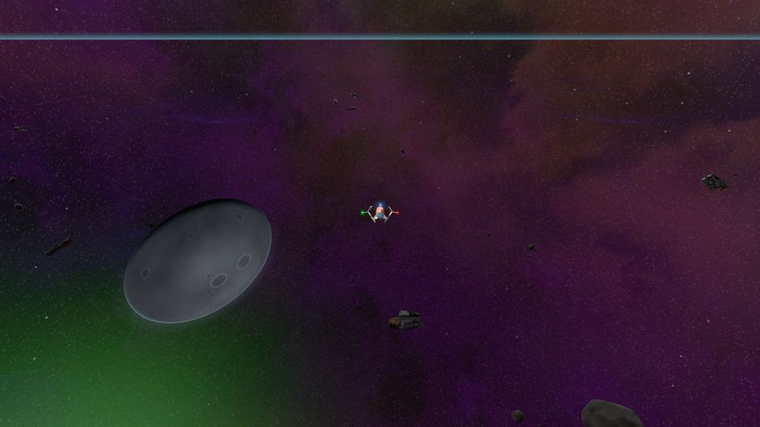
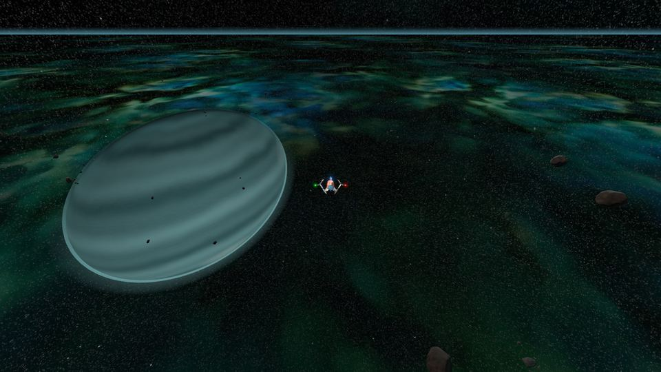
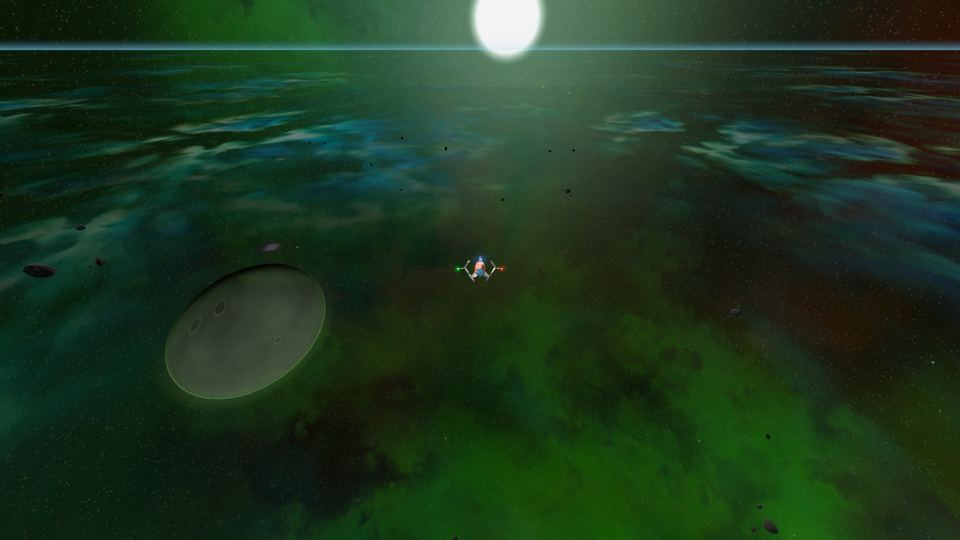
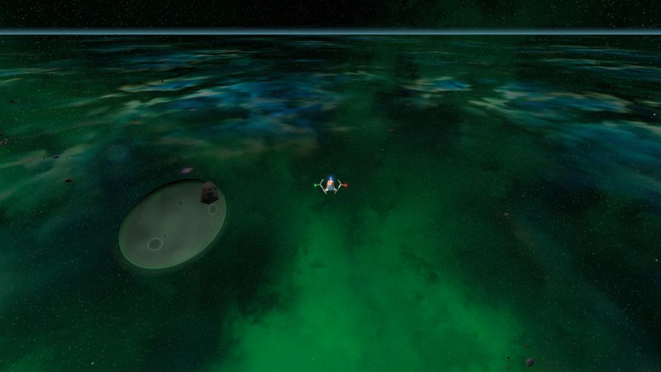
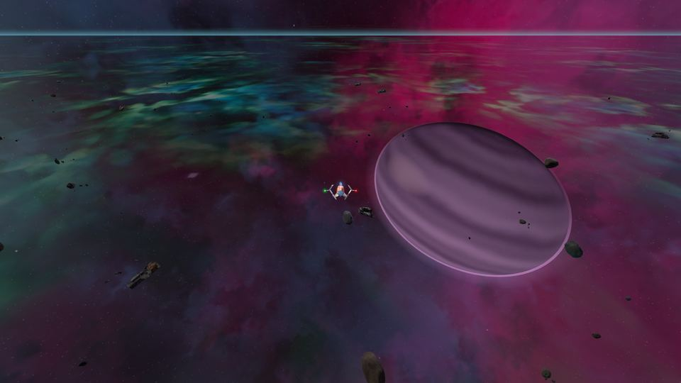
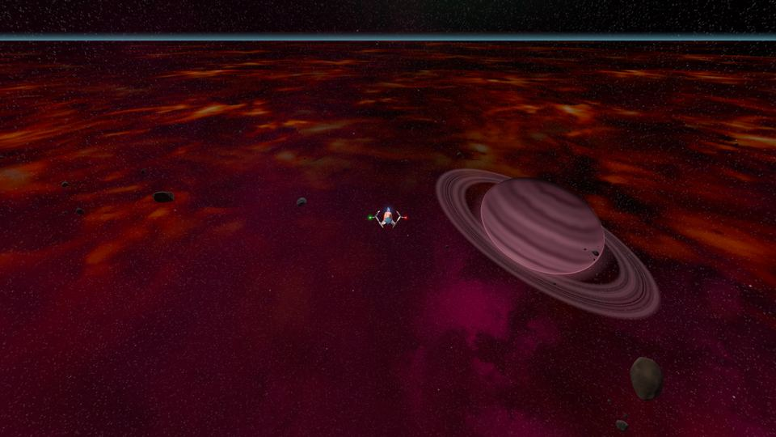
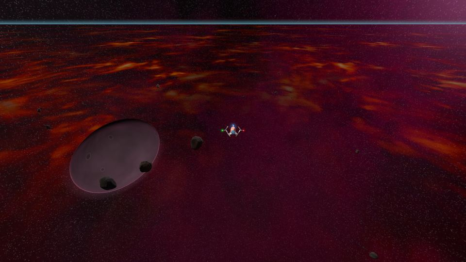
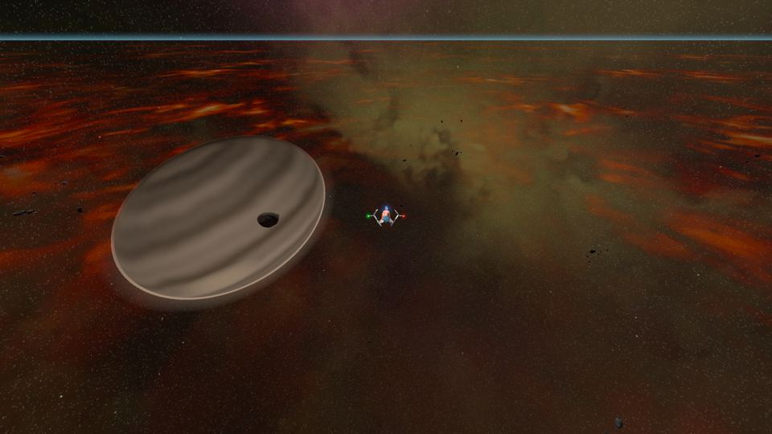
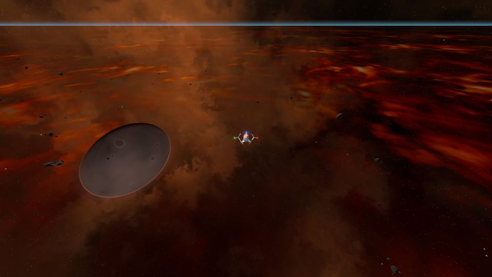
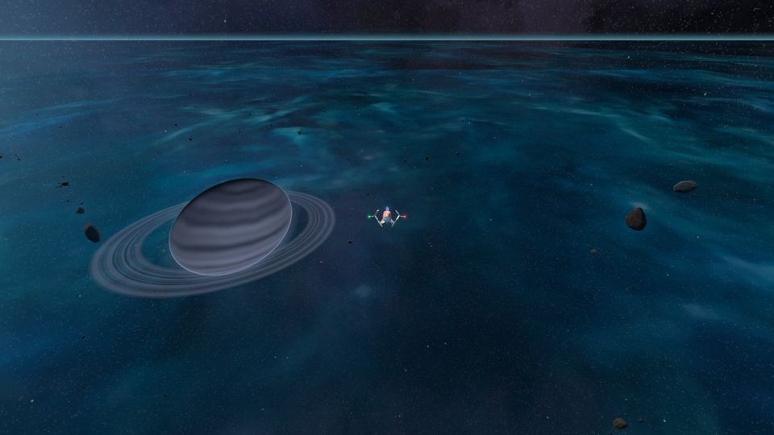
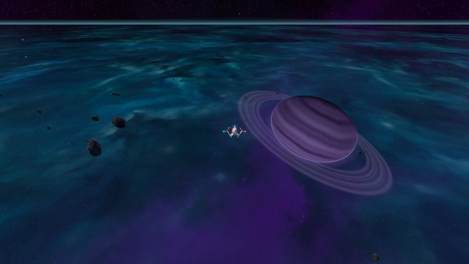
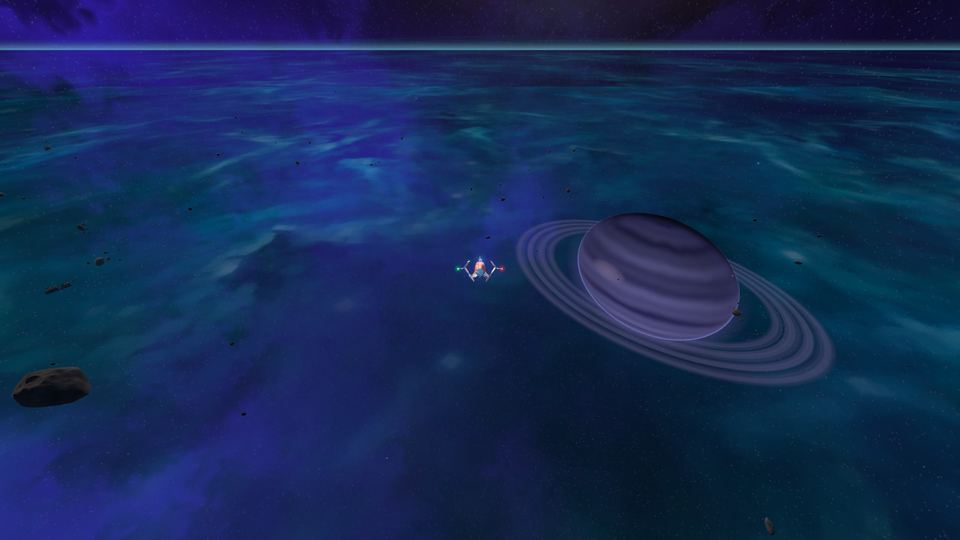
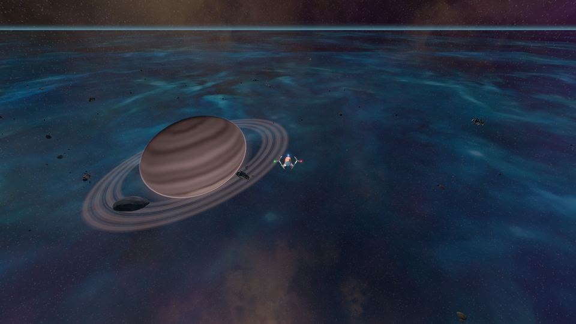
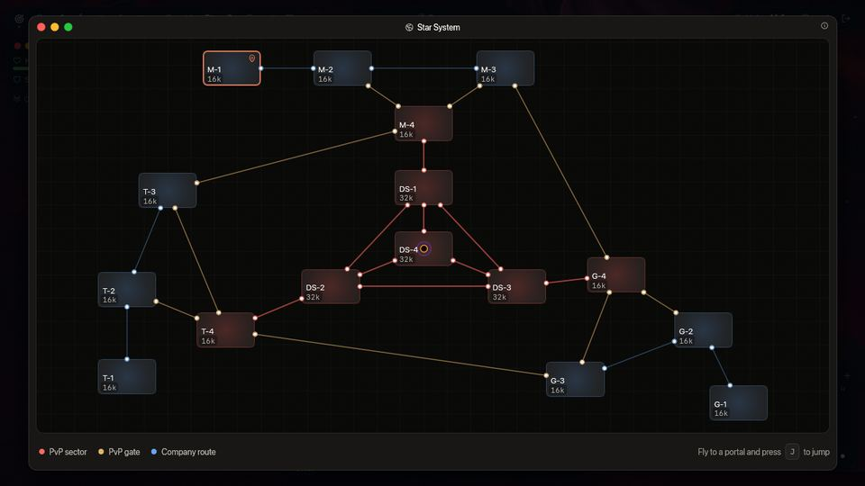

## Устройство вселенной {#the-universe-structure}

Вселенная состоит из трёх основных секторов корпораций (Mars, Terra, Galactic) и центральной PvP-зоны.

- **x-1 (домашняя база)**: стартовая карта каждой корпорации (M-1, T-1, G-1). Самая безопасная зона.
- **x-2 -> x-3**: зоны расширения со всё более сильными пришельцами.
- **x-4 (граница)**: врата в PvP-сектор и в `x-3` другой корпорации (Кольцо, ниже).
- **DS-x (Опасные секторы)**: центральная PvP-зона, соединяющая все корпорации: от DS-1 до DS-4. С первого дня сезона в каждом из DS-1–DS-3 есть пульсар, а с 11-го дня сезона рядом с ним также гигантский экскаватор, и есть Dormant Swamp ([Опасные секторы](/wiki/01-General/Danger-Sectors.md)).

Станция есть только на домашних базах. Именно у неё открывается **Mission Control**, а её безопасная зона простирается на 1 600 единиц вокруг. В Опасных секторах станций нет, и `DS-1` не исключение: единственные безопасные зоны там — кольца радиусом 660 единиц вокруг прыжковых врат, а Mission Control там открыть нельзя; за миссиями летите обратно на свою базу.

У каждого [мира](/wiki/03-Mechanics/Wipe-Timeline.md#worlds-alpha-beta-and-gamma) (Alpha, Beta, Gamma) есть своя копия всей этой карты, и от неё зависит, где пилоты могут сражаться друг с другом: в Alpha только в `x-4` и `DS-x`, в Beta везде, кроме `x-1`, в Gamma везде. Карта галактики окрашивает секторы по правилу вашего мира.

## Визуализация {#visualization}

Карта галактики ниже показывает в реальном времени устройство известной вселенной. В игре эта же карта — окно «Звёздная система».

```spacemap

```

Если установлен [Jump CPU](/wiki/06-Items/Extras.md#jump-cpu), карта ещё и выбирает пункт назначения: нажмите слот CPU на панели (**JMP**), и окно «Звёздная система» откроется в режиме выбора. Секторы, куда CPU может вас доставить, подсвечены; ваш собственный сектор и Опасные секторы — нет. Наведите курсор на подсвеченный сектор, чтобы прочитать цену, щёлкните по нему и подтвердите прыжок, когда карта спросит (500 Thulium).

## Как путешествовать {#how-to-travel}

Перемещение по космической карте происходит через **прыжковые врата** (порталы). [Jump CPU](/wiki/06-Items/Extras.md#jump-cpu) — другой путь: ему врата не нужны (см. конец страницы).

1. **Найдите портал**: порталы обычно находятся в углах или у краёв карты.
2. **Навигация**: подлетите на корабле близко к конструкции портала.
3. **Активация**: нажмите **«J»** в пределах 500 единиц от портала, чтобы начать прыжок.
4. **Подождите**: прыжок **занимает 3 секунды**. Всё это время над вашей панелью заполняется полоса («Прыжок…»), а портал светится всё ярче, набирая заряд; другие пилоты видят такой же заряд на портале, когда вы прыгаете. Ваш корабль продолжает лететь, но вы должны оставаться в пределах 500 единиц от портала, пока время не выйдет: вылетите за пределы зоны, и прыжок будет отменён («Портал слишком далеко для прыжка.», а полоса станет красной). Повторное нажатие **«J»** во время прыжка ничего не делает, а лишь сообщает, что прыжок уже идёт.
5. **Пункт назначения**: вы окажетесь у соответствующего портала на целевой карте.

### Прыжок под огнём {#jumping-under-fire}

- **Вне Опасных секторов** атака, будь то пришельцев или других пилотов, **не** прерывает ваш прыжок: он завершается.
- **В Опасных секторах (от `DS-1` до `DS-4`)** нельзя совершить прыжок, пока вас атакуют. Если пилот или пришелец попал по вашему кораблю (по щиту или корпусу) за последние **10 секунд**, прыжок не начнётся («Вас атакуют: из опасного сектора нельзя совершить прыжок.»), а попадание во время прыжка отменяет его (полоса становится красной, и игра сообщает причину). Урон от радиации чёрной дыры не считается атакой, как и выстрел, остановленный безопасной зоной. Попадание, полученное на карте, с которой вы прыгнули, не переходит с вами через портал: вы прибываете с чистого листа.
- Вы делаете одно дело за раз: нельзя подбирать [грузовой контейнер](/wiki/03-Mechanics/Cargo.md) во время прыжка, а начало прыжка отменяет уже начатый подбор.
- Закрытие игры или возвращение на базу посреди прыжка отменяет его: вы не прибываете.
- **Телепортация CPU заряжается, как прыжок через портал.** Jump CPU заряжается 5 секунд, Base CPU — 10, а над панелью появляется полоса. Ваш выстрел или полученное попадание в любом секторе отменяет телепортацию (ничего не списывается и не расходуется), а в течение 10 секунд после выстрела или попадания ни один из двух CPU не запускается. Нажмите слот CPU ещё раз, чтобы отменить её самостоятельно.

### Переходы между секторами {#jump-links}

- **Петля корпорации**: у Mars, Terra и Galactic одинаковая схема. Связи идут так: `1 <-> 2 <-> 3`, `2 <-> 4` и `3 <-> 4`. Это образует петлю между второстепенными картами (`x-2` и `x-3`) и пограничной картой (`x-4`), а `x-1` служит защищённым «хвостом» входа, соединённым только с `x-2`: на вашей стартовой карте всего один портал.
- **Врата в Опасные секторы**: пограничная карта каждой корпорации (`x-4`) напрямую соединена с её собственным Опасным сектором:
  - `M-4` соединён с `DS-1`
  - `T-4` соединён с `DS-2`
  - `G-4` соединён с `DS-3`
- **Кольцо**: у пограничной карты каждой корпорации (`x-4`) есть ещё одни врата, в `x-3` **следующей корпорации**, а у каждого `x-3` есть врата обратно. Три связи образуют кольцо вокруг Опасных секторов, так что у каждой корпорации есть один путь наружу и один внутрь:
  - `M-4` соединён с `T-3` корпорации Terra
  - `T-4` соединён с `G-3` корпорации Galactic
  - `G-4` соединён с `M-3` корпорации Mars

  Кольцо открыто для всех пилотов, за какую бы корпорацию они ни летали: это второй путь между картами корпораций, не пересекающий PvP-зону. Врата Кольца стоят в собственном углу, вдали от остальных врат своей карты, с обычной безопасной зоной радиусом 660 единиц вокруг, а прыжок работает так же, как у любых врат. Где вас могут атаковать на другой стороне, зависит от вашего мира, как и везде: в Alpha `T-3` не PvP-сектор, а `T-4` — PvP-сектор, в Beta оба являются PvP-секторами, в Gamma — каждый сектор.
- **Пути вторжения (перемещение между корпорациями)**: на территорию другой корпорации через врата ведут два пути. Короткий — Кольцо: пилот Mars вылетает из `M-4` и через врата Кольца попадает в `T-3` корпорации Terra (три прыжка от базы Mars, `M-1` → `M-2` → `M-4` → `T-3`), а оттуда летит дальше к `T-4` или `T-2`; `G-4` корпорации Galactic точно так же ведёт в `M-3` корпорации Mars, а `T-4` корпорации Terra — в `G-3` корпорации Galactic. Длинный путь проходит через PvP-зону: из `M-4` в Опасный сектор `DS-1`, через прыжковые врата в `DS-2`, а затем в пространство Terra через `T-4`; чтобы попасть к Galactic, нужно пройти через прыжковые врата в `DS-3` и войти через `G-4`.
- **Треугольник Опасных секторов**: `DS-1`, `DS-2` и `DS-3` соединены друг с другом. В каждом из них есть врата одной корпорации (Mars в `DS-1`, Terra в `DS-2`, Galactic в `DS-3`); в `DS-4` их нет.
- **Центральное ядро**: все три внешних Опасных сектора (`DS-1`, `DS-2` и `DS-3`) напрямую соединены с центральной картой **`DS-4`** — самой опасной и самой выгодной PvP-зоной во вселенной. Ровно посередине висит **чёрная дыра**: порталы и трассы между ними проходят далеко от неё, но корабль, который влетает в её зону, чувствует сперва радиацию, затем притяжение и уничтожается на горизонте событий. См. [Чёрная дыра](/wiki/03-Mechanics/Black-Hole.md). С 11-го дня сезона в левом верхнем углу `DS-4` находится [Dormant Swamp](/wiki/03-Mechanics/Dormant-Swamp.md), чьи орудия стреляют по каждому видимому кораблю.

### Jump CPU {#the-jump-cpu}

[Jump CPU](/wiki/06-Items/Extras.md#jump-cpu) переносит ваш корабль в любой корпоративный сектор вашего мира без врат, за 500 Thulium за прыжок, включая домашние секторы врагов. Он никогда не ведёт в Опасный сектор, не запускается в бою, и сначала его нужно исследовать в Исследовательском центре Skylab ([Исследования](/wiki/03-Mechanics/Research.md)). [Base CPU](/wiki/06-Items/Extras.md#base-cpus) возвращают вас на базу таким же образом. Варп-CPU, то есть Jump CPU или Base CPU, нельзя использовать, пока вы везёте предмет миссии («Нельзя использовать варп-CPU, пока на борту предмет миссии.»): возвращайтесь домой через врата ([Предметы миссий](/wiki/03-Mechanics/Quests.md#quest-items)).
