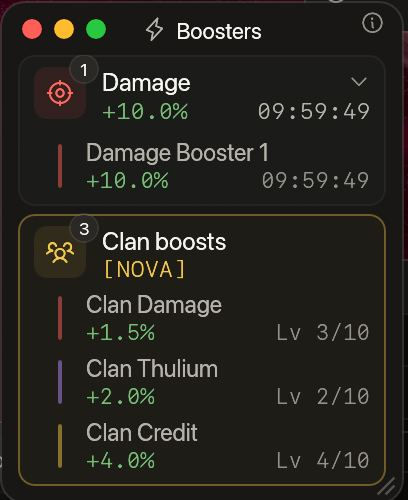
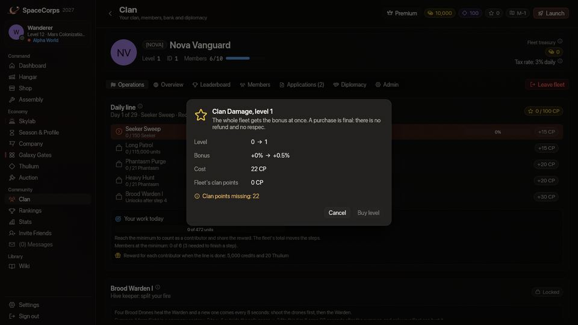
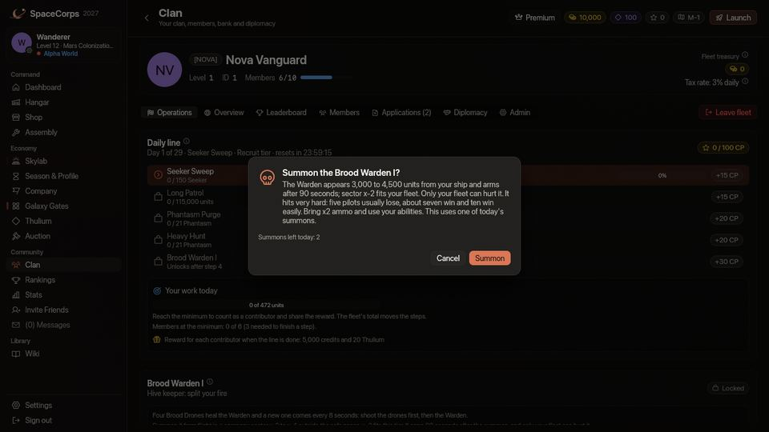

<!-- wiki-i18n source: e67774df0345c0b5 -->
<!-- wiki-i18n title: Кланы -->
# Кланы {#clans}

Создав клан или вступив в него, вы можете объединять ресурсы, улучшать общий банк, устанавливать налоговые ставки, согласовывать действия с членами фракции и вести дипломатию. У клана есть и общее дело: каждый день он получает **ежедневную линию** из миссий, которая заканчивается боссом, ранить которого может только клан, а заработанные очки покупают **постоянные усиления** для каждого участника. (На странице «Клан» игры клан называется *флотом*, а его очки и усиления — очками клана и усилениями клана.) **Клан принадлежит одному миру и уходит вместе с вайпом:** вступать можно только в кланы своего мира, а при каждом вайпе все кланы распускаются ([Кланы и миры](#clans-and-worlds)).

**За одну минуту**

- У каждого клана есть **страница клана**, которую может открыть любой пилот его мира: уровень, пилоты, глава, описание, ссылка на Discord, требования, суммарные очки и усиления ([Страница клана](#the-clan-page)). Глава и заместители настраивают её в разделе **Управление** ([Управление](#management)).
- У клана есть **мир** (мир основателя), он принимает только пилотов этого мира, и **вайп распускает его вместе с казной**: выплатите Казну клана до конца обратного отсчёта ([вайп](#the-wipe-disbands-every-clan)).
- Глава и заместители пишут [объявления](#clan-posts) для всего клана, каждый участник видит, [на какой карте](#where-your-clan-mates-are) летают остальные, окно [Кто в сети](#who-is-online) (клавиша **H**) приглашает в вашу группу любого пилота вашего мира, глава может платить [ежедневный бонус](#4-daily-bonus) из Казны клана, а вкладка [Журнал](#fleet-log) рассказывает клану, что в нём происходило.
- Война заканчивается только с согласия другого клана, а альянс или пакт заканчивается сразу, как только один из двух кланов его расторгает ([Дипломатия](#diplomacy)).
- Каждый день сезона ваш клан получает [ежедневную линию](#daily-line): четыре миссии, которые нужно выполнить по порядку (убивать пришельцев, пролететь расстояние, в некоторые дни победить боссов роёв), а затем [Стража клана](#clan-wardens) — босса, которого вы призываете и которого может ранить только ваш клан.
- Каждый выполненный шаг сразу приносит очки клана: 15, 15, 20, 20 и 30, то есть **100 очков** за всю линию.
- Глава и заместители тратят очки на три [усиления](#clan-points-and-boosts) по десять уровней: **Урон** (до +5%), **Thulium** (до +10%) и **Кредиты** (до +10%).
- Клан, выполняющий каждую линию, покупает все уровни на **12-й день сезона**. Очки, уровни и сам клан заканчиваются с вайпом.
- Нужно не меньше **трёх участников**, выполнивших свою часть, и **большой экипаж** для боя со Стражем: с 0.4.13 у Стража в пять раз больше корпуса, щита и лазерного урона, чем было, поэтому экипажи, которые раньше побеждали (около семи пилотов), теперь проигрывают ([какой нужен экипаж](#how-big-a-crew)). Слишком маленький экипаж проигрывает бой: тогда клан сохраняет **70 очков** четырёх миссий, но линия не выполнена и [вашу награду](#the-reward-for-you) не платит.
- Страж платит большой банк, который делится по урону, и **каждый пилот, нанёсший 5% урона или больше, получает личный ящик** со своей долей добычи, который видит и может подобрать только он ([награда и добыча](#warden-pay-and-loot)). С 0.4.16 награда втрое больше, а пока Страж стоит, **каждую минуту приходит волна пришельцев этой карты** ([волны](#waves-of-aliens)).
- Ваш корабль показывает свои усиления в окне «Бустеры», на отдельной карточке ([где их видно](#the-three-boosts)).
- Для линии и усилений нужна игра версии 0.4.10 или новее, для карточки в окне «Бустеры» — 0.4.12 или новее, для страницы клана, объявлений, окна «В сети», ежедневного бонуса, просьб о мире, журнала и кланов по мирам — 0.4.16 или новее.

## Кланы и миры {#clans-and-worlds}

### Один клан — один мир {#one-clan-one-world}

Клан принадлежит одному **миру** — Alpha, Beta или Gamma ([Миры](/wiki/03-Mechanics/Wipe-Timeline.md#worlds-alpha-beta-and-gamma)): миру пилота, который его основал. Основать клан ничего не стоит, но сначала нужно выбрать свой мир.

- **Вступать можно только в клан своего мира.** Нельзя подать заявку в клан другого мира, вступить в него, получить от него приглашение или заключить с ним альянс, и игра объясняет причину, когда вы пробуете. Пилота другого мира тоже нельзя ни пригласить, ни принять.
- **Вы видите только кланы своего мира.** Реестр кланов и оба рейтинга (PvE и PvP) показывают только их, а страница клана из другого мира не открывается. Названия и теги кланов уникальны во всех трёх мирах: имя, занятое в Gamma, не свободно и в Alpha до вайпа.
- **Альянсы, пакты и войны бывают только между кланами одного мира.** Те, что были заключены между мирами до 0.4.16, остаются в силе, пока их не расторгнут, а такую войну по-прежнему можно закончить по согласию сторон ([Дипломатия](#diplomacy)).
- **Уже существовавшие кланы** получили мир своего главы. Участник другого мира, который уже был внутри, остаётся до вайпа или пока не уйдёт; снова принять его нельзя.

### Вайп распускает все кланы {#the-wipe-disbands-every-clan}

При [вайпе](/wiki/03-Mechanics/Wipe-Timeline.md) распускаются все кланы, во всех трёх мирах. Вместе с ними исчезают: участники, **Казна клана**, заявки и приглашения, альянсы, пакты и войны, объявления, журнал, требования, описание и ссылка на Discord, ежедневный бонус, очки клана и уровни усилений, а также линия дня. Название и тег клана снова свободны, а новый клан начинает с 1-го уровня.

- **Вы сохраняете** все кредиты, которые клан уже вам выплатил (выплаты, ежедневные бонусы, награды линии), и свой лимит взносов, который вайп не обнуляет ([Взносы](#2-donations)).
- **Вы теряете** клан и **всё, что ещё лежит в его Казне клана**, если глава или заместитель не выплатили это пилотам до вайпа ([Выплаты из банка](#3-bank-payouts)).
- **Обратный отсчёт предупреждает кланы.** С первым оповещением, за 5 минут до вайпа, каждый пилот, состоящий в клане, получает строку и уведомление: вайп распускает все кланы, их казна пропадает, а главам и заместителям нужно сейчас выплатить Казну клана своим пилотам. Карточка «Казна клана» в разделе «Управление» говорит то же самое.

---

## Страница клана {#the-clan-page}

У каждого клана есть страница, которую **может открыть любой пилот его мира**, состоит он в клане или нет. Щёлкните по названию клана в **реестре кланов** (Сообщество › Клан, пока вы не в клане), в одном из двух **рейтингов** или в **профиле пилота**; кнопка **Предпросмотр страницы клана** в разделе «Управление» показывает ваш клан так, как его видит пилот со стороны. На странице видно:

- **Клан**: название и тег, уровень, сколько пилотов в нём сейчас и сколько вмещает его уровень («Уровень 2 · 14/25 пилотов»), главу (щёлкните по имени, чтобы открыть его профиль), мир клана, как вступают пилоты (Открытый, По заявкам или По приглашениям), **описание** (до 200 символов, пишет глава или заместитель) и **ссылку на Discord** с кнопкой **Открыть Discord**. Принимаются только ссылки `discord.gg` и `discord.com/invite`, и игра больше ничего не открывает.
- **Суммарные очки**: очки опыта, чести, рейтинга PvE и рейтинга PvP всех пилотов, которые сейчас в клане, сложенные вместе.
- **Требования** ([ниже](#requirements)), с галочкой или крестиком для того, что вы выполняете.
- **Бустеры клана**: усиления, которые клан купил, и сколько дней они действуют, до вайпа.
- **Подать заявку** или **Вступить**, как в реестре кланов. Кнопка серая, с указанием причины, если клан полон или вам не хватает требования.

Страница никогда не показывает список участников, казны, заявки и очки клана: это только для участников самого клана.

### Требования {#requirements}

Глава и заместители могут потребовать от желающего вступить две вещи:

- **Минимальный уровень** — от 1 (без требования) до 21.
- **Минимальное звание**: ступень корпоративных званий, от **Пилота** (без требования) до **Адмирала**: Пилот, Сержант, Лейтенант, Капитан, Майор, Полковник, Генерал, Адмирал ([Звания](/wiki/03-Mechanics/Ranks.md)). Ступень считается с её низшей степени: клан, который требует Капитана, принимает Младшего капитана и всех пилотов выше. Это звание, которое вы сейчас имеете в рейтинге своей корпорации, а не мир, в котором вы летаете.

Их проверяют, когда пилот **подаёт заявку или вступает**. **Приглашение** офицера их пропускает, как и заявка, которую принял офицер. Реестр кланов показывает их маленькими капсулами под названием клана, красной — ту, которую вы не выполняете; клан, который ничего не задал, ничего не требует.

---

## Развитие клана {#clan-progression}

Кланы начинают с 1-го уровня и могут подняться до 5-го. Для улучшения клана нужно заплатить кредиты из **банка клана** (в игре он называется **Казной клана**). Улучшения увеличивают вместимость и дневные лимиты выплат; усиления клана покупаются за очки клана, а не за уровни.

| Класс клана | Лимит участников | Дневной лимит выплат (на участника) | Стоимость улучшения (кредиты) |
| :---: | :---: | :---: | :--- |
| **Класс 1** | 15 | 1 000 000 кр. | — |
| **Класс 2** | 25 | 2 000 000 кр. | 10 000 000 кр. |
| **Класс 3** | 50 | 3 000 000 кр. | 100 000 000 кр. |
| **Класс 4** | 75 | 4 000 000 кр. | 1 000 000 000 кр. |
| **Класс 5** | 100 | 5 000 000 кр. | 10 000 000 000 кр. |

---

## Управление {#management}

Вкладка **Управление** в окне клана (до 0.4.16 она называлась «Админ») предназначена для главы и заместителей; остальные участники видят замок. Её карточки сверху вниз:

- **Правила набора**: как пилоты вступают. **Открытый** сразу принимает каждого пилота, выполняющего требования, **По заявкам** оставляет решение о каждой заявке офицеру, **По приглашениям** не принимает никого, кого не приглашали.
- **Налоговые настройки**: ежедневная ставка налога, от 0% до 5% ([Ежедневный налог](#1-daily-taxation)).
- **Требования к заявкам**: минимальный уровень и минимальное звание ([Требования](#requirements)).
- **Страница клана**: описание (200 символов) и ссылка на Discord, которые читают пилоты вне клана, и кнопка **Предпросмотр страницы клана** ([Страница клана](#the-clan-page)). Участники клана читают ссылку в Обзоре.
- **Казна клана**: кредиты от взносов и ежедневного налога, с напоминанием, что вайп распускает клан и казна пропадает.
- **Казна Thulium**: второй кошелёк, который показан рядом с Казной клана в шапке окна клана. Он пуст, и ничто не поступает в него и не уходит из него: он оставлен для будущего обновления.
- **Развитие клана** и **Улучшения**: пять уровней с числом пилотов, которое вмещает каждый, наибольшей суммой, которую участник может получить за день, и ценой, а также кнопка улучшения главы. Улучшает клан только глава.
- **Ежедневный бонус**: сумма главы для каждой роли ([Ежедневный бонус](#4-daily-bonus)).

---

## Экономика клана и налоги {#clan-economy-taxation}

Финансы клана построены на налогах:

### 1. Ежедневный налог {#1-daily-taxation}

- **Ставка налога**: глава или заместители могут установить ежедневную ставку налога от **0% до 5%**.
- **Автоматический сбор**: раз в сутки (по UTC) сервер автоматически взимает налог со всех участников клана.
- **Формула**: налог равен доле `ClanTaxRate` от текущего баланса кредитов каждого участника.
  - *Пример*: если у вас 10 000 000 кредитов, а налог клана равен 2%, с вашего счёта будет списано 200 000 кредитов, и они попадут в банк клана.
  - Можно также вносить кредиты добровольно, в пределах лимита из следующего раздела.

### 2. Взносы {#2-donations}

- **Взнос**: любой участник может отправить кредиты в банк клана на странице клана. Окно показывает, сколько ещё можно отправить.
- **Лимит взносов**: пилот может отправить в кланы не более **1 000 000 кредитов за любые 24 часа**, считая по всем кланам, в которых он состоял. Выход из клана и вступление в другой не дают нового лимита.
- **Без ежедневного сброса**: 24 часа скользят. Каждый взнос перестаёт учитываться ровно через 24 часа после того, как был внесён, а окно показывает, когда это произойдёт с самым ранним взносом и сколько вернётся. Взнос, превышающий остаток, отклоняется целиком.
- Ежедневный налог не считается взносом и не расходует ваш лимит.

### 3. Выплаты из банка {#3-bank-payouts}

- **Лимиты выплат**: глава клана и офицеры могут распределять кредиты из банка клана между отдельными участниками.
- **Дневной лимит**: участник не может получить в выплатах больше `1,000,000 * ClanLevel` кредитов за один календарный день (по UTC).

### 4. Ежедневный бонус {#4-daily-bonus}

Глава может раз в день платить каждому участнику фиксированный бонус из Казны клана.

- **Как задать.** На карточке **Ежедневный бонус** в разделе «Управление» глава вводит сумму для каждой роли: Пилот, Старейшина, Заместитель и Глава. **0 отключает роль**; любая другая сумма — от **1 000 до 1 000 000 кредитов**. Заместители видят карточку, но не могут её менять. Сохранение ничего не забирает из казны. Карточка показывает, сколько стоил бы целый день, если бы играли все пилоты, и на сколько дней хватило бы казны.
- **Выплата.** Участнику платят **один раз за день сезона**, при его первой проверке в этот день: когда он подключается, когда день сменяется, пока он в сети, и когда глава сохраняет новые суммы. День сезона — это 24 часа линии клана, а не полночь по UTC ([День](#the-day)). Пилот получает строку «Система» и строку в Журнале игры, а Обзор показывает «Ежедневный бонус: X кредитов» и выплачен ли он сегодня.
- **Кому.** Пилоту, который состоит в клане **не меньше 24 часов**, и **один бонус на пилота за день сезона по всем кланам**: кто меняет кланы, чтобы получить больше, получит один раз.
- **Нехватка в казне.** Казна платит только то, что в ней есть, и никогда не уходит ниже нуля. Если она не может выплатить сумму участника, его пропускают на этот день, даже если казну пополнят позже в тот же день, а [Журнал клана](#fleet-log) отмечает это один раз. Пилотам платят в том порядке, в котором они подключаются, пока казна не опустеет.
- **Это не выплата из банка.** Бонус не расходует дневной лимит выплат участника.

---

## Иерархия и роли {#hierarchy-roles}

Права в клане распределяются по ролям и рангам:

- **Глава (роль 3)**: полный административный доступ: улучшение клана, налоги, требования, страница клана, ежедневный бонус, дипломатия, объявления, повышения, исключение участников и роспуск клана.
- **Заместитель (роль 2)**: может устанавливать ставки налога, требования и страницу клана, выплачивать кредиты, вести дипломатию, писать объявления, повышать и понижать тех, кто ниже рангом.
- **Старейшина (роль 1)**: доверенный участник, который может принимать новые заявки на вступление в клан.
- **Участник (роль 0)**: обычный игрок без административных прав.

### Таблица прав {#permissions-table}

| Действие | Глава | Заместитель | Старейшина | Участник |
| :--- | :---: | :---: | :---: | :---: |
| **Распустить клан** | ✅ | ❌ | ❌ | ❌ |
| **Улучшить клан** | ✅ | ❌ | ❌ | ❌ |
| **Установить ставку налога** | ✅ | ✅ | ❌ | ❌ |
| **Задать требования и страницу клана** | ✅ | ✅ | ❌ | ❌ |
| **Задать ежедневный бонус** | ✅ | ❌ | ❌ | ❌ |
| **Писать объявления клана** | ✅ | ✅ | ❌ | ❌ |
| **Выплатить кредиты** | ✅ | ✅ | ❌ | ❌ |
| **Вести дипломатию** | ✅ | ✅ | ❌ | ❌ |
| **Покупать усиления клана** | ✅ | ✅ | ❌ | ❌ |
| **Призывать Стража клана** | ✅ | ✅ | ❌ | ❌ |
| **Повысить / исключить** | ✅ | ✅* | ❌ | ❌ |
| **Принять заявки** | ✅ | ✅ | ✅ | ❌ |

*\*Заместители могут повышать, понижать или исключать только участников, чей ранг ниже их собственного.*

### Когда глава уходит {#when-the-leader-leaves}

Глава не может покинуть клан, в котором ещё есть другие участники: сначала повысьте заместителя до главы (глава становится заместителем) или уходите последним, и тогда клан распускается. Если глава удаляет свой аккаунт (Настройки › Аккаунт), руководство переходит к участнику с наивысшим рангом, а при равенстве — к тому, кто состоит в клане дольше; если глава один в клане, клан распускается вместе с банком.

---

## Объявления клана {#clan-posts}

**Объявление** — это короткая записка для всего клана, доска новостей от офицеров. Оно находится на вкладке **Объявления** в окне клана.

- **Кто пишет.** Глава и заместители. Читают все участники. Глава и заместители удаляют любое объявление, а автор удаляет своё, даже после понижения.
- **Текст.** До **200 символов** в одной строке, со счётчиком под полем; Enter отправляет. **Без ссылок**: объявление со ссылкой отклоняется.
- **Ограничения.** Одно объявление от автора раз в **10 секунд**, и клан хранит **20** одновременно: 21-е вытесняет самое старое.
- **Сколько живёт.** Объявление живёт до вайпа.
- **Оповещение.** Участники, которые в сети, получают уведомление («Новое объявление клана от Nova.») и тихий звук, не чаще раза в полторы секунды, сколько бы объявлений ни пришло. Список показывает сначала самое новое, с автором и тем, как давно оно написано.

## Где ваши соклановцы {#where-your-clan-mates-are}

Столбец **Карта** в списке участников показывает сектор, в котором летает каждый пилот вашего клана («T-2»), а перед ним — мир, если он не ваш («Beta · T-2»). Он обновляется каждые 10 секунд, пока список открыт. Показывается только **карта**, никогда не координаты, и ничего не сохраняется. Пилот, который **пристыкован или вышел из игры**, показан как **Не в сети**, как и пилот, чей замаскированный корабль вы не увидели бы на карте ([Cloaking CPU](/wiki/06-Items/Extras.md#cloaking-cpu)): клан не снимает маскировку.

## Кто в сети {#who-is-online}

Кнопка **Кто в сети** на системной панели (вверху справа) или клавиша **H** (её можно переназначить в Настройки › Управление) открывает окно **Пилоты в сети**.

- **Кто в списке.** Пилоты, которые сейчас летают в **вашем мире**, кроме вас: Alpha, Beta и Gamma не встречаются. Пилот, чей замаскированный корабль вы не видите, в список не попадает и не считается. Окно показывает не больше **100** строк: сначала ваших соклановцев, потом более высокие уровни, потом по имени, а вверху — настоящее число пилотов в сети.
- **Что показывает строка.** Имя, уровень, корпорацию, тег клана и значок звания пилота: то, что чат и рейтинги и так показывают. Никогда не позицию, не карту и не состояние корабля.
- **Поиск.** Введите часть имени или тега клана; окно снова спрашивает сервер, если список был обрезан.
- **Пригласить.** Кнопка **Пригласить** в строке — это собственное приглашение окна «Группа» ([Группы](/wiki/03-Mechanics/Groups.md)), с теми же ответами и отказами (пилот уже в группе, группа заполнена, включён режим «Не беспокоить»). Кнопка серая, а причина видна при наведении, если игра уже знает, что приглашение отклонят.
- Список обновляется каждые 10 секунд, пока окно открыто.

---

## Ежедневная линия {#daily-line}

Каждый клан получает в день одну **ежедневную линию**: пять шагов, которые весь клан выполняет вместе и **по порядку**. Первые четыре — миссии: убить столько-то пришельцев, пролететь столько-то или, в некоторые дни, победить боссов роёв. Пятый — **Страж клана**, босс, которого вы призываете и уничтожаете. Откройте **Сообщество › Клан** и вкладку **Операции**, чтобы увидеть сегодняшнюю линию, открытый шаг с его полосой, свою долю и оставшееся время.

### Пять шагов {#the-five-steps}

| Шаг | Что | Очки клана |
| :---: | :--- | ---: |
| 1 | Первая миссия | 15 |
| 2 | Вторая миссия | 15 |
| 3 | Третья миссия | 20 |
| 4 | Четвёртая миссия | 20 |
| 5 | Страж клана на сегодня | 30 |
| | **Выполненная линия** | **100** |

- Засчитывается только **открытый шаг**. Убийство, совершённое, пока открыт шаг 1, идёт в шаг 1 и больше никуда. Когда шаг 1 выполнен, шаг 2 открывается с нуля. То, что вы убили сверх цели шага, на следующий шаг не переносится.
- Шаг платит свои очки **в тот момент, когда выполнен**. Клан, который выполнил четыре миссии, а потом не смог собрать экипаж для Стража или проиграл бой, всё равно сохраняет **70 очков**; [ваша награда](#the-reward-for-you) приходит только с выполненной линией.
- Работа всех идёт в **один общий счётчик**: убийства пришельца открытого шага и расстояние, которое пролетели все ваши участники, складываются, так что никому не нужно проходить шаг в одиночку.

### День {#the-day}

- День клана — это **день сезона**: 24 часа, отсчитываемые от начала сезона ([Хронология вайпа](/wiki/03-Mechanics/Wipe-Timeline.md#30-day-season-schedule)). Новая линия начинается каждый день в одно и то же время, и это не полночь UTC (ежедневный налог клана по-прежнему взимается в полночь UTC). Вкладка «Операции» ведёт обратный отсчёт до смены.
- Невыполненная линия **сгорает**, когда день заканчивается. Выполненные шаги сохраняют свои очки, прогресс открытого шага теряется, наверстать нельзя. Линии идут в дни сезона с 1 по 29.
- Пилоты клана, которые в сети, получают системную строку, когда начинается новая линия, когда выполнен шаг и **за час до смены**, если линия не выполнена.

### Уровни сложности {#difficulty-tiers}

Каждый день игра берёт **средний уровень пяти пилотов клана с самым высоким уровнем** (всех, если их меньше пяти) и по нему определяет сложность дня:

| Сложность | Средний уровень | Страж |
| :--- | :--- | :---: |
| Новобранец | меньше 4 | I |
| Ветеран | от 4 до 7 (не включая 7) | II |
| Элита | 7 и выше | III |

Сложность решает, сколько пришельцев просят миссии, какого пришельца просит «тяжёлый» шаг и насколько силён Страж. **Очки одинаковы при любой сложности.** Новые пилоты низкого уровня сложность не снижают: считаются только пять лучших.

### Кто засчитывается {#who-counts}

- **Засчитывается общий итог клана.** Полосы на вкладке «Операции» — это полосы всего клана.
- **Ваш минимум.** Чтобы разделить награду дня, нужно выполнить **5% работы дня**, примерно восемь минут настоящей охоты. Вкладка показывает это так: «Ваша работа сегодня: 312 из 469 ед.». Единица работы — это секунда игры: убийство засчитывается за то время, которое нужно, чтобы найти и уничтожить этого пришельца, а отрезок полёта — за время, которое он занимает. Для клана-ветерана Seeker стоит около 12 единиц, Phantasm 22, Bulwark 123, а 1 000 пролетенных единиц около 5; минимум составляет от 446 до 480 единиц при любом дне и любой сложности.
- **Не меньше трёх участников** должны достичь своего минимума, прежде чем шаг можно будет выполнить. Если шаг заполнен, а достигших минимума меньше, он **ждёт** («Шаг 3 заполнен, но минимума достигли только 2 участника»), и убийства пришельца этого шага по-прежнему добавляются к работе тех участников, которые их совершили, пока не дойдёт третий. Клан из менее чем трёх пилотов не может выполнить ни один шаг.
- **Кому идёт убийство.** Пилоту, которому платят за убийство, и его товарищам по группе в пределах 4 000 единиц, стрелявшим в последние 15 секунд ([Группы](/wiki/03-Mechanics/Groups.md#sharing-kills)). Клан засчитывает убийство **один раз**, сколько бы его пилотов ни было в группе, а работа за убийство делится между ними поровну. Два клана в одной группе засчитывают его по одному разу.
- **Какие убийства.** Только пришельца открытого шага: обычного Seeker, Phantasm, Bulwark или Goombah. Корабли роёв, другие пилоты и помощники Стража этими пришельцами не считаются. Убийство засчитывается для мира, в котором оно совершено, а в более сильном мире весит больше: **1 в Alpha, 1,5 в Beta, 2 в Gamma** ([Миры](/wiki/03-Mechanics/Wipe-Timeline.md#worlds-alpha-beta-and-gamma)). Шаг с боссами считает боссов [роёв](/wiki/05-Swarms/Swarms.md), по одному на каждый клан, у которого есть пилот, нанёсший не меньше 5% урона.
- **Полёт.** Шаг-патруль считает расстояние, которое каждый пилот пролетает вне безопасных зон; пять пилотов, летящих вместе, добавляют расстояние в пять раз.
- **Вступление и выход.** То, что вы сделали, остаётся засчитанным, если вы уйдёте. Вступивший пилот засчитывается с этого момента.

### Семь линий {#the-seven-lines}

Линии идут циклом из семи: линия дня сезона *d* имеет номер 1 + ((*d* − 1) mod 7), поэтому каждая возвращается раз в семь дней. Числа даны для клана **Новобранец / Ветеран / Элита**. Две линии **Swarm Break** просят боссов роёв и приходят только с 4-го дня, когда появляются [рои](/wiki/05-Swarms/Swarms.md). Все числа рассчитаны примерно на **2,6 часа игры в сумме**, по полчаса на каждого при пяти пилотах (оценка, а не измерение).

| Линия | Дни сезона | Шаг 1 | Шаг 2 | Шаг 3 | Шаг 4 |
| :--- | :--- | :--- | :--- | :--- | :--- |
| Seeker Sweep | 1, 8, 15, 22, 29 | 150 / 300 / 425 Seeker | 115 000 / 155 000 / 185 000 ед. | 21 / 70 / 130 Phantasm | 21 Phantasm / 12 Bulwark / 14 Goombah |
| Phantasm Purge | 2, 9, 16, 23 | 40 / 140 / 270 Phantasm | 60 / 120 / 170 Seeker | 175 000 / 230 000 / 275 000 ед. | 26 Phantasm / 15 Bulwark / 17 Goombah |
| Long Haul | 3, 10, 17, 24 | 290 000 / 385 000 / 460 000 ед. | 90 / 180 / 260 Seeker | 26 / 85 / 170 Phantasm | 21 Phantasm / 12 Bulwark / 14 Goombah |
| Swarm Break I | 4, 11, 18, 25 | 75 / 150 / 220 Seeker | 3 Boss Seeker / 3 Boss Seeker / 2 Pirate Boss | 26 / 85 / 170 Phantasm | 30 Phantasm / 18 Bulwark / 21 Goombah |
| Heavy Iron | 5, 12, 19, 26 | 40 Phantasm / 24 Bulwark / 28 Goombah | 21 / 70 / 130 Phantasm | 175 000 / 230 000 / 275 000 ед. | 75 / 150 / 220 Seeker |
| Swarm Break II | 6, 13, 20, 27 | 75 / 150 / 220 Seeker | 21 / 70 / 130 Phantasm | 4 Boss Seeker / 1 Pirate Boss / 3 Pirate Boss | 350 000 / 460 000 / 550 000 ед. |
| Grand Round | 7, 14, 21, 28 | 100 / 210 / 300 Seeker | 26 / 85 / 170 Phantasm | 21 Phantasm / 12 Bulwark / 14 Goombah | 230 000 / 305 000 / 365 000 ед. |

### Ваша награда {#the-reward-for-you}

Когда линия выполнена, то есть Страж уничтожен, каждый участник, достигший минимума и всё ещё состоящий в клане, получает выплату, даже если он не в сети. Линия, которая закончилась без Стража, не платит награду, что бы ни сделали четыре миссии. Выплата фиксированная: усиления, бустеры и мир её не меняют.

| Сложность | Кредиты | Thulium |
| :--- | ---: | ---: |
| Новобранец | 5 000 | 20 |
| Ветеран | 15 000 | 60 |
| Элита | 22 000 | 90 |

---

## Стражи кланов {#clan-wardens}

**Страж клана** — босс в конце ежедневной линии. Это не один из публичных [роёв](/wiki/05-Swarms/Swarms.md), бродящих по сектору: ваш клан **призывает его**, и **ранить его может только ваш клан**. Три Стража сменяют друг друга, по одному в день: день 1 — **Brood**, день 2 — **Siege**, день 3 — **Wrath**, день 4 снова Brood и так далее (15-й день — день Wrath). Каждый бывает трёх сил, **I, II и III**, и силу задаёт сложность клана. Страж — пришелец особого вида, как корабли роя: он не считается ни Seeker, ни Phantasm, ни любым другим пришельцем. Страж очень силён: у него в пять раз больше корпуса, щита и лазерного урона, чем было до 0.4.13, поэтому это бой для самого большого экипажа, который может собрать ваш клан ([какой нужен экипаж](#how-big-a-crew)). С 0.4.16 у Brood Warden III **вдвое меньше** корпуса и щита, его дроны лечат вдвое меньше и появляются вдвое реже, а каждый Страж приводит с собой [волны пришельцев](#waves-of-aliens), пока стоит.

| Страж | Дни сезона | Роль | Как он сражается |
| :--- | :--- | :--- | :--- |
| **Brood Warden** | 1, 4, 7, 10 … | Страж улья: разделяйте огонь | Четыре маленьких **Brood Drone** лечат его корпус, и каждые 8 секунд появляется новый, пока живых меньше четырёх (у Brood Warden III — каждые 16 секунд). Сначала стреляйте по дронам, потом по Стражу. |
| **Siege Warden** | 2, 5, 8, 11 … | Разрушитель осад: не стойте на месте | Он бродит и стреляет прямой [ракетой Rivet](/wiki/06-Items/Rockets.md#the-twelve-rockets) по первому пилоту, который по нему попал, и сам чинится. Два **Siege Escort** добавляют лазерный огонь. Не стойте на месте и по очереди будьте целью. |
| **Wrath Warden** | 3, 6, 9, 12 … | Полководец: переживите ярость | Он сражается на месте и сам чинится. Когда корпус ниже половины, его лазеры бьют **в полтора раза сильнее**. Два **Wrath Guard** добавляют лазерный огонь. Быстро собейте его и держите щиты поднятыми. |

### Призыв Стража {#calling-a-warden}

- **Когда.** После выполнения шага 4. У клана **два призыва в день**, одновременно может быть снаружи только один Страж, и до конца дня должно оставаться **не меньше 30 минут**.
- **Кто.** Глава или заместитель.
- **Как.** В полёте: кнопка **Призвать здесь** появляется на экране полёта, как только выполнен шаг 4, и просит подтверждения. Находитесь вне безопасных зон, в секторе корпорации **x-2, x-3 или x-4** (любой корпорации) своего мира. Вкладка «Операции» показывает Стража дня, оставшиеся призывы и почему кнопка неактивна, но Стража призывают с корабля.
- **Где он появляется.** В 3 000–4 500 единицах от вашего корабля, в вашем мире: достать его могут только пилоты этого мира. Вкладка рекомендует **x-2 для клана-новобранца, x-3 для ветерана и x-4 для элиты**. Обычные [правила PvP](/wiki/03-Mechanics/Wipe-Timeline.md#worlds-alpha-beta-and-gamma) выбранного сектора продолжают действовать.
- **Разогрев.** **90 секунд** он стоит под щитом и пассивен («запускается»), и каждый пилот клана в сети получает сообщение о месте. Летите к нему, пока он запускается: по истечении 90 секунд он активен. Капсула под значком безопасной зоны на экране полёта следит за ним: его имя, «запускается» с оставшимся временем, затем «активен» с сектором и временем до отступления и «в ярости», когда корпус Wrath Warden ниже половины.
- **Только ваш клан.** Выстрелы пилотов любого другого клана игнорируются и не заставляют его отвечать.
- **Чем это заканчивается.** Когда он уничтожен. Он **отступает** через 40 минут после активации, когда заканчивается день, когда ни один пилот вашего клана 2 минуты не летает на его карте или когда сервер перезапускается (этот призыв возвращается). Отступивший Страж стоит одного призыва, а следующий вызов — тот же Страж в полную силу.

### Бой со Стражем {#fighting-a-warden}

- **Страж сражается с первым пилотом, который по нему попал**, как любой босс: пусть начнёт самый прочный корабль экипажа, и используйте [Shield Surge и Emergency Repair](/wiki/03-Mechanics/Abilities.md).
- **Берите самый большой экипаж, какой сможете, и боеприпасы x2** ([Лазеры](/wiki/06-Items/Lasers.md#laser-ammunition)). Экипажи, которые побеждали до 0.4.13 (около семи пилотов), теперь проигрывают. Таблица ниже — расчёт и лучший случай: даже в нём десять пилотов проигрывают любому Стражу, а наименьший экипаж, способный победить, насчитывает 18–26 пилотов с боеприпасами x2 и 26–38 с боеприпасами x1. Волн ниже в этом расчёте нет.
- **Brood:** дроны лечат его корпус, и экипаж, который их игнорирует, проигрывает, даже большой. Бейте их первыми и продолжайте бить: новый появляется через 8 секунд (у Brood Warden III — через 16).
- **Siege:** его ракеты летят прямо и не наводятся, так что корабль, который не стоит на месте, уворачивается от большинства. Не стойте на месте и по очереди будьте целью.
- **Wrath:** когда его корпус опускается ниже половины, каждый залп бьёт в полтора раза сильнее, так что опасна вторая половина боя. Быстро сбейте первую половину, держите щиты поднятыми и берегите Emergency Repair на время ярости.

### Волны пришельцев {#waves-of-aliens}

С 0.4.16 Страж стоит не один. С того момента, как он **вооружён** (в 90 секунд разогрева волн нет, чтобы экипаж мог собраться), **каждые 60 секунд** приходит **волна** обычных пришельцев карты, на которой он стоит, пока Страж стоит.

| Карта | Волна | Не больше живых одновременно |
| :--- | :--- | ---: |
| x-2 | 5 Phantasm | 15 |
| x-3 | 10 Phantasm | 30 |
| x-4 | 10 Bulwark | 30 |

- **Живых волн не больше трёх.** Волна жива, пока жив хотя бы один её пришелец. Волна, срок которой наступает при трёх живых, пропускается, а не откладывается; следующая приходит через минуту.
- **Это собственные пришельцы карты**, того вида, что нападает на пилотов, созданные так, как их создаёт карта: более сильный мир даёт им больше корпуса, щита и урона ([Миры](/wiki/03-Mechanics/Wipe-Timeline.md#worlds-alpha-beta-and-gamma)). Они появляются в 500–1 200 единицах от Стража, разбросанные вокруг него.
- **Они не часть боя за Стража.** Они ничего не лечат, а стрельба по ним ничего не добавляет к вашей доле урона по Стражу. Убить их может любой пилот карты. Каждый платит обычную награду своего пришельца в вашем мире и приносит очки PvE: целая волна из 5 Phantasm платит 15 000 кредитов в Alpha, из 10 Bulwark — 50 000, меньше 2% того, что платит самый слабый Страж.
- **Они прекращаются вместе со Стражем.** Когда он уничтожен или отступает, новых нет; уже вышедшие пришельцы остаются и становятся обычными пришельцами карты. Перезапуск сервера прекращает их вместе со Стражем.
- **Клан оповещается.** Каждая волна объявляется на вкладке «Система» чата и в Журнале игры: «Brood Warden I вызывает подкрепление в M-3: 10 Phantasm.»

### Какой нужен экипаж {#how-big-a-crew}

> [!NOTE]
> С 0.4.13 у каждого Стража и каждого помощника в **пять раз** больше корпуса, щита, лазерного урона, самолечения и лечения, чем было в 0.4.12 (скорость, дальность и число помощников те же); с 0.4.16 у Brood Warden III от этого вдвое меньше корпуса и щита, а у его дронов вдвое меньше лечения. На его уничтожение уходит в пять раз больше времени, и всё это время он бьёт в пять раз сильнее, поэтому экипажи, которые раньше побеждали, теперь проигрывают. **Мы ещё не сражались с новыми Стражами в игре: время ниже рассчитано, а не измерено.** Это **лучший случай** для экипажа: экипаж на кораблях и в снаряжении, для которых сделана сложность, каждый пилот применяет Shield Surge и Emergency Repair, как только они готовы, экипаж сначала стреляет по помощникам Стража, когда так лучше, Страж и его помощники все стреляют по пилоту, попавшему первым, и никто не уворачивается. В 0.4.12 тот же расчёт был оптимистичнее боёв, которые мы провели в самой игре со скриптовыми пилотами, поэтому настоящий бой может быть тяжелее таблицы, а хороший экипаж может справиться лучше: считайте её ориентиром, а не обещанием. **Волн пришельцев в расчёте нет**, поэтому настоящий бой тяжелее таблицы.

Таблица — лучший случай; в игре берите как можно больше людей.

| Экипаж | С боеприпасами x2 | С боеприпасами x1 |
| :--- | :--- | :--- |
| 5 пилотов | проигрывают любому Стражу; Страж сохраняет 88–96% корпуса и щита | проигрывают |
| 10 пилотов | проигрывают любому Стражу; Страж сохраняет 55–85% корпуса и щита | проигрывают |
| 20 пилотов | побеждают только Siege Warden I и II, за 8,5–8,6 минуты, потеряв 7 кораблей, и Brood Warden III, за 3,7 минуты, потеряв 8 кораблей | проигрывают |
| 30 пилотов | побеждают любого Стража за 2,0–5,1 минуты, потеряв от 3 до 10 кораблей | побеждают только Siege Warden I и II, за 12,6–12,8 минуты, потеряв 10 кораблей, и Brood Warden III, за 5,0 минуты, потеряв 11 кораблей |

В расчёте наименьший экипаж, побеждающий с боеприпасами x2, насчитывает **18–26 пилотов** (меньше всего против Siege Warden I и II и Brood Warden III) и теряет при этом **9–17** кораблей; с боеприпасами x1 — **26–38** пилотов, и он теряет 13–27. Лазеры Стража бьют сотнями за залп при силе I (240–645) и тысячами при силе III (9 225–15 450), и помощники добавляют своё: корабль, с которым он сражается, падает за 19–59 секунд, после чего Страж переключается на следующий, поэтому даже побеждающий экипаж теряет много кораблей.

Таблица — для экипажа в снаряжении той же сложности, что и Страж. Более слабые корабли справляются хуже. Страж **вашего** клана всегда соответствует **вашей** сложности, которую задают пять лучших пилотов клана, поэтому берите их.

**Клан, слишком маленький для своего Стража,** не остаётся за бортом. Четыре миссии платят свои **70 очков**, что бы ни случилось со Стражем, очки покупают усиления, и клан может призвать Стража снова, если у него остался призыв (их два в день): если экипаж пал и не вернулся, Страж отступает, это стоит одного призыва, а следующий вызов вернёт его в полную силу. Но линия не выполнена, поэтому никто не получает [вашу награду](#the-reward-for-you), а клан, который никогда не убивает своего Стража, получает все 30 уровней усилений не раньше 18-го дня сезона, а не 12-го ([сколько это занимает](#how-long-it-takes)).

### Числа Стражей {#warden-numbers}

У Стражей одинаковые числа во всех мирах (числа Alpha), как и их награда. У каждого дрона, сопровождающего и охранника числа из второй таблицы, и они стоят рядом со Стражем: Brood Drone лечит корпус Стража, Siege Escort или Wrath Guard стреляют из лазеров. Залп — это выстрелы всех лазеров корабля за одну секунду, выпадающие между 80 и 100% указанного числа; Wrath Warden с корпусом меньше половины бьёт в полтора раза сильнее. Страж и его помощники все стреляют по пилоту, с которым сражается Страж, поэтому их залпы складываются: Brood Warden III с четырьмя дронами выдаёт до 21 750 в секунду по одному кораблю. Урон [ракеты Rivet](/wiki/06-Items/Rockets.md#the-twelve-rockets) у Siege Warden не выпадает случайно: не больше **2 500** у силы I, **5 000** у силы II и **7 500** у силы III, тогда как Rivet пилота бьёт на число между наименьшим и наибольшим. Она летит прямо, поэтому корабль, который продолжает двигаться, она не задевает.

| Страж | Корпус | Щит | Урон лазеров (залп в секунду) | Скорость | Дальность лазеров | Чинится сам (корпус в секунду) | Ракета и секунды между выстрелами |
| :--- | ---: | ---: | ---: | ---: | ---: | ---: | :--- |
| Brood Warden I | 830 000 | 680 000 | 645 | 90 | 600 | – | – |
| Brood Warden II | 1 440 000 | 1 180 000 | 3 885 | 90 | 700 | – | – |
| Brood Warden III | 2 650 000 | 2 175 000 | 15 450 | 90 | 800 | – | – |
| Siege Warden I | 715 000 | 585 000 | 240 | 110 | 600 | 1 075 | Rivet I: 24 |
| Siege Warden II | 1 240 000 | 1 015 000 | 1 455 | 110 | 700 | 1 875 | Rivet II: 12 |
| Siege Warden III | 4 575 000 | 3 725 000 | 9 225 | 110 | 800 | 6 925 | Rivet III: 8 |
| Wrath Warden I | 815 000 | 665 000 | 480 | 90 | 700 | 1 075 | – |
| Wrath Warden II | 1 410 000 | 1 155 000 | 2 910 | 90 | 800 | 1 875 | – |
| Wrath Warden III | 5 200 000 | 4 250 000 | 12 300 | 90 | 900 | 6 925 | – |

| Помощник | Сколько | Корпус | Щит | Урон лазеров (залп в секунду) | Скорость | Лечит Стража (корпус в секунду) |
| :--- | ---: | ---: | ---: | ---: | ---: | ---: |
| Brood Drone I | 4 | 3 500 | 2 500 | 60 | 170 | 600 |
| Brood Drone II | 4 | 6 000 | 4 500 | 390 | 170 | 1 050 |
| Brood Drone III | 4 | 20 000 | 17 500 | 1 575 | 170 | 1 925 |
| Siege Escort I | 2 | 21 500 | 17 500 | 30 | 175 | – |
| Siege Escort II | 2 | 37 000 | 30 500 | 225 | 175 | – |
| Siege Escort III | 2 | 137 500 | 112 500 | 1 425 | 175 | – |
| Wrath Guard I | 2 | 24 500 | 20 000 | 90 | 180 | – |
| Wrath Guard II | 2 | 42 500 | 34 500 | 585 | 180 | – |
| Wrath Guard III | 2 | 155 000 | 127 500 | 2 475 | 180 | – |

### Награда и добыча {#warden-pay-and-loot}

Страж платит столько, сколько заплатила бы стопка тяжёлого пришельца этой сложности: **900 Phantasm** за Стража I, **720 Bulwark** за II и **480 Goombah** за III, втрое больше, чем до 0.4.16. Это один общий банк, который делится по урону между пилотами, нанёсшими не меньше 5% урона, так же как у лидера [роя](/wiki/05-Swarms/Swarms.md#how-a-boss-kill-pays). К вашей доле применяются ваши [усиления клана](#what-the-boosts-apply-to). Общая сумма не растёт от полученного урона, потраченных боеприпасов и потерянных кораблей.

| Сила Стража | Кредиты | Thulium | Опыт (XP) | Честь |
| :--- | ---: | ---: | ---: | ---: |
| I | 2 700 000 | 10 800 | 270 000 | 5 400 |
| II | 3 600 000 | 18 000 | 576 000 | 7 200 |
| III | 7 200 000 | 36 000 | 1 440 000 | 11 520 |

**Каждый оплаченный пилот получает собственный ящик** на месте обломков со своей долей добычи. В таблице указано, что разыгрывает всё убийство целиком, а пилот, нанёсший 20% урона, разыгрывает примерно пятую часть каждого количества: доля округляется случайно, поэтому среднее значение точное, а маленькая доля всё же иногда получает редкую строку. **Свой ящик видите только вы, и подобрать его можете только вы**, не ваш клан и не ваша группа, и он лежит **10 минут**, без ожидания в 30 секунд ([личные контейнеры](/wiki/03-Mechanics/Cargo.md#private-boxes)). В [группе](/wiki/03-Mechanics/Groups.md#sharing-kills) участники считаются за одного пилота при расчёте 5%, а его часть делится так же, как делится любое убийство в группе (между участниками, которые рядом и стреляют, по уровню): каждый участник, получивший часть, получает личный ящик на эту часть. Журнал игры сообщает вам вашу долю. Пилот, нанёсший меньше 5% урона, ничего не получает, и для него ящик не кладётся; журнал игры сообщает ему об этом. Шанс в скобках относится к каждому из указанных бросков: (5 × 50%) — это пять бросков по 50% каждый.

| Страж | Предмет | I | II | III |
| :--- | :--- | :---: | :---: | :---: |
| Brood Warden | Ship Fragment | 30–50 | 80–120 | 150–250 |
| Brood Warden | Advanced Plasma | 6 000–12 000 | 18 000–36 000 | – |
| Brood Warden | Daraxium | 10–20 (5 × 50%) | – | – |
| Brood Warden | Nyxite | – | 20–40 (5 × 50%) | – |
| Brood Warden | Ultra Core | – | – | 18 000–30 000 |
| Brood Warden | Quorvium | – | – | 50–100 (60%) |
| Siege Warden | Ship Fragment | 20–40 | 60–100 | 120–200 |
| Siege Warden | Siphon Battery | 6 000–12 000 | 18 000–30 000 | 48 000–72 000 |
| Siege Warden | Ракета за кредиты (один вид, случайный) | 20–30 | 50–80 | 80–120 |
| Siege Warden | Reinforced Hull Plate | – | 10 (30%) | – |
| Siege Warden | Эпическая ракета (один вид, случайный) | – | – | 10–20 (50%) |
| Wrath Warden | Ship Fragment | 40–60 | 80–120 | – |
| Wrath Warden | Cataclysite | 30–50 | 50–100 | – |
| Wrath Warden | Reinforced Hull Plate | 10 (25%) | 10 (50%) | 10–20 (70%) |
| Wrath Warden | Power Core | – | 10 (15%) | 10 (35%) |
| Wrath Warden | Quorvium | – | – | 50–100 (70%) |
| Wrath Warden | Ancient Control Unit | – | – | 10 (8%) |

С 0.4.16 строки лазерных боеприпасов (Advanced Plasma, Ultra Core и Siphon Battery) втрое больше, чем были; остальные строки прежние.

Страж засчитывается в вашей статистике убийств под своим именем и добавляет очки PvE к вашему [званию](/wiki/03-Mechanics/Ranks.md#how-you-earn-pve-points): **от 13 до 35** за лидера, в зависимости от Стража и его силы (Страж III стоит больше всего), и **от 1 до 6** за каждого помощника, больше за более сильный экипаж.

---

## Очки и усиления клана {#clan-points-and-boosts}

Очки клана принадлежат клану. Каждый шаг, который выполняет клан, пополняет его баланс. **Глава и заместители** тратят их на карточке **Усиления клана** вкладки «Операции»: три усиления по десять уровней, и каждый участник получает их сразу. Покупка окончательна: возврата и перераспределения нет.

### Три усиления {#the-three-boosts}

| Усиление | Уровни | За уровень | Высший уровень | На что действует |
| :--- | :---: | :---: | :---: | :--- |
| **Урон клана** | 10 | +0,5% | +5% | Лазерный урон по пришельцам и пилотам |
| **Thulium клана** | 10 | +1% | +10% | Thulium за убийства и награды миссий |
| **Кредиты клана** | 10 | +1% | +10% | Кредиты за убийства и награды миссий |

**Где их видно.** В полёте окно «Бустеры» перечисляет усиления вашего корабля на отдельной карточке «Усиления клана» под бустерами с таймером: тег вашего клана, затем строка на каждое усиление с его бонусом и уровнем (Ур. 3/10). У них нет таймера, потому что усиление клана действует, пока вы в клане. Наведите курсор на строку, чтобы увидеть, на что оно действует. Клан, который ещё ничего не купил, показывает «У вашего клана пока нет усилений», а пилот без клана карточки не видит. Их перечисляют также карточка бустеров в **«Командном центре»** и профиль пилота. Карточка показывает то, что применяет ваш корабль, как сервер сообщает игре, поэтому уровень, который офицеры только что купили, появляется сразу. Игра старше 0.4.12 применяет усиления, но карточку не показывает.

### Цены {#boost-prices}

Цена уровня — **22 очка клана плюс 4 за каждый предыдущий уровень**, и она одинакова для трёх усилений: 400 очков за одно усиление, **1 200 за все три**, то есть двенадцать выполненных линий.

| Уровень | Цена | Итого за это усиление | Урон клана | Thulium клана | Кредиты клана |
| :---: | ---: | ---: | ---: | ---: | ---: |
| 1 | 22 | 22 | +0,5% | +1% | +1% |
| 2 | 26 | 48 | +1% | +2% | +2% |
| 3 | 30 | 78 | +1,5% | +3% | +3% |
| 4 | 34 | 112 | +2% | +4% | +4% |
| 5 | 38 | 150 | +2,5% | +5% | +5% |
| 6 | 42 | 192 | +3% | +6% | +6% |
| 7 | 46 | 238 | +3,5% | +7% | +7% |
| 8 | 50 | 288 | +4% | +8% | +8% |
| 9 | 54 | 342 | +4,5% | +9% | +9% |
| 10 | 58 | 400 | +5% | +10% | +10% |

### На что действуют усиления {#what-the-boosts-apply-to}

- **Урон клана** прибавляется ко всему лазерному урону вашего корабля: по пришельцам, кораблям роёв, Стражам и другим пилотам. Он **не действует на ракеты** никакого вида.
- **Thulium клана и Кредиты клана** прибавляются к плате за убийства пришельцев (ваши, ваша доля за босса и ваша доля за групповое убийство) и к награде за каждую миссию, которую вы забираете: уровня, станции или Испытание ([Задания](/wiki/03-Mechanics/Quests.md#rewards)). Они **не действуют на** фермы [Skylab](/wiki/03-Mechanics/Skylab.md#credit-farm-and-thulium-farm), выплаты из банка, бонус-коды и награду ежедневной линии.
- **Они складываются с вашими другими бонусами** (бустеры вроде Laser Damage Booster, баффы [магазина постоянных бонусов](/wiki/03-Mechanics/Wipe-Timeline.md#the-permanent-buff-store)): проценты суммируются. Лазерные усилители (Amp) к ним не относятся: они добавляют фиксированный урон, а проценты применяются к итогу. Пять пунктов Урона клана рядом с 50 из других источников дают 55, то есть на 3,3% больше урона, чем раньше.
- **Дробная часть не пропадает.** Усиление часто добавляет к убийству меньше одной единицы: 10% от 4 Thulium за Seeker — это 0,4. Игра запоминает дробь и выплачивает её вместе с единицами ваших следующих убийств, так что десять Seeker платят те 4, что вам причитаются. Дробь, которая у вас на руках, пропадает, когда вы выходите из игры.
- **Вступление и выход.** Пилот получает усиления с момента вступления в клан и теряет их в момент, когда уходит, его исключают или клан распускают. Клан сохраняет свои уровни.

### Сколько это занимает {#how-long-it-takes}

Клан, выполняющий каждую линию, зарабатывает 100 очков в день. Если офицеры покупают поровну во всех трёх усилениях, у него **4 уровня после первой линии, 10 после третьей, 16 после пятой и все 30 на 12-й день сезона**. К началу 15-го дня проходит четырнадцать линий, так что у такого клана запас в две линии. День, который не выполнен, всё равно платит за выполненные шаги: клан, который проходит четыре миссии, но никогда не убивает своего Стража, зарабатывает 70 очков в день и получает все 30 уровней не раньше 18-го дня сезона. После последнего уровня линия продолжает идти и платить вашу награду; очки продолжают прибавляться к тому, что клан заработал в этом сезоне, что показывает подсказка очков клана на карточке «Усиления клана».

### Очки и вайп {#clan-points-and-the-wipe}

Вайп распускает все кланы ([Вайп распускает все кланы](#the-wipe-disbands-every-clan)), поэтому **очки, уровни усилений и линии клана заканчиваются вместе с ним**, а клан, основанный после вайпа, начинает с нуля: каждый сезон — это новая гонка за полными усилениями.

---

## Дипломатия {#diplomacy}

Глава и заместители могут устанавливать официальные дипломатические отношения с другим кланом своего **мира**, указав его тег ([Кланы и миры](#clans-and-worlds)):

- **Альянс**: официально союзные кланы. Дружественный статус отображается на карте.
- **NAP (пакт о ненападении)**: договорённость не вступать в боевые действия.
- **Война**: официальное объявление войны. Кланы, которым объявлена война, можно атаковать где угодно без штрафа.

### Изменение и прекращение договора {#changing-and-ending-a-treaty}

Альянс, пакт и война начинаются сразу, без согласия другого клана. Заканчиваются они по-разному:

| Сейчас | Можно | Что происходит |
| :--- | :--- | :--- |
| **Альянс** | Перейти к пакту, расторгнуть, объявить войну | Пакт заменяет его сразу; расторжение сразу прекращает его для обоих кланов; война заменяет его. |
| **Пакт** | Перейти к альянсу, расторгнуть, объявить войну | Альянс заменяет его сразу; расторжение сразу прекращает его для обоих кланов; война заменяет его. |
| **Война** | Просить мира | Она заканчивается **только с согласия другого клана**. Альянс или пакт не могут её заменить, и никто не может расторгнуть её в одиночку. |

- **Расторгнуть и перейти** — одно нажатие главы или заместителя любого из двух кланов, при расторжении с подтверждением. Срока уведомления нет.
- **Просьба о мире.** Глава или заместитель клана, находящегося в войне, нажимает **Просить мира**. Просьба действует **24 часа**. Глава или заместитель другого клана **принимает** её (война закончена для обоих) или **отклоняет** (война продолжается, а попросить снова можно **через 1 час** после отказа). **Забрать просьбу** можно в любой момент. Если просят оба клана, мир заключается сразу.
- **Просьбы о мире** перечислены на карточке вкладки «Дипломатия», с кнопками «Принять» и «Отклонить» для офицеров.
- **Все оповещаются.** Каждое изменение попадает в [Журнал клана](#fleet-log) обоих кланов, а глава и заместители другого клана, которые в сети, получают строку «Система», уведомление и звук. Пилот вне этих двух кланов ничего не узнаёт.
- **Старые договоры.** Альянс, пакт или войну, заключённые между кланами разных миров до 0.4.16, по-прежнему можно расторгнуть или закончить по согласию сторон, а новых заключать нельзя.

---

## Журнал клана {#fleet-log}

Вкладка **Журнал**, последняя в окне клана, — это собственная история клана. **Читать её могут только пилоты клана.** Она хранит последние **200 строк** до вайпа, показывает по 50 на странице, сначала самые новые, и обновляется каждые 10 секунд, пока открыта. В ней записано:

- **Задания клана.** Каждый выполненный шаг ежедневной линии, с пилотами, чья работа засчиталась в этот шаг, даже если это был один пилот: Клановое задание «Seeker Sweep» выполнено. Участвовали пилоты: «Nova», «Vega». Страж — шаг 5, и он записывается с видом и силой; выполненная линия получает отдельную строку. Пилот, чью работу отозвали или чья доля урона по Стражу меньше 5%, не называется.
- **Казна клана.** Взносы, ежедневный налог (одна строка в день), выплаты, улучшения, каждый выплаченный ежедневный бонус, день, когда она не смогла заплатить (одна строка в день на весь клан), и каждый раз, когда глава меняет суммы.
- **Состав.** Основание клана, пилоты, которые вступают (открытый клан, принятая заявка или приглашение), уходят или исключаются, смена званий и новый глава.
- **Дипломатия.** Каждый альянс, пакт, война, расторжение и просьба о мире, сформулированные со стороны вашего клана («Наш клан заключил альянс с кланом [TAG] Name.»).

---

## Приведите друга {#bringing-a-friend}

Друг, который только начинает играть, может присоединиться по вашему личному пригласительному коду и получить стартовый набор; см. [Пригласить друзей](/wiki/03-Mechanics/Invite-Friends.md). Попав в игру, он, как и любой пилот того же мира, сможет подать заявку в ваш клан.