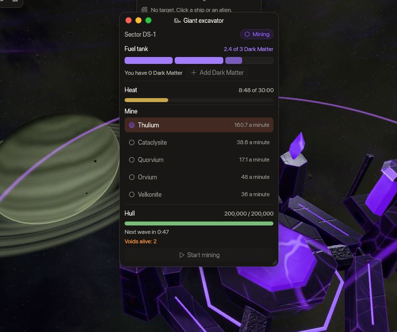

<!-- wiki-i18n source: 6b964707b3b7ca22 -->
<!-- wiki-i18n title: Гигантский экскаватор -->
# Гигантский экскаватор {#giant-excavator}

<!-- wiki-search: excavator; giant excavator; pulsar; mining; fuel; excavator fuel; control panel; overheat; radiation; slumbering void; voids; wave; ds-1; ds-2; ds-3; экскаватор; гигантский экскаватор; пульсар; топливо; пульт управления; перегрев; радиация; волна -->

С первого дня сезона в каждом из опасных секторов `DS-1`, `DS-2` и `DS-3` сияет **пульсар**, а с 11-го дня сезона рядом с ним стоит **гигантский экскаватор**. Экскаватор добывает из пульсара **Thulium и редкие руды**, и для этого он сжигает [Dark Matter](/wiki/03-Mechanics/Dark-Matter.md). Заправить его, выбрать, что он добывает, и запустить может любой, а всё, что он выдаёт, лежит вокруг него в контейнерах, которые может взять любой. Но запуск шумный: о нём узнаёт весь мир, к экскаватору волнами идут **Slumbering Void**, а экскаватор, работающий слишком долго, перегревается и облучает всю область. Эта страница рассказывает, как проходит запуск, что он даёт и как его пережить. Секторы описаны в [Опасные секторы](/wiki/01-General/Danger-Sectors.md); Void — в [Dormant Swamp](/wiki/03-Mechanics/Dormant-Swamp.md#slumbering-void).

## Кратко {#at-a-glance}

<!-- excavator-glance:begin -->
<!-- Generated from server/Resources/Excavator.json and DormantSwamp.json (and Rockets.json, Values/ranking-config.json) by scripts/dormant-wiki.sh: don't edit by hand. -->

- **Где**: Один пульсар с одним гигантским экскаватором в каждом из секторов `DS-1`, `DS-2` и `DS-3`, в каждом мире
- **Появляется**: Пульсар — с первого дня сезона, экскаватор — с 11-го дня сезона до вайпа
- **Топливо**: Dark Matter. Одна единица горит 10 мин; в бак помещается 3, это 30 мин добычи. Любой может добавлять по одной из собственного груза
- **Пульт**: Окно работает в пределах 600 ед. от экскаватора, а его метка видна с 1 400 ед. Заправлять, выбирать и запускать может любой; пока он работает, выбор заблокирован
- **Контейнеры**: Контейнер каждые 20 с, на расстоянии 450–900 ед. от экскаватора, свободный для любого с момента падения. Лежит 5 мин, а на карте одновременно лежит не больше 24
- **Нагрев**: 30 мин добычи, за сколько угодно запусков, и экскаватор перегревается на 1 ч. Нагрев сохраняется между запусками и исчезает после отдыха
- **Радиация**: Пока он перегрет или уничтожен, экскаватор (в пределах 1 100 ед.) и его пульсар (в пределах 1 300 ед.) сжигают каждый корабль внутри: 10% его общего HP каждую секунду
- **Корпус**: 200 000 HP в Альфе, 300 000 в Бете и 400 000 в Гамме. Повредить его могут только Slumbering Void, и только когда его некому защищать
- **Void**: Slumbering Void: 2 каждые 2 мин, пока он добывает, первые — через 1 мин после запуска; на карте живых не больше 8
- **Оповещения**: Пилоты всего мира узнают, когда запуск начинается, когда экскаватор перегревается и когда он уничтожен; остальное получают пилоты его сектора. Это системные строки: они видны на вкладке **Система** чата и в Журнале игры, а не на вкладках **Общий** и **Локальный**.

<!-- excavator-glance:end -->

## Как проходит запуск {#how-a-run-goes}

1. **Найдите его.** С 11-го дня сезона в каждом из трёх опасных секторов с пульсаром есть по одному экскаватору, в каждом мире. Рядом с ним над ним висит метка **Экскаватор**, а карта звёздной системы отмечает каждый опасный сектор, где он есть: цвет отметки — состояние экскаватора, а во всплывающей подсказке — время до его следующей смены состояния.
2. **Откройте пульт.** Щёлкните по метке. Окно **Гигантский экскаватор** работает, пока ваш корабль находится в зоне действия пульта экскаватора (она указана в списке *Кратко*). Корабль в маскировке тоже может им пользоваться, и маскировка при этом не снимается.
3. **Заправьте.** **Добавить Dark Matter** кладёт один Dark Matter из вашего груза в бак. Это может сделать любой. Бак никогда не принимает больше, чем экскаватор успеет сжечь до перегрева, поэтому топливо не пропадает зря.
4. **Выберите, что добывать,** в списке и нажмите **Начать добычу**. Нужен хотя бы один Dark Matter в баке и выбранный ресурс. До запуска выбор может изменить любой; когда экскаватор работает, ресурс заблокирован. О запуске узнают все пилоты мира, с вашим именем, сектором и ресурсом.
5. **Удержите его.** Пока он добывает, каждые несколько секунд вокруг него падает контейнер, а вскоре после запуска прилетают первые Slumbering Void. Защищайте экскаватор и собирайте контейнеры.
6. **Следите за нагревом.** Полоса Нагрев заполняется, пока экскаватор добывает, и никогда не пустеет, пока он ждёт. На пределе экскаватор перегревается. Уходите заранее: игра предупреждает карту дважды.
7. **Он отдыхает.** Перегретый или уничтоженный, экскаватор и его пульсар облучают область, пока не закончится отдых; затем он снова готов, с нулевым нагревом и полным корпусом.

В окне также показаны сектор, бак (по ячейке на каждый Dark Matter, горящая нарисована частично), сколько Dark Matter у вас с собой, корпус экскаватора, сколько каждый ресурс даёт в минуту в вашем мире, а во время добычи — время до следующей волны и число живых Void. Если что-то отклонено, причину вы прочтёте красным: вы слишком далеко от пульта, у вас нет Dark Matter, бак полон, ещё нет топлива или выбранного ресурса, ресурс заблокирован, пока он работает, или экскаватор горячий.

| Состояние | Что это | Что можно делать |
| :--- | :--- | :--- |
| **Готов** | Нет топлива, либо топливо есть, но запуска не было. Накопленный нагрев сохраняется. | Добавить Dark Matter, выбрать, запустить. |
| **Добывает** | Сжигает Dark Matter и копит нагрев; ресурс заблокирован. | Добавлять Dark Matter до свободного места, сражаться с Void, собирать контейнеры. |
| **Перегрет** | Нагрев достиг предела. Бак опустошён; уже упавшие контейнеры остаются. | Ничего. Область облучается: держитесь подальше. |
| **Уничтожен** | Void довели корпус до нуля. Топливо потеряно, корпус сразу снова полон. | Ничего. Область облучается: держитесь подальше. |

Если топливо кончается до предела, экскаватор возвращается в состояние **Готов** с сохранённым нагревом, а оставшиеся Void через какое-то время уходят, если не сражаются.

## Что он добывает {#what-it-mines}

Полный бак даёт примерно столько, сколько заработали бы пять пилотов за полчаса лучшей добычи Thulium. Бета и Гамма дают больше, как и платят больше за каждое убийство. За запуск вы выбираете один ресурс. Контейнер для всех одинаков, а контейнер с Thulium — это наличные, которые выплачиваются при подборе, как и Thulium астероидов.

<!-- excavator-resources:begin -->
<!-- Generated from server/Resources/Excavator.json and DormantSwamp.json (and Rockets.json, Values/ranking-config.json) by scripts/dormant-wiki.sh: don't edit by hand. -->

Полный бак (Dark Matter: 3, добыча 30 мин) даёт количества ниже, в контейнерах (всего 90).

| Ресурс | Alpha | Beta | Gamma | Минута, в Альфе | Контейнер, в Альфе |
| :--- | ---: | ---: | ---: | ---: | ---: |
| [Thulium](/wiki/06-Items/Resources.md#thulium) | 9 643 | 15 429 | 19 286 | 321,4 | 107,1 |
| [Cataclysite](/wiki/06-Items/Resources.md#cataclysite) | 2 314 | 3 703 | 4 629 | 77,1 | 25,7 |
| [Quorvium](/wiki/06-Items/Resources.md#quorvium) | 1 029 | 1 646 | 2 057 | 34,3 | 11,4 |
| [Velkonite](/wiki/06-Items/Resources.md#velkonite) | 640 | 640 | 640 | 21,3 | 7,1 |
| [Orvium](/wiki/06-Items/Resources.md#orvium) | 320 | 320 | 320 | 10,7 | 3,6 |

- Запуск на Velkonite или Orvium даёт не больше, чем сборщик этой руды 20-го уровня в [Skylab](/wiki/03-Mechanics/Skylab.md) за 8 ч (Velkonite: 640, Orvium: 320), в каждом мире: это руды Skylab, и запуск никогда не ускоряет их темп больше этого.
- В контейнере примерно столько, сколько указано в последнем столбце, с отклонением 15%. Контейнер с Thulium — наличные: их выплачивает подбор. В контейнере с рудой лежит предмет.

<!-- excavator-resources:end -->

Бустеры самого пилота действуют, как и для любого груза: бонус Resource Magnet Booster увеличивает контейнер с рудой. Суточного лимита на контейнеры нет: запуск ограничивают топливо и часы.

**Для чего нужна руда.** Руда из контейнера попадает в ваш груз, как любой предмет. Cataclysite и Quorvium используются в Сборочном цехе и в Кузнице ([Ресурсы](/wiki/06-Items/Resources.md)). Кузница и Исследовательский центр Skylab берут Velkonite и Orvium только из Хранилища ресурсов, которое наполняют сборщики; поэтому руда из контейнера в грузе бесполезна: поставьте корабль в отсек, и [Рудный отсек](/wiki/03-Mechanics/Skylab.md#ore-bay) вашего Skylab (ядро 10-го уровня) перенесёт её в хранилище в пределах лимита в час, откуда её возьмут Кузница и [Исследовательский центр](/wiki/03-Mechanics/Research.md#fuel).

## Slumbering Void {#the-slumbering-voids}

Запуск привлекает **Slumbering Void** — охотников утраченной цивилизации, которые прилетают с края карты, чтобы защитить пульсар от любого, кто захочет его опустошить. Они охотятся на пилотов возле экскаватора, а когда охотиться больше не на кого, нападают на сам экскаватор. Числа Void и его награда приведены в [Dormant Swamp](/wiki/03-Mechanics/Dormant-Swamp.md#slumbering-void).

<!-- excavator-voids:begin -->
<!-- Generated from server/Resources/Excavator.json and DormantSwamp.json (and Rockets.json, Values/ranking-config.json) by scripts/dormant-wiki.sh: don't edit by hand. -->

- **Волны.** Slumbering Void: 2 каждые 2 мин; первая — через 1 мин после запуска, и ни одной в последние 1 мин запуска. На карте одновременно живы не больше 8: волна, заставшая карту полной, пропускается.
- **Прилёт.** Волна появляется у края карты, в 900 ед. от него и не ближе 2 500 ед. к любому кольцу ворот, и летит к экскаватору около 20 с. В сообщении названа сторона карты, откуда она идёт.
- **Охота.** Void охотится на ближайшего пилота, которого видит в пределах 2 500 ед., и держится в пределах 7 000 ед. от экскаватора.
- **Осада.** Если в течение 15 с ни одного видимого пилота нет в пределах 7 000 ед. от экскаватора, Void атакуют экскаватор, и каждый лазер наносит 25% обычного урона. При нуле экскаватор уничтожен: топливо потеряно, корпус сразу снова полон, а отдыхает он 1 ч.
- **Уход.** Когда запуск заканчивается, оставшиеся Void остаются ещё на 90 с и продолжают сражаться, если с ними сражаются; потом уходят.

<!-- excavator-voids:end -->

- **Void — стеклянная пушка.** Его щит велик, но поглощает 80% попадания, так что корпус за ним исчезает после урона, в несколько раз превышающего его размер, а с пробиванием щита — гораздо раньше. Два-три хорошо экипированных пилота удерживают запуск в Альфе; Бета и Гамма требуют больших групп, как и для любого пришельца.
- **Маскировка не защищает место.** Void не видят корабли в маскировке, поэтому спрятавшийся пилот не отвлекает их от экскаватора; а пилот, укрывшийся в кольце ворот, недосягаем и тоже не считается.
- **Каждый Void платит** по нанесённому вами урону и роняет контейнер ([как платит убийство босса](/wiki/05-Swarms/Swarms.md#how-a-boss-kill-pays)). Их убийства прибавляются к вашим очкам PvE-звания, как убийства кораблей роя.

## Нагрев и радиация {#heat-and-radiation}

Добыча добавляет нагрев секунда за секундой. Нагрев **накапливается и не остывает, пока экскаватор ждёт**: запуск, остановленный рано, оставляет следующему пилоту более короткий. Достигнув предела, экскаватор **перегревается**, а когда его корпус доведён до нуля, он **уничтожается**; в обоих случаях экскаватор и его пульсар излучают, пока не закончится отдых.

<!-- excavator-radiation:begin -->
<!-- Generated from server/Resources/Excavator.json and DormantSwamp.json (and Rockets.json, Values/ranking-config.json) by scripts/dormant-wiki.sh: don't edit by hand. -->

| Круг | Радиус | Общее HP в секунду | Полный корабль держится |
| :--- | ---: | ---: | ---: |
| Гигантский экскаватор | 1 100 | 10% | 10 с |
| Пульсар | 1 300 | 10% | 10 с |

- **Доза.** 10% общего максимального HP корабля (корпус плюс щит) в секунду, поэтому полный корабль любого класса держится 10 с. Первым её принимает щит, а его поглощение не учитывается.
- **Кого.** Каждый корабль внутри кругов, в том числе в маскировке; пришельцев — нет. Это полученный урон: ремонтный дрон останавливается, а щит не восстанавливается, как у чёрной дыры.
- **Засчитывание.** Пилот, сгоревший насмерть, засчитывается последнему врагу, который попал по нему за 15 с до этого.
- **Предупреждения.** Карте сообщают за 1 мин и за 15 с до перегрева.

<!-- excavator-radiation:end -->

- **Предупреждение.** Дважды до перегрева (время указано в списке выше) карте сообщают об этом, корабль внутри кругов видит предупреждение, а круги рисуются на земле в полёте и на миникарте. Когда они излучают, круги красные, а шкала радиации показывает дозу.
- **Как уйти.** Любой серийный корабль может выйти от края пульта или от самого дальнего из оставшихся контейнеров, кроме медленного Ironclad: он уходит во время предупреждения или не уходит вовсе. Не стойте на контейнере, когда нагрев достигнет предела.
- **Добыча в кругах.** Контейнеры, упавшие до перегрева, остаются в радиации: контейнер, лежащий там, когда она начинается, забирают ценой дозы.
- **Перезапуск сервера** ставит запуск на паузу: топливо и нагрев возвращаются такими, какими были, отдых идёт по часам дальше, а первая волна после перезапуска приходит минутой позже.

## Борьба за запуск {#fighting-over-a-run}

У экскаватора **нет особого кольца**: действуют обычные правила вашего мира, поэтому могут прийти соперники, стрелять по вам и забирать контейнеры (контейнер свободен для любого с момента падения). Кражи и засады — часть события. Что стоит учесть:

- **Кто заправил, тот не обязательно выиграл.** Заправить, выбрать и запустить может любой; соперник может сменить ресурс, пока вы не нажали «Начать». Проверьте выбор, прежде чем нажимать.
- **Топливо под угрозой.** Если экскаватор уничтожен, Dark Matter из его бака пропадает, и никто его не получает. Больше всего можно потерять полный бак.
- **Идите в группе** и договоритесь, кто остаётся у экскаватора, а кто собирает контейнеры, и следите за нагревом: пилотов, берущих последние контейнеры, настигает радиация.
- **Void приходят к экскаватору, а не к контейнерам.** Группа, удерживающая экскаватор, занимает Void; ушедшая оставляет его осаде.

## Что узнаёт мир {#what-the-world-is-told}

Это системные строки (они видны на вкладке **Система** чата и в Журнале игры, а не на вкладках **Общий** и **Локальный**). Первые три адресованы всему миру; последняя — пилотам сектора экскаватора.

- В день начала события 2: опасные секторы изменились.
- Пилот **запускает** экскаватор, с указанием сектора, ресурса и минут топлива.
- Экскаватор **перегревается** или **уничтожается**.
- Кончается топливо; экскаватор вот-вот перегреется (дважды); приближается **волна** Void, с её номером и стороной карты, откуда она идёт; пилотов не осталось, поэтому Void атакуют экскаватор.

У каждого действия пульта и каждого предупреждения есть свой тихий звук, на громкости эффектов.

## Что ещё почитать {#where-to-read-more}

- [Опасные секторы](/wiki/01-General/Danger-Sectors.md): где стоят пульсары и что ещё нового.
- [Dormant Swamp](/wiki/03-Mechanics/Dormant-Swamp.md): Slumbering Void, Inert Mass и Unwakened.
- [Dark Matter](/wiki/03-Mechanics/Dark-Matter.md) и [Чёрная дыра](/wiki/03-Mechanics/Black-Hole.md): откуда берётся топливо.
- [Ресурсы](/wiki/06-Items/Resources.md): руды, которые выдаёт экскаватор.
- [Груз](/wiki/03-Mechanics/Cargo.md): контейнеры, подбор и Resource Magnet Booster.
- [Звания](/wiki/03-Mechanics/Ranks.md#how-you-earn-pve-points): очки PvE за Void.
