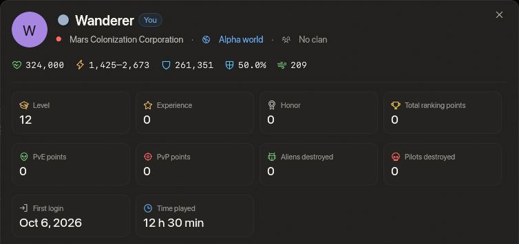

<!-- wiki-i18n source: 3b4de17b88336f9c -->
<!-- wiki-i18n title: Kom igång -->
# Kom igång i SpaceCorps {#getting-started-in-spacecorps}

Välkommen till den ultimata rymdkrigsupplevelsen. Som pilot i SpaceCorps representerar du din valda fraktion i kampen om herraväldet över galaxen, samlar värdefulla resurser och bygger upp ditt anseende i universum.

## Grundläggande resurser {#core-resources}

För att överleva och klara dig måste du hushålla med två valutor och hålla koll på din heder. Materialen du bygger med finns på sidan [Resurser](/wiki/06-Items/Resources.md), med var du hittar var och en och vad den används till:
- **Krediter**: Den vanliga huvudvalutan, som varje utomjording du besegrar och varje slutfört uppdrag betalar ut, och som Kreditfarmen i din [Skylab](/wiki/03-Mechanics/Skylab.md) tillverkar. Används för att köpa grundutrustning, skepp och standardutrustning.
- **Thulium**: Den sällsynta radioaktiva malmen och högvärdesvalutan, som varje utomjording du besegrar och varje slutfört uppdrag betalar ut, och som Thuliumfarmen i din Skylab tillverkar. Används för att köpa elitvapen, motorer, hybridsköldar och kraftfulla boosterpaket, för att uppgradera moduler i Monteringen, för att byta koncern (5 000), för att boosta Forskningscentrumet (5 000) och för varje hopp med en Jump CPU (500).
- **Heder**: Ett poängvärde, inte pengar: ett mått på din lojalitet och ställning i fraktionen. Heder avgör inte din [grad](/wiki/03-Mechanics/Ranks.md), som kommer från dina PvE-poäng och, för de sex bästa graderna, från din koncerns platser, och att angripa piloter i din egen fraktion straffar din hedersrating hårt: att förstöra en pilot i din egen koncern, en spelares skepp eller en av dess [koncernpiloter](/wiki/03-Mechanics/Company-Pilots.md), kostar 100 heder. Det gör även att träffa en under de 15 sekunderna innan något annat förstör den: att mjuka upp en koncernkamrat åt en utomjording som ska göra slut på den kostar lika mycket som själva nedskjutningen. Att skjuta ner en koncernkamrat räknas inte som en PvP-nedskjutning och ger inga PvP-poäng. Att byta koncern tar hälften av din heder, avrundat nedåt; en heder på 0 eller lägre ligger kvar som den är ([Byta koncern](#changing-your-company)).

På stationen står dina krediter, ditt Thulium och din heder uppe till höger på varje sida, bredvid din sektor och knappen **Flyg ut**. Är fönstret för smalt för ett långt belopp förkortas det (987,7M); peka på det för att läsa hela talet.

## Pilotprofiler {#pilot-profiles}

Klicka på en pilots namn i Hedersgalleriet (**Gemenskap › Ranking**), på sidan **Statistik** eller i en klans medlemslista, så öppnas pilotens **profil**: koncern, värld och klan, nivå, erfarenhet, heder och rankingpoäng, de aliens och piloter piloten har förstört och skeppet piloten flyger, med dess värden. Två rutor visar hur länge piloten har spelat:

- **Första inloggning.** Den dag då piloten loggade in för första gången, som ett datum i din egen tidszon. En pilot som spelade före 0.4.12 visar dagen då piloten först loggade in efter den uppdateringen, och ett streck står för en pilot som inte har loggat in sedan dess.
- **Speltid.** Hur länge pilotens spel har varit anslutet till servern, i timmar och minuter (”128 h 15 min”, ”45 min”), under flygning eller på stationen. Tid då du står still räknas också. Räkningen började med 0.4.12, så för en pilot som spelade före det är det tiden sedan uppdateringen.

Båda är offentliga, som nivå och grad: varje inloggad pilot kan läsa dem på en profil. Säsongens wipe nollställer ingen av dem.

## Byta koncern {#changing-your-company}

Du väljer din koncern första gången du spelar, och det är gratis. Senare kan du byta den på stationen: **Ekonomi › Koncern** visar de andra två koncernerna, var och en med en knapp **Byt koncern**. Ett byte kostar **5 000 Thulium** och hälften av din heder (avrundat nedåt; en heder på 0 eller lägre ligger kvar som den är). Ditt skepp repareras helt och du flyttar till den nya koncernens hemsektor (`M-1`, `T-1` eller `G-1`). Din klan, din grupp, dina skepp, dina föremål och din Skylab förblir som de är, och dina uppdrag fortsätter: deras officerare är nu din nya koncerns, och en uppgift `rival x-4` betyder de andra två koncernernas gränssektorer (se [Uppdrag](/wiki/03-Mechanics/Quests.md#where-it-counts)). Dina PvE-poäng följer med, och din [grad](/wiki/03-Mechanics/Ranks.md#who-is-on-the-ladder) räknas ut på nytt bland piloterna i din nya koncern, med de platser den har. Du kan inte byta koncern medan ditt skepp flyger: docka först.

## Spela med vänner {#playing-with-friends}

Gå med i en [klan](/wiki/03-Mechanics/Clans.md) eller flyg i en [grupp](/wiki/03-Mechanics/Groups.md) med upp till fem piloter, och ta med nya vänner med din personliga kod: under **Gemenskap › Bjud in vänner** får de ett startpaket och du en belöning i Thulium när de når nivå 5. Se [Bjud in vänner](/wiki/03-Mechanics/Invite-Friends.md).

## Uppdrag {#missions}

Uppdrag är det snabbaste sättet att gå upp i nivå. Öppna **Mission Control** från verktygsfältet (inne i en stations säkra zon) eller genom att klicka på **Mission Control**-bubblan som svävar ovanför stationen: 88 uppdrag tar dig från nivå 1 till 8, tio per nivå i valfri ordning plus ett **Special**-uppdrag som öppnas när de tio är klara. De flesta är korta kedjor: förstör några utomjordingar, flyg till en punkt, stanna några minuter i en sektor eller hitta ett uppdragsföremål som bara tappas åt dig och kör hem det till Mission Control, ibland med en regel som ”förlora inte mer än 3 000 skrovpoäng” eller ”dö inte”. Varje nivås uppdrag leder dig en sektor längre ut, från din bas till gränsen och PvP-zonens mitt. Från pilotnivå 3 betalar en särskild linje av femtio mycket svåra **Utmaningar** i fem steg stora belöningar efter arbetet: varje nedskjutning är värd mer för varje steg upp, upp till ett tak på 100 000 Thulium per uppdrag. De tryckta talen är grundvärdet, och din värld, dina boosters och din klans bonusar multiplicerar dem, som för varje uppdrag. Se [Uppdrag](/wiki/03-Mechanics/Quests.md) för hur de fungerar och vad varje uppdrag ger.

## Resa {#travelling}

Mellan kartorna reser du genom **portaler**: flyg inom 500 enheter från en och tryck `J`, så kommer du tre sekunder senare fram till motsvarande port på nästa karta ([Spacemap-resor](/wiki/01-General/Spacemap%20Travel.md)). Din bas `x-1` har en port, till `x-2`; därifrån leder kartorna vidare till `x-3` och till gränsen `x-4`, som öppnar sig mot din farosektor, PvP-centrum. Varje `x-4` har också en port till nästa koncerns `x-3`, och varje `x-3` har porten tillbaka: Mars `M-4` till Terra `T-3`, Terra `T-4` till Galactic `G-3`, Galactic `G-4` till Mars `M-3`. De tre förbindelserna bildar **ringen**, en väg mellan koncernernas kartor som inte korsar PvP-centrum.

## Förstörelse och återkomst {#dying-and-coming-back}

När ditt skrov når 0 förstörs skeppet och dödsskärmen frågar var du vill återvända. Tre platser listas alltid, och du väljer med ett klick eller med tangenterna `1`, `2` och `3` (valet öppnas tre sekunder efter explosionen, så en tangent du höll nere under striden väljer ingenting):

| Val | Tangent | Var du återvänder | Låst efter användning |
| :--- | :---: | :--- | :--- |
| **Vid basen** | `1` | Din koncerns bas i din värld (`M-1`, `T-1` eller `G-1`), inne i stationens säkra zon, var du än förstördes. | Aldrig |
| **Vid närmaste portal** | `2` | Intill den av sektorns portaler som ligger närmast, i rät linje, platsen där du förstördes, 150 till 300 enheter från den. En sektor med en portal använder den. I en sektor utan portal (de neutrala sektorerna) är det här valet utgråat. | 3 minuter |
| **På platsen** | `3` | Platsen där du förstördes, i samma sektor. | 5 minuter |

- **Låsningen börjar när du återvänder med det valet**, inte när du förstörs, och den gäller bara det valet: att använda portalen låser inte platsen. Ett låst val är utgråat på dödsskärmen med en nedräkning (minuter och sekunder) och öppnas av sig självt när tiden har gått. Låsningarna hålls av servern: att logga ut och in nollställer dem inte. En ny säsong (wipen) gör det.
- **Ett val som servern nekar kostar ingenting.** Om ett val inte kan användas (fortfarande låst, ingen portal i sektorn, du har bytt värld sedan du förstördes) förbrukas inte låsningen och ditt skepp flyttas inte; du väljer igen.
- **Skydd efter återkomst.** Vilken plats du än väljer kan ditt skepp varken skadas eller låsas på under **3 sekunder** efter att det kommit tillbaka, och utomjordingar tappar intresset för det, så den som förstörde dig kan inte förstöra dig igen direkt. Under samma 3 sekunder **kan du inte heller anfalla**: en laser eller en raket avvisas med ett meddelande, och skyddet tar inte slut i förtid. HUD:en visar hur många sekunder som återstår. Skyddet tar slut när de gått.
- **Det svarta hålet.** En plats inom strålningsringen kring det [svarta hålet](/wiki/03-Mechanics/Black-Hole.md) (4 200 enheter från mitten av Farosektor 4) är aldrig en plats att återvända till: om du förstördes där placerar ”på platsen” dig vid den närmaste punkten utanför ringen, på linjen från mitten genom din plats, och talar om det för dig.
- **Farosektorer.** Alla tre valen fungerar där också.
- **Skrovet kommer tillbaka begränsat.** Du återvänder med skeppets skrov **högst 10 000** och tom sköld, vilken plats du än väljer. Protos (8 000 skrov) kommer tillbaka fullt; de större skeppen (från Kitefins 24 000 till Ironclads 600 000) kommer tillbaka med 10 000, så reparera före nästa strid med en Repair Drone eller en Emergency Repair (se [Strid](/wiki/03-Mechanics/Combat.md) och [Förmågor](/wiki/03-Mechanics/Abilities.md)). Skölden laddas som vanligt. Dödsskärmen säger det.
- **Vad en förstörelse i övrigt kostar:** du förlorar inga föremål, och valet avgör bara var du dyker upp. Dina förmågor är redo, och du återvänder utan kamouflage och utanför alla EMP-fönster. Du stannar kvar i din [grupp](/wiki/03-Mechanics/Groups.md).
- **Dockning.** ”Tillbaka till basen” på dödsskärmen tar dig tillbaka till basen, som alltid, med samma skrov. Stängs spelet innan du har valt kan du reparera skeppet gratis i [hangaren](/wiki/03-Mechanics/Hangar.md); du är då vid din bas, med samma skrov och utan sköld.

## Tangentbordsstyrning och tangentbindningar {#keyboard-controls-keybindings}

SpaceCorps har anpassningsbar tangentbordsstyrning (du når den via panelen Inställningar i spelet). Här är standardbindningarna:

| Åtgärd | Styrning / tangentbindning | Beskrivning |
| :--- | :--- | :--- |
| **Flyga skeppet** | `Left Click` på Spacemap | Skickar ditt skepp mot koordinaterna du klickade på. |
| **Vrida och zooma kameran** | `Right Drag`, `Mouse Wheel` | Med högerdrag vrider du vyn runt ditt skepp; med hjulet (eller ett drag med mittenknappen) zoomar du in och ut, från 30 enheters avstånd ut till 1 500, vilket visar ungefär 4 400 gånger 2 650 enheter rymd (2,25 gånger ytan av en vy på 1 000 enheter). Din vridning och din zoom glider tillbaka till viloläget två sekunder efter att du har släppt, om du inte slår på **Kameran stannar där jag lämnar den** under Inställningar › Allmänt: då behåller vyn vinkeln och avståndet du gav den (knappen **Återställ vy** bredvid det reglaget sätter tillbaka den i viloläget en gång, och det gör även att slå av reglaget). **Kamerazoom** under Inställningar › Allmänt anger viloavståndet, från 50 % till 338 % (150 % är standard); när reglaget är på tar kameran sig till det nya avståndet när du ändrar värdet. |
| **Välja mål** | `Left Click` på ett objekt | Väljer en utomjording, en fientlig pilot eller en portal som ditt aktiva mål. Målfönstret (se nedan) visar dess namn, avstånd, skrov och sköld. Ett klick på en [asteroid](/wiki/03-Mechanics/Asteroid-Mining.md) väljer den utan att ändra ditt mål; raketer slår sönder den och dina lasrar skadar den lite. |
| **Anfall valt mål** | `Key A` (eller `Ctrl + Click`) | Börjar avfyra dina lasrar och raketer mot det valda målet. Är varken skepp eller utomjording valt avfyras dina lasrar mot den valda [asteroiden](/wiki/03-Mechanics/Asteroid-Mining.md#breaking-one). |
| **Avfyra raket** | `Key R` | Avfyrar den raket du sköt senast (eller den första i snabbfältet): en målsökande raket mot ditt valda mål, en rak raket mot din markör. För att sikta en rak raket med musen klickar du på dess plats i snabbfältet för att armera den och klickar sedan i rymden. Alla raketer delar en timer på 3 sekunder (en drönarformation kan ändra den). |
| **Hoppa genom portal** | `Key J` | Startar ett hopp när du är inom 500 enheter från en portal (inne i dess säkra zon). Hoppet tar 3 sekunder (ett fält ovanför snabbfältet visar det) och du måste stanna inom räckhåll tills det är klart. I farosektorerna kan du inte starta ett hopp medan du är under attack. |
| **Byt konfiguration** | `Key C` | Växlar mellan Konfig 1 och Konfig 2 (byter aktiv uppsättning av lasrar, sköldar och fart). |
| **Primärt snabbfält** | `Digits 1 - 9` | Aktiverar föremål och åtgärder på din primära snabbfältsplats i HUD:en (t.ex. ammunition, reparationsdrönare). |
| **Sekundärt snabbfält** | `Shift + Digits 1 - 9` | Aktiverar föremål och åtgärder på dina sekundära snabbfältsplatser. Raden visas ovanför den primära så snart den innehåller något; öppna väljaren Ammunition, Raketer eller Extra (eller dra en plats) för att placera ett föremål där. |
| **Drönarformation** | tangenten för dess plats | Bär formationen på den platsen. Dra den dit från Formationslistan i snabbfältet, där det också finns Standard, ingen formation. Du får byta en gång var 2:a sekund, både i strid och i en säker zon; platserna visar sekunderna som är kvar. Se [Drönarformationer](/wiki/03-Mechanics/Formations.md). |
| **Helskärm** | `F11` eller `Alt + Enter` (Windows) | Slår kantlös helskärm på eller av; knappen uppe till höger på flygskärmen gör detsamma på Windows och macOS. De här två tangenterna är fasta och finns inte bland bindningarna du kan ändra. `Alt + Enter` väntar medan du skriver i chatten. |
| **Välj var du återvänder** | `Keys 1 - 3` | På dödsskärmen: `1` vid basen, `2` vid närmaste portal, `3` på platsen. Se *Förstörelse och återkomst* ovan. |
| **Målfönster** | `Key V` | Visar eller döljer målfönstret. Den första knappen i verktygsfältet uppe till vänster gör detsamma. |
| **Gruppfönster** | `Key B` | Visar eller döljer gruppfönstret: din grupps skepp, skrov och sköld. Medan en gruppinbjudan väntar accepterar `Y` den och `Escape` avböjer den. Se [Grupper](/wiki/03-Mechanics/Groups.md). |

## Målfönstret {#the-target-window}

Klicka på en utomjording eller en pilot så visar **målfönstret** vad du har valt: namn, avstånd, staplarna för skrov och sköld och om du skjuter på målet. Dess **korshårsknapp** startar och stoppar attacken (samma som `A`), och **X**-knappen avmarkerar målet (samma som `Esc`). När inget är valt säger det så på en rad. Klicka på en [asteroid](/wiki/03-Mechanics/Asteroid-Mining.md#what-an-asteroid-is) så visar fönstret dess skrov, vad den lämnar och hur många av din raket, eller hur många salvor av dina lasrar, den tar.

Det är ett fönster som de andra. Dra det i titelraden för att placera det var som helst, stäng det med den röda lampan i hörnet eller med **den första knappen i verktygsfältet uppe till vänster** (eller `V`), och öppna det igen på samma sätt. Var du lämnar det och om det är öppet sparas för ditt konto. Det börjar högst upp på skärmen, mellan de två verktygsfälten. Att stänga det döljer bara avläsningen: ditt mål förblir valt och din attack fortsätter.

## När spelet laggar {#when-the-game-lags}

Slå på **Inställningar › Gränssnitt › Visa nätverksinfo** så visas ett litet kort uppe till höger (det håller sig undan från fönstren, och det är avstängt tills du slår på det). Det visar vilken sida som är långsam:

| Avläsning | Vad det är | Bra, långsamt |
| :--- | :--- | :--- |
| **Ping** | Rundturen till spelservern (ikonen bredvid har tre staplar när värdet är bra, två när det är långsamt och en när det är dåligt; varje annan avläsning får en triangel när den är långsam och en åttkant när den är dålig). | Under 80 ms är bra, över 150 ms är dåligt. |
| **Jitter**, **Snapshot-ålder** | Hur jämnt och hur färskt serverns uppdateringar (20 i sekunden) kommer fram. | Jitter under 25 ms och en ålder under 100 ms är bra. |
| **Längsta uppehåll** | Den längsta tiden utan en uppdatering från servern under de senaste tio sekunderna. | Över en sekund är ett stopp. |
| **Server** | Hur lång tid serverns eget steg på 50 ms tar (99:e percentilen). Det står *saknas* när servern är för gammal för att rapportera det. | Under 20 ms är bra, över 35 ms är dåligt. |
| **Klient** | Din dators bildtid (95:e percentilen). | Under 25 ms är bra, över 33 ms är dåligt. |

När något är dåligt säger en rad under siffrorna vems fel det är: *Långsamt nätverk*, *Fördröjt nätverk* eller *Anslutningen har stannat* betyder din anslutning eller vägen till servern, *Servern överbelastad* betyder servern (en överbelastad server höjer också pingen och kan hålla tillbaka uppdateringarna), *Klienten långsam* betyder din dator (sänk grafikdetaljerna) och *Klienten frös* betyder att själva spelet slutade rita en stund (en alt-tabbning, ett minimerat fönster). Samma siffror skrivs till spelets loggfil en gång i minuten, och direkt vid ett stopp, så en rapport om att ”det laggade 21:10” kan besvaras med hjälp av loggen.

## Snabba proffstips för nybörjare {#quick-pro-tips-for-beginners}

1. **Konfigurationer**: Förbered alltid två olika uppsättningar. Använd till exempel **Konfig 1** med alla motorer och styrraketer i dina generatorplatser för snabb flykt eller förflyttning, och **Konfig 2** med sköldar och lasrar för strid.
2. **Säkra zoner**: Portaler och baser har **säkra zoner** runt sig. I de områdena kan andra piloter inte anfalla dig, så du kan i lugn och ro ladda upp sköldarna igen eller vänta ut stridens återhämtningstider.
3. **Din första förmåga**: ditt startpaket har redan en Repair Drone I monterad i Protos förmågeplats, så knappen Emergency Repair (`E`, bredvid snabbfältet) reparerar ditt skrov under tio sekunder så fort det är skadat. Se [Förmågor](/wiki/03-Mechanics/Abilities.md). Paketet monterar också en **Base CPU I** (10 användningar, en teleport till din bas) och en andra **Repair Drone I** på Protos två extraplatser: dra dem från väljaren Extra i snabbfältet till en plats för att använda dem (se [Extrautrustning](/wiki/06-Items/Extras.md)). Bara för nya piloter: den som tog värvning före 0.4.10 behåller paketet från den tiden, utan de här två.
4. **Daglig klanskatt**: Om du är medlem i en klan, tänk på att klankassan drar en skatteprocent (0 % till 5 %) av ditt dagliga saldo av krediter vid UTC-midnatt. Välj din klan med omsorg!
5. **Kopiera från wikin**: dra musen över valfri text i en artikel för att markera den och tryck på `Ctrl+C` (`Cmd+C` på Mac) för att kopiera; ett klick på en länk öppnar fortfarande sidan. **Kopiera sidan** högst upp i varje artikel kopierar hela sidan som Markdown, att klistra in i en chatt eller en anteckning.
6. **Forska före tillverkning**: Monteringen tillverkar bara det som Forskningscentrumet i din [Skylab](/wiki/03-Mechanics/Skylab.md) har forskat fram. Det öppnas på kärnnivå 10, och sidan [Forskning](/wiki/03-Mechanics/Research.md) har teknologierna, deras tider och bränslet.
7. **Drönarformationer**: när du äger en drönare och har forskat fram och tillverkat en formation, dra den till ditt snabbfält från Formationslistan och bär den med tangenten för dess plats: en större sköld mot svagare vapen, hårdare raketer mot ett tunnare skrov. Var och en ger också dina drönare en form att flyga i. Se [Drönarformationer](/wiki/03-Mechanics/Formations.md).
