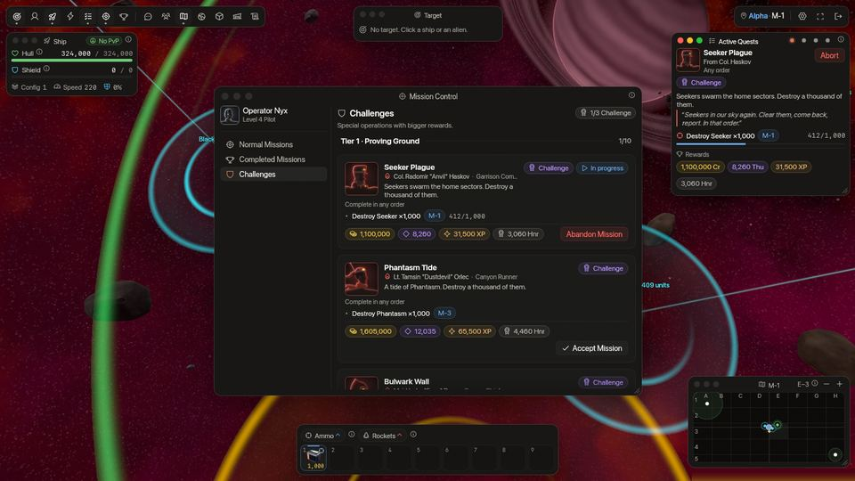
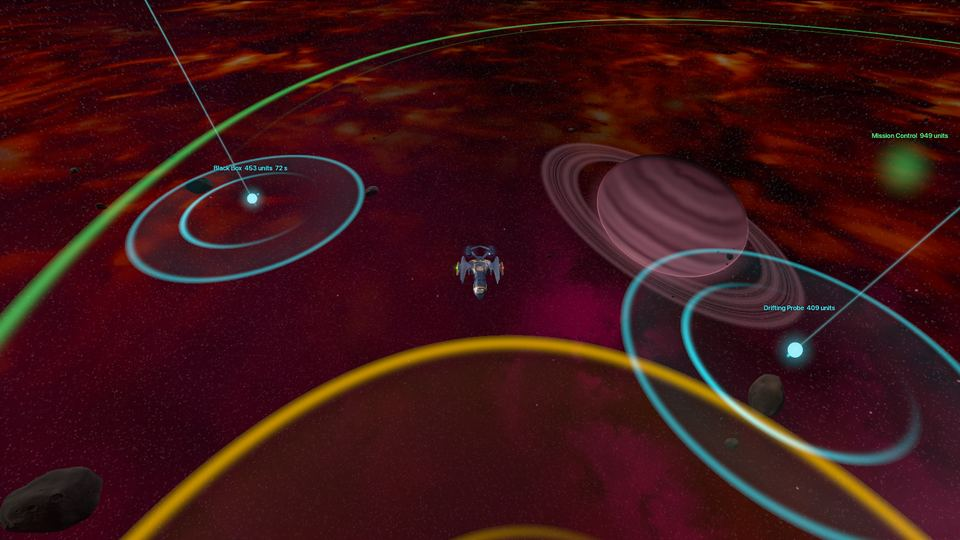

<!-- wiki-i18n source: c09d6729ddb6f774 -->
<!-- wiki-i18n title: Uppdrag -->
# Uppdrag {#quests}

Uppdrag är det viktigaste sättet att gå upp i nivå. Mission Control delar ut dem: varje uppdrag kommer från en officer i din egen koncern (om du [byter koncern](/wiki/01-General/Getting-Started.md#changing-your-company) blir officerarna din nya koncerns, och uppdragen `rival x-4` följer den), och vart och ett betalar erfarenhet, krediter, Thulium och heder när du hämtar belöningen. Det finns **88 uppdrag för nivå 1 till 8**, elva per nivå, och tillsammans tar de dig från en alldeles ny Protos till frontlinjen i PvP-centrum. Tio **Station-uppdrag** lär dig [Skylab](/wiki/03-Mechanics/Skylab.md) och betalar dig för att bygga upp den, och från pilotnivå 3 betalar en särskild linje av femtio mycket svåra **Utmaningar** stora belöningar. Station-uppdrag och Utmaningar betalar som nivåuppdragen: talen i tabellerna är **grundvärdet**, och din värld, dina boosters och din klans bonusar multiplicerar dem ([Belöningar](#rewards)).

De flesta uppdrag är inte längre ”förstör så här många av dessa”: de är korta **kedjor**. Du förstör några utomjordingar, flyger till en punkt, stannar några minuter i en sektor eller hittar ett föremål och kör hem det till Mission Control. Vissa lägger till en regel: förlora inte mer än så här många skrovpoäng, eller dö inte.

---

## På en minut {#in-one-minute}

- **Ta dem vid Mission Control.** Du kan ha 5 nivåuppdrag igång samtidigt, plus 3 Station-uppdrag och 3 Utmaningar.
- **Kedjor.** Stegen i ett uppdrag med märket **I ordning** öppnas ett efter ett, och bara det öppna steget räknas.
- **Fyra sorters steg vid sidan av nedskjutningar.** Ett **uppdragsföremål** som bara tappas åt dig och som du kör till Mission Control, en **punkt att besöka**, en **vistelse** på några minuter i en sektor och, från säsongsdag 4, en **svärm** att jaga.
- **Villkor.** Ett steg eller ett helt uppdrag kan säga ”skrovförlust högst N poäng” eller ”utan att förlora skeppet”. Bryter du det börjar det steget, eller uppdraget, om. Inget går förlorat för alltid.
- **Utmaningslinjen.** Femtio mycket svåra uppdrag i fem steg om tio, från pilotnivå 3. De betalar efter arbetet: en nedskjutning är värd vad steg I betalar för den, och 10 % mer för varje steg upp, och ett uppdrag betalar högst 100 000 Thulium. Steg I betalar sammanlagt 9 355 000 krediter, 70 125 Thulium och 2 177 500 XP, som grundvärden ([Utmaningslinjen](#challenge-line)).
- **Gjorda om i 0.4.10.** 64 av nivåuppdragen är nya versioner. Om du hade gjort ett av dem erbjuds det igen, med full belöning ([detaljer](#reworked-missions)).

## Mission Control

- Öppna **Mission Control** från verktygsfältet inne i en stations säkra zon, eller klicka på bubblan **Mission Control** ovanför stationen i din bassektor (den följer stationen på kartan, så flyg eller zooma ut tills stationen syns). Fliken **Vanliga uppdrag** listar dina uppdrag per nivå, fliken **Utmaningar** innehåller [Utmaningslinjen](#challenge-line) och **Slutförda uppdrag** innehåller de som väntar på att du ska hämta deras belöning.
- **Anta** ett uppdrag för att starta det. Du kan ha **5 uppdrag igång samtidigt**; [Station-uppdragen](#station-missions) har 3 platser för sig och [Utmaningarna](#challenge-line) 3 till. Uppdraget du antog senast är det du **följer** (ett Station-uppdrag bara när du inte följer något och inget av dina uppdrag är ett som flygning kan föra framåt): det visas i fönstret **Aktiva uppdrag**, och nedskjutningar och flygning räknas mot det först. Välj ett annat med prickarna i fönstrets titelrad.
- En **bricka** med en siffra sitter på Mission Control-knappen och på flikarna **Vanliga uppdrag** och **Utmaningar** (när du är på en annan flik) så länge ett uppdrag eller en utmaning kan accepteras. Varje nytt kommer med ett meddelande och ett lågmält ljud.
- Vissa uppdrag måste göras **i ordning**. De har märket **I ordning**, och deras steg är numrerade: se [Uppdragskedjor](#chained-missions).
- Ett uppdrag med uppdragsföremål, vistelse eller villkor visar sitt läge live i Aktiva uppdrag: **Ombord** med avståndet till Mission Control, tiden du har stannat, de skrovpoäng du har förlorat (**Skrovskada: 1 240 / 3 000**), **Dö inte**. På uppdragets kort visas samma regler som små märken: **Skrovgräns 3 000 HP**, **Inga dödsfall**, **I ordning** och klockan för ett tidsbegränsat uppdrag.
- **Överge** ett uppdrag för att släppa det och dess framsteg. Det är tillbaka i listan direkt, och du kan anta det igen. Ett föremål du bar för det är borta.
- Ett avklarat uppdrag väntar under **Slutförda uppdrag** tills du **hämtar** belöningen. Hämta den när du vill: belöningen går inte ut.
- Varje uppdrag kan göras **en gång per pilot**, utom de nivåuppdrag som gjordes om i 0.4.10, som erbjuds en gång till ([se nedan](#reworked-missions)). Dina uppdrag, gjorda och pågående, överlever säsongens wipe.

## Nivåer {#levels}

- Varje nivå från 1 till 8 har **tio uppdrag och en Special**. En nivås uppdrag öppnas när du når den och förblir öppna på alla nivåer ovanför.
- **Ta dem i valfri ordning.** Inget av de tio väntar på något annat. (Stegen inuti ett uppdrag kan ha en ordning.)
- Varje nivå har samma blandning: **tre** uppdrag med ett uppdragsföremål, **två** som skickar dig till punkter på kartan, **två** som låter dig stanna i en sektor och **tre** vanliga jakter. Ett uppdrag har ett till fyra steg, och en jakt kräver en sorts utomjording eller flera.
- Uppdragen på en nivå betalar **85 % av erfarenheten** fram till nästa nivå. Utomjordingarna de låter dig förstöra betalar resten, och på låga nivåer en hel del mer: du når oftast nästa nivå innan en uppsättning är klar.
- **Ett asteroiduppdrag för varje nivå.** Förutom sina tio och Specialen har varje nivå ett uppdrag som ber dig spränga ett antal [asteroider](/wiki/03-Mechanics/Asteroid-Mining.md) av slag som finns på bättre kartor ju högre nivån är (det första betalar 60 Rivet I; de på nivå 7 och 8 öppnar säsongsdag 4). En sprängning räknas när den ger dig en andel (minst 5 % av skadan asteroiden tar), med raketer eller lasrar. Det är inte ett av de tio, så Specialen väntar inte på det, men det tar en av dina 5 uppdragsplatser. Mission Control listar det efter Specialen, märkt **Asteroider**; tabellerna i slutet av den här sidan gör det inte.

## Specialuppdrag {#special-missions}

- Det elfte uppdraget på varje nivå är dess **Special**. Det är låst tills **alla tio** av nivåns andra uppdrag är klara (hämtade, eller väntande på att hämtas), och kortet säger hur många du har kvar.
- Specialuppdragen betalar mer erfarenhet än något annat uppdrag på sin nivå, och dessutom **föremål**: lasrar, sköldkomponenter, generatorer, Power Core, Ship Fragment, ammunition och boostertid.
- Specialuppdragen på nivå 3 och 4, **Kupekrossaren** och **Kuperensning**, är [svärmjakter](#swarm-missions): de öppnas från säsongsdag 4.
- De vanliga uppdragen på nivå 1 ger också ett litet startföremål var: en Light Shield Core, en Repair Drone, en Damage Amp I, en Absorption Shield Cell I, lite ammunition och en bunt raketer att prova varje sort (Lancet I, Rivet I, Ember I och Scatter I, och Lancet II från Special).

## Uppdragskedjor {#chained-missions}

En **kedja** är ett uppdrag vars steg går i en fast ordning. Den har märket **I ordning** på sitt kort och i Aktiva uppdrag. Stegen är numrerade: ett avklarat steg är bockat, det **markerade** steget är det öppna, och stegen efter det visar ett lås tills det är klart.

- **Bara det öppna steget räknas.** Dina nedskjutningar, din flygning och din vistelsetid går till det och till inget annat. Nedskjutningar du gjorde innan ett steg öppnades räknas inte för det.
- **Varför i ordning?** Ett uppdrag berättar en liten historia (”rensa vakterna och kör sedan hem kärnan”), och reglerna behöver ordningen: ett uppdragsföremål kan bara tappas när dess steg är öppet, en vistelse räknas från det ögonblick den öppnas, och ett stegs villkor (skrovgräns, inga dödsfall) gäller bara medan det steget är öppet.
- **Uppdrag utan märket öppnar alla sina steg på en gång**, i valfri ordning. **Håll porten** har en punkt att nå, en vistelse på fyra minuter i sträck och nedskjutningar av 8 Seekers och 3 Phantasm, allt öppet samtidigt, så nedskjutningarna räknas närhelst du gör dem medan uppdraget pågår, under vistelsen eller utanför den.
- I tabellerna längst ned på sidan förbinder en pil (”→”) stegen i ett I ordning-uppdrag, och ett semikolon (”;”) förbinder steg som öppnas samtidigt.

## Uppdragsföremål {#quest-items}

Ett uppdragsföremål är något du måste föra till Mission Control. Det är inget inventarieföremål: det kan inte bytas, lagras eller säljas, det är en del av uppdraget. **Bara du kan se det.** Andra piloter, även i din grupp, ser ingenting.

| Sort | Så får du det | Exempel |
| :--- | :--- | :--- |
| **En tappning** | Varje nedskjutning av den namngivna utomjordingen i den namngivna sektorn kan tappa det. Tabellen anger chansen per nedskjutning (”15 % per nedskjutning”) och den nedskjutning som tappar det säkert (”säkert vid nedskjutning 10”). Räkningen börjar när steget öppnas. | Kombinerade operationer: Cargo Pod, från Seekers i `x-1`. |
| **En förutbestämd tappning** | Ingen chans: den namngivna nedskjutningen, räknad från det steget öppnas, bär det alltid. | Boräd: den tredje Phantasm vid boet bär Nest Core. |
| **Ett utplacerat föremål** | Det ligger på en punkt i sektorn från det steget öppnas. | Utpostförsvar: Relay Part vid 12 500 / 4 800 i `x-2`. |

1. **Hitta det.** En tappning visas där utomjordingen dog, i **120 sekunder**; den blinkar under de sista 12. Missar du den tappar nästa nedskjutning som räknas den igen direkt. Du ser föremålet som en cyanfärgad fyr i världen (en roterande datakärna i en ring, med en stråle uppåt) och som en cyanfärgad romb på minikartan.
2. **Plocka upp det.** Flyg inom **200 enheter** från det. Ett meddelande säger att det är ombord, och Aktiva uppdrag visar **Ombord** och avståndet till Mission Control.
3. **Kör hem det.** Flyg in i den säkra zonen kring **din egen koncerns** Mission Control: stationen i din bassektor `x-1`, ringen på 1 600 enheter runt den. En grön ring på skärmen och på minikartan visar den. Föremålet lämnas in direkt och steget är klart.

Vad som stoppar transporten:

- **Ditt skepp förstörs**, av en utomjording eller av en pilot: föremålet går förlorat, och du kan hämta det igen (ett utplacerat ligger kvar på sin punkt, en tappning kommer med nästa nedskjutning som räknas). Ingen kan stjäla det: en pilot som förstör dig får inget av det.
- **En överskriden skrovgräns** eller en regel om **inga dödsfall** gör att transporten misslyckas på samma sätt: se [Villkor](#conditions).
- **Hopp-CPU:n och bas-CPU:n vägrar fungera medan du bär ett föremål.** Flyg hem genom portalerna. Portalerna, kamouflaget och Shield Surge går att använda fritt.
- Lämnar du spelet bär du föremålet kvar när du kommer tillbaka. En tappning som låg på kartan är borta, och nästa nedskjutning som räknas tappar den igen.
- Föremål finns bara i koncernernas sektorer `x-1` till `x-4`, **aldrig i farosektorerna**, och bara i **din egen koncerns**: en Galactic-pilots föremål ligger i `G-2`, aldrig i `M-2` eller `T-2`. En utomjording tappar ditt föremål bara om den dör i din egen koncerns sektor.
- I en [grupp](/wiki/03-Mechanics/Groups.md) slår varje medlem som nedskjutningen räknas för (se [Var det räknas](#where-it-counts)) och som har uppdraget för sig och ser sitt eget föremål. Ingen kan ge, ta eller dela ett.

> [!TIP]
> Planera vägen hem innan du plockar upp föremålet. Från `x-3` eller `x-4` är det två portalhopp till `x-1`, från `x-2` ett. Reparera först om skrovet är lågt (ett förstört skepp förlorar föremålet) och håll dig undan strider på vägen: reparationer ger inga skrovgränspoäng tillbaka.

## Besök en punkt och stanna {#visit-and-stay}

**Besök en punkt.** Ett besökssteg anger en punkt i en sektor med två tal, ”9 000 / 4 500”. Det är samma tal som minikartans titelrad visar för ditt eget skepp, så du kan styra efter dem. Flyg inom **400 enheter** från punkten så räknas den direkt; du behöver inte stanna (en tur som slutar vid Mission Control slutar inne i stationens säkra zon). Punkten är en **guldring** på skärmen och en guldromb på minikartan. Den räknas bara på din egen koncerns karta, inte i samma sektor hos en annan.

**Stanna i en sektor.** Ett vistelsesteg kräver några minuter i en sektor. Det räknas bara medan alla tre är sanna:

- du är i den sektor som steget anger (för en `x-n` din egen koncerns karta);
- du är **utanför varje säker zon** (en stations eller en portals ring: tid i en ring räknas inte);
- ditt skepp är **aktivt**: det har flugit 300 enheter eller avfyrat ett skott de senaste 30 sekunderna. Ett parkerat skepp tjänar ingenting.

Det finns två sorter. En vistelse som **summeras** behåller det du har: lämna, dö, kom tillbaka, och minuterna finns kvar, om inte vistelsen eller dess uppdrag har en skrovgräns eller en regel om inga dödsfall: då börjar vistelsen om när du förlorar ditt skepp eller passerar gränsen (se [Villkor](#conditions)). En vistelse **i sträck** börjar om från noll när du dör, hoppar eller lämnar sektorn (tid i en ring eller stillastående pausar den bara), och ett meddelande säger det.

Vistelser och besök konkurrerar inte: varje öppen räknas direkt, vad du än gör. Nedskjutningar är annorlunda: en nedskjutning räknas bara för ett nivåuppdrag (se [Var det räknas](#where-it-counts)).

> [!NOTE]
> Besök och vistelser kan leda in i farosektorerna (Centrumspaning, Vaka i centrum och Håll centrum gör det), där andra koncerners piloter kan attackera dig. Uppdragsföremål gör det aldrig.

## Svärmuppdrag {#swarm-missions}

Tretton uppdrag kräver skeppen i [svärmarna](/wiki/05-Swarms/Swarms.md). Två är nivåernas specialuppdrag: **Kupekrossaren** (nivå 3: 3 Boss Seekers, 12 Seeker Slaves och 6 Phantasm) och **Kuperensning** (nivå 4: 3 Boss Seekers, 12 Seeker Slaves, 2 Bulwarks och en punkt att besöka). Elva finns i Utmaningslinjen: Boss Seekers och Pirate Scouts (**Kupejakt**, **Spejarjakt**, **Kupejakt II**, **Spejarjakt II**), Pirate Bosses (**Piraternas uppgörelse**, **Piraternas fördärv**, **Piraternas undergång**, **Piratthronen**) och Dormant Force (**Dormant-gryning**, **Dormant-skymning**, **Dormant-herraväldet**).

- **De öppnas på säsongsdag 4**, dagen då svärmarna dyker upp ([30-dagarsschemat](/wiki/03-Mechanics/Wipe-Timeline.md#30-day-season-schedule)). Före den avvisar Mission Control dem med ”Det här uppdraget öppnas på säsongsdag 4”.
- Ett svärmskepp räknas under **sitt eget namn**: en Boss Seeker eller en Seeker Slave är ingen Seeker, en Pirate Scout är ingen Phantasm.
- Steget anger ingen sektor, eftersom svärmarna rör sig: [Seeker-svärmen](/wiki/05-Swarms/Seeker-Swarm.md) i `x-1` och `x-2`, [Pirate-svärmen](/wiki/05-Swarms/Pirate-Swarm.md) i `x-2` och `x-3`, [Dormant-svärmen](/wiki/05-Swarms/Dormant-Swarm.md) i farosektorerna. En Boss Seeker eller en Pirate Boss kommer tillbaka 2 minuter efter att den fallit.
- Dormant-uppdragen är för en besättning: det finns en Dormant-svärm i varje värld, och en grupp starka skepp tar den ([hur striden går till](/wiki/05-Swarms/Dormant-Swarm.md#how-the-fight-goes)). Nästa steg väntar inte på **Dormant-gryning** eller **Dormant-skymning** ([Utmaningslinjen](#challenge-line)).
- En Boss Seeker slår hårdare än en ny pilots skepp klarar: läs [hur striden går till](/wiki/05-Swarms/Seeker-Swarm.md#how-the-fight-goes) innan du börjar.

## Villkor {#conditions}

Ett **villkor** är en extra regel för ett steg eller för ett helt uppdrag. Det finns två. Tabellerna skriver dem ”(skrovförlust högst 3 000 poäng)” och ”(utan att förlora skeppet)”; ett villkor för hela uppdraget står som ”(hela uppdraget: ...)”.

- **Skrovgräns.** Förlora inte mer än så här många **skrovpoäng**. Det som räknas är det skrov du verkligen förlorar: de poäng skrovmätaren sjunker med, sedan din sköld och din absorption har tagit sin del. Skada på skölden räknas inte, det svarta hålets strålning räknas, och reparationer ger ingenting tillbaka. Ett dödande slag passerar alltid gränsen.
- **Inga dödsfall.** Om ditt skepp förstörs bryts villkoret.

**När klockan går.** En gräns för ett helt uppdrag räknas från det ögonblick du antar det (och från varje omstart) tills uppdraget är klart. En gräns för ett steg räknas från det ögonblick steget öppnas; för ett bärat föremål från upplockningen till inlämningen. Den räknar varje skrovpoäng du förlorar under den tiden, vem som än träffar dig, och i ett uppdrag vars steg är öppna samtidigt ingår även striderna i dess andra steg.

**Vad ett brutet villkor gör.** Inget går förlorat för alltid, inget Thulium dras och uppdraget förblir aktivt. Ett meddelande säger det (”villkoret bröts. Försöket börjar om.”).

| Det som bär villkoret | Vad som händer när det bryts |
| :--- | :--- |
| Ett nedskjutningssteg | Stegets nedskjutningar går tillbaka till 0. De andra stegen behåller sina framsteg. |
| Ett bärat föremål | Transporten misslyckas och du hämtar föremålet igen (se [Uppdragsföremål](#quest-items)). |
| Ett besöks- eller vistelsesteg | Steget börjar om. |
| Ett helt uppdrag | Varje steg börjar om, ett bärat föremål går förlorat, och klockan för ett tidsbegränsat uppdrag fortsätter gå. |

Att dö bryter en skrovgräns som är igång, precis som en regel om inga dödsfall.

Gränserna anges i poäng, för det skepp du flyger på den nivån. Gränsen för ett bärat föremål är 3 000 skrovpoäng på nivå 1 till 3, 17 000 på nivå 4 till 6 och 46 000 på nivå 7 och 8; vistelser och turer som varar längre har större tal. De är desamma i alla världar, så i Beta och Gamma, där utomjordingarna slår hårdare, lämnar de dig mindre marginal. Titta på uppdragets kort innan du antar det. En gräns kan också anges som procent av ditt skepps skrov, och när båda anges gäller den strängaste; alla uppdrag i den här uppdateringen använder poäng.

## Uppdragsexempel {#mission-examples}

Åtta uppdrag ur den riktiga listan, från första timmen till Utmaningslinjen. Deras tal finns i tabellerna i slutet av den här sidan; varje betalning som nämns här är **grundvärdet** (se [Belöningar](#rewards)).

- **Fyrvakt** (nivå 1). Flyg till punkten 9 000 / 4 500 i `x-1` och stanna sedan 5 minuter i `x-1`. Hela uppdraget är **utan att förlora skeppet**: förstörs ditt skepp börjar du om vid fyren. Håll dig i rörelse eller skjut, annars räknas inte minuterna. Betalar 700 XP, 3 500 krediter, 5 Thulium, 7 heder och en Repair Drone I.
- **Kombinerade operationer** (nivå 1). Förstör 8 Seekers i `x-1` och hitta sedan Cargo Pod: varje Seeker du förstör där efter det har 15 % chans att bära den, och den tionde säkert. Ta den till Mission Control med en skrovförlust på högst 3 000 poäng. Betalar 1 550 XP, 8 000 krediter, Advanced Plasma och Ember I.
- **Håll porten** (nivå 2, 15 minuter, utan att förlora skeppet). Fyra steg öppnas samtidigt: nå punkten 12 500 / 2 500 i `x-2`, stanna där 4 minuter i sträck och förstör 8 Seekers och 3 Phantasm. Nedskjutningarna räknas närhelst du gör dem medan uppdraget pågår. Dör du börjar allt om, men inte klockan.
- **Boräd** (nivå 3). Förstör 7 Phantasm i `x-3`, flyg till boet vid 7 500 / 7 600 och förstör sedan Phantasm tills den tredje tappar Nest Core: det är förutbestämt, den tredje nedskjutningen bär den alltid. Ta hem den med en skrovförlust på högst 3 000 poäng och utan att förlora skeppet. Betalar 4 500 XP och 36 000 krediter.
- **Tungt kurirjobb** (nivå 4, 40 minuter). Förstör 10 Phantasm i `x-3`, nå punkterna 13 400 / 5 000 och 13 600 / 1 900, ta sedan Manifest från en Bulwark (25 % per nedskjutning, säkert vid den femte) och ta den till Mission Control med en skrovförlust på högst 17 000 poäng och utan att förlora skeppet. Betalar 10 500 XP, 52 000 krediter och 315 Thulium.
- **Kupekrossaren** (nivå 3:s specialuppdrag, från säsongsdag 4). Förstör 3 Boss Seekers och 12 Seeker Slaves i valfri sektor och 6 Phantasm i `x-3`, i valfri ordning. Betalar 6 800 XP, 54 500 krediter, 170 Thulium, en Quantum Laser II, 10 Ship Fragments och 200 Ultra Core.
- **Stora rundturen** (nivå 8, 25 minuter, utan att förlora skeppet). Flyg till 8 000 / 4 500 i `x-4`, sedan till 6 000 / 4 500 i centrum, förstör 2 Goombahs i en rivaliserande koncerns `x-4` och flyg till dess hjärta vid 8 000 / 4 500. [Ringportalerna](/wiki/01-General/Spacemap%20Travel.md#jump-links) och centrum leder båda dit. Betalar 66 000 XP, 165 000 krediter och 1 320 Thulium.
- **Orörd** (Utmaning). Förstör 25 Phantasm i `x-3` i rad och förlora högst 39 000 skrovpoäng. Går du över gränsen går räknaren tillbaka till 0. Betalar, som grundvärde, 220 000 XP, 855 000 krediter, 6 405 Thulium, 2 370 heder, en Ancient Control Unit och 5 timmar Shield Wall Booster II.

## Station-uppdrag {#station-missions}

- Tio uppdrag om din [Skylab](/wiki/03-Mechanics/Skylab.md), i en **Station**-sektion överst på sidan Uppdrag. Det första, **Tänd stationen**, är öppet från nivå 1 och talar om var Skylab finns: Meny, Ekonomi, Skylab. Raden Skylab i stationsmenyn pulserar tills du har antagit det eller byggt Solkraft.
- De antas, följs, överges och hämtas som alla uppdrag, men de räknas inte bland de 5: du kan ha **3 Station-uppdrag igång samtidigt** vid sidan av dina andra 5. Ett Station-uppdrag kan vänta i timmar på uppgraderingstider och håller aldrig upp ett stridsuppdrag.
- Att anta ett Station-uppdrag ändrar inte uppdraget du följer när du har ett som flygning kan föra framåt: fönstret Aktiva uppdrag fortsätter visa ditt stridsuppdrag, och Station-uppdraget är en prick i dess titelrad (håll pekaren över den för dess framsteg, klicka för att visa det).
- Vart och ett öppnas på sin egen **pilotnivå** och efter de Station-uppdrag det följer på (hämtade först): ett låst kort säger vilka. De tre första öppnas på nivå 1. Den sista, **Core Ten**, tar Kärnan till nivå 10, nivån som öppnar Skylabs [forskningscentrum](/wiki/03-Mechanics/Research.md).
- Deras uppgifter läser din Skylab: **bygg** en modul eller **höj den till en nivå** (klart så länge modulen är på den nivån eller högre; ingen modul går över kärnan, så ett mål för Solkraft kan kräva att kärnan höjs först) och **hämta** krediter från Kreditfarmen (räknat från det ögonblick du antar uppdraget, med knappen Hämta resurser). Ett uppdrag vars uppgifter alla är sanna samtidigt är klart: ett som du redan uppfyller när du antar det är klart direkt.
- Kreditfarmen kostar ingenting att bygga, så **Första farmen** betalar dig 3 000 krediter och 100 Thulium för att bygga den. Att hämta tar tid: **Löning** vill ha 1 000 krediter, ungefär två timmar från en farm på nivå 1 (500 i timmen), och **Femtiotusen** vill ha 50 000, ungefär 33 timmar från farmen på nivå 3 som **Växtsäsong** lämnar dig (1 500 i timmen).
- Solkraft producerar bara 25 % av sin energi medan den uppgraderas, så en station med en Thuliumfarm stoppar sina farmer tills uppgraderingen är klar (se [Solkraftsmodulen](/wiki/03-Mechanics/Skylab.md#solar-module)). **Ljusare paneler** (Solkraft till nivå 3: 5 och 15 minuter; den lilla stationen i det uppdraget klarar sig ännu), **Växtsäsong** (steget till nivå 5 tar 45 minuter) och **Öppna försörjningslinjen** (Solkraft till nivå 6: 60 minuter) talar om hur länge det varar.
- **De betalar som ett nivåuppdrag.** Talen i tabellen är **grundvärdet**: din världs bonus, boosters, Premium-XP och din klans kredit- och Thulium-bonusar multiplicerar dem ([Belöningar](#rewards)). Ett Station-uppdrag har ingen egen värld och betalar därför efter den värld du flyger i när du hämtar det. Det ger inga föremål. Deras grunderfarenhet kommer utöver de 85 % som nivåernas uppdrag betalar (högst 5 % av en nivås erfarenhetsspann).
- Station-uppdrag räknas inte mot [wipepoängen](/wiki/03-Mechanics/Wipe-Timeline.md) för avklarade uppdrag. De överlever wipen som alla uppdrag, och det gör även det du byggde.

## Utmaningslinjen {#challenge-line}

Från **pilotnivå 3** öppnar fliken **Utmaningar** i Mission Control en andra linje: **femtio mycket svåra uppdrag i fem steg om tio**, för piloter som vill ha mer än nivåerna ger. Varje steg kräver mer än det förra, och alla femtio finns i spelet. [Tabellerna](#challenge-missions-table) i slutet av den här sidan listar varje uppdrag och varje tal.

- **Tio i valfri ordning.** De tio uppdragen i ett steg är öppna samtidigt. **Steg II** öppnas när du har hämtat alla tio i steg I, och **steg III** när du har hämtat alla tio i steg II. **Steg IV och V** öppnas när du har hämtat **nio av de tio** före dem: **Dormant-gryning** (steg III) och **Dormant-skymning** (steg IV) är uppdrag för [Dormant-svärmen](/wiki/05-Swarms/Dormant-Swarm.md), som kräver en besättning, så de är valfria.
- **Tre samtidigt**, vid sidan av dina 5 nivåuppdrag och 3 Station-uppdrag.
- **De betalar som ett nivåuppdrag.** Belöningen i tabellerna är **grundvärdet**, betalat en gång: din världs bonus, boosters, Premium-XP och din klans kredit- och Thulium-bonusar multiplicerar det, som [Belöningar](#rewards) förklarar med ett exempel. **Heder betalas bara av steg I.** De överlever wipen, och de räknas inte för wipepoängen för uppdrag.
- **Betalningen följer arbetet.** I en Utmaning är en nedskjutning av en sorts utomjording värd vad steg I betalar för den, och **10 % mer för varje steg upp** (steg II ×1,10, steg III ×1,21, steg IV ×1,331, steg V ×1,4641). Så de 150 Bulwark i **Bulwark-muren** betalar 19 585 Thulium i steg I, och de 400 i **Bulwark-storm** i steg II betalar 57 450: en Bulwark är värd 10 % mer där. Vistelser, rundor och rena genomföranden följer samma regel mot uppdraget av sin sort ett steg lägre.
- **Ett tak på 100 000 Thulium per uppdrag.** De största jakterna skulle betala mer. När en belöning kommer upp i mer än 100 000 Thulium kortas hela belöningen ner tillsammans tills dess Thulium är exakt 100 000: krediter, heder och föremål krymper i samma proportion. Tio uppdrag kortas: **Goombah-gisslet**, **Bulwark-plågan**, **Goombah-krossen**, **Bulwark-havet**, **Tiotusen Seeker**, **Tiotusen Phantasm**, **Goombah-legionen**, **Crystalys-väldet**, **Piratthronen** och **Linjens väktare**. De andra fyrtio betalar fullt.
- **XP: fem gånger.** XP:n i alla femtio uppdrag är exakt 5 gånger vad de betalade före 0.4.16, vad taket än kortar.
- **Föremålen växer med pengarna.** Power Cores, Reinforced Hull Plates och Cataclysite växer med belöningens krediter och Thulium. Orvium och Velkonite Reinforced Plates och Ancient Control Units ligger kvar på sina gamla mängder, och boostertimmarna är desamma.
- **Dina nedskjutningar betalar ovanpå.** Utomjordingarna du förstör betalar fortfarande sina egna krediter, sitt Thulium och sin heder som förr; belöningen kommer utöver det.
- **Nedskjutningar räknas två gånger.** En nedskjutning räknas för varje Utmaning som kräver den **och** för det ena nivåuppdrag den räknas för, så ett tusen-nedskjutningsuppdrag svälter aldrig dina nivåuppdrag.
- **Grupper.** En nedskjutning räknas för den pilot som får betalt för den och för varje gruppmedlem inom **4 000 enheter** från vraket som har avfyrat en laser eller en raket de senaste 15 sekunderna. Varje pilot för sin egen räkning.
- **Vistelser kräver skott, utom i centrum.** En vistelse i `x-3`, i `x-4` eller i en rivals `x-4` räknas bara medan du har avfyrat ett skott de senaste 60 sekunderna, så ett parkerat eller cirkulerande skepp tjänar ingenting. Vistelserna i farosektorerna (**Centrumvakten**, **Kantvakten**, **Sista vakten**), där ingen utomjording lever, räknas för ett skepp som har flugit 300 enheter eller avfyrat ett skott de senaste 30 sekunderna, som nivåuppdragens vistelser.

Vad varje steg kräver, med uppdrag ur tabellerna:

- **Steg I, Prövningen.** De stora jakterna i hemsektorerna och de första hårda proven: **Seeker-pest** och **Phantasm-flod** (1 000 av vardera), **Bulwark-muren** (150 Bulwarks), **Orörd** (25 Phantasm i rad, högst 39 000 skrovpoäng), två svärmjakter från säsongsdag 4 (**Kupejakt**, **Spejarjakt**), **Järnvakan** (45 minuter i sträck i `x-3`), **Centrumets spetsrodd** (sex steg genom centrum, utan att dö), **Konvoj** och **Hundra på en timme**.
- **Steg II, Järngränsen.** Större jakter och längre vakter vid gränsen: 2 500 Seekers (**Seeker-farsot**), 2 500 Phantasm (**Phantasm-syndaflod**), 400 Bulwarks (**Bulwark-storm**), 100 Goombahs (**Goombah-jakt**), 90 minuter i `x-4` (**Järnvakan II**) och de första Pirate Bosses.
- **Steg III, Centrum.** Centrum och dess Goombahs: 250 Goombahs (**Goombah-gisslet**), 800 Bulwarks (**Bulwark-plågan**), 5 000 Phantasm (**Phantasm-oceanen**), 10 Crystalys (**Crystalys-prövningen**), en timme i farosektorerna (**Centrumvakten**), en runda genom centrums fyra hörn (**Fyra hörn**) och en jakt på Dormant Force (**Dormant-gryning**).
- **Steg IV, Avgrunden.** 50 Crystalys (**Crystalys-utrensning**), 500 Goombahs (**Goombah-krossen**), 2 000 Bulwarks (**Bulwark-havet**), 90 minuter i `DS-4` (**Kantvakten**), två timmar i en rivals `x-4` (**Fiendemark**) och 10 Dormant Force (**Dormant-skymning**).
- **Steg V, Legender.** Linjens största summor: 10 000 Seekers och 10 000 Phantasm, 1 000 Goombahs (**Goombah-legionen**), 150 Crystalys (**Crystalys-väldet**), tre timmar i centrum (**Sista vakten**) och **Linjens väktare**, sex steg från 400 Goombahs och 30 Crystalys till en runda genom en rivals gräns och centrum.

De tio uppdragen i ett steg betalar så här **sammanlagt, som grundvärden** (din värld, dina boosters och din klans bonusar multiplicerar det när du hämtar; föremål och boostertid kommer utöver och är desamma i varje värld):

| Steg | Krediter | Thulium | XP | Heder |
| :--- | --: | --: | --: | --: |
| Steg 1 · Prövningen | 9 355 000 | 70 125 | 2 177 500 | 26 140 |
| Steg 2 · Järngränsen | 26 975 000 | 202 910 | 2 355 000 | 0 |
| Steg 3 · Centrum | 46 665 000 | 338 600 | 4 435 000 | 0 |
| Steg 4 · Avgrunden | 63 270 000 | 410 335 | 9 402 500 | 0 |
| Steg 5 · Legender | 111 595 000 | 723 915 | 15 550 000 | 0 |

Alla femtio tillsammans betalar som grundvärde 257 860 000 krediter, 1 745 885 Thulium och 33 920 000 XP. [Tabellerna](#challenge-missions-table) har varje tal för varje uppdrag.

> [!TIP]
> Anta de stora jakterna så fort du når nivå 3: Seeker-pest och Phantasm-flod räknar varje nedskjutning, i vilken sektor som helst, från det ögonblick du antar dem, vid sidan av dina nivåuppdrag.

## Var det räknas {#where-it-counts}

De flesta steg anger den sektor där de räknas, och bara nedskjutningar och flugen sträcka **där** räknas för dem. Ett besök, en vistelse och ett föremål anger sin sektor på samma sätt, men de är strängare: de räknas bara på kartan för **din egen koncern**. Ett föremål som ett uppdrag placerar i `G-2` ligger i `G-2` och ingen annanstans, och en Galactic-pilot hittar inget av det på Mars `M-2` eller Terras `T-2`. Nedskjutningar och flugen sträcka räknas i den sektorn hos vilken koncern som helst. Några nedskjutningssteg anger ingen och räknas i **varje** sektor: svärmskeppen i Kupekrossaren och Kuperensning och de stora jakterna i Utmaningslinjen (Seeker-pest, Phantasm-flod, Bulwark-muren, Kupejakt, Spejarjakt och de stora jakterna i stegen efter steg I). Stegen i Station-uppdragen läser din Skylab och har inte heller någon sektor. Sektorn visas bredvid ett steg som en av dina egna kartor:

| I tabellerna | Betyder | Du ser (en Mars-pilot) |
| :--- | :--- | :--- |
| `x-1` … `x-4` | för nedskjutningar och flugen sträcka: den sektorn hos någon koncern, din egen eller en annans; för ett föremål, ett besök och en vistelse: bara din egen koncerns sektor | `M-3` |
| `DS-x` | vilken sektor som helst i PvP-centrum, farosektorerna `DS-1` till `DS-4` | `DS-x` |
| `rival x-4` | en annan koncerns gränssektor (inte din egen), ett kort hopp genom ringportalerna eller via centrum | `T-4 · G-4` |

Uppdragen klättrar upp genom sektorerna i takt med din nivå:

| Nivå | Där du strider | Vart det leder |
| --: | :--- | :--- |
| 1 | din bas (`x-1`) och andra sektor (`x-2`) | – |
| 2 | den andra sektorn | en första titt genom portalen in i `x-3` |
| 3 | den tredje sektorn (`x-3`), nära dess portal; några uppvärmningar i `x-2` | – |
| 4 | den tredje sektorn | en titt genom gränsportalen in i `x-4` |
| 5 | den tredje sektorn | de första korsningarna av gränsen (`x-4`) |
| 6 | gränsen (`x-4`) | – |
| 7 | gränsen | färder in i PvP-centrum (`DS-x`) |
| 8 | gränsen | centrum, och andra koncerners gränser |

- **Märket bredvid ett steg** anger dess karta, till exempel `G-2`. Peka på det: för ett föremål, ett besök eller en vistelse står det ”Räknas bara i G-2”, för en nedskjutning eller en flygning tillkommer ”eller i en annan koncerns `x-2`”.
- **Patruller räknas bara utanför säkra zoner.** Att cirkla runt en portals ring patrullerar ingen sektor.
- **En nedskjutning räknas för ett nivåuppdrag**: det du följer, om det kan använda den, annars det första av dina aktiva uppdrag som kan. Utöver det räknas den för varje Utmaning som kräver den, och varje uppdragsföremålssteg du har som väntar på den utomjordingen slår för sin tappning.
- En utomjording som en [koncernpilot](/wiki/03-Mechanics/Company-Pilots.md) i din koncern gör slut på medan du strider mot den räknas som din nedskjutning, även för dina uppdrag.
- En nedskjutning av någon i din [grupp](/wiki/03-Mechanics/Groups.md) räknas också för dina nivåuppdrag när du är på samma karta och har avfyrat en laser eller raket mot vad som helst de senaste 15 sekunderna. För Utmaningslinjen måste gruppmedlemmen dessutom vara inom 4 000 enheter från nedskjutningen.

## Tidsgränser {#time-limits}

- Vissa uppdrag är **tidsbegränsade**. Mission Control visar gränsen på uppdragets kort innan du antar det (en klocka och ”15 min”), och när du har antagit det går en **nedräkning** på kortet och i Aktiva uppdrag. Den blir bärnstensfärgad den sista minuten och röd när tiden är slut.
- Ett tidsbegränsat uppdrag som tar slut **misslyckas**: det lämnar dina aktiva uppdrag och du kan anta det igen direkt, från början.
- Gränserna i tabellerna nedan är **Alphas**. Betas utomjordingar är 1,5 gånger så starka och Gammas dubbelt så starka, så deras gränser är 1,5 och 2 gånger så långa. Klockan ställs in när du antar uppdraget, för världen du befinner dig i.
- Steg har ingen egen tidsgräns: uppdragets gräns gäller för alla. Ett brutet villkor startar om ett steg eller uppdraget, men nollställer aldrig klockan.

## Belöningar {#rewards}

- Erfarenhet, krediter, Thulium och heder multipliceras med den [värld](/wiki/03-Mechanics/Wipe-Timeline.md#worlds-alpha-beta-and-gamma) uppdraget gjordes i: 1× i Alpha, 2× i Beta, 3× i Gamma. Dina boosters (Experience Booster, Honor Booster) lägger till dem, och Premium fördubblar erfarenheten. Din [klans](/wiki/03-Mechanics/Clans.md) Thulium- och kreditbonusar läggs till krediterna och Thulium i varje uppdrag du hämtar: nivå-, Station- och Utmaningsuppdrag.
- **Station-uppdrag och Utmaningar betalar som nivåuppdrag.** Talen som är tryckta i deras tabeller är **grundvärdet**. En Utmaning betalas efter världen du gjorde den i, som ett nivåuppdrag (den lägsta, om den sträcker sig över två). Ett Station-uppdrag har ingen egen värld: det betalar efter den värld du flyger i när du hämtar det.
- **Ett exempel.** **Seeker-pest** (Utmaning) har grundvärdet 1 100 000 krediter, 8 260 Thulium, 157 500 XP och 3 060 heder. Gjord och hämtad i Gamma utan något påslaget betalar den 3 300 000 krediter, 24 780 Thulium, 472 500 XP och 9 180 heder. Med din klans kredit- och Thulium-bonusar på max (+10 % vardera) betalar den 3 630 000 krediter och 27 258 Thulium.
- **Klanbankens tak.** Hur stor en belöning än är kan en pilot skicka högst 1 000 000 krediter till [klaner](/wiki/03-Mechanics/Clans.md#2-donations) under valfria 24 timmar.
- **Föremål och boostertid är desamma i varje värld.** Föremål går till ditt inventarie, boostertimmar läggs till det boostern har kvar, och ammunitionen är redo att avfyras även om du hämtar belöningen under flygning.
- **Föremål är säljbara.** Det ett uppdrag betalar ut i föremål (utrustning, ammunition, raketer, material, Reinforced Plates) kan säljas i [Auktionen](/wiki/03-Mechanics/Auction.md#marketable-items) från nivå 5. Utmaningsuppdragen betalar ingen utrustning: deras föremål är material och Reinforced Plates.

## De omgjorda uppdragen {#reworked-missions}

Uppdateringen 0.4.10 gjorde om nivåuppdragen till kedjor. **64 av de 88 är nya versioner**; de 24 som förblev som de var är de vanliga nedskjutningsuppdragen (som Grundutbildning: strid) och specialuppdragen på nivå 1, 2 och 5 till 8.

Om du hade **gjort** ett av de 64 gör du den nya versionen också. Vid din första flygning efter uppdateringen säger en Systemrad det: ”Mission Control har nya uppdrag: nivåuppdragen har gjorts om.”

- **Uppdraget erbjuds igen.** Det är tillbaka i Mission Control och betalar sin **fulla belöning** igen: erfarenhet, krediter, Thulium, heder och föremål, efter den värld du gör det i.
- **Ett specialuppdrag låses igen** tills nivåns vanliga uppdrag är gjorda på nytt, så nivå 3:s tio uppdrag kommer återigen före Kupekrossaren.
- **En belöning du ännu inte hade hämtat** betalas som förut (den större av den gamla och den nya belöningen), och därefter erbjuds den nya versionen.
- **Ett pågående uppdrag** förs över till sina nya steg efter den andel du hade gjort. Ett besök räknas bara när dess andel är hel, och ett uppdragsföremål lämnas aldrig in genom den överföringen.
- **Inget går ner.** Din nivå, din statistik och dina wipepoäng finns kvar. Ett uppdrag du gör om räknas inte en andra gång för [wipepoängen](/wiki/03-Mechanics/Wipe-Timeline.md#earning-wipe-points): det räknades första gången.
- Station-uppdragen, Utmaningslinjen och de 24 uppdrag som förblev som de var rörs inte.

## Fara {#danger}

De högre sektorerna är där uppdragen betalar, och där du kan dö. Planera din utrustning för dem:

- **PvP**: andra koncerners piloter kan attackera dig i `x-4` och centrum i varje värld, från `x-2` och uppåt i Beta, och överallt i Gamma (utom i säkra zoner och under Fredsprotokollet). Ringportalerna för även andra koncerners piloter in i din `x-3`: i Beta och Gamma kan en av dem förstöra dig där medan du bär ett föremål.
- **Bulwark** (`x-3`, `x-4`) är snabbare än en Protos och träffar hårt. Bekämpa dem från en [Ostirion](/wiki/02-Ships/Ostirion.md), nära en portals säkra zon, och dra dig tillbaka in i den för att reparera.
- **Goombah** (`x-3`, `x-4`) har en räckvidd på 800, träffar för 3 000 och startar aldrig en strid: lämnar du en i fred lämnar den dig i fred, skjuter du på den vänder den sig mot dig tills 10 sekunder efter din senaste träff (och den läker när den lämnas i fred). Ett skepp vars lasrar alla är [Starfire-III](/wiki/06-Items/Lasers.md) (räckvidd 850) har längre räckvidd än både dem och Bulwark: med ett skepp som är snabbare än de är (en Ostirion eller bättre; en Goombah flyger 180, en Bulwark 175) kan du skjuta utan att ta en träff. Ditt skepps räckvidd är medelvärdet av dess lasrars räckvidd, så en Starfire-III bredvid två Quantum Laser II skjuter från 750: långt nog för att hålla sig borta från en Bulwark (700), men inte från en Goombah (800). Specialuppdraget på nivå 5 ger dig en; du kan också tillverka en i Monteringen, av Velkonite Reinforced Plate som Smedjan i din [Skylab](/wiki/03-Mechanics/Skylab.md) gör.
- **Crystalys** strövar längs gränsen (`x-4`). Inget som finns inom räckhåll för nivå 8 har längre räckvidd än en, och bara ett snabbt skepp flyger ifrån den: håll avstånd, och håll koll på minikartan.
- När du förstörs väljer du var du kommer tillbaka: vid din bas, vid närmaste portal eller på platsen (se [Förstörd och tillbaka](/wiki/01-General/Getting-Started.md)). Klockan för ett tidsbegränsat uppdrag fortsätter gå under tiden, ett bärat föremål går förlorat, och en regel om inga dödsfall bryts.

## Uppdragen {#the-missions}

Tidsgränserna är Alphas (”–”: ingen). ”→” förbinder stegen i ett **I ordning**-uppdrag, som måste göras i den ordningen; steg som förbinds med ”;” öppnas samtidigt och kan göras i valfri ordning. Ett villkor som står efter ett steg hör till det steget, ”(hela uppdraget: ...)” till varje steg.

Ett uppdragsföremål står som ”kan tappa det: 15 % per nedskjutning, säkert vid nedskjutning 10”: varje nedskjutning av den utomjordingen i den sektorn slår chansen, och den tionde nedskjutningen sedan steget öppnades tappar det säkert. ”Från säsongsdag 4” är en [svärmjakt](#swarm-missions).

<!-- quests:begin -->
<!-- Generated from server/Resources/quests.json by scripts/quests-wiki.sh: don't edit by hand. -->

### Nivå 1: Flygskolan {#level-1-flight-school}

10 uppdrag och en Special, sammanlagt 17 000 XP.

| Uppdrag | Uppdragsgivare | Uppgifter | Tidsgräns | XP | Krediter | Thulium | Heder | Föremål |
| :--- | :--- | :--- | --: | --: | --: | --: | --: | :--- |
| Grundutbildning: strid | Strid | Förstör Seeker ×8 i x-1 | – | 950 | 5 000 | 10 | 10 | Standard Battery ×500, Lancet I ×50 |
| Grundutbildning: navigering | Spaning | Flyg till punkten 9 000 / 4 500 i x-1 → Flyg till punkten 8 000 / 4 500 i x-2 | – | 550 | 3 000 | 5 | 6 | Light Shield Core ×1 |
| Hastighetsprov | Operationer | Förstör Seeker ×8 i x-1 | 8 min | 1 050 | 5 000 | 10 | 10 | Advanced Plasma ×100, Rivet I ×50 |
| Hemsektorns försvar | Strid | Förstör Seeker ×12 i x-1 | – | 1 300 | 6 500 | 15 | 13 | Standard Battery ×500 |
| Fyrvakt | Spaning | Flyg till punkten 9 000 / 4 500 i x-1 → Stanna 5 min i x-1 (hela uppdraget: utan att förlora skeppet) | – | 700 | 3 500 | 5 | 7 | Repair Drone I ×1 |
| Kombinerade operationer | Operationer | Förstör Seeker ×8 i x-1 → Ta Cargo Pod till Mission Control (Seeker i x-1 kan tappa det: 15 % per nedskjutning, säkert vid nedskjutning 10) (skrovförlust högst 3 000 poäng) | – | 1 550 | 8 000 | 15 | 16 | Advanced Plasma ×100, Ember I ×30 |
| Slå till och fly | Spaning | Förstör Seeker ×4 i x-2 → Flyg till punkten 4 000 / 6 500 i x-2 → Flyg till punkten 9 500 / 1 800 i x-2 | – | 700 | 3 500 | 5 | 7 | Absorption Shield Cell I ×1 |
| Storviltsjägare | Strid | Förstör Seeker ×10 i x-1 → Ta Trophy Tag till Mission Control (förstör 10 Seeker i x-1: den sista bär det) (skrovförlust högst 3 000 poäng) | – | 2 150 | 11 000 | 20 | 22 | Standard Battery ×1 000 |
| Utpostförsvar | Strid | Förstör Seeker ×15 i x-2 → Ta Relay Part från punkten 12 500 / 4 800 i x-2 till Mission Control (skrovförlust högst 3 000 poäng) | – | 2 350 | 12 000 | 25 | 24 | Damage Amp I ×1, Scatter I ×30 |
| Eldprovet | Operationer | Förstör Seeker ×8 i x-1 → Stanna 5 min i sträck i x-2 → Förstör Seeker ×8 i x-2 | 20 min | 2 300 | 11 500 | 25 | 23 | Advanced Plasma ×150 |
| **Phantasm-jägare** (Special) | Operationer | Förstör Phantasm ×2 i x-2; Förstör Seeker ×15 i x-2 | – | 3 400 | 17 000 | 35 | 34 | Quantum Laser I ×1, Engine I ×1, Advanced Plasma ×250, Lancet II ×20 |

### Nivå 2: Första kontakten {#level-2-first-contact}

10 uppdrag och en Special, sammanlagt 17 000 XP.

| Uppdrag | Uppdragsgivare | Uppgifter | Tidsgräns | XP | Krediter | Thulium | Heder | Föremål |
| :--- | :--- | :--- | --: | --: | --: | --: | --: | :--- |
| Fantomflocken | Operationer | Förstör Phantasm ×5 i x-2 | – | 1 100 | 7 500 | 20 | 11 | – |
| Kartläggningsrunda | Spaning | Flyg till punkten 4 000 / 6 500 i x-2 → Förstör Seeker ×6 i x-2 → Flyg till punkten 9 500 / 1 800 i x-2 → Flyg till punkten 12 500 / 4 800 i x-2 | – | 650 | 4 500 | 15 | 6 | – |
| Förlorat paket | Spaning | Förstör Seeker ×12 i x-2 → Ta Parcel till Mission Control (Seeker i x-2 kan tappa det: 12 % per nedskjutning, säkert vid nedskjutning 18) (skrovförlust högst 3 000 poäng) | – | 1 800 | 12 500 | 35 | 18 | – |
| Sektorsvep | Strid | Förstör Seeker ×25 i x-2 | – | 1 800 | 12 500 | 35 | 18 | – |
| Lång vakt | Spaning | Stanna 8 min i x-2; Förstör Seeker ×6 i x-2 | – | 600 | 4 000 | 10 | 6 | – |
| Trippelhot | Strid | Förstör Seeker ×15 i x-2; Förstör Phantasm ×4 i x-2 | – | 1 900 | 13 500 | 40 | 19 | – |
| Kurirflygning | Operationer | Förstör Phantasm ×2 i x-2 → Ta Courier Case till Mission Control (förstör 2 Phantasm i x-2: den sista bär det) (skrovförlust högst 3 000 poäng) (utan att förlora skeppet) | – | 1 350 | 9 500 | 25 | 14 | – |
| Reläräddning | Strid | Förstör Seeker ×25 i x-2 → Ta Relay från punkten 4 000 / 6 500 i x-2 till Mission Control (skrovförlust högst 3 000 poäng) | – | 2 200 | 15 500 | 45 | 22 | – |
| Portfärd | Spaning | Flyg till punkten 12 500 / 4 800 i x-2 → Flyg till punkten 12 500 / 2 500 i x-2 → Flyg till punkten 3 500 / 6 200 i x-3 (hela uppdraget: utan att förlora skeppet) | 8 min | 700 | 5 000 | 15 | 7 | – |
| Håll porten | Operationer | Flyg till punkten 12 500 / 2 500 i x-2; Stanna 4 min i sträck i x-2; Förstör Seeker ×8 i x-2; Förstör Phantasm ×3 i x-2 (hela uppdraget: utan att förlora skeppet) | 15 min | 1 500 | 10 500 | 30 | 15 | – |
| **Phantasm-utrensning** (Special) | Operationer | Förstör Phantasm ×6 i x-2 → Förstör Seeker ×15 i x-2 → Patrullera 4 000 enheter i x-3 | 30 min | 3 400 | 24 000 | 70 | 34 | Capacity Shield Cell I ×1, Crit Amp I ×1, Ship Fragment ×5, Advanced Plasma ×300 |

### Nivå 3: Den tredje sektorn {#level-3-the-third-sector}

10 uppdrag och en Special, sammanlagt 34 000 XP.

| Uppdrag | Uppdragsgivare | Uppgifter | Tidsgräns | XP | Krediter | Thulium | Heder | Föremål |
| :--- | :--- | :--- | --: | --: | --: | --: | --: | :--- |
| Seeker-sopning | Strid | Förstör Seeker ×22 i x-2; Förstör Phantasm ×4 i x-2 | – | 1 700 | 13 500 | 40 | 17 | – |
| Kartläggningsfyrar | Spaning | Flyg till punkten 4 000 / 4 800 i x-3 → Förstör Phantasm ×3 i x-3 → Flyg till punkten 13 400 / 5 000 i x-3 (hela uppdraget: utan att förlora skeppet) | – | 1 400 | 11 000 | 35 | 14 | – |
| Svart låda | Strid | Förstör Phantasm ×6 i x-3 → Ta Black Box till Mission Control (Phantasm i x-3 kan tappa det: 12 % per nedskjutning, säkert vid nedskjutning 15) (skrovförlust högst 3 000 poäng) | – | 5 200 | 41 500 | 130 | 52 | – |
| Anfallsstyrka | Operationer | Förstör Seeker ×14 i x-2 → Förstör Phantasm ×5 i x-2 | 15 min | 1 800 | 14 500 | 45 | 18 | – |
| Fyrrundan | Spaning | Förstör Phantasm ×3 i x-3 → Flyg till punkten 8 000 / 1 800 i x-3 → Flyg till punkten 13 600 / 1 900 i x-3 | – | 1 200 | 9 500 | 30 | 12 | – |
| Boräd | Strid | Förstör Phantasm ×7 i x-3 → Flyg till punkten 7 500 / 7 600 i x-3 → Ta Nest Core till Mission Control (förstör 3 Phantasm i x-3: den sista bär det) (skrovförlust högst 3 000 poäng) (utan att förlora skeppet) | – | 4 500 | 36 000 | 110 | 45 | – |
| Snabbinsats | Operationer | Förstör Phantasm ×6 i x-3 | 15 min | 2 400 | 19 000 | 60 | 24 | – |
| Lång vakt | Spaning | Flyg till punkten 8 000 / 1 800 i x-3 → Stanna 10 min i x-3 → Förstör Phantasm ×3 i x-3 | – | 2 300 | 18 500 | 60 | 23 | – |
| Drivande sond | Strid | Förstör Phantasm ×6 i x-3 → Ta Probe från punkten 11 800 / 3 300 i x-3 till Mission Control (skrovförlust högst 3 000 poäng) | – | 4 000 | 32 000 | 100 | 40 | – |
| Bevakning | Operationer | Förstör Phantasm ×4 i x-3 → Stanna 6 min i sträck i x-3 → Förstör Phantasm ×4 i x-3 | – | 2 700 | 21 500 | 70 | 27 | – |
| **Kupekrossaren** (Special) | Operationer | Förstör Boss Seeker ×3; Förstör Seeker Slave ×12; Förstör Phantasm ×6 i x-3 (från säsongsdag 4) | – | 6 800 | 54 500 | 170 | 68 | Quantum Laser II ×1, Ship Fragment ×10, Ultra Core ×200 |

### Nivå 4: Tungt arbete {#level-4-heavy-work}

10 uppdrag och en Special, sammanlagt 68 000 XP.

| Uppdrag | Uppdragsgivare | Uppgifter | Tidsgräns | XP | Krediter | Thulium | Heder | Föremål |
| :--- | :--- | :--- | --: | --: | --: | --: | --: | :--- |
| Tung metall | Strid | Förstör Phantasm ×10 i x-3 → Förstör Bulwark ×4 i x-3 | – | 7 250 | 36 000 | 220 | 72 | – |
| Yttre kartläggning | Spaning | Flyg till punkten 8 000 / 1 800 i x-3 → Förstör Phantasm ×4 i x-3 → Flyg till punkten 13 400 / 5 000 i x-3 → Flyg till punkten 7 500 / 7 600 i x-3 (hela uppdraget: skrovförlust högst 24 000 poäng) | – | 2 250 | 11 000 | 70 | 22 | – |
| Urverk | Operationer | Förstör Seeker ×28 i x-2 → Förstör Phantasm ×8 i x-3 → Förstör Bulwark ×1 i x-3 | 25 min | 6 000 | 30 000 | 180 | 60 | – |
| Sektorrunda | Spaning | Flyg till punkten 8 000 / 4 500 i x-3 → Förstör Bulwark ×1 i x-3 → Flyg till punkten 8 000 / 4 500 i x-4 (hela uppdraget: utan att förlora skeppet) | 15 min | 3 500 | 18 000 | 105 | 35 | – |
| Tungt kurirjobb | Strid | Förstör Phantasm ×10 i x-3 → Flyg till punkten 13 400 / 5 000 i x-3 → Flyg till punkten 13 600 / 1 900 i x-3 → Ta Manifest till Mission Control (Bulwark i x-3 kan tappa det: 25 % per nedskjutning, säkert vid nedskjutning 5) (skrovförlust högst 17 000 poäng) (utan att förlora skeppet) | 40 min | 10 500 | 52 000 | 315 | 105 | – |
| Stigfinnare | Spaning | Förstör Phantasm ×8 i x-3 → Ta Beacon Core från punkten 3 200 / 2 900 i x-4 till Mission Control (skrovförlust högst 17 000 poäng) | – | 5 250 | 26 000 | 160 | 52 | – |
| Postering | Operationer | Stanna 12 min i x-3; Förstör Phantasm ×10 i x-3 | – | 2 750 | 14 000 | 80 | 28 | – |
| Depeschuppdrag | Spaning | Förstör Bulwark ×2 i x-3 → Ta Dispatch till Mission Control (förstör 6 Phantasm i x-3: den sista bär det) (skrovförlust högst 17 000 poäng) | – | 6 500 | 32 000 | 195 | 65 | – |
| Upprensning | Strid | Förstör Seeker ×18 i x-2; Förstör Bulwark ×3 i x-3 | – | 5 250 | 26 000 | 160 | 52 | – |
| Gränsvakt | Operationer | Förstör Phantasm ×10 i x-3 → Flyg till punkten 6 500 / 2 200 i x-4 → Stanna 6 min i sträck i x-4 | 20 min | 5 250 | 26 000 | 160 | 52 | – |
| **Kuperensning** (Special) | Operationer | Förstör Boss Seeker ×3; Förstör Seeker Slave ×12; Förstör Bulwark ×2 i x-3; Flyg till punkten 11 500 / 6 800 i x-4 (från säsongsdag 4) | – | 13 500 | 68 000 | 405 | 135 | Basic Shield Core ×1, Ship Fragment ×10, Reinforced Hull Plate ×2, Shield Regen Booster, 5 h |

### Nivå 5: Bulwark-linjen {#level-5-the-bulwark-line}

10 uppdrag och en Special, sammanlagt 136 000 XP.

| Uppdrag | Uppdragsgivare | Uppgifter | Tidsgräns | XP | Krediter | Thulium | Heder | Föremål |
| :--- | :--- | :--- | --: | --: | --: | --: | --: | :--- |
| Bulwark-krossare | Operationer | Förstör Bulwark ×3 i x-3 | – | 9 500 | 38 000 | 285 | 71 | – |
| Kassaskåpsjakten | Strid | Förstör Phantasm ×10 i x-3 → Förstör Bulwark ×3 i x-3 → Flyg till punkten 8 000 / 1 800 i x-3 → Ta Vault Key till Mission Control (Bulwark i x-3 kan tappa det: 35 % per nedskjutning, säkert vid nedskjutning 4) (skrovförlust högst 17 000 poäng) (utan att förlora skeppet) | – | 15 000 | 60 000 | 450 | 112 | – |
| Vakthavande | Spaning | Flyg till punkten 13 400 / 5 000 i x-3 → Förstör Bulwark ×2 i x-3 → Flyg till punkten 6 500 / 2 200 i x-4 (hela uppdraget: utan att förlora skeppet) | 20 min | 6 500 | 26 000 | 195 | 49 | – |
| Järnmuren | Strid | Förstör Phantasm ×6 i x-3 → Ta Wall Plans till Mission Control (förstör 6 Bulwark i x-3: den sista bär det) (skrovförlust högst 17 000 poäng) | – | 15 000 | 60 000 | 450 | 112 | – |
| Snabbt anfall | Operationer | Förstör Bulwark ×2 i x-3; Förstör Phantasm ×8 i x-3 | 15 min | 11 500 | 46 000 | 345 | 86 | – |
| Relänätet | Spaning | Flyg till punkten 8 000 / 1 800 i x-3 → Flyg till punkten 7 500 / 7 600 i x-3 → Förstör Bulwark ×2 i x-3 → Flyg till punkten 12 500 / 6 000 i x-4 | – | 6 000 | 24 000 | 180 | 45 | – |
| Tungviktare | Strid | Förstör Bulwark ×4 i x-3 → Förstör Phantasm ×8 i x-3 → Ta Heavy Core från punkten 11 500 / 6 800 i x-4 till Mission Control (skrovförlust högst 17 000 poäng) | – | 14 500 | 58 000 | 435 | 109 | – |
| Nattskift | Spaning | Stanna 15 min i x-3 (skrovförlust högst 40 000 poäng); Förstör Phantasm ×4 i x-3 | – | 5 000 | 20 000 | 150 | 38 | – |
| Sköldkrossare | Strid | Förstör Bulwark ×5 i x-3 | – | 15 500 | 62 000 | 465 | 116 | – |
| Hammare och städ | Operationer | Förstör Phantasm ×6 i x-3 → Förstör Bulwark ×4 i x-3 → Stanna 6 min i sträck i x-4 | – | 10 500 | 42 000 | 315 | 79 | – |
| **Järnfloden** (Special) | Operationer | Förstör Bulwark ×5 i x-3 → Förstör Phantasm ×15 i x-3 → Patrullera 6 000 enheter i x-4 | 35 min | 27 000 | 108 000 | 810 | 202 | Starfire-III ×1, Adaptive Core II ×1, Power Core ×1, Reinforced Hull Plate ×3, Ship Fragment ×15, Experience Booster, 5 h |

### Nivå 6: Gränsen {#level-6-the-border}

10 uppdrag och en Special, sammanlagt 272 000 XP.

| Uppdrag | Uppdragsgivare | Uppgifter | Tidsgräns | XP | Krediter | Thulium | Heder | Föremål |
| :--- | :--- | :--- | --: | --: | --: | --: | --: | :--- |
| Bulwark-jakt | Strid | Förstör Bulwark ×8 i x-4 | – | 31 000 | 110 000 | 930 | 232 | – |
| Gränsspaning | Spaning | Flyg till punkten 6 500 / 2 200 i x-4 → Förstör Bulwark ×2 i x-4 → Flyg till punkten 8 000 / 4 500 i x-4 → Flyg till punkten 13 000 / 3 000 i x-4 | – | 8 000 | 30 000 | 240 | 60 | – |
| Titandräpare | Strid | Förstör Goombah ×1 i x-3 | – | 11 000 | 40 000 | 330 | 82 | – |
| Gränsbelägring | Operationer | Stanna 12 min i x-4; Förstör Bulwark ×4 i x-4; Förstör Goombah ×1 i x-4 | 25 min | 24 000 | 85 000 | 720 | 180 | – |
| Djuppatrull | Spaning | Flyg till punkten 9 500 / 6 200 i x-4 → Förstör Bulwark ×2 i x-4 → Stanna 8 min i sträck i x-4 | – | 14 000 | 50 000 | 420 | 105 | – |
| Gränsrundan | Spaning | Flyg till punkten 13 400 / 5 000 i x-3 → Förstör Phantasm ×10 i x-3 → Flyg till punkten 11 500 / 6 800 i x-4 → Flyg till punkten 12 500 / 6 000 i x-4 (hela uppdraget: utan att förlora skeppet) | 15 min | 10 000 | 35 000 | 300 | 75 | – |
| Gränsstorm | Strid | Förstör Bulwark ×4 i x-4 → Förstör Goombah ×1 i x-4 → Ta Storm Key till Mission Control (Bulwark i x-4 kan tappa det: 30 % per nedskjutning, säkert vid nedskjutning 5) (skrovförlust högst 17 000 poäng) (utan att förlora skeppet) | – | 36 000 | 125 000 | 1 080 | 270 | – |
| Belägringsbrytare | Operationer | Förstör Bulwark ×4 i x-4 → Flyg till punkten 13 000 / 3 000 i x-4 → Ta Siege Orders till Mission Control (förstör 3 Bulwark i x-4: den sista bär det) (skrovförlust högst 17 000 poäng) | – | 28 000 | 100 000 | 840 | 210 | – |
| Vakttornet | Spaning | Förstör Bulwark ×2 i x-4 → Flyg till punkten 6 500 / 2 200 i x-4 → Ta Watch Core från punkten 12 500 / 6 000 i x-4 till Mission Control (skrovförlust högst 17 000 poäng) | – | 17 000 | 60 000 | 510 | 128 | – |
| Det långa eldprovet | Operationer | Förstör Bulwark ×5 i x-4 → Förstör Goombah ×1 i x-4 | 25 min | 39 000 | 135 000 | 1 170 | 292 | – |
| **Kolossen** (Special) | Operationer | Förstör Goombah ×2 i x-4; Förstör Bulwark ×6 i x-4 | – | 54 000 | 190 000 | 1 620 | 405 | Absorption Shield Cell II ×1, Power Core ×1, Reinforced Hull Plate ×3, Ship Fragment ×15 |

### Nivå 7: Goombah-jakt {#level-7-goombah-hunts}

10 uppdrag och en Special, sammanlagt 544 000 XP.

| Uppdrag | Uppdragsgivare | Uppgifter | Tidsgräns | XP | Krediter | Thulium | Heder | Föremål |
| :--- | :--- | :--- | --: | --: | --: | --: | --: | :--- |
| Goombah-jakt | Strid | Förstör Goombah ×6 i x-4 | – | 46 000 | 140 000 | 1 150 | 230 | – |
| Goombah-kärna | Strid | Förstör Bulwark ×6 i x-4 → Förstör Goombah ×2 i x-4 → Ta Goombah Core till Mission Control (Goombah i x-4 kan tappa det: 30 % per nedskjutning, säkert vid nedskjutning 5) (skrovförlust högst 46 000 poäng) | – | 65 000 | 195 000 | 1 625 | 325 | – |
| Gränskartläggning | Spaning | Flyg till punkten 6 500 / 2 200 i x-4 → Förstör Bulwark ×2 i x-4 → Flyg till punkten 11 500 / 6 800 i x-4 → Flyg till punkten 13 000 / 3 000 i x-4 | – | 9 000 | 25 000 | 225 | 45 | – |
| Anfallsfönster | Operationer | Förstör Goombah ×2 i x-4 | 15 min | 33 000 | 100 000 | 825 | 165 | – |
| Järnskörd | Strid | Förstör Bulwark ×6 i x-4 → Förstör Goombah ×2 i x-4 → Ta Harvest Core från punkten 9 500 / 6 200 i x-4 till Mission Control (skrovförlust högst 46 000 poäng) (utan att förlora skeppet) | – | 44 000 | 130 000 | 1 100 | 220 | – |
| Centrumspaning | Spaning | Flyg till punkten 8 000 / 4 500 i x-4 → Flyg till punkten 6 000 / 4 500 i DS-x → Flyg till punkten 26 000 / 4 500 i DS-x (hela uppdraget: skrovförlust högst 52 000 poäng) (hela uppdraget: utan att förlora skeppet) | – | 13 000 | 40 000 | 325 | 65 | – |
| Korseld | Operationer | Förstör Goombah ×2 i x-4; Förstör Bulwark ×8 i x-4 | – | 59 000 | 175 000 | 1 475 | 295 | – |
| Gränsvakt III | Spaning | Förstör Bulwark ×6 i x-4 → Förstör Goombah ×2 i x-4 → Stanna 15 min i x-4 (skrovförlust högst 46 000 poäng) | – | 47 000 | 140 000 | 1 175 | 235 | – |
| Goombah-order | Strid | Förstör Bulwark ×4 i x-4 → Ta Sealed Orders till Mission Control (förstör 5 Goombah i x-4: den sista bär det) (skrovförlust högst 46 000 poäng) (utan att förlora skeppet) | – | 64 000 | 190 000 | 1 600 | 320 | – |
| Vaka i centrum | Operationer | Förstör Bulwark ×6 i x-4 → Förstör Goombah ×4 i x-4 → Stanna 6 min i sträck i DS-x | – | 55 000 | 165 000 | 1 375 | 275 | – |
| **Goombah-belägring** (Special) | Operationer | Förstör Goombah ×4 i x-4 → Förstör Bulwark ×8 i x-4 → Patrullera 8 000 enheter i DS-x | – | 109 000 | 325 000 | 2 725 | 545 | Power Core ×2, Reinforced Hull Plate ×5, Ship Fragment ×20, Experimental Fusion Core ×300 |

### Nivå 8: Frontlinjen {#level-8-frontline}

10 uppdrag och en Special, sammanlagt 1 088 000 XP.

| Uppdrag | Uppdragsgivare | Uppgifter | Tidsgräns | XP | Krediter | Thulium | Heder | Föremål |
| :--- | :--- | :--- | --: | --: | --: | --: | --: | :--- |
| Goombah-gallring | Strid | Förstör Goombah ×6 i x-4 | – | 104 000 | 260 000 | 2 080 | 520 | – |
| Frontvakt | Spaning | Förstör Goombah ×3 i x-4 → Stanna 20 min i x-4 (skrovförlust högst 46 000 poäng) | – | 80 000 | 200 000 | 1 600 | 400 | – |
| Frontförråd | Strid | Förstör Bulwark ×14 i x-4 → Ta Frontline Cache till Mission Control (Goombah i x-4 kan tappa det: 40 % per nedskjutning, säkert vid nedskjutning 4) (skrovförlust högst 46 000 poäng) | – | 96 000 | 240 000 | 1 920 | 480 | – |
| Blixträd | Operationer | Förstör Goombah ×4 i x-4 | 20 min | 82 000 | 205 000 | 1 640 | 410 | – |
| Stora rundturen | Spaning | Flyg till punkten 8 000 / 4 500 i x-4 → Flyg till punkten 6 000 / 4 500 i DS-x → Förstör Goombah ×2 i rival x-4 → Flyg till punkten 8 000 / 4 500 i rival x-4 (hela uppdraget: utan att förlora skeppet) | 25 min | 66 000 | 165 000 | 1 320 | 330 | – |
| Frontkonvoj | Strid | Förstör Bulwark ×8 i x-4 → Flyg till punkten 12 500 / 6 000 i x-4 → Ta Command Seal till Mission Control (förstör 5 Goombah i x-4: den sista bär det) (skrovförlust högst 46 000 poäng) (utan att förlora skeppet) | 45 min | 124 000 | 310 000 | 2 480 | 620 | – |
| Centrumkartläggning | Spaning | Flyg till punkten 6 000 / 4 500 i DS-x → Flyg till punkten 26 000 / 4 500 i DS-x → Flyg till punkten 6 000 / 13 500 i DS-x (hela uppdraget: skrovförlust högst 78 000 poäng) (hela uppdraget: utan att förlora skeppet) | – | 28 000 | 70 000 | 560 | 140 | – |
| Håll gränsen | Operationer | Förstör Bulwark ×12 i x-4; Förstör Goombah ×3 i x-4 | 30 min | 134 000 | 335 000 | 2 680 | 670 | – |
| Djupt gömställe | Spaning | Förstör Goombah ×3 i x-4 → Ta Deep Cache från punkten 9 500 / 6 200 i x-4 till Mission Control (skrovförlust högst 46 000 poäng) | – | 62 000 | 155 000 | 1 240 | 310 | – |
| Håll centrum | Operationer | Förstör Bulwark ×8 i x-4 → Förstör Goombah ×3 i x-4 → Stanna 8 min i sträck i DS-x | 35 min | 94 000 | 235 000 | 1 880 | 470 | – |
| **Frontkommandot** (Special) | Operationer | Förstör Bulwark ×10 i x-4 → Patrullera 10 000 enheter i DS-x → Förstör Goombah ×4 i rival x-4 | – | 218 000 | 545 000 | 4 360 | 1 090 | Ancient Control Unit ×1, Power Core ×1, Ship Fragment ×25, Laser Damage Booster I, 10 h |

### Station-uppdrag {#station-missions-table}

10 uppdrag om din Skylab, sammanlagt 8 300 XP. Siffrorna är grunden: världsbonus, boosters, Premium-XP och flottbonusar läggs till, precis som för ett nivåuppdrag.

| Uppdrag | Uppdragsgivare | Öppnas | Uppgifter | XP | Krediter | Thulium | Heder |
| :--- | :--- | :--- | :--- | --: | --: | --: | --: |
| Tänd stationen | Operationer | nivå 1 | Bygg Solkraft | 300 | 1 500 | 100 | 3 |
| Första farmen | Operationer | nivå 1, efter Tänd stationen | Bygg Kreditfarm | 350 | 3 000 | 100 | 4 |
| Löning | Spaning | nivå 1, efter Första farmen | Hämta 1 000 krediter från kreditfarmen | 350 | 2 000 | 20 | 4 |
| Stationens hjärta | Operationer | nivå 2, efter Första farmen | Höj Kärna till nivå 3 | 400 | 4 000 | 10 | 4 |
| Ljusare paneler | Operationer | nivå 2, efter Stationens hjärta | Höj Solkraft till nivå 3 | 600 | 2 000 | 40 | 6 |
| Thuliumlinjen | Operationer | nivå 3, efter Ljusare paneler | Bygg Thuliumfarm; Höj Solkraft till nivå 4 | 1 000 | 5 000 | 100 | 10 |
| Växtsäsong | Operationer | nivå 4, efter Thuliumlinjen | Höj Kreditfarm till nivå 3; Höj Solkraft till nivå 5 | 800 | 4 000 | 80 | 8 |
| Femtiotusen | Spaning | nivå 4, efter Löning och Växtsäsong | Hämta 50 000 krediter från kreditfarmen | 1 500 | 5 000 | 50 | 15 |
| Öppna försörjningslinjen | Operationer | nivå 4, efter Växtsäsong | Höj Kärna till nivå 6; Höj Solkraft till nivå 6 | 1 500 | 5 500 | 60 | 15 |
| Kärna tio | Operationer | nivå 5, efter Öppna försörjningslinjen | Höj Kärna till nivå 10 | 1 500 | 20 000 | 50 | 11 |

### Utmaningar {#challenge-missions-table}

50 uppdrag för piloter på nivå 3 och uppåt, sammanlagt 33 920 000 XP. Vart och ett betalar en gång. Siffrorna är grunden: världsbonus, boosters, Premium-XP och flottbonusar läggs till, precis som för ett nivåuppdrag.

#### Steg 1 · Prövningen {#challenge-tier-1}

Tio uppdrag i valfri ordning. Nästa steg öppnas när alla tio är hämtade.

| Uppdrag | Uppdragsgivare | Uppgifter | Tidsgräns | XP | Krediter | Thulium | Heder | Föremål |
| :--- | :--- | :--- | --: | --: | --: | --: | --: | :--- |
| Seeker-pest | Strid | Förstör Seeker ×1 000 | – | 157 500 | 1 100 000 | 8 260 | 3 060 | Power Core ×6, Experience Booster, 5 h |
| Phantasm-flod | Strid | Förstör Phantasm ×1 000 | – | 327 500 | 1 605 000 | 12 035 | 4 460 | Reinforced Hull Plate ×20, Laser Damage Booster I, 5 h |
| Bulwark-muren | Strid | Förstör Bulwark ×150 | – | 515 000 | 2 610 000 | 19 585 | 7 420 | Ancient Control Unit ×2 |
| Orörd | Operationer | Förstör Phantasm ×25 i x-3 (skrovförlust högst 39 000 poäng) | – | 220 000 | 855 000 | 6 405 | 2 370 | Ancient Control Unit ×1, Shield Wall Booster II, 5 h |
| Kupejakt | Strid | Förstör Boss Seeker ×40 (från säsongsdag 4) | – | 55 000 | 355 000 | 2 660 | 990 | Power Core ×4, Loot Luck Booster, 3 h |
| Spejarjakt | Strid | Förstör Pirate Scout ×40 (från säsongsdag 4) | – | 137 500 | 425 000 | 3 170 | 1 170 | Power Core ×4, Hull Plating Booster II, 5 h |
| Järnvakan | Spaning | Stanna 45 min i sträck i x-3 | – | 187 500 | 540 000 | 4 030 | 1 490 | Velkonite Reinforced Plate ×3, Shield Regen Booster, 5 h |
| Centrumets spetsrodd | Spaning | Flyg till punkten 8 000 / 4 500 i x-4 → Förstör Bulwark ×4 i x-4 → Flyg till punkten 6 000 / 4 500 i DS-x → Flyg till punkten 26 000 / 4 500 i DS-x → Flyg till punkten 6 500 / 2 200 i x-4 → Flyg till punkten 1 500 / 1 500 i x-1 (hela uppdraget: utan att förlora skeppet) | – | 140 000 | 405 000 | 3 025 | 1 120 | Velkonite Reinforced Plate ×3 |
| Konvoj | Operationer | Förstör Bulwark ×5 i x-4 → Ta Convoy Core från punkten 9 500 / 6 200 i x-4 till Mission Control (skrovförlust högst 17 000 poäng) (utan att förlora skeppet) | – | 372 500 | 1 075 000 | 8 065 | 2 990 | Orvium Reinforced Plate ×1 |
| Hundra på en timme | Operationer | Förstör Phantasm ×100 i x-3 | 1 h | 65 000 | 385 000 | 2 890 | 1 070 | Honor Booster, 5 h |

#### Steg 2 · Järngränsen {#challenge-tier-2}

Tio uppdrag i valfri ordning. Nästa steg öppnas när alla tio är hämtade.

| Uppdrag | Uppdragsgivare | Uppgifter | Tidsgräns | XP | Krediter | Thulium | Heder | Föremål |
| :--- | :--- | :--- | --: | --: | --: | --: | --: | :--- |
| Seeker-farsot | Strid | Förstör Seeker ×2 500 | – | 260 000 | 3 025 000 | 22 715 | 0 | Power Core ×47, Experience Booster, 6 h |
| Phantasm-syndaflod | Strid | Förstör Phantasm ×2 500 | – | 427 500 | 4 415 000 | 33 100 | 0 | Reinforced Hull Plate ×129, Laser Damage Booster I, 6 h |
| Bulwark-storm | Strid | Förstör Bulwark ×400 | – | 357 500 | 7 660 000 | 57 450 | 0 | Cataclysite ×245 |
| Goombah-jakt | Strid | Förstör Goombah ×100 | – | 292 500 | 5 745 000 | 43 090 | 0 | Orvium Reinforced Plate ×4, Loot Luck Booster, 4 h |
| Kupejakt II | Strid | Förstör Boss Seeker ×100 (från säsongsdag 4) | – | 100 000 | 980 000 | 7 315 | 0 | Power Core ×30, Resource Magnet Booster, 6 h |
| Spejarjakt II | Strid | Förstör Pirate Scout ×120 (från säsongsdag 4) | – | 127 500 | 1 405 000 | 10 465 | 0 | Velkonite Reinforced Plate ×8, Hull Plating Booster I, 6 h |
| Piraternas uppgörelse | Strid | Förstör Pirate Boss ×3 (från säsongsdag 4) | – | 55 000 | 425 000 | 3 980 | 0 | Ancient Control Unit ×1, Shield Wall Booster I, 6 h |
| Järnvakan II | Spaning | Stanna 90 min i sträck i x-4 | – | 287 500 | 1 190 000 | 8 870 | 0 | Velkonite Reinforced Plate ×6, Shield Regen Booster, 6 h |
| Konvoj II | Operationer | Förstör Bulwark ×8 i x-4 → Ta Iron Core från punkten 12 500 / 6 000 i x-4 till Mission Control (skrovförlust högst 17 000 poäng) (utan att förlora skeppet) | – | 352 500 | 1 185 000 | 8 875 | 0 | Orvium Reinforced Plate ×3, Hull Plating Booster II, 8 h |
| Orörd II | Operationer | Förstör Bulwark ×15 i x-4 (skrovförlust högst 60 000 poäng) | – | 95 000 | 945 000 | 7 050 | 0 | Ancient Control Unit ×1, Laser Damage Booster II, 8 h |

#### Steg 3 · Centrum {#challenge-tier-3}

Tio uppdrag i valfri ordning. Nästa steg öppnas när nio är hämtade: uppdraget mot Dormant-svärmen kräver en besättning och kan vänta.

| Uppdrag | Uppdragsgivare | Uppgifter | Tidsgräns | XP | Krediter | Thulium | Heder | Föremål |
| :--- | :--- | :--- | --: | --: | --: | --: | --: | :--- |
| Goombah-gisslet | Strid | Förstör Goombah ×250 | – | 672 500 | 13 335 000 | 100 000 | 0 | Cataclysite ×281, Experience Booster, 8 h |
| Bulwark-plågan | Strid | Förstör Bulwark ×800 | – | 660 000 | 13 330 000 | 100 000 | 0 | Power Core ×65, Laser Damage Booster I, 8 h |
| Phantasm-oceanen | Strid | Förstör Phantasm ×5 000 | – | 900 000 | 9 715 000 | 72 815 | 0 | Reinforced Hull Plate ×162, Resource Magnet Booster, 8 h |
| Crystalys-prövningen | Strid | Förstör Crystalys ×10 | – | 90 000 | 3 160 000 | 12 640 | 0 | Orvium Reinforced Plate ×6, Loot Luck Booster, 5 h |
| Piraternas fördärv | Strid | Förstör Pirate Boss ×10 (från säsongsdag 4) | – | 145 000 | 1 560 000 | 14 585 | 0 | Ancient Control Unit ×1, Hull Plating Booster I, 8 h |
| Dormant-gryning | Strid | Förstör Dormant Force ×3 (från säsongsdag 4) | – | 230 000 | 1 260 000 | 6 310 | 0 | Cataclysite ×54, Shield Wall Booster I, 8 h |
| Centrumvakten | Spaning | Stanna 60 min i sträck i DS-x | – | 490 000 | 980 000 | 7 365 | 0 | Velkonite Reinforced Plate ×10, Shield Regen Booster, 8 h |
| Fyra hörn | Spaning | Flyg till punkten 3 000 / 3 000 i DS-x → Flyg till punkten 29 000 / 3 000 i DS-x → Flyg till punkten 29 000 / 15 000 i DS-x → Flyg till punkten 3 000 / 15 000 i DS-x → Flyg till punkten 1 500 / 1 500 i x-1 (hela uppdraget: skrovförlust högst 104 000 poäng) (hela uppdraget: utan att förlora skeppet) | – | 490 000 | 980 000 | 7 365 | 0 | Orvium Reinforced Plate ×4, Hull Plating Booster II, 10 h |
| Konvoj III | Operationer | Förstör Goombah ×4 i x-4 → Ta Centre Core från punkten 13 000 / 3 000 i x-4 till Mission Control (skrovförlust högst 46 000 poäng) (utan att förlora skeppet) | – | 595 000 | 1 305 000 | 9 765 | 0 | Ancient Control Unit ×1, Shield Wall Booster II, 10 h |
| Orörd III | Operationer | Förstör Goombah ×8 i x-4 (skrovförlust högst 350 000 poäng) | – | 162 500 | 1 040 000 | 7 755 | 0 | Power Core ×12, Laser Damage Booster II, 10 h |

#### Steg 4 · Avgrunden {#challenge-tier-4}

Tio uppdrag i valfri ordning. Nästa steg öppnas när nio är hämtade: uppdraget mot Dormant-svärmen kräver en besättning och kan vänta.

| Uppdrag | Uppdragsgivare | Uppgifter | Tidsgräns | XP | Krediter | Thulium | Heder | Föremål |
| :--- | :--- | :--- | --: | --: | --: | --: | --: | :--- |
| Crystalys-utrensning | Strid | Förstör Crystalys ×50 | – | 610 000 | 17 370 000 | 69 515 | 0 | Cataclysite ×292, Experience Booster, 10 h |
| Goombah-krossen | Strid | Förstör Goombah ×500 | – | 1 167 500 | 13 330 000 | 100 000 | 0 | Power Core ×48, Laser Damage Booster I, 10 h |
| Piraternas undergång | Strid | Förstör Pirate Boss ×25 (från säsongsdag 4) | – | 497 500 | 4 285 000 | 40 110 | 0 | Orvium Reinforced Plate ×8, Loot Luck Booster, 6 h |
| Dormant-skymning | Strid | Förstör Dormant Force ×10 (från säsongsdag 4) | – | 902 500 | 4 610 000 | 23 125 | 0 | Ancient Control Unit ×1, Shield Wall Booster I, 10 h |
| Kantvandringen | Spaning | Flyg till punkten 16 000 / 5 300 i DS-4 → Flyg till punkten 19 700 / 9 000 i DS-4 → Flyg till punkten 16 000 / 12 700 i DS-4 → Flyg till punkten 12 300 / 9 000 i DS-4 (hela uppdraget: skrovförlust högst 76 000 poäng) (hela uppdraget: utan att förlora skeppet) | – | 810 000 | 1 620 000 | 12 150 | 0 | Orvium Reinforced Plate ×6, Hull Plating Booster II, 10 h |
| Kantvakten | Spaning | Stanna 90 min i sträck i DS-4 | – | 810 000 | 1 620 000 | 12 150 | 0 | Velkonite Reinforced Plate ×12, Shield Regen Booster, 10 h |
| Fiendemark | Spaning | Stanna 120 min i sträck i rival x-4 | – | 1 717 500 | 3 435 000 | 25 760 | 0 | Cataclysite ×50, Hull Plating Booster I, 10 h |
| Avgrundskonvojen | Operationer | Förstör Goombah ×6 i x-4 → Ta Abyss Core från punkten 12 800 / 6 800 i x-4 till Mission Control (skrovförlust högst 46 000 poäng) (utan att förlora skeppet) | – | 990 000 | 2 090 000 | 15 660 | 0 | Ancient Control Unit ×1, Shield Wall Booster II, 10 h |
| Orörd IV | Operationer | Förstör Crystalys ×3 i x-4 (skrovförlust högst 480 000 poäng) | – | 305 000 | 1 580 000 | 11 865 | 0 | Orvium Reinforced Plate ×6, Laser Damage Booster II, 10 h |
| Bulwark-havet | Strid | Förstör Bulwark ×2 000 | – | 1 592 500 | 13 330 000 | 100 000 | 0 | Reinforced Hull Plate ×113, Resource Magnet Booster, 10 h |

#### Steg 5 · Legender {#challenge-tier-5}

Tio uppdrag i valfri ordning. Det här är sista steget.

| Uppdrag | Uppdragsgivare | Uppgifter | Tidsgräns | XP | Krediter | Thulium | Heder | Föremål |
| :--- | :--- | :--- | --: | --: | --: | --: | --: | :--- |
| Tiotusen Seeker | Strid | Förstör Seeker ×10 000 | – | 1 612 500 | 13 325 000 | 100 000 | 0 | Power Core ×36, Experience Booster, 10 h |
| Tiotusen Phantasm | Strid | Förstör Phantasm ×10 000 | – | 2 100 000 | 13 340 000 | 100 000 | 0 | Reinforced Hull Plate ×159, Laser Damage Booster I, 10 h |
| Goombah-legionen | Strid | Förstör Goombah ×1 000 | – | 2 337 500 | 13 330 000 | 100 000 | 0 | Cataclysite ×160, Resource Magnet Booster, 10 h |
| Crystalys-väldet | Strid | Förstör Crystalys ×150 | – | 1 827 500 | 24 990 000 | 100 000 | 0 | Orvium Reinforced Plate ×12, Loot Luck Booster, 10 h |
| Dormant-herraväldet | Strid | Förstör Dormant Force ×25 (från säsongsdag 4) | – | 1 970 000 | 12 670 000 | 63 590 | 0 | Ancient Control Unit ×1, Shield Wall Booster I, 10 h |
| Piratthronen | Strid | Förstör Pirate Boss ×60 (från säsongsdag 4) | – | 955 000 | 10 680 000 | 100 000 | 0 | Ancient Control Unit ×1, Hull Plating Booster I, 10 h |
| Sista vakten | Spaning | Stanna 180 min i sträck i DS-x | – | 1 690 000 | 3 560 000 | 26 735 | 0 | Velkonite Reinforced Plate ×15, Shield Regen Booster, 10 h |
| Konvoj noll | Operationer | Förstör Goombah ×8 i x-4 → Förstör Crystalys ×1 i x-4 → Ta Zero Core från punkten 13 600 / 4 400 i x-4 till Mission Control (skrovförlust högst 46 000 poäng) (utan att förlora skeppet) | – | 1 260 000 | 2 740 000 | 20 535 | 0 | Ancient Control Unit ×1, Shield Wall Booster II, 10 h |
| Orörd noll | Operationer | Förstör Goombah ×20 i x-4 (skrovförlust högst 556 000 poäng) | – | 435 000 | 1 740 000 | 13 055 | 0 | Orvium Reinforced Plate ×10, Laser Damage Booster II, 10 h |
| Linjens väktare | Operationer | Förstör Goombah ×400 i x-4 → Förstör Crystalys ×30 i x-4 → Stanna 60 min i sträck i x-4 → Flyg till punkten 8 000 / 4 500 i rival x-4 → Flyg till punkten 26 000 / 4 500 i DS-x → Flyg till punkten 1 500 / 1 500 i x-1 | – | 1 362 500 | 15 220 000 | 100 000 | 0 | Orvium Reinforced Plate ×20, Cataclysite ×298, Hull Plating Booster II, 10 h |

<!-- quests:end -->
