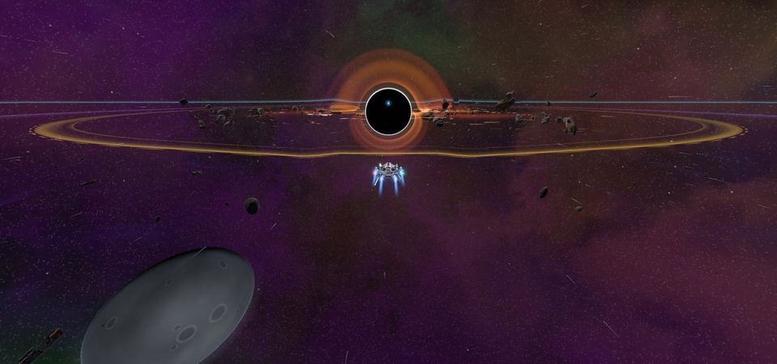
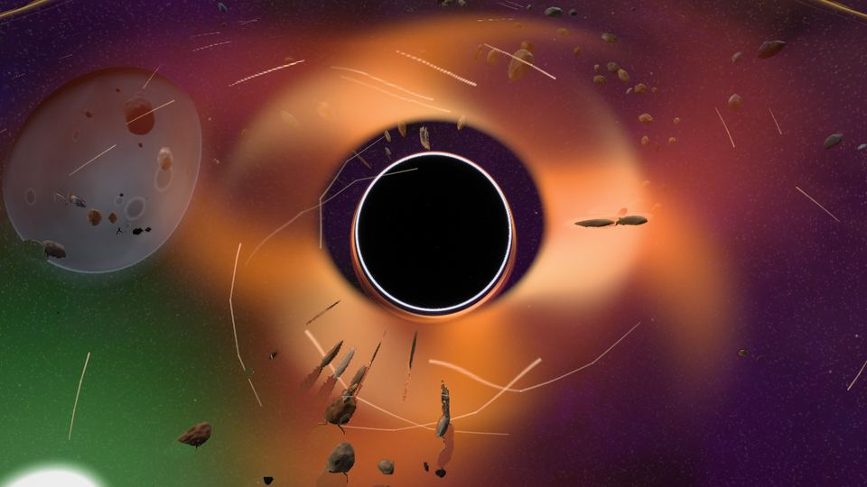

<!-- wiki-i18n source: 1052f444fa6b763d -->
<!-- wiki-i18n title: 黑洞 -->
# 黑洞 {#the-black-hole}

<!-- wiki-search: black hole -->

在危险星区 4（`DS-4`，PvP 区域的中心）的正中央，一个黑洞悬在黑暗之中。它在每个世界（Alpha、Beta 和 Gamma）里都一样，赛季的每一天也都一样，和平协议期间同样如此。它会吞噬一切靠得太近的东西，只归还一样东西：向它射入 N.I.K.E. 火箭所换来的 [Dark Matter](#dark-matter)。从研究到板的完整流程见 [Dark Matter 与 Dark Matter Plate](/wiki/03-Mechanics/Dark-Matter.md)。

## 各个环带 {#the-rings}

距离从星区中心算起，单位是地图单位。星区大小为 32,000 × 18,000 单位。

| 环带 | 距离 | 会发生什么 |
| :--- | ---: | :--- |
| **辐射** | 4,000 | 你的舰船每秒都会受到伤害，伤害是其最大生命值总量的一个比例。越近，伤害越大。 |
| **引力** | 3,000 | 黑洞把你的舰船拉向中心，离得越近拉得越猛。不在飞行的舰船会被带着走。 |
| **不归点** | 约 1,000 到 2,600 | 引力等于你舰船速度的位置。在它以内，即使全速前进，你也会被吸进去。它取决于你的速度。 |
| **事件视界** | 300 | 任何到达这里的舰船都会立刻被摧毁，无论船体和护盾如何。 |

危险星区 4 的传送门，以及它们之间的航线，都远在辐射范围之外，所以你在途经时绝不会无意间撞上它。从赛季第 11 天起，同一星区的左上角、远离黑洞的地方还有 [Dormant Swamp](/wiki/03-Mechanics/Dormant-Swamp.md)；那里的外星人永远不会进入黑洞的环。

## 辐射 {#radiation}

每秒的伤害是**你舰船最大生命值总量的一个百分比**（船体加护盾），所以在同一距离上，每种舰船能撑的时间完全相同：Protos 和 Wraith 在 2,000 单位处，都会在 50 秒内把整艘满状态的舰船烧穿。

| 距离 | 每秒伤害 | 满状态舰船能撑 |
| ---: | ---: | ---: |
| 4,000 | 0.3% | 333 秒 |
| 3,500 | 0.55% | 182 秒 |
| 3,000 | 0.8% | 125 秒 |
| 2,000 | 2% | 50 秒 |
| 1,200 | 5% | 20 秒 |
| 700 | 11% | 9 秒 |
| 300 | 24% | 4 秒 |

两行之间的伤害呈直线上升。以下是标准配置每秒损失的生命值：

| 舰船 | 最大生命值总量 | 3,500 处 | 3,000 处 | 2,000 处 | 1,200 处 | 700 处 |
| :--- | ---: | ---: | ---: | ---: | ---: | ---: |
| Protos | 30,000 | 165 | 240 | 600 | 1,500 | 3,300 |
| Kitefin | 46,000 | 253 | 368 | 920 | 2,300 | 5,060 |
| Ostirion | 82,500 | 454 | 660 | 1,650 | 4,125 | 9,075 |
| Nomad | 130,500 | 718 | 1,044 | 2,610 | 6,525 | 14,355 |
| Paragon | 162,500 | 894 | 1,300 | 3,250 | 8,125 | 17,875 |
| Storm | 198,000 | 1,089 | 1,584 | 3,960 | 9,900 | 21,780 |
| Wraith | 372,000 | 2,046 | 2,976 | 7,440 | 18,600 | 40,920 |
| Ironclad | 673,200 | 3,703 | 5,386 | 13,464 | 33,660 | 74,052 |

- **护盾先承受**，然后才是船体。它不属于攻击：护盾的吸收率不起作用，也无法躲避。
- 辐射算作**受到伤害**：你的护盾不会充能，Repair Drone 会停止（“修理中断：辐射。”）且无法启动，而安全区要在最后一次辐射剂量过后 5 秒才会保护你。
- 增益和升级只会改变你的总量有多大，不会改变你能撑多久：伤害是总量的一个比例。
- 没有任何东西能让舰船免疫。辐射不属于攻击，所以没有东西能吸收它；但技能仍会在其中继续生效：Shield Surge 会在它的十秒内持续恢复你的护盾，Emergency Repair 会持续修复你的船体（它们不属于被辐射剂量中断的自然修复）。隐形也无法让舰船躲开辐射。

## 引力 {#the-pull}

在 3,000 单位以内，黑洞会把每艘舰船拉向中心，而且越近引力越强。它在边缘处很轻柔，进入 200 单位后就已经能明显感觉到：

| 距离 | 引力（单位/秒） | 不在飞行的舰船会被带着走 |
| ---: | ---: | :--- |
| 3,000 | 0 | 暂时没有 |
| 2,800 | 25 | 每秒 25 单位 |
| 2,300 | 60 | 每秒 60 单位 |
| 1,800 | 120 | 每秒 120 单位 |
| 1,300 | 220 | 每秒 220 单位 |
| 1,000 | 262 | 每秒 262 单位，并且还在上升 |
| 900 | 289 | 每秒 289 单位，并且迅速上升 |
| 700 | 496 | 约一秒就到达视界 |
| 300 | 2,829 | 事件视界 |

从 3,000 到 925 单位，引力在相邻两行之间呈直线上升；在 925 以内，它沿一条更陡的曲线变化（最后三行就在这条曲线上）。它像一股水流：会推动你的舰船，而你的引擎要与它对抗。

- **不飞行的舰船无法静止。**如果你停下来（到达了你点击的地点，或者你从未下过指令），黑洞会把你的舰船带向中心，你的指令也随之失效，所以无论引擎能飞多快，你的舰船都会不断坠落。想要停留在某处，就必须一直朝那里飞行：把鼠标按在那个位置上，你的舰船就能在速度高于引力的地方保持位置，在两次指令之间会略微下沉。在引力范围内停下来互相交火的两艘舰船，会一起被带进去。
- **飞行中的舰船会感到逆风。**径直飞离中心时，你舰船的速度会被所在位置的引力削减：速度为 155 时，在 2,800 处你每秒前进 130 单位，在 2,300 处是 95，在 1,800 处是 35，而在 1,500 处（引力为 180）则完全无法前进。

你的**不归点**是引力等于你速度的那个距离。速度为 150 的舰船，不归点在 1,650 单位处；你越快，它就越靠近中心：

| 舰船（标准配置） | 速度 | 不归点 |
| :--- | ---: | ---: |
| Ironclad | 99 | 1,974 |
| Protos | 165 | 1,577 |
| Kitefin | 184 | 1,480 |
| Ostirion | 208 | 1,362 |
| Nomad | 211 | 1,347 |
| Paragon | 222 | 1,287 |
| Wraith | 233 | 1,208 |
| Storm | 263 | 995 |

舰船设计会改变其舰船的速度，不归点也随之改变：DUMA 比 Ironclad 慢，NOTSUM 比 Storm 快。

速度超过每秒 272 单位的舰船（追求极速的配置，或开着 Afterburner 的标准 Wraith），不归点仍在它一贯所在的位置：速度为 300 时是 885，速度为 432 时是 747。

为速度而配置，你就能从更深处脱身；装满重型护盾，则做不到（一艘 Ironclad，也是最慢的舰船，14 个槽位全装 Heavy Shield Core 时，速度只有 39.1，不归点约在 2,600）。只有一阵爆发的速度，才能把一艘刚越过不归点不远的舰船拉回来：运行中的 [Afterburner](/wiki/03-Mechanics/Abilities.md) 就算数，并且在它运行期间会让不归点更靠近中心（一台引擎十秒，两台十五秒，三台二十秒；Afterburner III 会把标准 Protos 的不归点从 1,577 降到 989，把标准 Wraith 的从 1,208 降到 801）。在大约 390 单位以内，没有任何东西能脱身，哪怕是为速度而配置、所有速度属性都附魔到顶、并且最强爆发正在运行的舰船（附魔到上限的 Afterburner III，x1.69）；一艘未附魔、为速度而配置的舰船（Engine III 和 Adaptive Core III 各装三个 Impulse Thruster IV），带 Afterburner III，最好的情况下也只能从 430 以外脱身。

从不归点坠落的过程一开始很缓慢：一艘在不归点内几个单位处、全力飞行的舰船，会在二十秒甚至更久的时间里被吸进去，然后越来越快。引力不算飞行：它不计入飞行距离。

## 事件视界 {#the-event-horizon}

距离中心 300 单位时，舰船会被摧毁。而在途中因辐射而船体耗尽的舰船，则是被辐射摧毁。无论哪种情况：

- 这是一次普通的摧毁：你可以选择在哪里回来（参见[被摧毁与重生](/wiki/01-General/Getting-Started.md)），带着最多 10,000 的船体和空护盾（见该页面），付出的代价与以往每次被摧毁相同。“就地”绝不会让你回到环内：它会把你移到环外最近的一点（距中心 4,500 单位），并通知你。
- **没有残骸，没有货箱，没有战利品**，也不会损失荣誉。
- 你的被摧毁会像一次 PvP 击杀一样，记在**你的舰船被摧毁前 15 秒内最后一个击中它的敌方飞行员**名下：即属于另一个企业的飞行员（在允许 PvP 的地点和时间），无论那一击多么微小。它会作为击杀计入他的统计，并按你的舰船类型计入 PvP 排名积分，仅此而已。一次射击就够了；如果在这 15 秒内没有任何其他企业的飞行员击中过你，就没有人得到任何东西。
- 在这 15 秒内击中过你舰船的同企业飞行员，无论最终是什么摧毁了它，仍会损失误伤荣誉。
- 外星人和企业飞行员从不靠近它。如果有一个无论如何还是进入了其中，它会消失，没有战利品、奖励，也不留归属。

## 你所见所闻 {#what-you-see-and-hear}

视野很小（默认缩放下屏幕上约为 1,900 × 1,150 单位，缩放到最远时为 4,400 × 2,650），所以黑洞本身的画面只在距它约三千单位以内才会显示（缩放到最远时为 3,600）。从更远的地方，屏幕上没有任何东西指向它（请看小地图或下文的星系地图）；界面上的警告是为你靠近时准备的：

- **从远处看。**如果你把镜头压低，沿着平面向远处望去，那么无论你在星区的哪个位置，只要黑洞处于画面内，它就会被画在它在屏幕上所处的位置：一个带光环的黑色圆盘，笼罩在吸积光辉之中，其大小经过缩放，以保证容易看清（从最远的角落看去，约占画面高度的 2%，那个角落距它约 18,000 单位），当你靠近时，它会逐渐长成它自己的画面。其中没有任何东西会自己运动。当黑洞不在视野内时，屏幕上没有指向它的标记。
- **飞行平面上的环。**一条紫罗兰色的光带，辉光向外延伸到辐射边缘（4,000 单位）处形成清晰的边线，另一条较细的琥珀色光带标出引力的边缘（3,000）。在引力范围内，一条**红线**显示*你自己的*不归点。它跟随你的速度，所以你的舰船变快或变慢时，它也会移动。
- **仪表**，位于快捷栏上方，在距辐射边缘一千单位以内出现，并在你受辐射期间一直保留。它显示以舰船生命值总量每秒百分比计的辐射、仅靠辐射烧穿你剩余生命值所需的时间（“31 秒后致命”，不足十秒时变红）、一条该生命值的进度条、你所在位置的引力与你速度的对比，以及距离你的不归点还要飞多远，越过不归点后则变成闪烁的警告。把指针悬停在某一行上可查看它的含义；点击 (i) 会打开一张说明卡片。
- **屏幕边缘**泛起紫罗兰色的光，随着剂量上升变成红色，并且每秒脉动一次。
- **小地图**把黑洞及其环画成椭圆（图会随窗口拉伸），它的提示会写出各个半径。星图用一个小小的黑洞标记这个星区。
- **辐射计数器**的咔嗒声随着剂量上升而加快，压过战斗的声响。当你越过边缘时，以及再次到达你的不归点时，会响起双音警告；从约 6,500 单位起能听到低沉的隆隆声，离得越近音调越低。
- **画面本身：**从**中画质**起（开启后期处理时），黑洞是逐条追踪光线绘制的：一个黑色的阴影，外围一圈细细的白色光子环，以及光线所能抵达你眼中的吸积盘。镜头较高时，它是围着黑暗的一圈明亮光环；把镜头压低，吸积盘的远侧会向上弯过黑洞顶部，它的下侧会弯到黑洞下方，近侧则从前方横过。黑洞背后的天空也会弯曲，程度适中：星星、星云、行星和小行星被推向阴影外侧，它们的线条绕着阴影弯曲。舰船画在黑洞之上，不再被它涂黑：位于你与黑洞之间的船体会留在前面。中画质追踪光线的圈数更少，画出的吸积盘像更少，也没有朝向你转动一侧的增亮，这些由高画质和极高画质加上。**低画质**以及没有后期处理的画面沿用旧画面：一个带明亮光环的黑色圆盘，加上由三层相互反向旋转的吸积盘，天空不弯曲。无法构建新画面的显卡同样退回旧画面，只保留旧画面中星星的轻微弯曲。每一档画质都会加上沿引力方向坠入的物质流线（它们以引力自身的速度下落，所以不飞行的舰船会与它们同步被带走，而逆着引力飞出的舰船会看到它们从身边飞速掠过）。被引力带着走的舰船不会喷出引擎火焰，也不留尾迹；逆着引力飞出的舰船则以全速的火焰穿过这股洪流，它的尾迹会朝黑洞方向流去。镜头的颤动随引力增强，按你舰船速度的比例计算，在你的不归点处达到设定的强度，并一直增强到视界。被黑洞灼烧的舰船会迸出紫罗兰色的火花；被它吞噬的舰船会被拉向中心并被拉成细丝。这个星区的天空是 `DS-3` 那种深紫罗兰色加绿色的天空。
- **碎片：**岩石和破损船体的碎片环绕黑洞运行，并沿螺旋轨迹坠入，从它引力的边缘一直坠向视界：一开始很慢，然后越来越快，离得越近，绕行和翻滚得就越快。它们在吸积盘的光芒中泛着橙色光，被撕裂时被拉长成针状，并在抵达视界之前就消失了。其中有几块大岩石，有些飘浮在飞行平面上方，所以舰船会从它们下面经过。它们只是布景：没有东西会撞到它们，它们也不会撞到任何东西，并且只在距黑洞约四千单位以内显示，向 6,500 渐渐淡出。吸积盘的光芒在你的舰船靠近时也会洒在它身上。
- **当你阵亡时**，死亡界面会说明原因：“被黑洞吞噬”或“被辐射烧毁”，游戏日志里也有这一行。

在黑洞负担很重，或者刺眼的地方，设置可以帮上忙：**减弱动态效果**会让吸积盘和流线停止，让碎片保持静止，并停止屏幕边缘的脉动，**减弱屏幕震动**则会停止黑洞附近的镜头颤动；**低画质**会沿用旧画面、不使用光线追踪透镜，绘制更少的流线（40 条，中画质为 100，更高为 200）和更少的碎片（30 块，中画质为 80，更高为 160），把光环烧得更亮来弥补，并且在绘制远景时少画一层辉光。较低的**粒子质量**会让碎片变稀疏，就像让背景中的岩石变稀疏一样。

## 避开黑洞 {#staying-out}

- 服务器会为你导航：如果一个移动指令会让你的舰船穿过辐射环（距中心 4,200 单位，比辐射本身稍宽一些），舰船就会改为沿着环的边缘**绕行**。终点在环内的指令会按原样飞行；进入环内是你自己的选择。横穿星区的路线最多会多出五分之一的路程，传送门之间的航线则不会多出任何路程。
- 当你越过辐射的边缘、引力的边缘以及你自己的不归点时，聊天的**系统**标签页会发出警告，当你脱离影响范围时会再次提示。这些行不会出现在**全球**或**本地**标签页里。
- 如果你在辐射区内、引力范围之外退出游戏，回来时你会在环的外边缘，保持原位，船体状态与离开时相同。如果你在**引力范围内**（3,000 单位）退出，回来时你会恰好在离开的位置，船体状态与离开时相同，而坠落仍在继续：下线并不能让你逃出黑洞。
- 旧版本的游戏不会显示黑洞。它仍然会收到警告和导航，并且仍然可以通过下达指令飞进环内。

无人机随它们的舰船一起飞行。货物绝不会放置在环内：本来会落在环内的货箱，会被放在它的边缘。Dark Matter 货箱是唯一的例外。

## 获取 Dark Matter {#dark-matter}

刚接触 Dark Matter？从研究到板的完整流程见 [Dark Matter 与 Dark Matter Plate](/wiki/03-Mechanics/Dark-Matter.md)。本节讲的是黑洞这一侧。

黑洞会为抵达它的 **N.I.K.E.** 火箭归还 **Dark Matter**。N.I.K.E. 是一枚伤害 67,500 到 75,000 的火箭，它会命中遇到的第一艘它可以伤害的舰船，并在其上耗尽；如果路上没有阻挡，它就会飞向黑洞，并在越过事件视界时耗尽。研究出科技后（[研究](/wiki/03-Mechanics/Research.md)），[装配站](/wiki/06-Items/Rockets.md)可以制造 N.I.K.E.，每次制造五枚（100,000 信用点、1,500 Thulium、20 Ship Fragment、4 Reinforced Hull Plate、40 Cataclysite）。

- **发射。** N.I.K.E. 在 4.5 秒内飞过 4,050 单位（每秒 900），径直飞向你瞄准的位置：没有选中目标时，把光标放在黑洞上（或让你的舰船朝向它）。从辐射边缘（4,000 单位）到距中心 4,380 单位之间的任何位置发射，它都能抵达视界。再远一些就会射程不足，白白浪费。和所有火箭一样，它使用所有火箭共用的装填计时，发射后要等 4.6 秒才能发射下一枚（不需要装备激光）；发射它会结束你的安全区保护和你的隐形。**航线上的舰船会替黑洞承受它**：在边缘守候的对手，或在途中拾取货箱的其他企业的飞行员，会被打出 67,500 到 75,000 的伤害，而黑洞什么也得不到。外星人和企业飞行员从不进入环内，所以航线是否畅通，要靠你自己保证；它会穿过你自己企业的飞行员，也会穿过对你而言处于安全状态的舰船。如果你在开火后离开地图，它会继续飞行而不伤害任何人，并且仍然会为你产出 Dark Matter。无人机编队可以改变命中的伤害，但改变不了 N.I.K.E. 之后的等待时间（见[无人机编队与火箭](/wiki/06-Items/Rockets.md#drone-formations-and-rockets)）。
- **产出什么。**每枚抵达视界的 N.I.K.E. 会产出 **1、2 或 3 个 Dark Matter**（平均 2 个，所以大约五枚 N.I.K.E. 能产出十个），装在一两个小货箱中，出现在黑洞区域的边缘，**距中心 3,050 到 3,950 单位**，靠近你那一发射入的路线。引力在 3,000 处结束，所以货箱和前来拾取它们的舰船不会被拉扯，而那里的辐射是每秒舰船生命值的 0.3% 到 0.8%：在这条带的中间待一分钟，会耗掉你舰船的三分之一。满状态的舰船在那里能撑三分钟。
- **归谁所有。**从射击起 **60 秒**内，这些货箱归你和你的战队所有。之后地图上的任何人都可以拾取它们，并且它们会在 **4 分钟**后飘走。危险星区是 PvP 星区，所以要做好有人来抢的准备。在开火后下线的飞行员，仍然拥有它的货箱。
- **数量上限。**一张地图最多容纳 32 个 Dark Matter 货箱；新的货箱会把其中最旧的挤掉，而绝不会挤掉其他种类的货箱。[Resource Magnet Booster](/wiki/03-Mechanics/Cargo.md) 不会给 Dark Matter 增加任何东西。
- **你会看到什么。**当 N.I.K.E. 越过视界时，它会被拉长并扯入黑洞，空间从它进入的地方泛起涟漪，吸积盘和光子环会闪耀约一秒半（在**减弱动态效果**下是其三分之一的时间、一半的亮度）。片刻之后，货箱从黑洞中飞出，飘向它们在边缘上的位置：每个都是一颗带明亮边缘和闪光的紫黑色球体，从远处就很容易看见，悬停时标题为 **Dark Matter**。属于你的货箱上方会显示你剩余的秒数，并在小地图上显示为一个小小的紫罗兰色标记，你的战队也一样；其他飞行员的货箱，要等他们的那一分钟过去之后才会显示在小地图上。
- **有什么用。**装配站可以把 5 个 Dark Matter 连同一块 Velkonite Reinforced Plate 和一块 Orvium Reinforced Plate 压制成一块 **Dark Matter Plate**，而[锻造炉](/wiki/06-Items/Forge.md)需要两块这样的板，才能把物品从神圣提升到裂变，再从裂变提升到永恒：每一步需要十个 Dark Matter。每条升级链的最后一阶需要 3 块板，即每件 15 个 Dark Matter：IV 阶的 Amp、护盾电池和推进器，以及 Heavy Shield Core、Engine III、Adaptive Core III、Helios Beam、Extra Slots CPU III 和 Base CPU II。Skylab 的[研究中心](/wiki/03-Mechanics/Research.md#dark-matter)同样需要 Dark Matter：科技树顶端的 16 项科技每项 10 个，共 160 个，须在研究开始前添加到研究中心。无人机编队同样需要 Dark Matter，按强度为 5、13 或 20 个：另外 189 个，共 349 个。Hull Plating 的两项研究另外需要 65 个，舰船的 13 种设计和 36 项装甲科技另外需要 490 个（[研究](/wiki/03-Mechanics/Research.md#ship-technologies)）。一个带有三个 IV 阶 Amp 的 Helios Beam 含有 60 个 Dark Matter，全部用最后一阶部件的 Wraith 则含有 900 个（[Dark Matter 与 Dark Matter Plate](/wiki/03-Mechanics/Dark-Matter.md#what-the-last-tier-asks-for)）。
