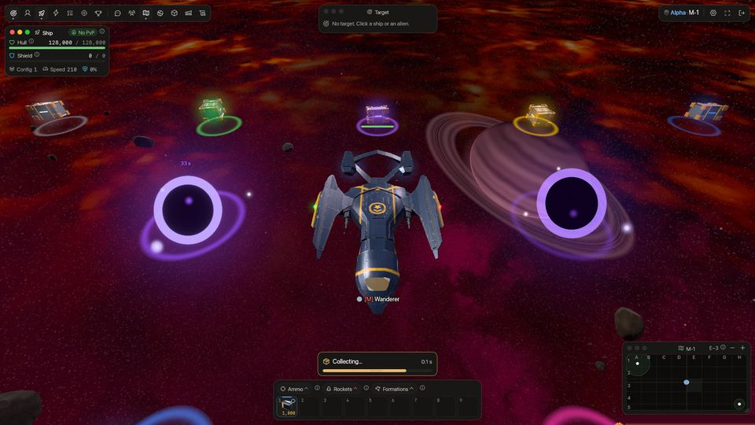

<!-- wiki-i18n source: e8ccf0e85479a269 -->
<!-- wiki-i18n title: 货箱 -->
# 货箱 {#cargo-boxes}

被摧毁的外星人会把战利品以发光货箱的形式留在太空中。飞过去，赶在别人之前把它们拾取起来。

## 掉落内容 {#what-drops}

- **外星人**会在爆炸的位置留下一个货箱，里面是各外星人*战利品掉落*一节所列的资源和部件（参见[外星人](/wiki/04-Aliens/Phantasm.md)各篇）。信用点、Thulium、经验值和荣誉仍会在你完成击杀的瞬间发放。如果某个外星人的战利品判定结果为空（例如 Seeker，五次中有四次），就不会留下货箱。
- **企业飞行员**被摧毁时不会留下货箱，无论摧毁他们的是谁或是什么。参见[企业飞行员](/wiki/03-Mechanics/Company-Pilots.md)。
- **玩家舰船**被摧毁时不会留下残骸，也不会留下货箱，无论摧毁它们的是谁或是什么，飞行员的物品栏里也不会被拿走任何东西。
- **黑洞**会为射入其中的 N.I.K.E. 火箭，在它所在区域的边缘放置装有 **Dark Matter** 的货箱（参见[黑洞](/wiki/03-Mechanics/Black-Hole.md)）。这是唯一一种会落在黑洞环内的货箱。
- **[虫群](/wiki/05-Swarms/Swarms.md)的头领和 Dormant Pulse** 会掉落专属的货箱，里面有弹药、火箭和资源。货箱为对其造成伤害最多的飞行员（及其战队）保留，而不是第一个击中它的飞行员。
- **[Clan Warden](/wiki/03-Mechanics/Clans.md#warden-pay-and-loot)** 不会掉落这样的货箱：每名造成至少 5% 伤害的飞行员都会得到属于自己的[私人货箱](#private-boxes)，里面是他那一份战利品。
- **[小行星](/wiki/03-Mechanics/Asteroid-Mining.md)**不留下货箱，而是留下**碎块**：装着信用点和 Thulium 的小金块和水晶，以及装着矿石的石头。信用点和 Thulium 在拾取碎块时支付，而不是在小行星碎裂时，并且每 24 小时有一个上限。碎块像货箱一样拾取，先为挣得它的飞行员保留，之后像货箱一样对所有人开放。

如果外星人是被企业飞行员击杀的，它会为这次击杀所记在的飞行员掉落战利品（持有其归属权的那位飞行员；没有的话，则是与该外星人交战、且与这名企业飞行员同属一个企业的飞行员）。企业飞行员独自交战击杀的外星人则什么都不掉落，因为企业飞行员从不拾取。

货箱的灯光颜色取决于箱内最稀有的物品：普通战利品是青色，从优秀到永恒则依次是绿色、蓝色、紫色、粉色、金色和橙红色。

## 拾取 {#collecting}

- **左键单击**货箱：你的舰船会飞向它，进入拾取范围（200 单位）后将其取走。点击货箱不算移动指令；任何其他移动指令（在太空中点击、点击小地图）都会取消拾取。如果指针正下方同时还有舰船或外星人，这次点击会交给离指针更近的那个，因此战斗经过货箱上方时，你的目标不会丢失。
- **拾取需要半秒。**一旦你的舰船进入范围并获准取走货箱，拾取就开始了：快捷栏上方的进度条（“拾取中…”）逐渐填满，一道光束扫描货箱。你的舰船会继续飞行，进度条一满，货箱就归你了。飞出范围，或者货箱被其他飞行员抢先取走，拾取就会取消。无论在哪里，受到攻击都不会打断拾取。
- 你一次只能做一件事：[跃迁](/wiki/01-General/Spacemap%20Travel.md)期间无法拾取，而开始跃迁会放弃拾取。对正在拾取的货箱再次发出拾取指令，不会有任何变化。
- 将指针悬停在货箱上，可以看到里面有什么、它为谁保留，以及在最后一分钟内还剩多少时间。
- 拾取货箱时，原地会响起一声短促的拾取音效；你也能听到附近其他飞行员的拾取声，只是更轻一些。
- 你拾取的东西会直接进入机库物品栏，叠加到你那种物品的散装堆叠上（绝不会放到装备上，也不会放进运输储藏库里的任何东西上）。弹出的提示会告诉你得到了什么；连续拾取的多个货箱会累加在同一条提示里。
- 你拾取的东西是**可交易**的：可以在[拍卖行](/wiki/03-Mechanics/Auction.md#marketable-items)出售。
- 当[小行星](/wiki/03-Mechanics/Asteroid-Mining.md)的一块碎块归你之后，你的舰船会自己前往触及范围内你可以拿的下一块碎块；你下达任何移动命令都会让它停下。

## 归谁所有 {#who-gets-it}

- 获得击杀奖励的飞行员，以及该飞行员所在**战队**的成员，会在 **30 秒**内独占这个货箱。对外星人而言，这位飞行员就是持有其归属权的那位，也就是第一个击中它的人（参见[战斗](/wiki/03-Mechanics/Combat.md)），不论最后一击是谁打的。其他飞行员看到的货箱是变暗的，暂时无法拾取；飞向货箱的舰船会在附近等待，直到时间结束。
- 此后，地图上的**任何人**都可以拾取。
- 只有处于货箱所在地图上的舰船才能拾取：如果你在途中（或拾取所需的那半秒内）被摧毁、跃迁或下线，货箱就会留给其他人。
- 如果两名飞行员同时拾取同一个货箱，先拾取完成的那位得到它，且只会得到一次；另一位会被告知货箱已经没了。
- 无人拾取的货箱会在 **3 分钟**后飘走（最后 10 秒会闪烁）。一张地图最多容纳 64 个货箱；新货箱若会超出这个数量，最旧的那个就会消失。小行星碎块在这 64 个之内有自己单独的名额：它们不会挤走其他货箱，其他货箱也不会挤走碎块（[规则](/wiki/03-Mechanics/Asteroid-Mining.md#the-rules)）。Dark Matter 货箱可存在 4 分钟，其中第一分钟只属于你。

## 私人货箱 {#private-boxes}

[Clan Warden](/wiki/03-Mechanics/Clans.md#warden-pay-and-loot) 的战利品不是给一名飞行员的一个货箱：**每名造成至少 5% 伤害的飞行员都会得到属于自己的货箱**，按他那一份抽取（造成 20% 的伤害，就是每个数量的约五分之一；[详情](/wiki/03-Mechanics/Clans.md#warden-pay-and-loot)）。

- **只有你看得到，也只有你能拾取。** 你的战队和小队看不到，也拿不走；对其他所有人来说，它根本不存在。在你的屏幕上，它下面有一圈细环。
- **它会在击毁后保留 10 分钟**，这段时间一直是你的：没有 30 秒的等待。之后它会像任何货箱一样飘走。守卫倒下时，游戏日志会告诉你你的战利品份额。
- **它不会挤掉其他货箱。** 私人货箱在地图的 64 个之外有自己的名额（最多 32 个），所以击毁守卫永远不会占掉其他货箱的位置，地图满了也不会让你丢掉自己的货箱。
- 拾取方式与任何货箱相同（[见上](#collecting)）：你的飞船飞过去，拾取需要半秒。

## 增益 {#boosters}

- **Loot Luck Booster**（以及永久幸运加成）会在击杀者完成击杀时，提高每一项战利品的掉落几率。
- **Resource Magnet Booster** 会让你拾取的每个货箱中的资源增加 **25%**，无论击杀者是谁。Dark Matter 是例外：Magnet 不会给它增加任何东西，所以五枚 N.I.K.E. 对每个人来说都是十个 Dark Matter。
