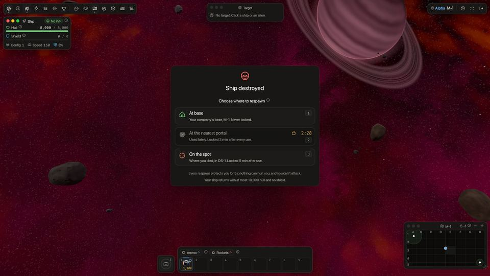
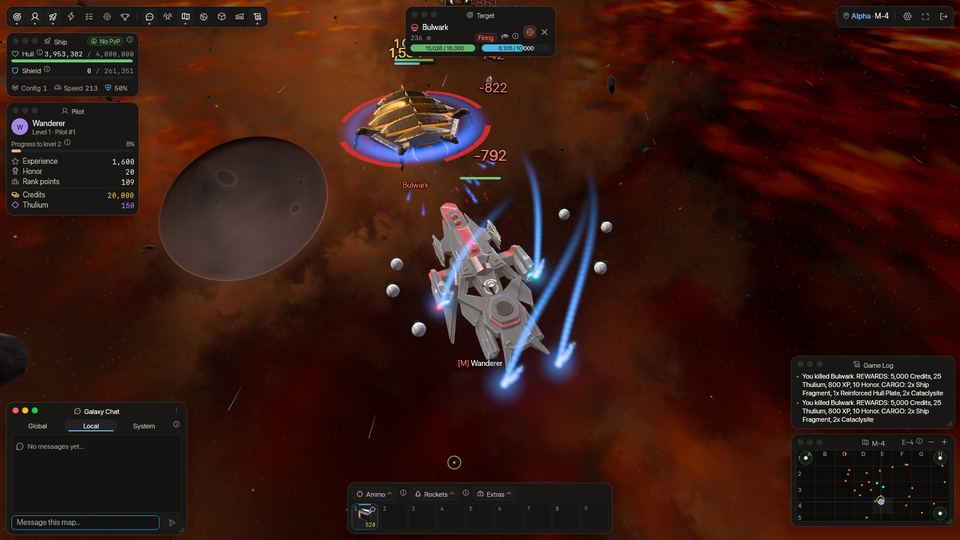
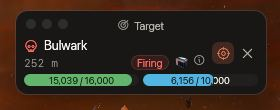

<!-- wiki-i18n source: 2329e422c8d1d27c -->
<!-- wiki-i18n title: 战斗 -->
# 战斗机制 {#combat-mechanics}

本节详细介绍 SpaceCorps 的战斗中，伤害是如何计算、结算和修复的。

## 伤害计算 {#damage-calculation}

舰船发射激光时，服务器按以下顺序计算伤害输出：

### 1. 基础伤害与随机浮动 {#1-base-damage-random-variance}

所有已装备激光（包括无人机上的激光）及其槽位中的激光增幅器的基础伤害会被相加。
- **随机浮动**：一轮齐射的实际伤害会在基础伤害总和的 **80%** 到 **100%** 之间随机取值。
  - 公式：`Roll = (0.8 + (Random * 0.2)) * BaseDamage`

### 2. 暴击 {#2-critical-hits}

每一轮齐射都有几率成为暴击。
- **暴击率**：已装备激光的平均暴击率，加上所有已装备激光增幅器暴击率之和。
- **暴击倍率**：如果一次射击暴击，伤害值会乘以 **1.5 倍**。暴击齐射的伤害数字显示为冰青色，字号更大，并带有“!”。
- Quantum Laser 1 和 2 自身没有暴击率：暴击率来自它们的增幅器。
- **固定暴击伤害**：激光增幅器提供的任何固定暴击伤害，会在倍率之后再加上。
  - 公式：`CritDamage = (Roll * 1.5) + FixedCritDamage`

### 3. 全局倍率 {#3-global-multipliers}

最后，应用全局倍率（例如生效中的增益，或 x2、x3、x4 这样的激光弹药倍率），得到最终伤害输出：
- 公式：`FinalDamage = Damage * AmmoMultiplier * (1.0 + BoosterDamagePercent)`
- 正在使用的[无人机编队](/wiki/03-Mechanics/Formations.md)可能会再乘一次：例如 Auger 激光伤害 +21%，Gyre −11%，对外星人则是 Culler +12%（是单独的系数，不属于增益的百分比）。
- **Siphon Battery** 弹药的倍率是 x1，但作用对象不同：它的伤害只从目标的护盾中扣除（无论吸收率多少，都绝不会伤及船体），并转入你自己的护盾，最高不超过你的护盾上限。见[激光与弹药](/wiki/06-Items/Lasers.md)。

### 3b. 火箭 {#3b-rockets}

[火箭](/wiki/06-Items/Rockets.md)有自己的伤害（Lancet I 为 1,600 到 2,000，Lancet III 为 4,800 到 6,000，N.U.K.E. 为 45,000 到 50,000），在发射时随机决定一次，对每艘舰船都一样：你的激光、增幅器、增益和弹药都不会改变它，它也不会暴击。所有火箭共用一个 **5 秒**的装填计时器。单体火箭带有**护盾穿透**：它会从你目标的吸收率中扣除（见下文“承受伤害与安全区”）；爆炸会伤害半径内的每一艘舰船，越靠近边缘伤害越低。火箭能从飞行员的舰船上夺走多少，没有任何上限：先扣护盾，再扣船体。火箭绝不会伤害你自己的企业或你自己的[小队](/wiki/03-Mechanics/Groups.md)，无论其中的成员来自哪个企业。正在使用的[无人机编队](/wiki/03-Mechanics/Formations.md)是唯一能同时改变这两者的东西：火箭编队会提高每枚火箭的伤害（最高 +55%），有些编队还会让计时器变长或变短。

### 4. 面向目标 {#4-facing-the-target}

已锁定目标并开火的舰船或外星人会转向面对目标，无论它朝哪个方向飞行（盘旋、后退或静止不动），停火后则转回原来的航向。

### 5. 射程 {#5-range}

当目标处于**射程**之内时，舰船每秒发射一轮齐射；目标更远时则停火：停火期间不消耗弹药，直到目标再次足够近，同时目标面板会显示“超出射程”。射程是**你所有激光射程的平均值**（无人机上的激光也算），四舍五入到整数单位，并且是整艘舰船共用的一个数值：在射程之内每门激光都开火，在射程之外则都不开火。因此，把一门远射程激光和几门短射程激光装在一起，并不会延长你的射程：一门 Starfire-3（850）加两门 Quantum Laser 2（700），射程是 750。锻造炉的射程加成在取平均值之前，先算在它所在的那门激光上。没有激光的舰船无法发射激光，机库对它不显示射程（显示为一条短横线）；它的火箭仍然可以发射，每枚火箭有各自的射程（见[火箭](/wiki/06-Items/Rockets.md)）。每门激光自身的射程见[激光与弹药](/wiki/06-Items/Lasers.md)。

---

## 击杀奖励：先手归属 {#kill-rewards-first-hit-claims}

外星人的奖励归最先向它开火的飞行员所有，而不是打出最后一击的人。

- **获得归属**：第一个用射击对外星人造成伤害的飞行员，获得它的归属。你的每一次命中都会刷新你的归属。
- **失去归属**：如果你有 **10 秒**没有命中该外星人，你的归属就会失效，下一个命中它的飞行员将获得归属。你的舰船被摧毁或你离开地图（通过传送门，或退出登录）时，你的归属同样会结束，并且在 10 秒内返回也不会恢复。
- **击杀**：外星人被摧毁时，持有其归属的飞行员获得一切：信用点、Thulium、经验值、荣誉，用于任务和重置点数的击杀计数，以及[货箱](/wiki/03-Mechanics/Cargo.md)。补刀击杀了他人持有归属的外星人的飞行员什么都得不到，游戏日志会这样告知。当你的归属为你带来奖励、而最后一击由另一名飞行员打出时，游戏日志会点出这名飞行员，并说明你的归属让你获得了奖励。
- **排名积分**：击杀还会为持有归属的飞行员的排名增加 PvE 积分，外星人越难击杀，积分越多：Seeker 1 分、Phantasm 2 分、Bulwark 4 分、Goombah 7 分、Crystalys 16 分（每个外星人的文章里都写有自己的数值）。这些积分只属于击杀者本人，小队分享的奖励不包含它们。
- **查看归属**：当你选中一个已被其他飞行员持有归属的外星人时，目标窗口会显示 *归属：* 该飞行员的名字，以及 *无奖励*。
- [企业飞行员](/wiki/03-Mechanics/Company-Pilots.md)从不获得外星人的归属，他们补刀击杀的外星人，奖励仍归持有其归属的飞行员。
- [小队](/wiki/03-Mechanics/Groups.md)中的飞行员，会把自己归属带来的奖励分给在附近且正在开火的队友；归属本身只属于这名飞行员一人。
- **[虫群](/wiki/05-Swarms/Swarms.md)的头领、Dormant Pulse 和 [Clan Warden](/wiki/03-Mechanics/Clans.md#warden-pay-and-loot) 是例外**：虫群 Boss、每个 Dormant Pulse 和每个 Clan Warden 按每名飞行员对其造成的伤害支付奖励，而不是按第一击，各自的货箱归造成伤害最多的飞行员（[Boss 击杀如何支付奖励](/wiki/05-Swarms/Swarms.md#how-a-boss-kill-pays)）。其余的随从（Pirate Scout 和 Seeker Slave）和任何外星人一样按归属支付。虫群舰船的 PvE 积分见虫群页面。

---

## 只会还击的外星人 {#aliens-that-only-fight-back}

Seeker 和 Goombah 从不主动挑起战斗。它们会转向击中自己的飞行员（必须是造成了伤害的命中；其他外星人的火力绝不会激怒它），并与[外星人与谁交战](#who-an-alien-fights)一节所述的那名飞行员交战，在任何人最后一次击中它之后 **10 秒**放弃。被放着不管 **30 秒**后，它的船体每秒修复最大值的 2%。其他外星人（Phantasm、Bulwark、Crystalys）会攻击进入其仇恨范围（分别为 700、700 和 900 单位）的任何不受保护的飞行员，并且从不修复船体；每个外星人的护盾在其最后一次被击中的 15 秒后开始充能。

---

## 外星人与谁交战 {#who-an-alien-fights}

外星人会一直与**最先向它开火的飞行员**交战，只要它仍然能追击那名飞行员：那名飞行员仍在地图上，不在安全区内，没有隐形、也不在自己 EMP 的生效期内，没有被摧毁，并且在最近 **10 秒**内击中过它（每次命中都会重新开始这 10 秒：无论是一轮激光齐射、一枚火箭，还是爆炸的边缘）。只要这些条件成立，其他飞行员的射击就绝不会让它转向，无论他们离得多近、命中得多频繁，所以一名飞行员可以牵制住一个外星人，而其他人则向它开火。

当第一名飞行员脱离战斗时（离开地图、进入安全区、隐形或进入 EMP 生效期、被摧毁，或者有 10 秒没有再击中该外星人），外星人会转向**下一名**加入战斗的飞行员，顺序按他们首次向它开火的先后，而不是转向最后一个击中它的那一名。脱离战斗后又重新向它开火的飞行员，会排到队尾。外星人会记录最先向它开火的 **32** 名飞行员；第 33 名开火者在其中有人脱离战斗之前，不参与这个队列；而无论人群有多大，外星人始终咬住队列中的第一名。

[企业飞行员](/wiki/03-Mechanics/Company-Pilots.md)排在所有玩家之后：只有当没有任何一名它仍能追击的玩家向它开过火时，外星人才会与企业飞行员交战；玩家向正与企业飞行员交战的外星人开火时，就会把这个外星人接手过来；企业飞行员绝不会把外星人从玩家身上引开。以上这些都不会改变谁获得外星人的奖励：奖励由归属决定（[击杀奖励](#kill-rewards-first-hit-claims)）。

---

## 外星人失去兴趣 {#aliens-lose-interest}

没有哪种外星人会追着你跑遍整张地图。但是，一个正被你**击中**的外星人并没有失去兴趣，它正在与你交战：在你最后一次命中后的 **10 秒**内（每次命中都会重新开始这 10 秒，无论是一轮激光齐射、一枚火箭，还是爆炸的边缘），只要你在它的攻击范围之外（Seeker 600，Phantasm 和 Bulwark 700，Goombah 800，Crystalys 900），它就会以自己的速度向你飞来，并持续逼近和开火，直到你进入它的攻击范围。只要你一直击中它，它追击的距离就没有上限。射程比外星人武器更远的激光（Starfire-3 的射程为 850 单位，Helios Beam 为 900）并不能让你在它无法还击的位置命中它，而更快的舰船也只能在你持续射击期间让它一直跟在你身后。只要你抵达安全区、隐形或离开地图，它仍会立刻放弃你。

当多名飞行员击中同一个外星人时，它会一直咬住最先向它开火的那一个（参见[外星人与谁交战](#who-an-alien-fights)）：它会向那名飞行员逼近并开火，所以一群人围在它攻击范围之外，无法让它在彼此之间来回奔跑而始终不予还击。

已经把你当作目标的外星人（你靠近过的 Phantasm、Bulwark 或 Crystalys，或任何被你射击过的外星人），如果你已有 10 秒没有击中它，那么只要下列任一条件成立，它就会放弃：

- **你从未射击过它**：你离它超过 **1,200 单位**，或者它已经从开始追击的位置飞出了 **2,000 单位**。
- **你在最近一分钟内射击过它**：你离它超过 **2,500 单位**，或者它已经从开始追击的位置飞出了 **3,000 单位**。你挑起的战斗会继续公平地打下去。

放弃的外星人会从原地开始游荡，绝不会朝它最后一次看到你的位置游荡过去（即使你隐形或发射 EMP 也一样），并且在 **8 秒**内不会再次选你为目标，除非你射击它。每个外星人各自做出决定，所以当你飞远时，混编的一群会逐渐散开。外星人绝不会跟着你进入安全区或穿过传送门，在安全区附近丢失你的外星人会各自朝不同方向离开，所以它们不会挤成一堆干等。外星人的兴趣距离不会短于其攻击范围和仇恨范围再加上 100 单位。

外星人之间不会互相推开：追着一名飞行员的一群外星人会逼近，彼此的飞船之间不留间隙；失去飞行员的一群外星人，只有在各自选择去向后才会散开。不过外星人会避开**舰船**：它们绝不会跑进飞行员的船体里，而停在某个外星人身上的飞行员会把它推开。

飞得更快只能帮到你这么多：Protos（160）不比任何会追击的外星人快（Phantasm 160，Bulwark 175，Crystalys 230），所以结束追击的是追击距离上限，而不是你的速度。

---

## 承受伤害与安全区 {#taking-damage-safe-zones}

当你的舰船被敌人或 NPC 击中时，伤害按如下方式处理：

### 1. 护盾吸收 {#1-shield-absorption}

来袭伤害会按你舰船的**平均吸收率**，在护盾和生命值之间分配：平均吸收率是各护盾的吸收率（各自连同其护盾电池的吸收率）的平均值，再加上赛季商店的 Shield Absorbance Boost（见[护盾机制](/wiki/03-Mechanics/Shields.md)）。它**没有 100% 的上限**：护盾承受一次攻击的份额，等于你的吸收率**减去攻击方的护盾穿透**，结果限制在 0% 到 100% 之间。
- 每次攻击的**吸收率**份额（例如，最好的护盾配最好的电池为 80%，一个 Basic Shield Core 加两个 Absorption Shield Cell I 为 56%）由护盾承受，再减去该次攻击的穿透：Lancet III 的 35% 会让 80% 吸收率的舰船的护盾只承受 45%，其余部分（这里是 55%）直接打在 HP 上。
- **护盾穿透**来自单体火箭（10% 至 35%）以及 x3 和 x4 激光弹药（5% 和 10%）；外星人没有穿透。吸收率超过 100% 的舰船（比如 112%），能让护盾整次承受穿透不超过超出部分（这里是 12%）的攻击。
- 护盾值不足以承担其份额时，差额会转给 HP；如果护盾完全耗尽，剩余的全部伤害的 **100%** 都会打在 HP 上。
- 外星人没有吸收率属性：它们的护盾承受每次攻击的 80%（再减去该次攻击的穿透），船体承受其余部分。
- **无人机编队。** Rampart 把你的吸收率提高 17%（Shrike 降低 6%），Asterism 让每次对你的直接命中都有 7% 的几率完全不造成伤害（会浮现“未命中”），其余命中照常由护盾和船体分摊。Gemini（+9 点）和 Stiletto（+16）会给你自己的弹药和直接命中火箭增加穿透，总和最高 40%（[无人机编队](/wiki/03-Mechanics/Formations.md)）。

### 2. 安全区免疫 {#2-safe-zone-immunity}

每个阵营的基地（X-1 地图）都设有安全区。
- 进入安全区会让你的舰船完全免疫伤害。
- **攻击解除保护**：攻击敌人会立即解除你的安全区免疫，即使你身处安全区之内。
- 每个空间站和传送门周围都有一圈保护环，在你被击中后过了 5 秒、开火后过了 15 秒时，它就会保护你。当它保护着你、且你已脱离战斗时，可以通过机库窗口更换你的舰船而无需退出游戏：见[飞行中的机库](/wiki/03-Mechanics/Hangar.md)。
- 空间站只设在基地（`x-1`）。危险星区（`DS-1` 至 `DS-4`）没有空间站：那里唯一的安全区是传送门周围的保护环。

### 3. 在危险星区遭到攻击 {#3-under-attack-in-a-danger-sector}

穿过传送门的跃迁需要 3 秒（见[太空地图航行](/wiki/01-General/Spacemap%20Travel.md)）。在危险星区（`DS-1` 至 `DS-4`），如果飞行员的舰船在最近 **10 秒**内被其他飞行员或外星人击中，就无法开始跃迁，而命中也会取消正在进行的跃迁。在其他任何地方，攻击都不会打断跃迁，也没有任何东西会打断拾取[货箱](/wiki/03-Mechanics/Cargo.md)。

---

## 恢复与修理 {#recovery-repair}

战斗之后要恢复状态，飞行员可以依靠被动再生和主动的辅助机器人：

### 1. 护盾被动再生 {#1-shield-passive-regeneration}

- **运作方式**：每秒恢复相当于你护盾充能速率的护盾值。
- **延迟**：战斗会打断再生；只有在连续 **15 秒**未受伤害之后，被动再生才会恢复。
- **无人机编队**：Adamant 和 Redoubt 每秒都会回复护盾，战斗中也一样（见[无人机编队](/wiki/03-Mechanics/Formations.md)）。

### 1b. Siphon Battery

[Siphon Battery](/wiki/06-Items/Lasers.md) 弹药会把它从目标身上吸取的护盾立即加到你的护盾上，最高不超过你的上限。获得护盾不算受到伤害，所以不会延迟你的被动再生。

### 2. Repair Drone（船体修理） {#2-repair-drones-hull-repair-}

- **运作方式**：如果你装备了 Repair Drone（在机库的附加装置下），就可以从快捷栏启用它（把它从附加装置选择器拖到槽位上），它会修理你的船体（HP）。任何一次被击中都会将其关闭，船体满血时它也会停止。装备了 [Auto-Repair CPU](/wiki/06-Items/Extras.md#auto-repair-cpu) 时，你不必再次启用它：下面所说的延迟一过，CPU 就会自动放出 Repair Drone，除非你手动停止过它。
- **修理速率**：每秒恢复你最大生命值的一定百分比（只有装备的最好的那台 Repair Drone 生效，它们不会叠加）：
  - **Repair Drone I**：1.5% 最大 HP / 秒
  - **Repair Drone II**：2.25% 最大 HP / 秒
  - **Repair Drone III**：3.5% 最大 HP / 秒
  - **Repair Drone IV**：5% 最大 HP / 秒
- **延迟**：Repair Drone 只有在连续 **10 秒**未受伤害之后，才会开始修补船体。
- **装在技能槽位中**时，Repair Drone 不会自行修理：它会给你 **Emergency Repair**，这是一个按钮，能在十秒内恢复你最大生命值的一定比例，即使在遭受炮火时也可以使用（见[技能](/wiki/03-Mechanics/Abilities.md)）。

---

## 隐形与 EMP {#cloaking-and-the-emp}

射击需要锁定。有两种[附加装置](/wiki/06-Items/Extras.md)能让别人无法锁定你：

- **Cloaking CPU**：当你处于隐形状态时（没有时间限制），其他企业的飞行员、外星人和企业飞行员看不到你的舰船，也无法锁定它；他们只会在小地图上你所在的位置看到一个普通的红点。你的第一轮齐射会结束隐形，而且你在一分钟内不能再次隐形，在被击中或开火后的 10 秒内也不能隐形。
- **EMP Charge**：在 3 秒内没有人能锁定你，所有已经锁定你的锁定都会立刻断开。它会结束发射者 1,500 单位范围内的所有隐形，但发射者自己小队的隐形除外。它不会让你隐藏，也不是无敌：它只会阻止那些需要锁定的东西。

火箭也是一种射击：它会结束你自己的隐形；而别人火箭的范围爆炸仍然会伤害隐形的舰船并结束其隐形，因为爆炸不需要锁定（见[火箭](/wiki/06-Items/Rockets.md)）。EMP 能阻止已锁定的激光和制导火箭，但挡不住爆炸。

两者都不会改变击杀归属：归属是谁击中过外星人的历史记录，而不是锁定，而且隐形会解除你的归属。
