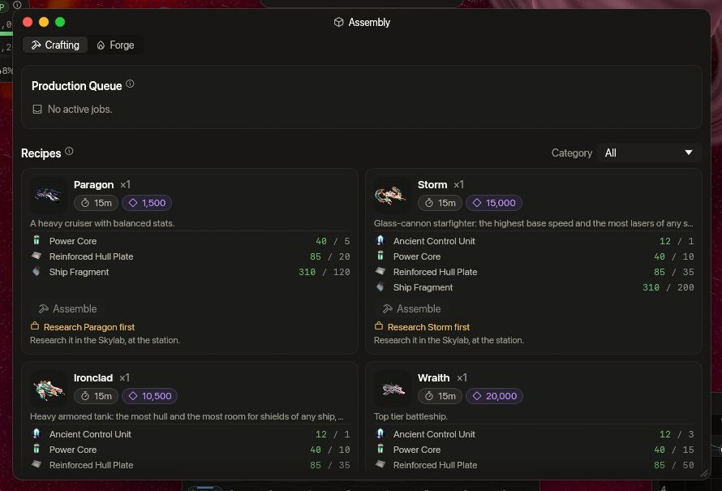

<!-- wiki-i18n source: ebaadcaf8dcaf5d1 -->
<!-- wiki-i18n title: 物品树 -->
# 物品树 {#item-trees}

物品树展示同一类物品如何层层相连：各阶并排排列，并标明每件物品由什么制成。将鼠标悬停在物品上，可以查看它的价格，或在装配站制造它所需的东西（Thulium、时间和材料）；点击物品即可打开它的页面。这些树由游戏自身的数据绘制，因此始终与商店和装配站一致。

“物品”类别的每个页面都会显示各自类型的树。本页汇集了全部的树，还包括舰船和材料。十六种[无人机编队](/wiki/03-Mechanics/Formations.md)在无人机树里。



<!-- item-tree:begin -->
<!-- Generated from server/Data/Seeds/{items,recipes}.json and Resources/Rockets.json by scripts/trees-wiki.sh: don't edit by hand. -->

装配站制造的东西要先有对应的科技；将指针悬停在物品上可看到研究所需的时间。科技树、燃料和加速见 [研究](/wiki/03-Mechanics/Research.md)。

## 舰船 {#ships}

```tree
Protos | ship, shoddy | /wiki/02-Ships/Protos.md
Kitefin | ship, common | buy 600 Thulium | /wiki/02-Ships/Kitefin.md
Ostirion | ship, common | buy 425000 Credits | /wiki/02-Ships/Ostirion.md
Nomad | ship, uncommon | buy 1275000 Credits, 500 Thulium | /wiki/02-Ships/Nomad.md
Paragon | ship, rare | craft 1500 Thulium, 900 s | research 21600 s, 21600 science | 120 Ship Fragment, 20 Reinforced Hull Plate, 5 Power Core | /wiki/02-Ships/Paragon.md
Ironclad | ship, epic | craft 10500 Thulium, 900 s | research 86400 s, 86400 science, 10 Dark Matter | 200 Ship Fragment, 35 Reinforced Hull Plate, 10 Power Core, 1 Ancient Control Unit | /wiki/02-Ships/Ironclad.md
Storm | ship, epic | craft 15000 Thulium, 900 s | research 86400 s, 86400 science, 10 Dark Matter | 200 Ship Fragment, 35 Reinforced Hull Plate, 10 Power Core, 1 Ancient Control Unit | /wiki/02-Ships/Storm.md
Wraith | ship, mythical | craft 20000 Thulium, 900 s | research 172800 s, 172800 science, 10 Dark Matter | 300 Ship Fragment, 50 Reinforced Hull Plate, 15 Power Core, 3 Ancient Control Unit | /wiki/02-Ships/Wraith.md
```

## 激光与弹药 {#lasers}

详情与价格：[激光与弹药](/wiki/06-Items/Lasers.md)

```tree
Quantum Laser I | laser, shoddy | buy 8000 Credits | /wiki/06-Items/Lasers.md#lasers
Quantum Laser II | laser, common | buy 80000 Credits | /wiki/06-Items/Lasers.md#lasers
Quantum Laser III | laser, rare | craft 1500 Thulium, 60 s | research 10800 s, 10800 science | 1 Quantum Laser II, 10 Ship Fragment, 2 Velkonite Reinforced Plate | /wiki/06-Items/Lasers.md#lasers
Starfire-III | laser, mythical | craft 100000 Credits, 1500 Thulium, 60 s | research 86400 s, 86400 science, 10 Dark Matter | 1 Quantum Laser III, 15 Ship Fragment, 1 Reinforced Hull Plate, 8 Velkonite Reinforced Plate | /wiki/06-Items/Lasers.md#lasers
Helios Beam | laser, mythical | craft 2000 Thulium, 180 s | research 86400 s, 86400 science, 10 Dark Matter | 1 Starfire-III, 4 Reinforced Hull Plate, 2 Power Core, 50 Cataclysite, 18 Orvium Reinforced Plate, 3 Dark Matter Plate | /wiki/06-Items/Lasers.md#lasers
Damage Amp I | laser-amp, shoddy | buy 10000 Credits | /wiki/06-Items/Lasers.md#laser-amplifiers-amps-
Crit Amp I | laser-amp, shoddy | buy 15000 Credits | /wiki/06-Items/Lasers.md#laser-amplifiers-amps-
Penetration Amp I | laser-amp, shoddy | buy 15000 Credits | /wiki/06-Items/Lasers.md#laser-amplifiers-amps-
Damage Amp II | laser-amp, uncommon | craft 250 Thulium, 60 s | research 1800 s, 1800 science | 1 Damage Amp I, 10 Cataclysite, 1 Velkonite Reinforced Plate | /wiki/06-Items/Lasers.md#laser-amplifiers-amps-
Crit Amp II | laser-amp, uncommon | craft 250 Thulium, 60 s | research 1800 s, 1800 science | 1 Crit Amp I, 10 Cataclysite, 1 Velkonite Reinforced Plate | /wiki/06-Items/Lasers.md#laser-amplifiers-amps-
Penetration Amp II | laser-amp, uncommon | craft 250 Thulium, 60 s | research 1800 s, 1800 science | 1 Penetration Amp I, 20 Daraxium, 10 Cataclysite, 1 Velkonite Reinforced Plate | /wiki/06-Items/Lasers.md#laser-amplifiers-amps-
Damage Amp III | laser-amp, rare | craft 1000 Thulium, 60 s | research 10800 s, 10800 science | 1 Damage Amp II, 1 Power Core, 20 Cataclysite, 2 Velkonite Reinforced Plate | /wiki/06-Items/Lasers.md#laser-amplifiers-amps-
Crit Amp III | laser-amp, rare | craft 1000 Thulium, 60 s | research 10800 s, 10800 science | 1 Crit Amp II, 1 Power Core, 20 Cataclysite, 2 Velkonite Reinforced Plate | /wiki/06-Items/Lasers.md#laser-amplifiers-amps-
Penetration Amp III | laser-amp, rare | craft 1000 Thulium, 60 s | research 10800 s, 10800 science | 1 Penetration Amp II, 1 Power Core, 30 Nyxite, 20 Cataclysite, 2 Velkonite Reinforced Plate | /wiki/06-Items/Lasers.md#laser-amplifiers-amps-
Damage Amp IV | laser-amp, epic | craft 1200 Thulium, 60 s | research 36000 s, 36000 science, 10 Dark Matter | 1 Damage Amp III, 1 Power Core, 30 Cataclysite, 3 Dark Matter Plate | /wiki/06-Items/Lasers.md#laser-amplifiers-amps-
Crit Amp IV | laser-amp, epic | craft 1200 Thulium, 60 s | research 36000 s, 36000 science, 10 Dark Matter | 1 Crit Amp III, 1 Power Core, 30 Cataclysite, 3 Dark Matter Plate | /wiki/06-Items/Lasers.md#laser-amplifiers-amps-
Penetration Amp IV | laser-amp, epic | craft 1200 Thulium, 90 s | research 36000 s, 36000 science, 10 Dark Matter | 1 Penetration Amp III, 1 Power Core, 30 Cataclysite, 40 Quorvium, 3 Dark Matter Plate | /wiki/06-Items/Lasers.md#laser-amplifiers-amps-
Standard Battery | ammo, common | buy 5 Credits | /wiki/06-Items/Lasers.md#laser-ammunition
Siphon Battery | ammo, rare | buy 0.25 Thulium | /wiki/06-Items/Lasers.md#siphon-battery
Advanced Plasma | ammo, rare | buy 0.5 Thulium | /wiki/06-Items/Lasers.md#laser-ammunition
Ultra Core | ammo, rare | buy 1 Thulium | /wiki/06-Items/Lasers.md#laser-ammunition
Experimental Fusion Core | ammo, epic | buy 2.2 Thulium | /wiki/06-Items/Lasers.md#laser-ammunition

Quantum Laser I -> Quantum Laser II => Quantum Laser III => Starfire-III => Helios Beam
Damage Amp I => Damage Amp II => Damage Amp III => Damage Amp IV
Crit Amp I => Crit Amp II => Crit Amp III => Crit Amp IV
Penetration Amp I => Penetration Amp II => Penetration Amp III => Penetration Amp IV
Standard Battery -> Advanced Plasma -> Ultra Core -> Experimental Fusion Core
```

## 火箭 {#rockets}

详情与价格：[火箭](/wiki/06-Items/Rockets.md)

```tree
Lancet I | rocket, common | buy 500 Credits | /wiki/06-Items/Rockets.md#the-twelve-rockets
Rivet I | rocket, common | buy 500 Credits | /wiki/06-Items/Rockets.md#the-twelve-rockets
Ember I | rocket, common | buy 500 Credits | /wiki/06-Items/Rockets.md#the-twelve-rockets
Scatter I | rocket, common | buy 500 Credits | /wiki/06-Items/Rockets.md#the-twelve-rockets
Lancet II | rocket, rare | buy 800 Credits | /wiki/06-Items/Rockets.md#the-twelve-rockets
Rivet II | rocket, rare | buy 800 Credits | /wiki/06-Items/Rockets.md#the-twelve-rockets
Ember II | rocket, rare | buy 800 Credits | /wiki/06-Items/Rockets.md#the-twelve-rockets
Scatter II | rocket, rare | buy 800 Credits | /wiki/06-Items/Rockets.md#the-twelve-rockets
Lancet III | rocket, epic | buy 5 Thulium | /wiki/06-Items/Rockets.md#the-twelve-rockets
Rivet III | rocket, epic | buy 5 Thulium | /wiki/06-Items/Rockets.md#the-twelve-rockets
Ember III | rocket, epic | buy 5 Thulium | /wiki/06-Items/Rockets.md#the-twelve-rockets
Scatter III | rocket, epic | buy 5 Thulium | /wiki/06-Items/Rockets.md#the-twelve-rockets
N.I.K.E. | rocket, mythical | craft 100000 Credits, 1500 Thulium, 300 s, x5 | research 10800 s, 10800 science | 20 Ship Fragment, 4 Reinforced Hull Plate, 40 Cataclysite | /wiki/06-Items/Rockets.md#the-craft-only-rockets
N.U.K.E. | rocket, legendary | craft 150000 Credits, 3000 Thulium, 900 s | research 86400 s, 86400 science, 10 Dark Matter | 6 Scatter III, 40 Ship Fragment, 10 Reinforced Hull Plate, 4 Power Core, 80 Cataclysite | /wiki/06-Items/Rockets.md#the-craft-only-rockets

Lancet I -> Lancet II -> Lancet III
Rivet I -> Rivet II -> Rivet III
Ember I -> Ember II -> Ember III
Scatter I -> Scatter II -> Scatter III => N.U.K.E.
```

## 护盾与防御 {#shields}

详情与价格：[护盾与防御](/wiki/06-Items/Shields.md)

```tree
Light Shield Core | shield, shoddy | buy 20000 Credits | /wiki/06-Items/Shields.md#shield-cores
Basic Shield Core | shield, common | buy 2000 Thulium | /wiki/06-Items/Shields.md#shield-cores
Heavy Shield Core | shield, rare | craft 2000 Thulium, 90 s | research 10800 s, 10800 science | 1 Basic Shield Core, 8 Reinforced Hull Plate, 20 Cataclysite, 3 Dark Matter Plate | /wiki/06-Items/Shields.md#shield-cores
Adaptive Core I | hybrid-generator, shoddy | buy 100000 Credits | /wiki/06-Items/Shields.md#hybrid-generators-adaptive-cores-
Adaptive Core II | hybrid-generator, common | buy 4000 Thulium | /wiki/06-Items/Shields.md#hybrid-generators-adaptive-cores-
Adaptive Core III | hybrid-generator, rare | /wiki/06-Items/Shields.md#hybrid-generators-adaptive-cores-
Absorption Shield Cell I | shield-cell, shoddy | buy 30000 Credits | /wiki/06-Items/Shields.md#shield-cells
Capacity Shield Cell I | shield-cell, shoddy | buy 30000 Credits | /wiki/06-Items/Shields.md#shield-cells
Absorption Shield Cell II | shield-cell, common | craft 1000 Thulium, 60 s | research 1800 s, 1800 science | 1 Absorption Shield Cell I, 4 Reinforced Hull Plate, 10 Cataclysite, 2 Velkonite Reinforced Plate | /wiki/06-Items/Shields.md#shield-cells
Capacity Shield Cell II | shield-cell, common | craft 1000 Thulium, 60 s | research 1800 s, 1800 science | 1 Capacity Shield Cell I, 4 Reinforced Hull Plate, 10 Cataclysite, 2 Velkonite Reinforced Plate | /wiki/06-Items/Shields.md#shield-cells
Absorption Shield Cell III | shield-cell, rare | craft 1500 Thulium, 60 s | research 10800 s, 10800 science | 1 Absorption Shield Cell II, 6 Reinforced Hull Plate, 15 Cataclysite, 4 Velkonite Reinforced Plate | /wiki/06-Items/Shields.md#shield-cells
Capacity Shield Cell III | shield-cell, rare | craft 1500 Thulium, 60 s | research 10800 s, 10800 science | 1 Capacity Shield Cell II, 6 Reinforced Hull Plate, 15 Cataclysite, 4 Velkonite Reinforced Plate | /wiki/06-Items/Shields.md#shield-cells
Absorption Shield Cell IV | shield-cell, epic | craft 2500 Thulium, 90 s | research 36000 s, 36000 science, 10 Dark Matter | 1 Absorption Shield Cell III, 8 Reinforced Hull Plate, 20 Cataclysite, 3 Dark Matter Plate | /wiki/06-Items/Shields.md#shield-cells
Capacity Shield Cell IV | shield-cell, epic | craft 2500 Thulium, 90 s | research 36000 s, 36000 science, 10 Dark Matter | 1 Capacity Shield Cell III, 8 Reinforced Hull Plate, 20 Cataclysite, 3 Dark Matter Plate | /wiki/06-Items/Shields.md#shield-cells

Light Shield Core -> Basic Shield Core => Heavy Shield Core
Adaptive Core I -> Adaptive Core II -> Adaptive Core III
Absorption Shield Cell I => Absorption Shield Cell II => Absorption Shield Cell III => Absorption Shield Cell IV
Capacity Shield Cell I => Capacity Shield Cell II => Capacity Shield Cell III => Capacity Shield Cell IV
```

## 推进与速度 {#propulsion}

详情与价格：[推进与速度](/wiki/06-Items/Propulsion.md)

```tree
Engine I | engine, shoddy | buy 20000 Credits | /wiki/06-Items/Propulsion.md#engines
Engine II | engine, common | buy 2000 Thulium | /wiki/06-Items/Propulsion.md#engines
Engine III | engine, rare | craft 2000 Thulium, 90 s | research 10800 s, 10800 science | 1 Engine II, 60 Ship Fragment, 3 Power Core, 3 Dark Matter Plate | /wiki/06-Items/Propulsion.md#engines
Impulse Thruster I | thruster, shoddy | buy 20000 Credits | /wiki/06-Items/Propulsion.md#thrusters
Momentum Thruster I | thruster, shoddy | buy 20000 Credits | /wiki/06-Items/Propulsion.md#thrusters
Impulse Thruster II | thruster, common | craft 1000 Thulium, 60 s | research 1800 s, 1800 science | 1 Impulse Thruster I, 10 Ship Fragment, 1 Power Core, 2 Velkonite Reinforced Plate | /wiki/06-Items/Propulsion.md#thrusters
Momentum Thruster II | thruster, common | craft 1000 Thulium, 60 s | research 1800 s, 1800 science | 1 Momentum Thruster I, 10 Ship Fragment, 1 Power Core, 2 Velkonite Reinforced Plate | /wiki/06-Items/Propulsion.md#thrusters
Impulse Thruster III | thruster, rare | craft 1500 Thulium, 60 s | research 10800 s, 10800 science | 1 Impulse Thruster II, 30 Ship Fragment, 2 Power Core, 4 Velkonite Reinforced Plate | /wiki/06-Items/Propulsion.md#thrusters
Momentum Thruster III | thruster, rare | craft 1500 Thulium, 60 s | research 10800 s, 10800 science | 1 Momentum Thruster II, 30 Ship Fragment, 2 Power Core, 4 Velkonite Reinforced Plate | /wiki/06-Items/Propulsion.md#thrusters
Impulse Thruster IV | thruster, epic | craft 2000 Thulium, 90 s | research 36000 s, 36000 science, 10 Dark Matter | 1 Impulse Thruster III, 60 Ship Fragment, 3 Power Core, 3 Dark Matter Plate | /wiki/06-Items/Propulsion.md#thrusters
Momentum Thruster IV | thruster, epic | craft 2000 Thulium, 90 s | research 36000 s, 36000 science, 10 Dark Matter | 1 Momentum Thruster III, 60 Ship Fragment, 3 Power Core, 3 Dark Matter Plate | /wiki/06-Items/Propulsion.md#thrusters

Engine I -> Engine II => Engine III
Impulse Thruster I => Impulse Thruster II => Impulse Thruster III => Impulse Thruster IV
Momentum Thruster I => Momentum Thruster II => Momentum Thruster III => Momentum Thruster IV
```

## 附加装置 {#extras}

详情与价格：[附加装置](/wiki/06-Items/Extras.md)

```tree
Cloaking CPU S | extra, common | buy 5000 Thulium | /wiki/06-Items/Extras.md#cloaking-cpu
Repair Drone I | extra, common | buy 5000 Credits | /wiki/06-Items/Extras.md#repair-drones
Repair Drone II | extra, common | buy 15000 Credits | /wiki/06-Items/Extras.md#repair-drones
Repair Drone III | extra, common | buy 35000 Credits | /wiki/06-Items/Extras.md#repair-drones
Extra Slots CPU I | extra, uncommon | craft 12000 Thulium, 300 s | research 1800 s, 1800 science | 60 Ship Fragment, 3 Power Core, 6 Velkonite Reinforced Plate | /wiki/06-Items/Extras.md#extra-slots-cpus
Base CPU I | extra, uncommon | craft 8000 Thulium, 300 s | research 10800 s, 10800 science | 40 Ship Fragment, 2 Power Core, 4 Velkonite Reinforced Plate | /wiki/06-Items/Extras.md#base-cpus
EMP Charge | extra, uncommon | buy 500 Thulium | /wiki/06-Items/Extras.md#emp-charge
Cloaking CPU M | extra, uncommon | buy 11250 Thulium | /wiki/06-Items/Extras.md#cloaking-cpu
Extra Slots CPU II | extra, rare | craft 30000 Thulium, 600 s | research 36000 s, 36000 science | 120 Ship Fragment, 10 Reinforced Hull Plate, 6 Power Core, 12 Velkonite Reinforced Plate, 2 Orvium Reinforced Plate | /wiki/06-Items/Extras.md#extra-slots-cpus
Base CPU II | extra, rare | craft 20000 Thulium, 600 s | research 36000 s, 36000 science | 100 Ship Fragment, 5 Power Core, 2 Orvium Reinforced Plate, 3 Dark Matter Plate | /wiki/06-Items/Extras.md#base-cpus
Auto-Repair CPU | extra, rare | craft 15000 Thulium, 600 s | research 21600 s, 21600 science | 80 Ship Fragment, 8 Reinforced Hull Plate, 4 Power Core, 6 Velkonite Reinforced Plate | /wiki/06-Items/Extras.md#auto-repair-cpu
Repair Drone IV | extra, rare | buy 2000 Thulium | /wiki/06-Items/Extras.md#repair-drones
Cloaking CPU L | extra, rare | buy 20000 Thulium | /wiki/06-Items/Extras.md#cloaking-cpu
Extra Slots CPU III | extra, epic | craft 75000 Thulium, 900 s | research 86400 s, 86400 science, 10 Dark Matter | 240 Ship Fragment, 25 Reinforced Hull Plate, 12 Power Core, 2 Ancient Control Unit, 6 Orvium Reinforced Plate, 3 Dark Matter Plate | /wiki/06-Items/Extras.md#extra-slots-cpus
Jump CPU | extra, epic | craft 40000 Thulium, 900 s | research 86400 s, 86400 science, 10 Dark Matter | 200 Ship Fragment, 20 Reinforced Hull Plate, 10 Power Core, 3 Ancient Control Unit, 15 Velkonite Reinforced Plate, 10 Orvium Reinforced Plate | /wiki/06-Items/Extras.md#jump-cpu

Cloaking CPU S -> Cloaking CPU M -> Cloaking CPU L
Repair Drone I -> Repair Drone II -> Repair Drone III -> Repair Drone IV
Extra Slots CPU I -> Extra Slots CPU II -> Extra Slots CPU III
Base CPU I -> Base CPU II
```

## 无人机 {#drones}

详情与价格：[无人机](/wiki/06-Items/Drones.md)

```tree
Slave Drone | drone, common | buy 100000 Credits | /wiki/06-Items/Drones.md#available-drones
Master Drone | drone, rare | craft 40000 Thulium, 60 s | research 36000 s, 36000 science | 1 Slave Drone, 100 Ship Fragment | /wiki/06-Items/Drones.md#available-drones
Testudo Formation | formation, epic | craft 7500 Thulium, 300 s | research 36000 s, 36000 science, 5 Dark Matter | 100 Ship Fragment, 10 Reinforced Hull Plate, 5 Power Core, 4 Velkonite Reinforced Plate | /wiki/03-Mechanics/Formations.md#the-sixteen-formations
Bodkin Formation | formation, epic | craft 21000 Thulium, 600 s | research 86400 s, 86400 science, 13 Dark Matter | 180 Ship Fragment, 18 Reinforced Hull Plate, 9 Power Core, 8 Velkonite Reinforced Plate, 3 Orvium Reinforced Plate | /wiki/03-Mechanics/Formations.md#the-sixteen-formations
Asterism Formation | formation, epic | craft 7000 Thulium, 300 s | research 36000 s, 36000 science, 5 Dark Matter | 100 Ship Fragment, 10 Reinforced Hull Plate, 5 Power Core, 4 Velkonite Reinforced Plate | /wiki/03-Mechanics/Formations.md#the-sixteen-formations
Adamant Formation | formation, epic | craft 9000 Thulium, 300 s | research 36000 s, 36000 science, 5 Dark Matter | 100 Ship Fragment, 10 Reinforced Hull Plate, 5 Power Core, 4 Velkonite Reinforced Plate | /wiki/03-Mechanics/Formations.md#the-sixteen-formations
Ballista Formation | formation, epic | craft 24000 Thulium, 600 s | research 86400 s, 86400 science, 13 Dark Matter | 180 Ship Fragment, 18 Reinforced Hull Plate, 9 Power Core, 8 Velkonite Reinforced Plate, 3 Orvium Reinforced Plate | /wiki/03-Mechanics/Formations.md#the-sixteen-formations
Sanctum Formation | formation, epic | craft 20000 Thulium, 600 s | research 86400 s, 86400 science, 13 Dark Matter | 180 Ship Fragment, 18 Reinforced Hull Plate, 9 Power Core, 8 Velkonite Reinforced Plate, 3 Orvium Reinforced Plate | /wiki/03-Mechanics/Formations.md#the-sixteen-formations
Shrike Formation | formation, epic | craft 8500 Thulium, 300 s | research 36000 s, 36000 science, 5 Dark Matter | 100 Ship Fragment, 10 Reinforced Hull Plate, 5 Power Core, 4 Velkonite Reinforced Plate | /wiki/03-Mechanics/Formations.md#the-sixteen-formations
Culler Formation | formation, epic | craft 20000 Thulium, 600 s | research 86400 s, 86400 science, 13 Dark Matter | 180 Ship Fragment, 18 Reinforced Hull Plate, 9 Power Core, 8 Velkonite Reinforced Plate, 3 Orvium Reinforced Plate | /wiki/03-Mechanics/Formations.md#the-sixteen-formations
Redoubt Formation | formation, epic | craft 21000 Thulium, 600 s | research 86400 s, 86400 science, 13 Dark Matter | 180 Ship Fragment, 18 Reinforced Hull Plate, 9 Power Core, 8 Velkonite Reinforced Plate, 3 Orvium Reinforced Plate | /wiki/03-Mechanics/Formations.md#the-sixteen-formations
Auger Formation | formation, epic | craft 20500 Thulium, 600 s | research 86400 s, 86400 science, 13 Dark Matter | 180 Ship Fragment, 18 Reinforced Hull Plate, 9 Power Core, 8 Velkonite Reinforced Plate, 3 Orvium Reinforced Plate | /wiki/03-Mechanics/Formations.md#the-sixteen-formations
Cordon Formation | formation, epic | craft 21500 Thulium, 600 s | research 86400 s, 86400 science, 13 Dark Matter | 180 Ship Fragment, 18 Reinforced Hull Plate, 9 Power Core, 8 Velkonite Reinforced Plate, 3 Orvium Reinforced Plate | /wiki/03-Mechanics/Formations.md#the-sixteen-formations
Centurion Formation | formation, epic | craft 8000 Thulium, 300 s | research 36000 s, 36000 science, 5 Dark Matter | 100 Ship Fragment, 10 Reinforced Hull Plate, 5 Power Core, 4 Velkonite Reinforced Plate | /wiki/03-Mechanics/Formations.md#the-sixteen-formations
Gyre Formation | formation, epic | craft 20000 Thulium, 600 s | research 86400 s, 86400 science, 13 Dark Matter | 180 Ship Fragment, 18 Reinforced Hull Plate, 9 Power Core, 8 Velkonite Reinforced Plate, 3 Orvium Reinforced Plate | /wiki/03-Mechanics/Formations.md#the-sixteen-formations
Gemini Formation | formation, mythical | craft 38000 Thulium, 900 s | research 172800 s, 172800 science, 20 Dark Matter | 260 Ship Fragment, 26 Reinforced Hull Plate, 13 Power Core, 2 Ancient Control Unit, 14 Velkonite Reinforced Plate, 6 Orvium Reinforced Plate | /wiki/03-Mechanics/Formations.md#the-sixteen-formations
Stiletto Formation | formation, mythical | craft 46000 Thulium, 900 s | research 172800 s, 172800 science, 20 Dark Matter | 260 Ship Fragment, 26 Reinforced Hull Plate, 13 Power Core, 2 Ancient Control Unit, 14 Velkonite Reinforced Plate, 6 Orvium Reinforced Plate | /wiki/03-Mechanics/Formations.md#the-sixteen-formations
Rampart Formation | formation, mythical | craft 38500 Thulium, 900 s | research 172800 s, 172800 science, 20 Dark Matter | 260 Ship Fragment, 26 Reinforced Hull Plate, 13 Power Core, 2 Ancient Control Unit, 14 Velkonite Reinforced Plate, 6 Orvium Reinforced Plate | /wiki/03-Mechanics/Formations.md#the-sixteen-formations

Slave Drone => Master Drone
```

## 增益 {#boosters}

详情与价格：[增益](/wiki/06-Items/Boosters.md)

```tree
Experience Booster | booster, common | buy 8000 Thulium | /wiki/06-Items/Boosters.md#active-boosters
Honor Booster | booster, common | buy 10000 Thulium | /wiki/06-Items/Boosters.md#active-boosters
Laser Damage Booster II | booster, rare | craft 20000 Thulium, 60 s | research 10800 s, 10800 science | 5 Ship Fragment | /wiki/06-Items/Boosters.md#active-boosters
Shield Wall Booster II | booster, rare | craft 15000 Thulium, 60 s | research 10800 s, 10800 science | 5 Ship Fragment | /wiki/06-Items/Boosters.md#active-boosters
Hull Plating Booster II | booster, rare | craft 15000 Thulium, 60 s | research 10800 s, 10800 science | 5 Ship Fragment | /wiki/06-Items/Boosters.md#active-boosters
Shield Regen Booster | booster, rare | buy 10000 Thulium | /wiki/06-Items/Boosters.md#active-boosters
Shield Wall Booster I | booster, rare | buy 15000 Thulium | /wiki/06-Items/Boosters.md#active-boosters
Hull Plating Booster I | booster, rare | buy 15000 Thulium | /wiki/06-Items/Boosters.md#active-boosters
Resource Magnet Booster | booster, rare | buy 18000 Thulium | /wiki/06-Items/Boosters.md#active-boosters
Laser Damage Booster I | booster, rare | buy 20000 Thulium | /wiki/06-Items/Boosters.md#active-boosters
Loot Luck Booster | booster, legendary | buy 30000 Thulium | /wiki/06-Items/Boosters.md#active-boosters

Shield Wall Booster I -> Shield Wall Booster II
Hull Plating Booster I -> Hull Plating Booster II
Laser Damage Booster I -> Laser Damage Booster II
```

## 资源 {#materials}

详情与价格：[资源](/wiki/06-Items/Resources.md)

```tree
Velkonite Reinforced Plate | resource, rare | /wiki/06-Items/Resources.md#velkonite-reinforced-plate
Orvium Reinforced Plate | resource, epic | /wiki/06-Items/Resources.md#orvium-reinforced-plate
Dark Matter | resource, epic | /wiki/06-Items/Resources.md#dark-matter
Dark Matter Plate | resource, mythical | craft 250 Thulium, 120 s | research 86400 s, 86400 science, 10 Dark Matter | 1 Velkonite Reinforced Plate, 1 Orvium Reinforced Plate, 5 Dark Matter | /wiki/06-Items/Resources.md#dark-matter-plate

Velkonite Reinforced Plate => Dark Matter Plate
Orvium Reinforced Plate => Dark Matter Plate
Dark Matter => Dark Matter Plate
```

<!-- item-tree:end -->
